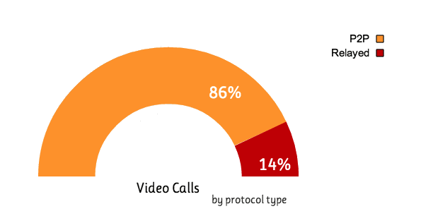

RTCPeerConnection API plus servers

WebRTC 建立连接需要交换“会话信息”，这些信息包括

- 本端支持何种格式，以及想还要发送什么信息
- 建立网络连接需要的网络信息。


这些消息的传输可以使用任何消息传递机制，可以使用任何消息协议。甚至连接顺序，WebRTC 对这部分内容没有任何定义。因此可以根据业务逻辑，自己定义连接顺序。


## STUN and TURN

需要服务器做的另一件事是获取对等端回话的全部路由。早互联网的早起，这是一个很简单的事情，因为早期的网络每个设备都有一个公开的 IP 地址（将来 IPv6 普及也可能实现，就是不知道 IPv6 什么时候能普及呀）。将各自端的 IP 地址通过服务发送给对方即可直接在对等端建立连接。


自从有了 NAT，事情变得复杂了。NATs 分发一个私有的 IP 地址，私有 IP 仅用于内部网络定位，对于公共互联网并没有作用。

实际上，大多数设备都位于一层或多层NAT之后，有些设备具有阻止某些端口和协议的防病毒软件，而许多设备则位于代理服务器和公司防火墙之后。 实际上，防火墙和NAT可以由同一设备（例如家庭WIFI路由器）实现。

NAT为设备提供IP地址以供在专用局域网中使用，但是该地址不能在外部使用。 没有公共地址，WebRTC对等方将无法通信。 为解决此问题，WebRTC使用STUN。


不知道对等端的真实公开 IP 便无法建立对等端连接。这就需要 STUN 服务。

- Tell me what my public IP address is.
- Simple server, cheap to run.
- Data flows peer-to-peer.

STUN 的功能极其简单，WebRTC 向 STUN 发送请求，STUN 接到请求后，就知道请求的来源 IP, 它将此 IP 返回给 WebRTC.


ICE试图找到连接对等方的最佳路径。 它并行尝试所有可能性，并选择最有效的选择。 ICE首先尝试使用从设备的操作系统和网卡获得的主机地址进行连接。 如果失败（ICE将用于NAT之后的设备），则ICE使用STUN服务器获取外部地址，如果失败，则将流量通过TURN中继服务器进行路由。

在图片中，每个 WebRTC 端从 STUN 获取到自己的公共 IP, 将 IP 发送给对方后，即可建立对等连接进行数据传输。

对等连接通常是有效的(例如你的网络受限，或者使用了代理)，但不是所有情况都能成功，此时，我们需要一个中继服务器进行转化，这就是 TURN 。在对等连接不可用时，向云端的中继询问，给我一个公共 IP, 因为该公共 IP 在云端。任何人都可以连接，即可保证通话总是成功。


为了尽可能减少服务器的运行成本，优先使用 STUN 连接，失败后才使用 TURN 服务器。所有这些通过 ICE 自动完成。



每个TURN服务器都支持STUN。 TURN服务器是具有附加内置中继功能的STUN服务器。 ICE还可以应对NAT设置的复杂性。 实际上，NAT打孔可能不仅仅需要一个公共IP：端口地址。

STUN和/或TURN服务器的URL由（可选）由WebRTC应用程序在iceServers配置对象中指定，该对象是RTCPeerConnection构造函数的第一个参数。 对于appr.tc，该值如下所示：

```
{
  'iceServers': [
    {
      'urls': 'stun:stun.l.google.com:19302'
    },
    {
      'urls': 'turn:192.158.29.39:3478?transport=udp',
      'credential': 'JZEOEt2V3Qb0y27GRntt2u2PAYA=',
      'username': '28224511:1379330808'
    },
    {
      'urls': 'turn:192.158.29.39:3478?transport=tcp',
      'credential': 'JZEOEt2V3Qb0y27GRntt2u2PAYA=',
      'username': '28224511:1379330808'
    }
  ]
}
```

