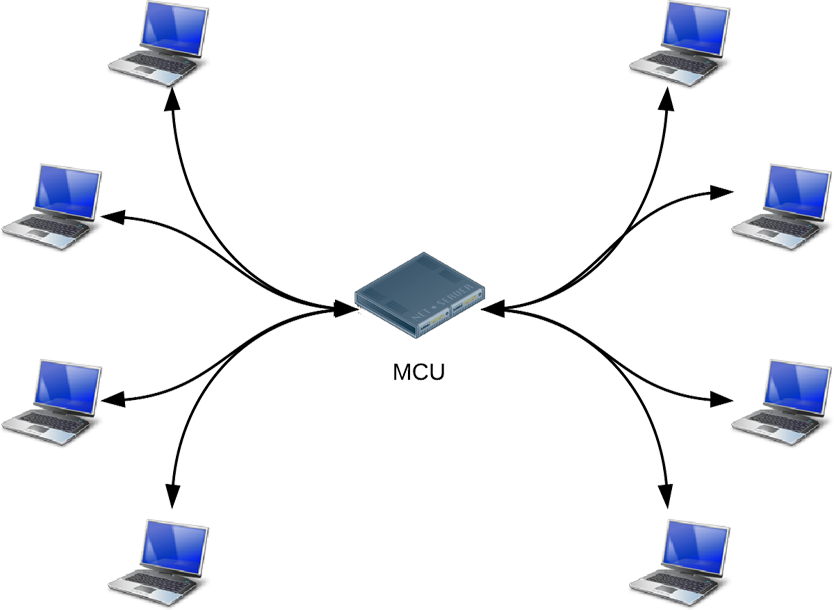

## 多人视频

只有一对连接的场景是最简单的连接方式。当有更多对等端加入时，连接变得复杂。

一种实现方式是网状连接，每两个对等端相互连接。

这种方式连接，除了信令服务器，不涉及任何服务器。但是每个端都必须拷贝和发送它的数据到每个与其连接的一端。这将消耗大量的 CPU 和宽带资源。这种拓扑结构的连接将极大的限制最大连接数量，特别是如果一个端是移动设备。

A WebRTC app can use multiple RTCPeerConnections so that every endpoint connects to every other endpoint in a mesh configuration. This is the approach taken by apps, such as talky.io, and works remarkably well for a small handful of peers. Beyond that, processing and bandwidth consumption becomes excessive, especially for mobile clients.

另一个可用的架构是星状结构。这需要选择性能最好的设备作为连接的中心。

中心连接负责接收数据并将数据分发给每个端。当时当传输高清视频时，这对中间连接连说，将是一项非常困难的。

目前最为健壮的拓扑结构是 MCU(Multipoint control unit)。这是一个为转发大量audio 和 video 定制的服务器。它能完成许多任务，例如：

1. 选择性流转发。
2. 混合音频或视频数据
3. 记录

并且不会因为一个端掉线而终止整个通话，

在视频会议中，mcu可以处理不同的分辨率、编解码器和帧速率

A better option for a large number of endpoints is to use a Multipoint Control Unit (MCU). This is a server that works as a bridge to distribute media between a large number of participants. MCUs can cope with different resolutions, codecs, and frame rates in a video conference; handle transcoding; do selective stream forwarding; and mix or record audio and video. For multiparty calls, there are a number of issues to consider, particularly how to display multiple video inputs and mix audio from multiple sources. Cloud platforms, such as vLine, also attempt to optimize traffic routing.

It's possible to buy a complete MCU hardware package or build your own.

Several open source MCU software options are available. For example, Licode (previously known as Lynckia) produces an open source MCU for WebRTC. OpenTok has Mantis.

