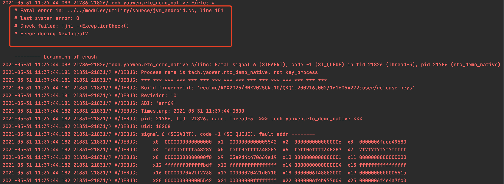

# Debug

1. 利用代码和 debug 结合



```c++
  RTC_LOG(INFO) << "NativeRegistration::NewObject";
  va_list args;
  va_start(args, signature);
  jobject obj = jni_->NewObjectV(
      j_class_, GetMethodID(jni_, j_class_, name, signature), args);
  CHECK_EXCEPTION(jni_) << "Error during NewObjectV";
  va_end(args);
  return std::unique_ptr<GlobalRef>(new GlobalRef(jni_, obj));
```

查看 `INFO` 级别的 LOG, 搜索 `NativeRegistration`。

```shell
2021-05-31 11:32:12.777 21445-21486/tech.yaowen.rtc_demo_native I/jvm_android.cc: (line 196): JNIEnvironment::RegisterNatives: org/webrtc/voiceengine/WebRtcAudioManager
2021-05-31 11:32:12.777 21445-21486/tech.yaowen.rtc_demo_native I/jvm_android.cc: (line 134): NativeRegistration::ctor
2021-05-31 11:32:12.777 21445-21486/tech.yaowen.rtc_demo_native I/jvm_android.cc: (line 146): NativeRegistration::NewObject
2021-05-31 11:32:12.780 21445-21486/tech.yaowen.rtc_demo_native I/org.webrtc.Logging: WebRtcAudioManager: ctor@[name=Thread-3, id=8582]
2021-05-31 11:32:12.781 21445-21486/tech.yaowen.rtc_demo_native W/System.err: java.lang.NullPointerException: Attempt to invoke virtual method 'java.lang.Object android.content.Context.getSystemService(java.lang.String)' on a null object reference
2021-05-31 11:32:12.781 21445-21486/tech.yaowen.rtc_demo_native W/System.err:     at org.webrtc.voiceengine.WebRtcAudioManager.<init>(WebRtcAudioManager.java:176)
2021-05-31 11:32:12.781 21445-21486/tech.yaowen.rtc_demo_native E/rtc: #
    # Fatal error in: ../../modules/utility/source/jvm_android.cc, line 151
    # last system error: 0
    # Check failed: !jni_->ExceptionCheck()
    # Error during NewObjectV
2021-05-31 11:32:12.781 21445-21486/tech.yaowen.rtc_demo_native A/libc: Fatal signal 6 (SIGABRT), code -1 (SI_QUEUE) in tid 21486 (Thread-3), pid 21445 (rtc_demo_native)
2021-05-31 11:32:12.871 21491-21491/? I/crash_dump64: obtaining output fd from tombstoned, type: kDebuggerdTombstone
2021-05-31 11:32:12.872 1595-1595/? I//system/bin/tombstoned: received crash request for pid 21486
2021-05-31 11:32:12.874 21491-21491/? I/crash_dump64: performing dump of process 21445 (target tid = 21486)
2021-05-31 11:32:12.878 21491-21491/? A/DEBUG: Process name is tech.yaowen.rtc_demo_native, not key_process
2021-05-31 11:32:12.878 21491-21491/? A/DEBUG: *** *** *** *** *** *** *** *** *** *** *** *** *** *** *** ***
2021-05-31 11:32:12.878 21491-21491/? A/DEBUG: Build fingerprint: 'realme/RMX2025/RMX2025CN:10/QKQ1.200216.002/1616054272:user/release-keys'
2021-05-31 11:32:12.878 21491-21491/? A/DEBUG: Revision: '0'
2021-05-31 11:32:12.878 21491-21491/? A/DEBUG: ABI: 'arm64'
2021-05-31 11:32:12.879 21491-21491/? A/DEBUG: Timestamp: 2021-05-31 11:32:12+0800
2021-05-31 11:32:12.879 21491-21491/? A/DEBUG: pid: 21445, tid: 21486, name: Thread-3  >>> tech.yaowen.rtc_demo_native <<<
2021-05-31 11:32:12.879 21491-21491/? A/DEBUG: uid: 10208
2021-05-31 11:32:12.879 21491-21491/? A/DEBUG: signal 6 (SIGABRT), code -1 (SI_QUEUE), fault addr --------
2021-05-31 11:32:12.879 21491-21491/? A/DEBUG:     x0  0000000000000000  x1  00000000000053ee  x2  0000000000000006  x3  0000006f4b08c580
```