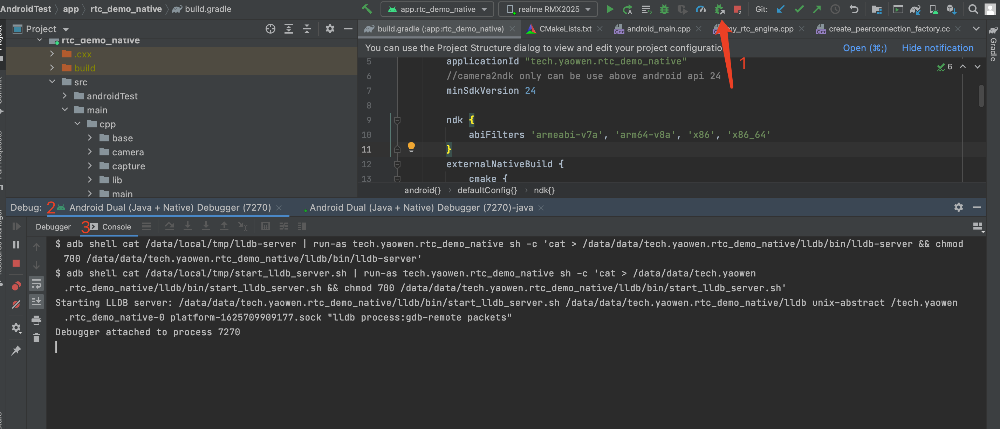
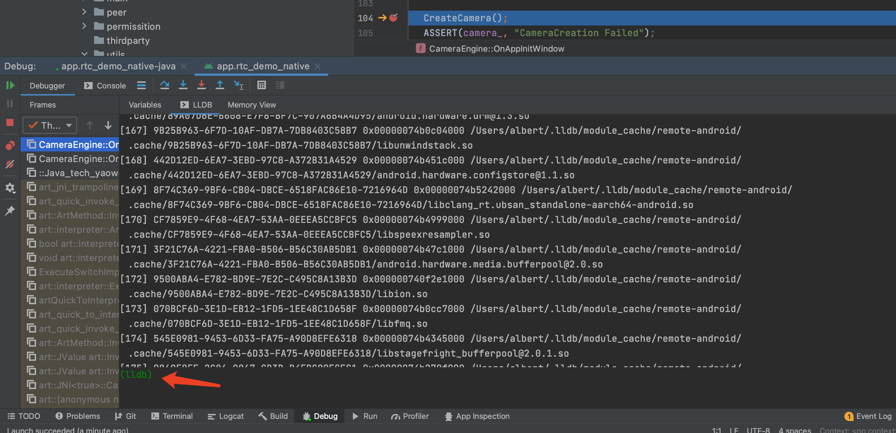
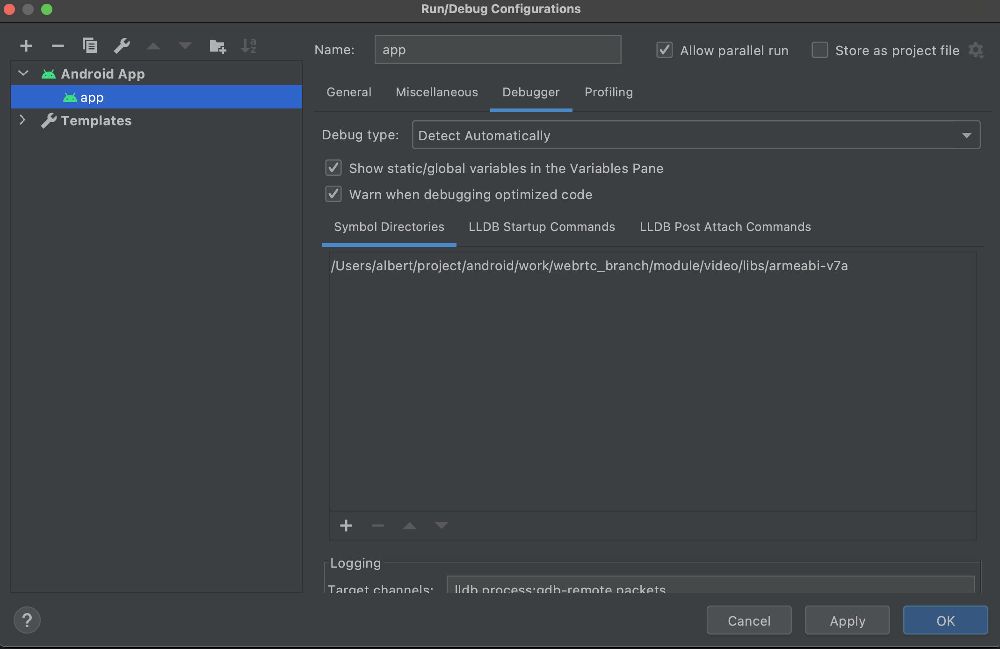
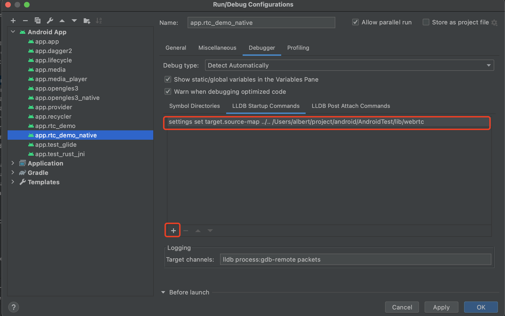
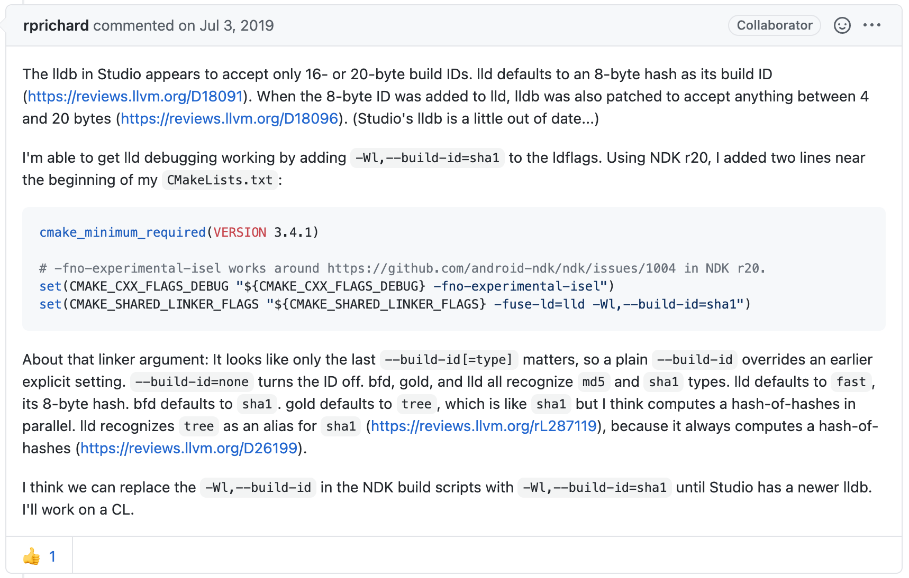

# Android Studio 断点调试 Webrtc

WebRTC 的项目非常庞大，由于使用 gn，导致跟主流 IDE 集成性较差，这就导致通常是使用场景是先编译出静态库或动态库，然后使用静态库/动态库进行二次开发。

我在将完整的 WebRTC 的代码放在项目目录下时，出现 Android Sudio 卡死的情况，只能仅拉取 webrtc 的主仓库的代码。可见项目 AS 做的还是不够支持大型项目。

设置支持断点调试的方法很简单，仅仅演示我的设置用不了太多文字。然而不同人使用 webrtc 的场景不同，如果稍微不同，设置后仍然不能打断点，却束手无策。因此这里讲解如何诊断断点不生效的原因，从而即使有问题时，也能找到方案解决。此谓：“授人以渔”。

## 确定包含了 debug 信息

首先要编译包含 `debug symbol` 信息的库，这些信息用于在调试打断点，以及对应源代码用。要包含这些 symbol info，只需要在 gn 参数中添加 `android_full_debug=true symbol_level=2`

```shell
gn gen out/arm64 --args='target_os="android" target_cpu="arm64" use_custom_libcxx=false  android_full_debug=true symbol_level=2 use_rtti=true'
```

验证 webrtc 库包含了 `symbol info`。能查看的信息的工具很多，例如

```
$ objdump -h a.out
# 或
$ readelf -S a.out
# 或
$ nm --demangle libwebrtc.a
```

阅读性最好的是 `dwarfdump`，例如：

dwarfdump <可执行文件/库文件>

```shell
$ dwarfdump libwebrtc.a
libwebrtc.a(create_peerconnection_factory.o):	file format elf64-littleaarch64
0x0000002a:   DW_TAG_namespace
                DW_AT_name	("std")

0x0000002f:     DW_TAG_namespace
                  DW_AT_name	("__ndk1")
                  DW_AT_export_symbols	(true)

0x00000034:       DW_TAG_class_type
                    DW_AT_calling_convention	(DW_CC_pass_by_reference)
                    DW_AT_name	("unique_ptr<webrtc::RtcEventLogFactory, std::default_delete<webrtc::RtcEventLogFactory> >")
                    DW_AT_byte_size	(0x08)
                    DW_AT_decl_file	("./../../third_party/android_ndk/toolchains/llvm/prebuilt/darwin-x86_64/sysroot/usr/include/c++/v1/memory")
                    DW_AT_decl_line	(2485)

...
```
- DW_AT_name: 就是函数名、类名、或者变量名。
- DW_AT_decl_file: 所在的文件
- DW_AT_decl_line: 所在文件的行数

有了调试信息，再看一下 Android Studio 打断点的流程

## Android Stduio 断点调试流程

Android app 的断点调试在 IDE 上看起来很简单，点一下按钮就能调试了。其实却做了很多工作，已经设计到`远程调试`了，所谓远程调试，就是程序运行的机器和调试断点的机器不是同一天机器。这就需要 server-client 的配合。得益于优秀的设计，其实远程调试并没有太复杂。

### 远程调试的命令流程
远程调试的流程有总体上分三步:

1. start lldb server
2. attaching to the app
3. loaded modile: LLVM module

#### 1. 启动 debug server.

通过 adb 在手机上启动 debug_server，首先要获取 lldb-server。

如果已经使用 AS 调试过程序，在手机的 /data/local/tmp 已经有了 lldb-server，不用再往手机添加。没有的话，可以在下载的 ndk 的 `toolchains/llvm/prebuilt/<平台类型，如darwin-x86_64>/lib64/clang/9.0.8/` 目录下找到。然后 push 到手机上。

```
$ adb push lldb-server /data/local/tmp/
$ adb shell
cd /data/local/tmp
chmod 755 lldb-server
# 进入 app 的沙盒
$ run-as <app 的包名>
```

> 启动 lldb-server

继续在 adb shell 中执行
```
./lldb-server p --server --listen unix-abstract:///data/local/tmp/debug.sock
```

`unix-abstract:///data/local/tmp/debug.sock` 是启动 Socket 的一种启动方式，这种方式监听文件。这种方式必须使用 USB 连接手机。如果网络连接的远程调试，则需要使用 `ip:port` 的方式。如：

```
$ # ./lldb-server platform --server --listen "<incoming-ip>:<port>"
$ # Example: allow any ip on port 9999
$ ./lldb-server platform --server --listen "*:9999"
```


#### 2. 启动 lldb 作为客户端

在调试机的另一个终端执行

```
$ lldb
platform list # 查看支持连接平台的插件
platform select remote-android # 选择连接安卓设备
platform status # 查看连接状态
platform connect unix-abstract-connect:///data/local/tmp/debug.sock # 连接远程
```
对于使用 `ip:port` 启动的，使用 `platform connect connect://<ip>:<port>` 进行连接。


#### 3. 关联到调试程序

> 方式一：启动程序
```
file <target_binary> # 指定将要调试的二进制文件,注意是相对于WorkingDir的路径
br set -f app_core.cpp -l 128 # 意思就是在app_core.cpp的128行处打个断点
run # 运行程序
```
> 方式二：关联到已经运行着的程序

```
file  <target_binary> # 指定将要调试的二进制文件,注意是相对于WorkingDir的路径
platform process list # 查看一直远端的进程, 找到目标进程pid, 或者名称
attach <pid>
```

也可以用 `$ adb shell ps | grep "<package name>"` 查看进程 id。然后就可以执行 lldb 的各种调试命令了。

### 在 Android Studio 调试

了解了远程调试的流程，我们来看 Android Studio 的调试，这样如果不能正确得打断点，我们就能很方便地进行诊断问题出在那里。

使用 Android Studio 的 `Attach Debugger to Android process` 时会输出 Android Studio 的脚本



此时 lldb 并不能使用，需要在 C++ 代码中打个断点，然后 lldb 的 client 就能用了。



查看是否加载带符号表的库。使用 lldb 的 `image list`

```shell
(lldb) image list
...
[325] 9C6B9195 0x00000073bf618000 /Users/albert/.lldb/module_cache/remote-android/.cache/9C6B9195/base.odex
[326] 7FF70FE5-49B6-1934-A565-25D0ABB0F85F-A48B0D26 0x00000073b6512000 /Users/albert/project/android/AndroidTest/app/rtc_demo_native/build/intermediates/cxx/Debug/1v3t6s3w/obj/arm64-v8a/librtc_demo.so
```

可以看到库的位置有一个特别的地方。可以打断点的库是从项目下的库，例如这里的 `librtc_demo.so`，`/Users/albert/project/android/AndroidTest/` 就是我的项目目录，而其它库使用 `$HOME/.lldb/module_cache/remote-android/.cache` 目录下的库。可以使用 `dwarfdump` 来对比这两种路径下的文件，`.lldb/module_cache/remote-android` 目录下的文件都没有携带 debug symbol.

其实 `.lldb/module_cache/remote-android/.cache` 目录下的可执行文件都是在本地找不到执行文件，从手机上（远程端）拉取下来的。而本地找得到**对应文件**的，就不会从远端拉取。

debug 程序的调试原理是，本地和远端都要存储同样的执行文件，这样在调试过程中，就不用发送具体执行的代码内容，仅发送 lldb 的调试指令，如断点行数，代码行数等信息，从而减少调试过程中的数据传输。

那如何让 lldb 找到我们带调试信息的库，而不是从远程获取呢？我们看一下 lldb 查找库的路径。

```
(lldb) settings show target.exec-search-paths
target.exec-search-paths (file-list) =
  [0]: /Users/albert/project/android/AndroidTest/app/rtc_demo_native/build/intermediates/cxx/Debug/1v3t6s3w/obj/arm64-v8a
```
我们只需要也添加一个这样的搜索路径即可，使用 `settings set` 或者 `setting append` 命令，区别就是 `set` 是设置，而 `append` 是添加。

```
settings append target.exec-search-paths <你的带 debug symbole 的路径>
```

这个命令必须在 lldb attach 进程之前设置，因此我们修改 Android Studio 的 配置。

在 Android Studio 中 Edit Configuration -> app -> debugger 中添加



这里设置目录和在 `LLDB Startup Commands` 下添加 `settings append` 指令是相同的效果。

设置之后，如果还不能正确加载对应目录下的程序。这就涉及到另一个问题，lldb 是如何将本地可执行文件和远端关联的，显然不是文件名，因为文件名可以随时更改。lldb 使用了 `build id`.

## Build ID

build id 是用于唯一标识一个编译目标，广泛应用于可执行文件，lib，可制成程序以及 debuginfo 文件等。使用 `build id` 是为了使 elf文件 `自识别`。使用 build id 有一系列的便利之处，能够标识当前正在运行的程序，让帮助用户了解程序运行的调试工具能够与对应的包、源文件、debuginfo 进行关联（通常在发生异常时）。

SHA-1 build id 是根据 elf 头和短内容的二级制内容生成的 160 bits/20 bytes 的字符串。这意味着它在ELF文件的一组有意义的内容中是唯一的，如果输出文件本来是相同的，则它是相同的。

当将可执行文件或共享库加载到内存中时，build id 也会加载到内存中，进程的核心转储也将具有可执行文件和共享库中嵌入的 build id。 在将 DebugInfo 从主可执行文件或共享库分离成单独的 .debug文件， `debug id` 也将被复制。 这意味着将核心文件或运行进程跟原始可执行文件和共享库匹配很容易。将这些文件与提供更多内省和调试信息的debuginfo文件进行匹配也很简单。


添加 build id 需要修改 `build/toolchain/gcc_toolchain.gni` 中 `tool("solink")` 的链接命令，添加参数 `-Wl,--build-id=sha1`.
```shell
$ vim build/toolchain/gcc_toolchain.gni

...
# link_command = "$ld -shared -Wl,-soname=\"$soname\" {{ldflags}}${extra_ldflags} -o \"$unstripped_sofile\" @\"$rspfile\""
# 修改为
link_command = "$ld -shared -Wl,--build-id=sha1 -Wl,-soname=\"$soname\" {{ldflags}}${extra_ldflags} -o \"$unstripped_sofile\" @\"$rspfile\""
...
```

查看是否有 `build id` 可以使用 `readelf` 指令

```
$ readelf -n libwebrtc.a
[...]
Note section [ 3] '.note.gnu.build-id' of 36 bytes at offset 0x274:
  Owner		Data size    Type
  GNU		       20    GNU_BUILD_ID
    Build ID: efdd0b5e69b0742fa5e5bad0771df4d1df2459d1
```
mac 上没有 `readelf` 工具，需要额外安装，最简单的方式是用 file 查看 file info，虽然不够准确，却是最简单的方法。

```
$ file libwebrtc.a
ELF 32-bit LSB shared object, ARM, EABI5 version 1 (SYSV), dynamically linked, with debug_info, not stripped
```

`stripped` 是指不包含 symbol，已经使用 `strip` 命令去掉了 debug symbol。而包含 build id 的输出信息为：
```
$ file libwebrtc.a
ELF 32-bit LSB shared object, ARM, EABI5 version 1 (SYSV), dynamically linked, BuildID[sha1]=fa8ffd39fcb7c0443af3667c2175de2af633721e, with debug_info, not stripped
```


```shell
(lldb) target create --no-dependents '9.0/Symbols/Library/Application Support/WatchKit/WK'
Current executable set to '9.0/Symbols/Library/Application Support/WatchKit/WK' (armv7k).
(lldb) image list
[  0] 675ED1EB-BAA0-3453-B7B1-3E69310F40FD 0x00004000 9.0/Symbols/Library/Application Support/WatchKit/WK
(lldb) image dump symtab
Dumping symbol table for 1 modules.
Symtab, file = 9.0/Symbols/Library/Application Support/WatchKit/WK, num_symbols = 6:
               Debug symbol
               |Synthetic symbol
               ||Externally Visible
               |||
Index   UserID DSX Type            File Address/Value Load Address       Size               Flags      Name
------- ------ --- --------------- ------------------ ------------------ ------------------ ---------- ----------------------------------
[    0]      0     Code            0x0000000000007fcc                    0x0000000000000030 0x001e0000  stub helpers
[    1]      1   X Data            0x0000000000004000                    0x0000000000003fcc 0x000f0010 _mh_execute_header
[    2]      2   X ReExported                                                               0x000b0000 main -> /System/Library/PrivateFrameworks/SockPuppetGizmo.framework/SockPuppetGizmo`_SPApplicationMain
[    3]      3   X Undefined       0x0000000000000000                    0x0000000000000000 0x00010100 _SPApplicationMain
[    4]      4   X Undefined       0x0000000000000000                    0x0000000000000000 0x00010500 dyld_stub_binder
[    5]      5  S  Trampoline      0x0000000000007ffc                    0x0000000000000004 0x00000000 main
```


> 查看某个函数或者类信息 lookup

```shell
(lldb) image lookup -vn <SomeFunctionNameThatShouldHaveDebugInfo>
```

函数或者类名不一定写全限定，例如 `truman::TrumanEngine::SetAndroidObjects` 可以写成 `SetAndroidObjects`

```s
(lldb) f
frame #0: 0xb400caac libengine.so`truman::TrumanEngine::SetAndroidObjects(javaVM=0x00000000) at truman_engine_impl.cc:206:5
(lldb) image lookup -vn SetAndroidObjects
1 match found in /Users/albert/project/android/work/webrtc_branch/module/video/libs/armeabi-v7a/libengine.so:
        Address: libengine.so[0x001c4a94] (libengine.so.PT_LOAD[0]..text + 137812)
        Summary: libengine.so`truman::TrumanEngine::SetAndroidObjects(void*) at truman_engine_impl.cc:201
         Module: file = "/Users/albert/project/android/work/webrtc_branch/module/video/libs/armeabi-v7a/libengine.so", arch = "arm"
    CompileUnit: id = {0x00000005}, file = "/data/truman/new/webrtc/src/truman_live/engine/truman_engine_impl.cc", language = "c++"
       Function: id = {0x7fffffff000dfb1a}, name = "truman::TrumanEngine::SetAndroidObjects(void*)", mangled = "_ZN6truman12TrumanEngine17SetAndroidObjectsEPv", range = [0xb400ca94-0xb400cab8)
       FuncType: id = {0x7fffffff000dfb1a}, byte-size = 0, decl = truman_engine.h:25, compiler_type = "int (void *)"
         Blocks: id = {0x7fffffff000dfb1a}, range = [0xb400ca94-0xb400cab8)
      LineEntry: [0xb400ca94-0xb400ca9c): /data/truman/new/webrtc/src/truman_live/engine/truman_engine_impl.cc:201
         Symbol: id = {0x0003ef38}, range = [0xb400ca94-0xb400cab8), name="truman::TrumanEngine::SetAndroidObjects(void*)", mangled="_ZN6truman12TrumanEngine17SetAndroidObjectsEPv"
       Variable: id = {0x7fffffff000dfb2c}, name = "javaVM", type = "void *", location = DW_OP_fbreg +4, decl = truman_engine_impl.cc:201
```

## 添加路径映射

能够查看到特定的程序之后，如果 so 是有别人提供的，或者特殊编译机编译好的。这时候可能跟本地的源码路径对不上。我们需要使用设置路径映射：

```shell
settings set target.source-map <编译时的源码目录> <映射到的源码目录>
```
或者使用添加的方式
```
settings append target.source-map <编译时的源码目录> <映射到的源码目录>
```
如:

```shell
(lldb) settings append target.source-map /opt/webrtc/linux_android/src/out/arm64/../..  /Users/lim/project/android/AndroidTest/lib/webrtc
```

为了不每次设置，我们可以将上面的命令添加到 Android Studio 的运行配置中。




重新 `Attach Debugger`， 终于可以调试啦，继续努力！！！


## 相对路径问题

WebRTC 编译出来的调试信息默认是相对路径，例如：
```shell
0x000075fe:     DW_TAG_formal_parameter
                  DW_AT_location	(DW_OP_fbreg +12)
                  DW_AT_name	("a")
                  DW_AT_decl_file	("./../../rtc_base/numerics/safe_compare.h") # 这里就是相对路径
                  DW_AT_decl_line	(141)
                  DW_AT_type	(0x000007a4 "int")
```

有时候在映射到调试机的代码路径比较慢，可以开启 WebRTC 的绝对路径。但是 WebRTC 默认并没有支持，需要修改调 `src/build/config/compiler/compiler.gni` 的配置。

将
```
if (strip_absolute_paths_from_debug_symbols_default) {
  strip_absolute_paths_from_debug_symbols = true
} else {
  declare_args() {
    strip_absolute_paths_from_debug_symbols = false
  }
}
```
修改为
```
declare_args() {
  strip_absolute_paths_from_debug_symbols = false
}
```

同时为 gn 添加 `strip_absolute_paths_from_debug_symbols=false` 参数。例如：

```shell
gn gen out/arm64 --args='target_os="android" target_cpu="arm64" use_custom_libcxx=false  android_full_debug=true symbol_level=2 use_rtti=true  strip_absolute_paths_from_debug_symbols=false'
```
`strip_absolute_paths_from_debug_symbols=true` 参数为编译器指定了 -D__TIMESTAMP__=`-ffile-compilation-dir=.` 参数，导致编译出的 .o 文件的符号表是相对路径。


> 参考文档

https://github.com/android/ndk/issues/885
[build id](http://abcdxyzk.github.io/blog/2014/09/12/compiler-build-id/)
[Remot debug](https://www.cnblogs.com/ciml/p/14154668.html)
[gdb 指定搜索路径或者或者目录映射](https://www.cnblogs.com/eric-geoffrey/p/3365653.html)
[gdb redirect path offical doc](https://sourceware.org/gdb/current/onlinedocs/gdb/Source-Path.html)
[线上 debug, 如 google play。有一些生成映射的概念可能很重要](https://support.google.com/googleplay/android-developer/answer/9848633?hl=en)
[官方文档](https://developer.android.com/ndk/guides/debug)
