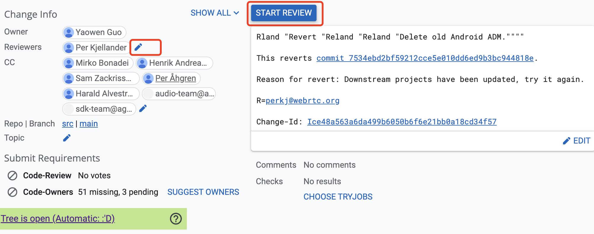
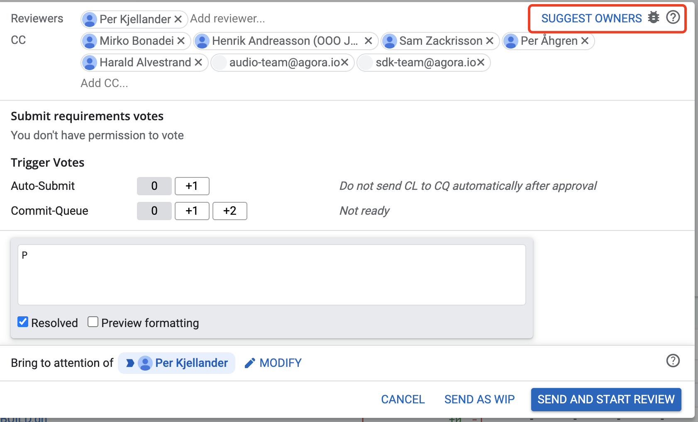

# WebRTC

1. WebRTC 是 google 收购了 GIPS、On2 等公司、融合后开源的项目。由于后来提交到 W3C 称为了标准，其它浏览器也需要支持。但是其它浏览器（包括 Safafi 和 Firefox）并没有从头实现，而是用的 Google 的实现。

虽然 Google 的 WebRTC 实现是最早也是功能支持最全的一个，但是仍然有很多工作待处理，因此想要做点贡献并不难、主要有几个原因：

1. Google 先实现，后推动了标准化，有很多实现跟规范不一致，需要修改。例如 Google 的 WebRTC SDP 支持 `Plan B` 和 `Unified Plan`，WebRTC 1.0 只支持 `Unified Plan`。WebRTC 定义的标准接口，和 google 实现的一些来的作用是重复的，例如标准定义了 `RTCTransceiver` 表示一个收发器，在 google 的实现中有个 `Channel`，正在被逐渐合并到新的 `RTCTransceiver` 中。

2. WebRTC 支持多平台，有很庞大的代码，数量大意味着修改缓慢，有很多工作待做。


## 贡献代码

在 WebRTC 的官网有一个和开源项目内部都有如何做贡献的说明文档。

官网的说明：https://webrtc.org/support/contributing
项目内的说明：https://webrtc.googlesource.com/src/+/main/g3doc/become_a_committer.md

以下的内容基本上是对这两个文档和实际操作的经历的整理。

## 沟通

开源项目和内部项目最大的不同之一就是沟通交流。因此维护一个用于沟通的社区非常有必要。常见的有邮件和论坛。比较早期的项目一般是邮件，后出现的项目一般会使用论坛，更加现代化一下。一些小型的项目直接使用 Github 作为交流的平台。
- Linux 内核至今仍在使用邮件列表
- Python 开发社区从邮件迁移到了论坛。

这些交流平台都有都有一些适用于异步协作特点：

- 保留历史记录，方便后来加入的人员随时查看，不会就同一问题重复发问。

- 记录问题和讨论过程。有问有答，沟通的时间线非常清晰。

谷歌的 WebRTC 开源项目依托于谷歌的基础服务。论坛使用了 [groups](https://groups.google.com/g/discuss-webrtc), bug 列表使用了 [Chromium bug 列表](https://bugs.chromium.org/p/webrtc/issues/list)

- 开发中遇到什么问题都优先到 groups 上搜一下之前有没有人遇到同样的问题，以及是不是有解决方案。没有的话就可以新提一个。

- 遇到了 bug 就可以去 bug 列表搜一下是不是有这个 bug 的跟踪，以及是不是有人正在解决这个问题。或者关于这个问题的讨论。
    代码中也有注释会加上 bug 的 id.


### 如何发现待修改的代码

1. WebRTC 代码中有很多 TODO 和 bug 标记。


2. 如果自己发现了 bug 或者可优化的内容，也可以提交到 [WebRTC 的 bugs 跟踪社区](https://bugs.chromium.org/p/webrtc/issues/list)，然后提交修复。

3. 如果是简单的修改，例如代码风格、注释等可以直接提交一个 CL（Change List）。如果改动比较大，最好是先在 bug 跟踪中提一个 bug，然后跟内部人员讨论确定后再修改。

确认过须有优化之后，然后修改代码、提交。

### WebRTC 的组织

WebRTC 是一个开源项目，但是是由 Google 主导的，据说 Firefox 和 Safari 中使用的 WebRTC 也都是复制的 Google 的项目。

不同于完全社区驱动的项目，Google 的内部开发人员对项目有主导作用。邮件 `@webrtc.org` 结尾的邮件是 WebRTC 项目的内部人员。所有提交贡献的人在首次提交时都需要都在项目根目录的 `AUTHORS` 文件中添加姓名和邮箱。AUTHORS 中组织和个人分开排列。分别按照字典顺序排列。

每个模块都会有 `OWNERS` 文件，记录该模块的维护人员。如果修改到这部分代码，就需要添加至少其中一人作为 CL 的 Reviwer。（这部分在 gerrit 上就可以操作，而且很友好)


WebRTC 将贡献者的使用权限进行了分级：

- 随机贡献者: 只能提交代码，由 reviewer 负责运行测试和合并。

- Tryjob access: 可以运行测试。有 10-20 个提交，[然后申请](https://bugs.chromium.org/p/webrtc/issues/entry?template=Get+tryjob+access) 并附上自己 CL 的链接。

- WebRTC committer rights: 允许合并代码和运行测试。当做了一些贡献之后，如果想要成为 Commiter，可以[申请称为 Commiter](https://bugs.chromium.org/p/webrtc/issues/entry?template=Become+WebRTC+committer)。对Commiter 的要求也更高，比如代码规范，最佳实践。也是由有内部的管理人员根据提交的 CL 进行评估决定的。

具体可以看项目中的 [成为 Commiter ](https://webrtc.googlesource.com/src/+/main/g3doc/become_a_committer.md) 的文档


## 签开源协议

[首先需要签一个协议](https://webrtc.googlesource.com/new-password )。打开连接，然后允许访问邮箱信息，同意协议之后，会打开一个页面生成一个脚本。


复制脚本在自己电脑的终端上执行一下就可以了。


## 提交 Review

### 工具

WebRTC 使用了 Chromium 一套开发工具 [depot_tools](https://chromium.googlesource.com/chromium/tools/depot_tools.git)，Mac 和 linux 只需要 clone 下来并设置 PATH 路劲就可以直接使用了。depot_tools 有大量的 git 子命令以及用于 git 仓库操作的工具。

例如：
- `fetch`, `gclient` 用于拉取仓库和同步依赖的命令
- `git cl` 用于和 Gerrit 和 Rietveld 代码审核交互的工具。
- `gn` 构建工具

以 WebRTC 为例，看一下这些命令的使用。

1. clone 仓库
```shell
$ mkdir webrtc & cd webrtc
$ fetch --nohooks webrtc_android
```

2. 同步依赖，以及执行 hook 脚本
```shell
$ gclient sync
```
3. 编译
```shell
$ cd src
$ gn gen out/Debug --args='target_os="android" target_cpu="arm"'
$ autoninja -C out/Debug
```

[提交代码需要说一下](https://chromium.googlesource.com/chromium/tools/depot_tools.git)

```
git new-branch <somename>
# Hack
git add .
git commit -a -m "Fixes goat teleporting"
# find reviewers
git cl owners
git log -- <yourfiles>

# Request a review.
git cl upload -r reviewer1@chromium.org,reviewer2@chromium.org --send-mail

# Edit change description if needed.
git cl desc

# If change is approved, flag it to be committed.
git cl set-commit

# If change needs more work.
git rebase-update
...
git cl upload -t "Fixes goat teleporter destination to be Australia"
```

- 对分支没有要求，你可以随便建立自己的分支。
- 提交信息如果是修复 bug，需要添加一个 Bug: webrtc:<bug id>。不是的话可以写 Bug: None。
- **所有上传的提交都有基于最新的 main 分支，否则 `git cl` 会出错。**提交之后如果 Review 的周期比较长，出现了冲突，应该及时的 rebase 最新的代码，防止合并冲突。如果出现了合并冲突，维护人员也会提醒你 rebase 最新的代码。

重点说一下 `git cl` 子命令，这个我们也可以使用。

### 提交流程

```shell
$ git cl upload
CheckChangeOnUpload from /Users/albert/project/webrtc/linux_android/src/PRESUBMIT.py took 46.0s to run.
** Presubmit Warnings **
Found 4 lines longer than 80 characters (first 5 shown).
  modules/audio_device/audio_device_impl.cc, line 89, 89 chars \
  sdk/android/src/jni/audio_device/audio_device_module.cc, line 636, 81 chars \
  sdk/android/src/jni/audio_device/audio_device_module.cc, line 640, 82 chars \
  sdk/android/src/jni/audio_device/audio_device_module.h, line 91, 81 chars

** Presubmit Messages **
You need LGTM from owners of depends-on paths in DEPS that  were modified in this CL:
    '+modules/utility/include/jvm_android.h',

Suggested missing target path OWNERS:
    perkj@webrtc.org

Presubmit checks took 48.5s to calculate.
There were Python 3 presubmit warnings. Are you sure you wish to continue? (y/N): ^Cinterrupted
Interrupted
```


如果是严重的不符合代码规范，就会报 Error，无法提交上去。

Worning 可以修改。如果确认没问题，可以可以忽略警告，继续提交。

例如这里添加所有者 review 之后，少了一个警告。
```
$ git cl upload -r  perkj@webrtc.org

Running Python 3 presubmit upload checks ...
Ignoring /Users/albert/project/webrtc/linux_android/src/sdk/android/src/java/org/webrtc/ApplicationContextProvider.java; not a valid file name (cu, h, cuh, cpp, cc)
Ignoring /Users/albert/project/webrtc/linux_android/src/sdk/android/src/java/org/webrtc/audio/WebRtcAudioManager.java; not a valid file name (cu, h, cuh, cpp, cc)
CheckChangeOnUpload from /Users/albert/project/webrtc/linux_android/src/PRESUBMIT.py took 18.9s to run.
** Presubmit Warnings **
Found 4 lines longer than 80 characters (first 5 shown).
  modules/audio_device/audio_device_impl.cc, line 89, 89 chars \
  sdk/android/src/jni/audio_device/audio_device_module.cc, line 636, 81 chars \
  sdk/android/src/jni/audio_device/audio_device_module.cc, line 640, 82 chars \
  sdk/android/src/jni/audio_device/audio_device_module.h, line 91, 81 chars

Presubmit checks took 20.7s to calculate.
There were Python 3 presubmit warnings. Are you sure you wish to continue? (y/N): y
```

基本不用修改， 因为是 revert, Bug id 也不用填写。保存即可，就会输出提交的信息
```
Was the presubmit check useful? If not, run "git cl presubmit -v"
to figure out which PRESUBMIT.py was run, then run git blame
on the file to figure out who to ask for help.
No more presubmits to run - skipping Python 2 presubmits.
 examples/androidnativeapi/BUILD.gn                                                    |    1 -
 examples/androidvoip/BUILD.gn                                                         |    1 -
 modules/audio_device/BUILD.gn                                                         |   57 +-----
 modules/audio_device/DEPS                                                             |    1 +
  1 # Enter a description of the change.
 modules/audio_device/android/aaudio_player.cc                                         |  228 ----------------------
 modules/audio_device/android/aaudio_player.h                                          |  147 --------------
 modules/audio_device/android/aaudio_recorder.cc                                       |  220 ---------------------
 modules/audio_device/android/aaudio_recorder.h                                        |  129 -------------
 modules/audio_device/android/aaudio_wrapper.cc                                        |  499 -----------------------------------------------
 modules/audio_device/android/aaudio_wrapper.h                                         |  127 ------------
 modules/audio_device/android/audio_common.h                                           |   28 ---
 modules/audio_device/android/audio_device_template.h                                  |  435 -----------------------------------------
 modules/audio_device/android/audio_device_unittest.cc                                 | 1020 ------------------------------------------------------------------------------------------------
 modules/audio_device/android/audio_manager.cc                                         |  318 ------------------------------
 modules/audio_device/android/audio_manager.h                                          |  225 ---------------------
 modules/audio_device/android/audio_manager_unittest.cc                                |  239 -----------------------
 modules/audio_device/android/audio_record_jni.cc                                      |  280 ---------------------------
 modules/audio_device/android/audio_record_jni.h                                       |  168 ----------------
 modules/audio_device/android/audio_track_jni.cc                                       |  296 ----------------------------
 modules/audio_device/android/audio_track_jni.h                                        |  161 ---------------
 modules/audio_device/android/build_info.cc                                            |   59 ------
 modules/audio_device/android/build_info.h                                             |   86 ---------
 modules/audio_device/android/ensure_initialized.cc                                    |   42 ----
 modules/audio_device/android/ensure_initialized.h                                     |   17 --
 modules/audio_device/android/java/src/org/webrtc/voiceengine/BuildInfo.java           |   51 -----
 modules/audio_device/android/java/src/org/webrtc/voiceengine/WebRtcAudioEffects.java  |  312 ------------------------------
 modules/audio_device/android/java/src/org/webrtc/voiceengine/WebRtcAudioManager.java  |  371 -----------------------------------
 modules/audio_device/android/java/src/org/webrtc/voiceengine/WebRtcAudioRecord.java   |  409 ---------------------------------------
 modules/audio_device/android/java/src/org/webrtc/voiceengine/WebRtcAudioTrack.java    |  494 -----------------------------------------------
 modules/audio_device/android/java/src/org/webrtc/voiceengine/WebRtcAudioUtils.java    |  377 ------------------------------------
 modules/audio_device/android/opensles_common.cc                                       |  103 ----------
 modules/audio_device/android/opensles_common.h                                        |   62 ------
 modules/audio_device/android/opensles_player.cc                                       |  434 -----------------------------------------
 modules/audio_device/android/opensles_player.h                                        |  195 -------------------
 modules/audio_device/android/opensles_recorder.cc                                     |  431 -----------------------------------------
 modules/audio_device/android/opensles_recorder.h                                      |  193 ------------------
 modules/audio_device/audio_device_impl.cc                                             |   82 ++------
 modules/audio_device/audio_device_impl.h                                              |   11 --
 modules/audio_device/g3doc/audio_device_module.md                                     |    4 +-
 modules/utility/source/jvm_android.cc                                                 |    4 -
 sdk/android/BUILD.gn                                                                  |   25 +--
 sdk/android/native_api/DEPS                                                           |    1 +
 sdk/android/native_api/audio_device_module/audio_device_android.cc                    |   80 ++++++++
 sdk/android/native_api/audio_device_module/audio_device_android.h                     |   13 +-
 sdk/android/{native_unittests => native_api/jni}/application_context_provider.cc      |   12 +-
 sdk/android/{native_unittests => native_api/jni}/application_context_provider.h       |   12 +-
 sdk/android/native_unittests/android_network_monitor_unittest.cc                      |    4 +-
 sdk/android/native_unittests/audio_device/audio_device_unittest.cc                    |   95 +++++----
 sdk/android/native_unittests/peerconnection/peer_connection_factory_unittest.cc       |    4 +-
 sdk/android/{native_unittests => src/java}/org/webrtc/ApplicationContextProvider.java |    2 +-
 sdk/android/src/java/org/webrtc/audio/WebRtcAudioManager.java                         |    6 +-
 sdk/android/src/jni/audio_device/audio_device_module.cc                               |    8 +
 sdk/android/src/jni/audio_device/audio_device_module.h                                |    4 +
 53 files changed, 216 insertions(+), 8367 deletions(-)
Waiting for editor...

saving CL description to /opt/depot_tools/.git_cl_description_backup

Enumerating objects: 92, done.
Counting objects: 100% (92/92), done.
Delta compression using up to 8 threads
Compressing objects: 100% (41/41), done.
Writing objects: 100% (48/48), 6.41 KiB | 3.20 MiB/s, done.
Total 48 (delta 38), reused 9 (delta 4), pack-reused 0
remote: Resolving deltas: 100% (38/38)
remote: Processing changes: refs: 1, new: 1, done
remote: commit b1a544b: warning: subject >50 characters; use shorter first paragraph
remote:
remote: SUCCESS
remote:
remote:   https://webrtc-review.googlesource.com/c/src/+/271841 Rland "Revert "Reland "Reland "Delete old Android ADM."""" [WIP] [NEW]
remote:
To https://webrtc.googlesource.com/src.git
 * [new reference]         b1a544b9d0d596acac8108dd1c2bd52bf219603a -> refs/for/refs/heads/main%wip,m=Initial_upload,r=perkj@webrtc.org,cc=henrika@webrtc.org,cc=hta@webrtc.org,cc=mbonadei@webrtc.org,cc=peah@webrtc.org,cc=saza@webrtc.org
```

revert 的代码会自动添加一些 CC.


如果没有 reviewer 的话，需要自己添加。点 `编辑 Reviewer 的图标`或者点 `Start Review` 都可以添加 Reviewer


添加完 reviewer 之后，状态就会变成 `active`


选择 reviewer 要覆盖所有的文件




## 测试和 Review


WebRTC 的测试分单元测试和继承测试：

- 单元测试是使用 google 的 gtest;
- 集成测试是使用 [KITE 自动化测试](https://webrtc.org/support/kite)，可用于在浏览器上运行测试。 [以及国内人搭建 KITE 测试的帖子](https://blog.piasy.com/2020/03/28/KITE/index.html)

集成测试了解的不多。这里仅说一下单元测试。

只有测试通过的代码才会被合并，如果出现了运行测试错误，就需要修改代码。

添加单元测试：WebRTC 的代码分成很多小的模块，这些模块是在 `BUILD.gn` 中具名的 lib、source_set 等，返回模块对外暴露的接口，都需要写测试用例。例如 ADM(Audio Device Module) 是封装 Audio 硬件操作的接口，各个平台实现对 Audio 的操作的封装。ADM 实现的接口都需要编写单元测试。

谁修改了代码，就需要同时修改单元测试，使其想匹配。删除了的代码，相应的单元测试代码也应该一并删除，保证在运行测试的时候完全通过。

虽然单元测试最理想的方式是在本地测试，但是由于 WebRTC 的 Audio 和 Video 是依赖于硬件环境的，需要运行在真实的机器上。以安卓为例，需要有 root 权限的手机或虚拟机。如果有运行单元测试的条件，[在文档中, Running Tests on an Android Device](https://webrtc.googlesource.com/src/+/main/docs/native-code/android/index.md)一节描述了如何运行测试。

最好的方式还是在 google 提供的运行环境上测试。在提交代码之后，gerrit 的 review 页面有一个 `CHOOSE TRYJOBS`来选择运行测试的机器。但是这个只有在提交了 10~20 个修改后才能申请 Tryjob 权限。我们可以将代码提交上去，让代码维护人员帮我们运行测试。基本上每次提交都会维护人员都会先运行测试，然后才 review.


## 维护自有代码碰到的一些问题

1. 功能不全，bug 多。代表 ShadowLayout.

2. 和上游各列。代表： TabLayout 现在不能和 ViewPager2 合用。

## 附加

[如何创建 git 子命令](http://t.zoukankan.com/kidsitcn-p-4743042.html)
