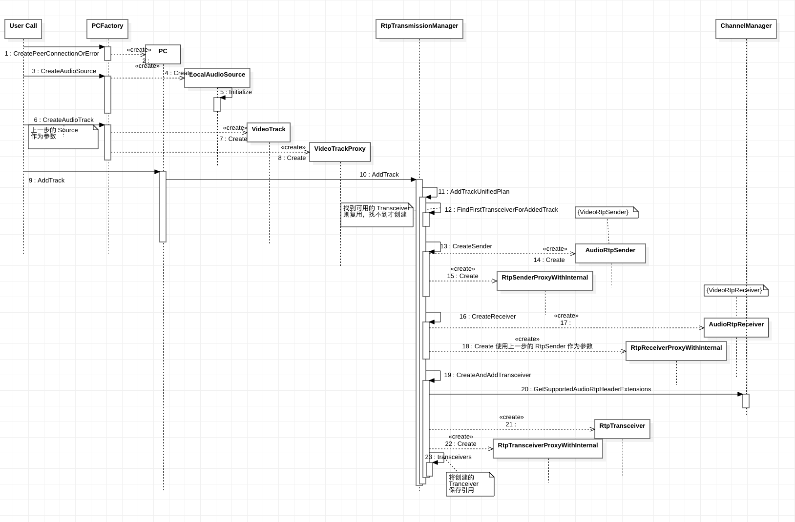

# 媒体数据控制

媒体数据使用 addTrack/removeTrack 添加或删除。根据 [RFC8829](https://datatracker.ietf.org/doc/html/rfc8829) 规范 3.4.1. 节规定，每添加一个 Track 都将隐式确定一个 RtpTransceivers，也可以显示直接添加一个 RtpTransceivers。 除了 mid 为 null 的 RtpTransceivers(没有关联)，RtpTransceivers 唯一确定一个 m 块，RtpTransceiver 与 m 块一对一对应。因此追踪 AddTrack()/AddTransceiver() 一定要确定 RtpTransceivers 的生成，否则可能在庞杂的代码中过分计较细节，失去主线。


## 模型

### 收发器（transceiver）

addTrack 时会为其分配 transceiver（新建或复用已有 transceiver），WebRTC 实现的 unified plan 规范，每个transceiver 包含一个 sender 和一个 receiver，它们拥有相同的 mid。也可以通过 addTransceiver 来建立 transceiver —— sender/receiver 的关联。

一个 PC 可以有多个 transceiver。addTransceiver 创建一个新的 RTCRtpTransceiver 并将其添加到 RTCPeerConnection 已关联的收发器集中 。每个收发器都代表一个双向流，并带有 RTCRtpSender 和 RTCRtpReceiver。

多媒体模块音频和视频其实是独立且并行的两个部分。 根据 [README][1] 中关于架构的概述，媒体的采集和播放是硬件相关的，并且为了保证单例，都在 PCFactory 中准备好了。

### 数据源

WebRTC 对多媒体数据的抽象模型：

WebRTC 将每个数据的抽象为一个 Track，而产生数据的源称为 Source，然后数据的流向就是

Source --> Track ---> AudioSender/AudioReceiver

## 1. Source

Source 的创建 Audio 和 Video 不同，Audio 由 PCFactory 创建，而 Video 则不是。

视频采集模块，Mac/IOS 一般使用 AVFoundation 框架。Linux 一般使用 V2L4库，Windows 则使用 MediaFoundation 库。

### Audio Source

Audio 的 Source 看起来跟 PCFactory 没什么联系，就是调用 `LocalAudioSource::Create(&options)` 并调用 `LocalAudioSource::Initialize` 而已，很奇怪 WebRTC 设计这样的接口。使得 Audio 和 Video 缺少了对称美。

**Audio 的 Source 是一个假的，只是用于媒体协商，定制协商参数，代表本地会开启录音，数据根本不会从 Source 经过**

### Video Source

虽然 WebRTC 的 SDK 封装了和 Auidio 一样的从 PC Factory 获取 VideoSource 的方法。但是 Native API 里并没有。Native 里不同平台上差别比较大，根据不同平台有各自的实现。跟 Audio 一样，需要自己创建一个 VideoTrack，封装各自平台的 API。

VideoSource 只需要创建一个继承自 `rtc::AdaptedVideoTrackSource` 的类，根据平台，自己实现即可。

## 2. Tracker

Audio 和 Video 的 Track 都是由 PCFactory 创建的。其内容很简单，都是先检查当前线程，然后分别调用 `AudioTrack::Create` 和 `VideoTrack::Create` 进行创建，并传到线程切换代理中。最后只有 Source 中的 `RegisterObserver(this)` 才是最重要的，将 Track 注册给了 Source。这样在 Source 有数据时，将发送给下游。

这里的 MediaStreamTrack 只不过是 AudioTrackInterface 的模板实现。简单增加了通知功能。

## 添加媒体时序图




## 3. Add Tracker

到这里 Audio 和 Video 就使用一套 API 了。添加 Track 到 PC 中。AddTrack 的流程就是和 RtpTransceiver 关联的过程。因为一个 RtpTransceiver 唯一确定一个 m-line。

AddTrack 第一个参数是创建的 Track 对象，可以是视频流或者音频流。第二个参数是 streamId 的类表。相同 streamId 的 media 将保持时间的同步，例如一个视频的音频和视频部分，需要保持同步。之所以第二个参数是个列表，是可以将同一个 Media 分配到不同的 Stream 中。可以是一个空列表，WebRTC 将默认使用同一个 MediaStream 同步所有的空参数的 Media。

这个函数主要完成：

1. 由于 `AddTrack` 是一个 Audio/Video 共用的接口，内部先判断 Track 类型是 Audio 或者 View，否则报错。

2. 检查连接是否已经关闭

3. 检查该 track 是否已经添加过

4. 获取 RtpTransmissionManager 添加 Track，**其内部最终会为 Track 关联一个 `Transceiver`**


最终目标是创建 Transceiver, 一个 Transceiver 唯一对应一个 `m=` 块。带有一个 RtpSender 和 RtpReceiver

## QA

1. 为什么一个 Track 需要创建 一个 Sender + 一个 Receiver?

答：添加 Track 表示用于发送，所以需要一个 Sender。是不是接收由后继的协商决定。EFC 规定 TrpTranceiver Receiver 用于包含接收的参数（应该是可以优化为后继协称的时候再创建的）。


2. 设置 Track 说明要发送，要不要接收由什么决定？

答：是不是要接收由后继的协商决定，在应答方回复的 answer 中的信息是否要发送确定，应答方需要发送，则需要接收。如果应答方拒绝接收数据，则发送也不再需要。


## addTransceiver()

如果你想将本地的摄像头麦克风的数据（视频聊天）发送到远端，那么 addTrack 刚好能满足你的需求，毕竟需要使用到用户的摄像头、麦克风（浏览器会询问用户是否授权）。但是你只想接收音视频（只建立音视频轨道），并不需要使用摄像头、麦克风，那我们应该怎么去做呢？addTransceiver 才是更好的选择。

PC 提供了 API 用于直接添加 transceiver，其中有四个 API。

```C++
// 跟 AddTracker 一样，添加一个 Tracker
RTCErrorOr<rtc::scoped_refptr<RtpTransceiverInterface>> AddTransceiver(
    rtc::scoped_refptr<MediaStreamTrackInterface> track
) override;

// RtpTransceiverInit 参数用于控制方向
RTCErrorOr<rtc::scoped_refptr<RtpTransceiverInterface>> AddTransceiver(
    rtc::scoped_refptr<MediaStreamTrackInterface> track,
    const RtpTransceiverInit& init
) override;

RTCErrorOr<rtc::scoped_refptr<RtpTransceiverInterface>> AddTransceiver(
    cricket::MediaType media_type
) override;

RTCErrorOr<rtc::scoped_refptr<RtpTransceiverInterface>> AddTransceiver(
    cricket::MediaType media_type,
    const RtpTransceiverInit& init
) override;
```
① 和 ② 和 AddTracker 一样，用于添加一个 Tracker，其中 RtpTransceiverInit 提供了控制 【方向、steamd_id、编解码】的参数。

③ 和 ④ 只需要提供 MediaType 就可以城建一个 transceiver。

四个函数最后都是调用如下内部的 AddTransceiver，以上函数都是对参数的检查，不再贴代码。

```C++
// Internal implementation for AddTransceiver family of methods. If
// `fire_callback` is set, fires OnRenegotiationNeeded callback if successful.
RTCErrorOr<rtc::scoped_refptr<RtpTransceiverInterface>> AddTransceiver(
    cricket::MediaType media_type,
    rtc::scoped_refptr<MediaStreamTrackInterface> track,
    const RtpTransceiverInit& init,
    bool fire_callback = true
) override;
```
- media_type 只能是 Audio 或者 Video.
- track 可空
- init 如果外部没传，就是用 RtpTransceiverInit() 提供默认的。
- fire_callback 都是使用的默认 true.

也是调用 RtpTransmissionManager 创建 RTCRtpTransceiver 以及关联的 Sender、Receiver。

AddTracker 和 AddTransceiver 都是创建 RTCRtpTransceiver， 相比 AddTracker，AddTransceiver 因为没有 Tracker，流程就很简单，适合于接收流。

***总结：***

核心就是: 创建一个新的 RTCRtpTransceiver 并将其添加到 RTCPeerConnection 已关联的收发器集中。每个收发器都代表一个双向流，并带有 RTCRtpSender 和 RTCRtpReceiver。