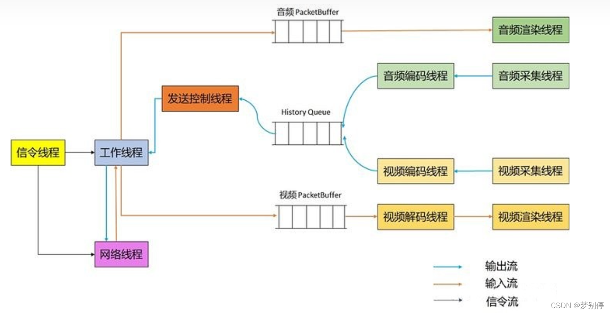

# Thread

WebRTC 支持的音视频通话是一个庞大工程。在内部有不同线程来做不同的工作。

- 信令线程：负责信令的处理，WebRTC 的信令交互是有时序的，因此所有的信令都在一个线程中按照队列处理。

- 工作线程：负责一些本地处理工作，例如本地音视频设备的操作，开关音视频设备等。内部比较耗时的工作如 AecDump，EventLog、网络接收的数据包分流。

- 网络线程：网络线程工作在网络传输层，它负责网络收发包，从网络接收包数据并发送给工作线程。

- 音频相关线程：音频采集线程、音频播放线程、音频编码线程。（但没有音频解码线程，音频解码器做的太好了，延迟几乎可以忽略，因此没有单独线程）
- 视频相关线程：视频采集线程、视频渲染线程、视频编码线程、视频解码线程。



1. WebRTC 是一个线程安全的库，所有提供给外部的 API 都可以在任意线程调用，WebRTC 会将任务抛到对应线程处理。例如 PC 的 `SetAudioRecording(bool recording)` 接口用于开关本地麦克风，我们可能在收到某个指令后直接在 `当前线程`进行该操作，由于是对本地的操作，WebRTC 最终会将其切换到 `工作线程` 处理。而 `createOffer`，`createAnswer` 等操作会切到信令线程。

2. WebRTC 可以建立多个连接，即使创建多个连接、以上线程也是复用的，不会创建多个同一类型的线程。例如不会创建多个信令线程。这很好理解，因为信令的实际需要操作本地资源，而本地的设备管理需要保证单例，单一线程保证线程安全更简单。

3. 如果进行 WebRTC 本身的开发，其内部函数应该放在哪个线程呢？
  - 对于音视频相关的内容，在哪个线程格外清晰。
  - 对于信令、工作 好像不是特别清晰，因为他们之间牵涉到相互的调用，由于调用链比较长，有时可以在这个函数切换，有时也能在调用到函数中切换，需要根据实际情况进行分析。总的来说：**关于远端信令交互的，需要放到信令线程中处理；关于本地的操作，需要放到工作线程**

实际的线程远不止于此：

```
// 三个可定制线程
network_thread
worker_thread -
signaling_thread
// 其它
rtc_event_log   // // log 线程

// audio
rtc-low-prio    // voice engine 中用于处理低优先级任务的队列
AudioDeviceBuff // AudioDeviceBufferTimer AudioDeviceBuffer 的专用线程。
AudioEncoder    // 编码，没有解码线程。

// OpenSLES
AudioTrack      // 播放
AudioRecord     // 录制

// video
FrontCapture    // 视频采集
IncomingVideoStream // 视频处理线程
RenderThread    // 渲染线程, 安卓渲染线程，不同平台可能不一样。

DecodingQueue   // 每个 VideoReceiveStream 配一个 DecodingQueue
EncoderQueue    // 每个 VideoSendStream 配一个 VideoStreamEncoder，VideoStreamEncoder 中带一个 EncoderQueue

MediaCodec_loop // Android 编解码 SDK 的线程，编码和解码各一个。
CodecLooper     // Android 编解码 SDK 的线程，仅一个。

// 网络
TaskQueuePacedS // TaskQueuePacedSender
// RTP 网络发送有两个线程：TaskQueuePacedSender 控制发送报文节奏；network_thread 发送报文。
// 在之前的版本中是 PacerThread，更老的版本还有一个 ModuleProcessThread。
rtp_send_control // rtp_send_controller RtpTransportControllerSend 线程

// 使用 Java SDK 才有的额外线程
// 如果使用的是 Java 的 Recorder 和 Tracker 还有另外的四个线程。
AudioPortEventHandler // AudioPortEventHandler.java
AudioTrackJavaThread
AudioRecordJavaThread
WebRtcVolumeLevelLoggerThread // VolumeLogger.java 线程
// Video
decoder-texture // decoder-texture-thread AndroidVideoDecoder.java 的线程
localViewEglRenderer 和 JNISurfaceTexture // SurfaceViewRenderer 的线程。 <ViewId>EglRenderer


// native
thread #39: name = 'ImageReader-640' // native AImageReader 的线程。
```


## 可以指定的线程

其中信令、工作、网络三个线程可以呦用户指定，如果不给出，WebRTC 内部会创建默认的。

指定线程是在创建 PeerConnectionFactory 的时候。

```C++
RTC_EXPORT rtc::scoped_refptr<PeerConnectionFactoryInterface>
CreatePeerConnectionFactory(
    rtc::Thread* network_thread,
    rtc::Thread* worker_thread,
    rtc::Thread* signaling_thread,
    rtc::scoped_refptr<AudioDeviceModule> default_adm,
    rtc::scoped_refptr<AudioEncoderFactory> audio_encoder_factory,
    rtc::scoped_refptr<AudioDecoderFactory> audio_decoder_factory,
    std::unique_ptr<VideoEncoderFactory> video_encoder_factory,
    std::unique_ptr<VideoDecoderFactory> video_decoder_factory,
    rtc::scoped_refptr<AudioMixer> audio_mixer,
    rtc::scoped_refptr<AudioProcessing> audio_processing,
    AudioFrameProcessor* audio_frame_processor = nullptr,
    std::unique_ptr<FieldTrialsView> field_trials = nullptr);
}
```

如果不传，内部会创建默认的。

```C++
CreateModularPeerConnectionFactory(PeerConnectionFactoryDependencies dependencies) ->
PeerConnectionFactory::Create(PeerConnectionFactoryDependencies dependencies) ->
ConnectionContext::Create(PeerConnectionFactoryDependencies* dependencies) ->
ConnectionContext::ConnectionContext(
    PeerConnectionFactoryDependencies* dependencies)
    : network_thread_(MaybeStartNetworkThread(dependencies->network_thread,
                                              owned_socket_factory_,
                                              owned_network_thread_)),
      worker_thread_(dependencies->worker_thread,
                     []() {
                       auto thread_holder = rtc::Thread::Create();
                       thread_holder->SetName("pc_worker_thread", nullptr);
                       thread_holder->Start();
                       return thread_holder;
                     }),
      signaling_thread_(MaybeWrapThread(dependencies->signaling_thread,
                                        wraps_current_thread_))
                                        ...
```
然后在调用 `CreatePeerConnectionOrError` 创建 PC时将线程传给了 PC。由于可以创建多个 PC，因此多个 PC 使用的三个线程其实是同一套。

```C++
RTCErrorOr<rtc::scoped_refptr<PeerConnectionInterface>>
PeerConnectionFactory::CreatePeerConnectionOrError(
    const PeerConnectionInterface::RTCConfiguration& configuration,
    PeerConnectionDependencies dependencies) {
  ...
  auto result = PeerConnection::Create(context_, options_, std::move(event_log),
                                       std::move(call), configuration,
                                       std::move(dependencies));
  if (!result.ok()) {
    return result.MoveError();
  }
  // We configure the proxy with a pointer to the network thread for methods
  // that need to be invoked there rather than on the signaling thread.
  // Internally, the proxy object has a member variable named `worker_thread_`
  // which will point to the network thread (and not the factory's
  // worker_thread()).  All such methods have thread checks though, so the code
  // should still be clear (outside of macro expansion).
  rtc::scoped_refptr<PeerConnectionInterface> result_proxy =
      PeerConnectionProxy::Create(signaling_thread(), network_thread(),
                                  result.MoveValue());
  return result_proxy;
}
```

- `signaling` 默认创建的使用当前线程。例如：
- `worker` 默认新创建一个线程。
- `network` 带有一个 SocketServer。

三线程队列的关系：箭头代表调用方向
```
              signaling_thread
               /            \
              /              \
             /                \
            v                  V
worker_thread  ----------->  network_thread 有个别自己调用自己的地方


signaling_thread_->AllowInvokesToThread(worker_thread());
signaling_thread_->AllowInvokesToThread(network_thread_);
worker_thread_->AllowInvokesToThread(network_thread_);
if (!network_thread_->IsCurrent()) {
  // network_thread_->IsCurrent() == true means signaling_thread_ is
  // network_thread_. In this case, no further action is required as
  // signaling_thread_ can already invoke network_thread_.
  network_thread_->PostTask(
      [thread = network_thread_, worker_thread = worker_thread_.get()] {
        thread->DisallowBlockingCalls();
        thread->DisallowAllInvokes();
        if (worker_thread == thread) {
          // In this case, worker_thread_ == network_thread_
          thread->AllowInvokesToThread(thread);
        }
      });
}
```


使用了代理的类：
需要 primary 和 secondary 线程
BEGIN_PROXY_MAP(PeerConnectionFactory)
BEGIN_PROXY_MAP(PeerConnection)
BEGIN_PROXY_MAP(RtpReceiver)
BEGIN_PROXY_MAP(VideoTrackSource)
BEGIN_PROXY_MAP(VideoTrack)

只需要 primary 线程
BEGIN_PRIMARY_PROXY_MAP(MediaStream)
BEGIN_PRIMARY_PROXY_MAP(AudioTrack)
BEGIN_PRIMARY_PROXY_MAP(DtmfSender)
BEGIN_PRIMARY_PROXY_MAP(RtpTransceiver)
BEGIN_PRIMARY_PROXY_MAP(RtpSender)
BEGIN_PRIMARY_PROXY_MAP(DataChannel)

- PCFactoryProxy:
    - primary_thread: signaling_thread
    - secondary_thread: worker_thread
- PCProxy: 只有此一个是 Network
    - primary_thread: signaling_thread
    - secondary_thread: network_thread

- VideoTrackProxy:
    - primary_thread: signaling_thread
    - secondary_thread: worker_thread
- RtpReceiver:
    - primary_thread: signaling_thread
    - secondary_thread: worker_thread
- VideoTrackSource:
    - primary_thread: signaling_thread
    - secondary_thread: worker_thread
- VideoTrack:
    - primary_thread: signaling_thread
    - secondary_thread: worker_thread


- MediaStreamProxy: signaling_thread
- AudioTrackProxy: signaling_thread
- DtmfSenderProxy: single_thread
- RtpTransceiver: signaling_thread
- RtpSender: signaling_thread
- DataChannel: signaling_thread

其它
- RTCCertificateGenerator:
    - signaling_thread
    - network_thread
- RtpTransmissionManager：
    - signaling_thread
    - worker_thread

- VideoTrack: worker_thread
- webrtc::Call::Config: network_thread
- AudioRtpSender: work_thread


WebRTC 为了统一各个平台上的接口，封装了统一的 `rtc::Thread` 和 `rtc::PlatformThread`。

其中 `rtc::Thread` 其实是一个队列，实现了 `webrtc::TaskQueueBase` 接口，用于顺序执行任务。

`rtc::PlatformThread` 用于封窗各个平台上的线程，从而保证接口的一致性。

每创建一个 `rtc::Thread` 队列，就会创建一个线程，`rtc::Thread` 和 `rtc::PlatformThread` 是一一对应的。各个模块应该统一使用 `rtc::Thread` 提供的接口，而不必关心线程 `rtc::PlatformThread` 的操作。


## 1. 创建

创建分为两种

- 分别对应于 `network` 的带 `SocketServer` 的构造器。
- `signaling`、`worker` 的不带 SockerServer 的队列。

> 示例

```C++
std::unique_ptr<rtc::Thread> network_thread = rtc::Thread::CreateWithSocketServer();
network_thread->SetName("network_thread", nullptr);
RTC_CHECK(network_thread->Start()) << "Failed to start thread";

std::unique_ptr<rtc::Thread> worker_thread = rtc::Thread::Create();
worker_thread->SetName("worker_thread", nullptr);
RTC_CHECK(worker_thread->Start()) << "Failed to start thread";

std::unique_ptr<rtc::Thread> signaling_thread = rtc::Thread::Create();
signaling_thread->SetName("signaling_thread", NULL);
RTC_CHECK(signaling_thread->Start()) << "Failed to start thread";
```

### 带 SocketServer 的 Thread

```C++
// rtc_base/thread.h
explicit Thread(SocketServer* ss);
explicit Thread(std::unique_ptr<SocketServer> ss);
Thread(SocketServer* ss, bool do_init);
Thread(std::unique_ptr<SocketServer> ss, bool do_init);
```

或者使用静态函数

```C++
// rtc_base/thread.h
static std::unique_ptr<Thread> CreateWithSocketServer();
```

### 不带 SocketServer 的 Thread

没有提供空参构造函数，静态函数更方便。

```C++
// rtc_base/thread.h
static std::unique_ptr<Thread> Create();
```
静态方法其实也是调用一个带参数的构造函数创建的。

```C++
std::unique_ptr<Thread> Thread::CreateWithSocketServer() {
  return std::unique_ptr<Thread>(new Thread(CreateDefaultSocketServer()));
}

std::unique_ptr<Thread> Thread::Create() {
  return std::unique_ptr<Thread>(
      new Thread(std::unique_ptr<SocketServer>(new NullSocketServer())));
}
```

默认的 SocketServer 也是对多平台的一个封装，用于实现跨平台。


## 2. 使用

线程队列在添加任务。其方法为

```C++
void PostTask(const Location& posted_from, FunctorT&& functor) {
  Post(posted_from, GetPostTaskMessageHandler(), /*id=*/0,
       new rtc_thread_internal::MessageWithFunctor<FunctorT>(
           std::forward<FunctorT>(functor)));
}
template <class FunctorT>
void PostDelayedTask(const Location& posted_from,
                     FunctorT&& functor,
                     uint32_t milliseconds) {
  PostDelayed(posted_from, milliseconds, GetPostTaskMessageHandler(),
              /*id=*/0,
              new rtc_thread_internal::MessageWithFunctor<FunctorT>(
                  std::forward<FunctorT>(functor)));
}

// From TaskQueueBase
void PostTask(std::unique_ptr<webrtc::QueuedTask> task) override;
void PostDelayedTask(std::unique_ptr<webrtc::QueuedTask> task,
                       uint32_t milliseconds) override;
```

即需要创建一个 `webrtc::QueuedTask` 类型的对象，在 `Run()` 方法中写要执行的代码。


```C++
// pc/peer_connection_factory.cc

void PeerConnectionFactory::StopAecDump() {
  RTC_DCHECK_RUN_ON(worker_thread());
  channel_manager()->StopAecDump();
}

RTCErrorOr<rtc::scoped_refptr<PeerConnectionInterface>>
PeerConnectionFactory::CreatePeerConnectionOrError(
    const PeerConnectionInterface::RTCConfiguration& configuration,
    PeerConnectionDependencies dependencies) {
  ...
  // 先创建一个 PeerConnection.
  auto result = PeerConnection::Create(context_, options_, std::move(event_log),
                                       std::move(call), configuration,
                                       std::move(dependencies));
  if (!result.ok()) {
    return result.MoveError();
  }
  // We configure the proxy with a pointer to the network thread for methods
  // that need to be invoked there rather than on the signaling thread.
  // Internally, the proxy object has a member variable named `worker_thread_`
  // which will point to the network thread (and not the factory's
  // worker_thread()).  All such methods have thread checks though, so the code
  // should still be clear (outside of macro expansion).
  // 然后创建一个 PeerConnectionProxy 代理 PeerConnection 的请求，自动将任务放到线程队列中。
  rtc::scoped_refptr<PeerConnectionInterface> result_proxy =
      PeerConnectionProxy::Create(signaling_thread(), network_thread(),
                                  result.MoveValue());
  return result_proxy;
}
```

可以看到，`PeerConnectionProxy::Create(rtc::Thread* primary_thread, rtc::Thread* secondary_thread, PeerConnectionInterface* c)` 的 `primary_thread` 是 `signaling`, `secondary_thread` 是 `network`。

PeerConnectionProxy 是用宏函数实现的代理，具体代码在 `pc/peer_connection_proxy.h` 中。以 `CreateOff` 为例

```C++
// pc/peer_connection_proxy.h
PROXY_METHOD2(void,
              CreateOffer,
              CreateSessionDescriptionObserver*,
              const RTCOfferAnswerOptions&)
// pc/proxy.h
#define PROXY_METHOD2(r, method, t1, t2)                         \
  r method(t1 a1, t2 a2) override {                              \
    TRACE_BOILERPLATE(method);                                   \
    MethodCall<C, r, t1, t2> call(c_, &C::method, std::move(a1), \
                                  std::move(a2));                \
    return call.Marshal(RTC_FROM_HERE, primary_thread_);         \
  }


template <typename C, typename R, typename... Args>
class MethodCall : public QueuedTask {
 public:
  typedef R (C::*Method)(Args...);
  MethodCall(C* c, Method m, Args&&... args)
      : c_(c),
        m_(m),
        args_(std::forward_as_tuple(std::forward<Args>(args)...)) {}

  R Marshal(const rtc::Location& posted_from, rtc::Thread* t) {
    // 如果当前线程是指定的线程，就直接调用执行。否则放入队列
    if (t->IsCurrent()) {
      Invoke(std::index_sequence_for<Args...>());
    } else {
      t->PostTask(std::unique_ptr<QueuedTask>(this));
      // 等待返回结果
      event_.Wait(rtc::Event::kForever);
    }
    return r_.moved_result();
  }

 private:
  bool Run() override {
    Invoke(std::index_sequence_for<Args...>());
    // 唤醒原线程。
    event_.Set();
    return false;
  }

  template <size_t... Is>
  void Invoke(std::index_sequence<Is...>) {
    r_.Invoke(c_, m_, std::move(std::get<Is>(args_))...);
  }

  C* c_;
  Method m_;
  ReturnType<R> r_;
  std::tuple<Args&&...> args_;
  rtc::Event event_;
};
```


问题：

1. 三个线程是都负责什么内容？ 即 媒体发送不同的媒体独立发送（甚至是多连接）也是用一个线程吗？还是各有各的线程？

答：1. 多有的网络发送都是在同一个线程，即使建立了多个连接。2. 多个连接的信令、工作、网络线、数据采集、播放的线程都是使用的同一个。

2. 编解码是使用同一个线程吗？
 所有连接的 Video 编码器是一个线程，解码器是一个线程。Audio 只有编码线程，没有解码线程。

3. 网络的发送和接收是使用同一线程吗？

答：是的。在 PCFactory 传入的 Network 线程负责该工作。


## Audio 相关的线程

### Audio 发送
```
* thread #48, name = 'AudioRecord'

webrtc::AudioTransportImpl::RecordedDataIsAvailable() at audio_transport_impl.cc:173:5
webrtc::AudioTransportImpl::SendProcessedData() at audio_transport_impl.cc:192:30
webrtc::internal::AudioSendStream::SendAudioData() at audio_send_stream.cc:409:18
webrtc::voe::(anonymous namespace)::ChannelSend::ProcessAndEncodeAudio() at channel_send.cc:811:3 encoder_queue_.PostTask 将数据放入队列 ，由 Encoder 线程处理

* thread #43, name = 'AudioEncoder'
webrtc::(anonymous namespace)::AudioCodingModuleImpl::Add10MsData() at audio_coding_module.cc:342:16
webrtc::(anonymous namespace)::AudioCodingModuleImpl::Encode() at audio_coding_module.cc:305:32
webrtc::voe::(anonymous namespace)::ChannelSend::SendData() at channel_send.cc:361:10
webrtc::voe::(anonymous namespace)::ChannelSend::SendRtpAudio() at channel_send.cc:433:27
webrtc::RTPSenderAudio::SendAudio() at rtp_sender_audio.cc:311:35
webrtc::RTPSender::SendToNetwork() at rtp_sender.cc:480:18
webrtc::voe::(anonymous namespace)::RtpPacketSenderProxy::EnqueuePackets() at channel_send.cc:261:24
webrtc::TaskQueuePacedSender::EnqueuePackets() at task_queue_paced_sender.cc:156:3  task_queue_.PostTask 将数据放入队列，由 TaskQueuePacedS 线程处理


* thread #39, name = 'TaskQueuePacedS', stop reason = step over
webrtc::TaskQueuePacedSender::EnqueuePackets(this=0xb400007974137700)::$_8::operator()() at task_queue_paced_sender.cc:174:5
webrtc::TaskQueuePacedSender::MaybeProcessPackets() at task_queue_paced_sender.cc:264:24
webrtc::PacingController::ProcessPackets(this=0xb4000079e7159fd0) at pacing_controller.cc:470:23
webrtc::PacketRouter::SendPacket() at packet_router.cc:164:20
webrtc::ModuleRtpRtcpImpl2::TrySendPacket() at rtp_rtcp_impl2.cc:352:30
webrtc::RtpSenderEgress::SendPacket() at rtp_sender_egress.cc:271:29
webrtc::RtpSenderEgress::SendPacketToNetwork() at rtp_sender_egress.cc:551:30
cricket::WebRtcVoiceMediaChannel::SendRtp() at webrtc_voice_engine.cc:2493:17
cricket::MediaChannel::SendRtp() at media_channel.cc:192:5

* thread #33, name = 'network_thread ', stop reason = breakpoint 60.1
cricket::MediaChannel::SendRtcp(this=0xb40000797ba8c500)::$_11::operator()() at media_channel.cc:203:5
cricket::MediaChannel::SendRtcp(this=0xb4000079db4ee400, packet=0xb40000797ba8c508, options=0x000000797b3fb340) at media_channel.cc:69:10
cricket::MediaChannel::DoSendPacket() at media_channel.cc:162:40
cricket::BaseChannel::SendRtcp(this=0xb4000079db4a4100, packet=0xb40000797ba8c508, options=0x000000797b3fb340) at channel.cc:295:10
cricket::BaseChannel::SendPacket(this=0xb4000079db4a4100, rtcp=true, packet=0xb40000797ba8c508, options=0x000000797b3fb340) at channel.cc:407:33
webrtc::SrtpTransport::SendRtcpPacket(this=0xb40000797b6e1100, packet=0xb40000797ba8c508, options=0x000000797b3fb340, flags=1) at srtp_transport.cc:198:10
webrtc::RtpTransport::SendPacket(this=0xb40000797b6e1100, rtcp=true, packet=0xb40000797ba8c508, options=0x000000797b3fb340, flags=1) at rtp_transport.cc:148:24
cricket::DtlsTransport::SendPacket(this=0xb4000079df739680, data="\x80\xc8", size=70, options=0x000000797b3fb340, flags=1) at dtls_transport.cc:446:32
cricket::P2PTransportChannel::SendPacket(this=0xb4000079794d5700, data="\x80\xc8", len=70, options=0x000000797b3fb340, flags=0) at p2p_transport_channel.cc:1625:36
cricket::ProxyConnection::Send(this=0xb400007977fae800, data=0xb4000079e7158000, size=70, options=0x000000797b3f9870) at connection.cc:1663:14
cricket::UDPPort::SendTo(this=0xb40000797b6e1600, data=0xb4000079e7158000, size=70, addr=0xb400007977faeb50, options=0x000000797b3f9870, payload=true) at stun_port.cc:327:23
rtc::AsyncUDPSocket::SendTo(this=0xb4000079794fb800, pv=0xb4000079e7158000, cb=70, addr=0xb400007977faeb50, options=0x000000797b3f91b8) at async_udp_socket.cc:84:22
rtc::PhysicalSocket::SendTo(this=0xb4000079794fb600, buffer=0xb4000079e7158000, length=70, addr=0xb400007977faeb50) at physical_socket_server.cc:377:7
rtc::PhysicalSocket::DoSendTo(this=0xb4000079794fb600, socket=168, buf="\x80\xc8", len=70, flags=0, dest_addr=0x000000797b3f8e68, addrlen=16) at physical_socket_server.cc:512:19
socket 的 sendto 发送


(lldb) bt
* thread #48, name = 'AudioRecord', stop reason = breakpoint 50.1
  * frame #0: 0x000000797bac4db4 librtc_demo.so`webrtc::voe::(anonymous namespace)::ChannelSend::ProcessAndEncodeAudio(this=0xb4000079df640d00, audio_frame=webrtc::AudioFrame @ 0xb400007943dfb600) at channel_send.cc:811:3
    frame #1: 0x000000797ba88304 librtc_demo.so`webrtc::internal::AudioSendStream::SendAudioData(this=0xb4000079df62f100, audio_frame=nullptr) at audio_send_stream.cc:409:18
    frame #2: 0x000000797baa4424 librtc_demo.so`webrtc::AudioTransportImpl::SendProcessedData(this=0xb400007979571560, audio_frame=nullptr) at audio_transport_impl.cc:192:30
    frame #3: 0x000000797baa3888 librtc_demo.so`webrtc::AudioTransportImpl::RecordedDataIsAvailable(this=0xb400007979571560, audio_data=0xb400007976ffe400, number_of_frames=480, bytes_per_sample=2, number_of_channels=1, sample_rate=48000, audio_delay_milliseconds=25, (null)=0, (null)=0, key_pressed=false, (null)=0x00000079767e35c4, estimated_capture_time_ns=0) at audio_transport_impl.cc:173:5
    frame #4: 0x000000797c29d278 librtc_demo.so`webrtc::AudioDeviceBuffer::DeliverRecordedData(this=0xb4000079df6cfdc0) at audio_device_buffer.cc:289:38
    frame #5: 0x000000797c2a2b10 librtc_demo.so`webrtc::FineAudioBuffer::DeliverRecordedData(this=0xb4000079df683140, audio_buffer=ArrayView<const short, -4711L> @ 0x00000079767e3898, record_delay_ms=25) at fine_audio_buffer.cc:123:27
    frame #6: 0x000000797c328904 librtc_demo.so`webrtc::jni::OpenSLESRecorder::ReadBufferQueue(this=0xb4000079df611740) at opensles_recorder.cc:385:23
    frame #7: 0x000000797c328758 librtc_demo.so`webrtc::jni::OpenSLESRecorder::SimpleBufferQueueCallback(buffer_queue=0xb400007976e6e370, context=0xb4000079df611740) at opensles_recorder.cc:337:11
    frame #8: 0x0000007a72aa0934 libwilhelm.so`audioRecorder_callback(int, void*, void*) + 616
    frame #9: 0x0000007a752f0bf4 libaudioclient.so`android::AudioRecord::processAudioBuffer() + 1300
    frame #10: 0x0000007a752f03fc libaudioclient.so`android::AudioRecord::AudioRecordThread::threadLoop() + 276
    frame #11: 0x00000079d0fe0598 libutils.so`android::Thread::_threadLoop(void*) + 464
    frame #12: 0x0000007a746f0494 libandroid_runtime.so`android::AndroidRuntime::javaThreadShell(void*) + 148
    frame #13: 0x00000079d0fdfd94 libutils.so`thread_data_t::trampoline(thread_data_t const*) + 416
    frame #14: 0x0000007a76a1a27c libc.so`__pthread_start(void*) + 68
    frame #15: 0x0000007a769ba44c libc.so`__start_thread + 68

* thread #43, name = 'AudioEncoder', stop reason = breakpoint 49.1
  * frame #0: 0x000000797fd3d4e0 librtc_demo.so`webrtc::TaskQueuePacedSender::EnqueuePackets(this=0xb4000079df6a9a78, packets=size=1) at task_queue_paced_sender.cc:156:3
    frame #1: 0x000000797ef8be34 librtc_demo.so`webrtc::voe::(anonymous namespace)::RtpPacketSenderProxy::EnqueuePackets(this=0xb4000079df687ea0, packets=size=0) at channel_send.cc:261:24
    frame #2: 0x000000797fc25184 librtc_demo.so`webrtc::RTPSender::SendToNetwork(this=0xb4000079df7695f0, packet=nullptr) at rtp_sender.cc:480:18
    frame #3: 0x000000797fc2b324 librtc_demo.so`webrtc::RTPSenderAudio::SendAudio(this=0xb4000079df7502c0, frame_type=kAudioFrameSpeech, payload_type=111 'o', rtp_timestamp=4290714043, payload_data="x\r\U0000001fFp\xf3\U00000016\xcd\xdcy\xd6\U0000000e\U00000003\xf1\x96\xff\x9dD\U00000019' |\x8fԡ\xe9\xf9\xe8s\xae\xebhù]\x80\b\xa7\xf9\U00000011ٔ\x90\x816˿鶩sI\xe2y>\xeaI\xc6'/\n\x96\x8c\x98U\xb2U\xad\x8fr//tW\b乫\t]+ #\x9a`7W啚\xeba\xda\xef1\tszE\x85y8\x82\xa6X\U0000001e5\xdby", payload_size=55, absolute_capture_timestamp_ms=0) at rtp_sender_audio.cc:311:35
    frame #4: 0x000000797ef8ec14 librtc_demo.so`webrtc::voe::(anonymous namespace)::ChannelSend::SendRtpAudio(this=0xb4000079df6c8900, frameType=kAudioFrameSpeech, payloadType=111 'o', rtp_timestamp=21813120, payload=ArrayView<const unsigned char, -4711L> @ 0x00000079761e68e0, absolute_capture_timestamp_ms=0) at channel_send.cc:433:27
    frame #5: 0x000000797ef896fc librtc_demo.so`webrtc::voe::(anonymous namespace)::ChannelSend::SendData(this=0xb4000079df6c8900, frameType=kAudioFrameSpeech, payloadType=111 'o', rtp_timestamp=21813120, payloadData="x\r\U0000001fFp\xf3\U00000016\xcd\xdcy\xd6\U0000000e\U00000003\xf1\x96\xff\x9dD\U00000019' |\x8fԡ\xe9\xf9\xe8s\xae\xebhù]\x80\b\xa7\xf9\U00000011ٔ\x90\x816˿鶩sI\xe2y>\xeaI\xc6'/\n\x96\x8c\x98U\xb2U\xad\x8fr//tW\b乫\t]+ #\x9a`7W啚\xeba\xda\xef1\tszE\x85y8\x82\xa6X\U0000001e5\xdby", payloadSize=55, absolute_capture_timestamp_ms=0) at channel_send.cc:361:10
    frame #6: 0x000000797fd7e00c librtc_demo.so`webrtc::(anonymous namespace)::AudioCodingModuleImpl::Encode(this=0xb4000079dca383c0, input_data=0xb4000079dca383c8, absolute_capture_timestamp_ms=optional<long> @ 0x00000079761e7030)::AudioCodingModuleImpl::InputData const&, absl::optional<long>) at audio_coding_module.cc:305:32
    frame #7: 0x000000797fd7c840 librtc_demo.so`webrtc::(anonymous namespace)::AudioCodingModuleImpl::Add10MsData(this=0xb4000079dca383c0, audio_frame=0xb4000079dccf1840) at audio_coding_module.cc:342:16
    frame #8: 0x000000797ef9232c librtc_demo.so`webrtc::voe::(anonymous namespace)::ChannelSend::ProcessAndEncodeAudio(this=0x00000079761e7910)::$_8::operator()() at channel_send.cc:852:28
    frame #9: 0x000000797ef91d68 librtc_demo.so`decltype(__f=0x00000079761e7910)::ChannelSend::ProcessAndEncodeAudio(std::__ndk1::unique_ptr<webrtc::AudioFrame, std::__ndk1::default_delete<webrtc::AudioFrame> >)::$_8>(fp)()) std::__ndk1::__invoke<webrtc::voe::(anonymous namespace)::ChannelSend::ProcessAndEncodeAudio(std::__ndk1::unique_ptr<webrtc::AudioFrame, std::__ndk1::default_delete<webrtc::AudioFrame> >)::$_8>(webrtc::voe::(anonymous namespace)::ChannelSend::ProcessAndEncodeAudio(std::__ndk1::unique_ptr<webrtc::AudioFrame, std::__ndk1::default_delete<webrtc::AudioFrame> >)::$_8&&) at type_traits:3874:1
    frame #10: 0x000000797ef91d3c librtc_demo.so`std::__ndk1::invoke_result<webrtc::voe::(anonymous namespace)::ChannelSend::ProcessAndEncodeAudio(std::__ndk1::unique_ptr<webrtc::AudioFrame, std::__ndk1::default_delete<webrtc::AudioFrame> >)::$_8>::type std::__ndk1::invoke<webrtc::voe::(anonymous namespace)::ChannelSend::ProcessAndEncodeAudio(__f=0x00000079761e7910)::$_8>(webrtc::voe::(anonymous namespace)::ChannelSend::ProcessAndEncodeAudio(std::__ndk1::unique_ptr<webrtc::AudioFrame, std::__ndk1::default_delete<webrtc::AudioFrame> >)::$_8&&) at functional:2985:12
    frame #11: 0x000000797ef91ccc librtc_demo.so`void absl::internal_any_invocable::InvokeR<void, webrtc::voe::(anonymous namespace)::ChannelSend::ProcessAndEncodeAudio(std::__ndk1::unique_ptr<webrtc::AudioFrame, std::__ndk1::default_delete<webrtc::AudioFrame> >)::$_8, void>(f=0x00000079761e7910)::ChannelSend::ProcessAndEncodeAudio(std::__ndk1::unique_ptr<webrtc::AudioFrame, std::__ndk1::default_delete<webrtc::AudioFrame> >)::$_8&&) at any_invocable.h:130:3
    frame #12: 0x000000797ef91c50 librtc_demo.so`void absl::internal_any_invocable::LocalInvoker<false, void, webrtc::voe::(anonymous namespace)::ChannelSend::ProcessAndEncodeAudio(std::__ndk1::unique_ptr<webrtc::AudioFrame, std::__ndk1::default_delete<webrtc::AudioFrame> >)::$_8&&>(state=0x00000079761e7910) at any_invocable.h:300:10
    frame #13: 0x000000797ef7fca0 librtc_demo.so`absl::internal_any_invocable::Impl<void () &&>::operator(this=0x00000079761e7910)() && at any_invocable.h:842:1
    frame #14: 0x000000797f7beca8 librtc_demo.so`webrtc::(anonymous namespace)::TaskQueueLibevent::OnWakeup(socket=160, flags=2, context=0xb4000079df74fbc0) at task_queue_libevent.cc:285:9
    frame #15: 0x000000797f7cfebc librtc_demo.so`event_process_active(base=0xb4000079dcc88400) at event.c:381:4
    frame #16: 0x000000797f7cf3a4 librtc_demo.so`event_base_loop(base=0xb4000079dcc88400, flags=0) at event.c:521:4
    frame #17: 0x000000797f7c1c0c librtc_demo.so`webrtc::(anonymous namespace)::TaskQueueLibevent::TaskQueueLibevent(this=0xb4000079df6c5e18)::$_1::operator()() const at task_queue_libevent.cc:168:13
    frame #18: 0x000000797f7c1bb0 librtc_demo.so`decltype(__f=0xb4000079df6c5e18)::TaskQueueLibevent::TaskQueueLibevent(absl::string_view, rtc::ThreadPriority)::$_1&>(fp)()) std::__ndk1::__invoke<webrtc::(anonymous namespace)::TaskQueueLibevent::TaskQueueLibevent(absl::string_view, rtc::ThreadPriority)::$_1&>(webrtc::(anonymous namespace)::TaskQueueLibevent::TaskQueueLibevent(absl::string_view, rtc::ThreadPriority)::$_1&) at type_traits:3874:1
    frame #19: 0x000000797f7c1b58 librtc_demo.so`void std::__ndk1::__invoke_void_return_wrapper<void>::__call<webrtc::(anonymous namespace)::TaskQueueLibevent::TaskQueueLibevent(__args=0xb4000079df6c5e18)::$_1&>(webrtc::(anonymous namespace)::TaskQueueLibevent::TaskQueueLibevent(absl::string_view, rtc::ThreadPriority)::$_1&) at __functional_base:348:9
    frame #20: 0x000000797f7c1b2c librtc_demo.so`std::__ndk1::__function::__alloc_func<webrtc::(anonymous namespace)::TaskQueueLibevent::TaskQueueLibevent(absl::string_view, rtc::ThreadPriority)::$_1, std::__ndk1::allocator<webrtc::(anonymous namespace)::TaskQueueLibevent::TaskQueueLibevent(absl::string_view, rtc::ThreadPriority)::$_1>, void ()>::operator(this=0xb4000079df6c5e18)() at functional:1557:16
    frame #21: 0x000000797f7c0cdc librtc_demo.so`std::__ndk1::__function::__func<webrtc::(anonymous namespace)::TaskQueueLibevent::TaskQueueLibevent(absl::string_view, rtc::ThreadPriority)::$_1, std::__ndk1::allocator<webrtc::(anonymous namespace)::TaskQueueLibevent::TaskQueueLibevent(absl::string_view, rtc::ThreadPriority)::$_1>, void ()>::operator(this=0xb4000079df6c5e10)() at functional:1731:12
    frame #22: 0x000000797ef378f0 librtc_demo.so`std::__ndk1::__function::__value_func<void ()>::operator(this=0xb4000079df6c5e10)() const at functional:1884:16
    frame #23: 0x000000797ef37898 librtc_demo.so`std::__ndk1::function<void ()>::operator(this=0xb4000079df6c5e10)() const at functional:2556:12
    frame #24: 0x000000797f4125c4 librtc_demo.so`rtc::PlatformThread::SpawnThread(this=0xb4000079df6c5e10)>, absl::string_view, rtc::ThreadAttributes, bool)::$_1::operator()() const at platform_thread.cc:185:9
    frame #25: 0x000000797f412578 librtc_demo.so`decltype(__f=0xb4000079df6c5e10)>, absl::string_view, rtc::ThreadAttributes, bool)::$_1&>(fp)()) std::__ndk1::__invoke<rtc::PlatformThread::SpawnThread(std::__ndk1::function<void ()>, absl::string_view, rtc::ThreadAttributes, bool)::$_1&>(rtc::PlatformThread::SpawnThread(std::__ndk1::function<void ()>, absl::string_view, rtc::ThreadAttributes, bool)::$_1&) at type_traits:3874:1
    frame #26: 0x000000797f412520 librtc_demo.so`void std::__ndk1::__invoke_void_return_wrapper<void>::__call<rtc::PlatformThread::SpawnThread(__args=0xb4000079df6c5e10)>, absl::string_view, rtc::ThreadAttributes, bool)::$_1&>(rtc::PlatformThread::SpawnThread(std::__ndk1::function<void ()>, absl::string_view, rtc::ThreadAttributes, bool)::$_1&) at __functional_base:348:9
    frame #27: 0x000000797f4124f4 librtc_demo.so`std::__ndk1::__function::__alloc_func<rtc::PlatformThread::SpawnThread(std::__ndk1::function<void ()>, absl::string_view, rtc::ThreadAttributes, bool)::$_1, std::__ndk1::allocator<rtc::PlatformThread::SpawnThread(std::__ndk1::function<void ()>, absl::string_view, rtc::ThreadAttributes, bool)::$_1>, void ()>::operator(this=0xb4000079df6c5e10)() at functional:1557:16
    frame #28: 0x000000797f4116a0 librtc_demo.so`std::__ndk1::__function::__func<rtc::PlatformThread::SpawnThread(std::__ndk1::function<void ()>, absl::string_view, rtc::ThreadAttributes, bool)::$_1, std::__ndk1::allocator<rtc::PlatformThread::SpawnThread(std::__ndk1::function<void ()>, absl::string_view, rtc::ThreadAttributes, bool)::$_1>, void ()>::operator(this=0xb4000079df6c5e00)() at functional:1731:12
    frame #29: 0x000000797ef378f0 librtc_demo.so`std::__ndk1::__function::__value_func<void ()>::operator(this=0xb4000079dcd71cb0)() const at functional:1884:16
    frame #30: 0x000000797ef37898 librtc_demo.so`std::__ndk1::function<void ()>::operator(this=0xb4000079dcd71cb0)() const at functional:2556:12
    frame #31: 0x000000797f410f40 librtc_demo.so`rtc::(anonymous namespace)::RunPlatformThread(param=0xb4000079dcd71cb0) at platform_thread.cc:101:3
    frame #32: 0x0000007a76a1a27c libc.so`__pthread_start(void*) + 68
    frame #33: 0x0000007a769ba44c libc.so`__start_thread + 68


(lldb) bt
* thread #39, name = 'TaskQueuePacedS', stop reason = step over
  * frame #0: 0x000000797d813580 librtc_demo.so`cricket::MediaChannel::SendRtp(this=0xb4000079db4ee400, data="\x90o}7\U00000002\f\xc17\U0000000e+\xbb\xfe\xbe\xde", len=82, options=0x00000079750f3cc0) at media_channel.cc:192:5
    frame #1: 0x000000797dc6fcac librtc_demo.so`cricket::WebRtcVoiceMediaChannel::SendRtp(this=0xb4000079db4ee400, data="\x90o}7\U00000002\f\xc17\U0000000e+\xbb\xfe\xbe\xde", len=82, options=0x00000079750f3cc0) at webrtc_voice_engine.cc:2493:17
    frame #2: 0x000000797dd358ec librtc_demo.so`webrtc::RtpSenderEgress::SendPacketToNetwork(this=0xb4000079db36f748, packet=0xb4000079742bf0c0, options=0x00000079750f3cc0, pacing_info=0x00000079750f4980) at rtp_sender_egress.cc:551:30
    frame #3: 0x000000797dd326ec librtc_demo.so`webrtc::RtpSenderEgress::SendPacket(this=0xb4000079db36f748, packet=0xb4000079742bf0c0, pacing_info=0x00000079750f4980) at rtp_sender_egress.cc:271:29
    frame #4: 0x000000797dd2169c librtc_demo.so`webrtc::ModuleRtpRtcpImpl2::TrySendPacket(this=0xb4000079db36f000, packet=0xb4000079742bf0c0, pacing_info=0x00000079750f4980) at rtp_rtcp_impl2.cc:352:30
    frame #5: 0x000000797de31d8c librtc_demo.so`webrtc::PacketRouter::SendPacket(this=0xb4000079e7159c88, packet=webrtc::RtpPacketToSend @ 0xb4000079742bf0c0, cluster_info=0x00000079750f4980) at packet_router.cc:164:20
    frame #6: 0x000000797de2c794 librtc_demo.so`webrtc::PacingController::ProcessPackets(this=0xb4000079e7159fd0) at pacing_controller.cc:470:23
    frame #7: 0x000000797de4305c librtc_demo.so`webrtc::TaskQueuePacedSender::MaybeProcessPackets(this=0xb4000079e7159e78, scheduled_process_time=Timestamp @ 0x00000079750f51a8) at task_queue_paced_sender.cc:264:24
    frame #8: 0x000000797de467dc librtc_demo.so`webrtc::TaskQueuePacedSender::EnqueuePackets(this=0xb400007974137700)::$_8::operator()() at task_queue_paced_sender.cc:174:5
    frame #9: 0x000000797de46170 librtc_demo.so`decltype(__f=0xb400007974137700)::$_8>(fp)()) std::__ndk1::__invoke<webrtc::TaskQueuePacedSender::EnqueuePackets(std::__ndk1::vector<std::__ndk1::unique_ptr<webrtc::RtpPacketToSend, std::__ndk1::default_delete<webrtc::RtpPacketToSend> >, std::__ndk1::allocator<std::__ndk1::unique_ptr<webrtc::RtpPacketToSend, std::__ndk1::default_delete<webrtc::RtpPacketToSend> > > >)::$_8>(webrtc::TaskQueuePacedSender::EnqueuePackets(std::__ndk1::vector<std::__ndk1::unique_ptr<webrtc::RtpPacketToSend, std::__ndk1::default_delete<webrtc::RtpPacketToSend> >, std::__ndk1::allocator<std::__ndk1::unique_ptr<webrtc::RtpPacketToSend, std::__ndk1::default_delete<webrtc::RtpPacketToSend> > > >)::$_8&&) at type_traits:3874:1
    frame #10: 0x000000797de46144 librtc_demo.so`std::__ndk1::invoke_result<webrtc::TaskQueuePacedSender::EnqueuePackets(std::__ndk1::vector<std::__ndk1::unique_ptr<webrtc::RtpPacketToSend, std::__ndk1::default_delete<webrtc::RtpPacketToSend> >, std::__ndk1::allocator<std::__ndk1::unique_ptr<webrtc::RtpPacketToSend, std::__ndk1::default_delete<webrtc::RtpPacketToSend> > > >)::$_8>::type std::__ndk1::invoke<webrtc::TaskQueuePacedSender::EnqueuePackets(__f=0xb400007974137700)::$_8>(webrtc::TaskQueuePacedSender::EnqueuePackets(std::__ndk1::vector<std::__ndk1::unique_ptr<webrtc::RtpPacketToSend, std::__ndk1::default_delete<webrtc::RtpPacketToSend> >, std::__ndk1::allocator<std::__ndk1::unique_ptr<webrtc::RtpPacketToSend, std::__ndk1::default_delete<webrtc::RtpPacketToSend> > > >)::$_8&&) at functional:2985:12
    frame #11: 0x000000797de46118 librtc_demo.so`void absl::internal_any_invocable::InvokeR<void, webrtc::TaskQueuePacedSender::EnqueuePackets(std::__ndk1::vector<std::__ndk1::unique_ptr<webrtc::RtpPacketToSend, std::__ndk1::default_delete<webrtc::RtpPacketToSend> >, std::__ndk1::allocator<std::__ndk1::unique_ptr<webrtc::RtpPacketToSend, std::__ndk1::default_delete<webrtc::RtpPacketToSend> > > >)::$_8, void>(f=0xb400007974137700)::$_8&&) at any_invocable.h:130:3
    frame #12: 0x000000797de4601c librtc_demo.so`void absl::internal_any_invocable::RemoteInvoker<false, void, webrtc::TaskQueuePacedSender::EnqueuePackets(std::__ndk1::vector<std::__ndk1::unique_ptr<webrtc::RtpPacketToSend, std::__ndk1::default_delete<webrtc::RtpPacketToSend> >, std::__ndk1::allocator<std::__ndk1::unique_ptr<webrtc::RtpPacketToSend, std::__ndk1::default_delete<webrtc::RtpPacketToSend> > > >)::$_8&&>(state=0x00000079750f5910) at any_invocable.h:358:10
    frame #13: 0x000000797d084960 librtc_demo.so`absl::internal_any_invocable::Impl<void () &&>::operator(this=0x00000079750f5910)() && at any_invocable.h:842:1
    frame #14: 0x000000797d8c2ed0 librtc_demo.so`webrtc::(anonymous namespace)::TaskQueueLibevent::OnWakeup(socket=154, flags=2, context=0xb4000079d475eb80) at task_queue_libevent.cc:285:9
    frame #15: 0x000000797d8d40e4 librtc_demo.so`event_process_active(base=0xb4000079e7012b00) at event.c:381:4
    frame #16: 0x000000797d8d35cc librtc_demo.so`event_base_loop(base=0xb4000079e7012b00, flags=0) at event.c:521:4
    frame #17: 0x000000797d8c5e34 librtc_demo.so`webrtc::(anonymous namespace)::TaskQueueLibevent::TaskQueueLibevent(this=0xb4000079d460d0d8)::$_1::operator()() const at task_queue_libevent.cc:168:13
    frame #18: 0x000000797d8c5dd8 librtc_demo.so`decltype(__f=0xb4000079d460d0d8)::TaskQueueLibevent::TaskQueueLibevent(absl::string_view, rtc::ThreadPriority)::$_1&>(fp)()) std::__ndk1::__invoke<webrtc::(anonymous namespace)::TaskQueueLibevent::TaskQueueLibevent(absl::string_view, rtc::ThreadPriority)::$_1&>(webrtc::(anonymous namespace)::TaskQueueLibevent::TaskQueueLibevent(absl::string_view, rtc::ThreadPriority)::$_1&) at type_traits:3874:1
    frame #19: 0x000000797d8c5d80 librtc_demo.so`void std::__ndk1::__invoke_void_return_wrapper<void>::__call<webrtc::(anonymous namespace)::TaskQueueLibevent::TaskQueueLibevent(__args=0xb4000079d460d0d8)::$_1&>(webrtc::(anonymous namespace)::TaskQueueLibevent::TaskQueueLibevent(absl::string_view, rtc::ThreadPriority)::$_1&) at __functional_base:348:9
    frame #20: 0x000000797d8c5d54 librtc_demo.so`std::__ndk1::__function::__alloc_func<webrtc::(anonymous namespace)::TaskQueueLibevent::TaskQueueLibevent(absl::string_view, rtc::ThreadPriority)::$_1, std::__ndk1::allocator<webrtc::(anonymous namespace)::TaskQueueLibevent::TaskQueueLibevent(absl::string_view, rtc::ThreadPriority)::$_1>, void ()>::operator(this=0xb4000079d460d0d8)() at functional:1557:16
    frame #21: 0x000000797d8c4f04 librtc_demo.so`std::__ndk1::__function::__func<webrtc::(anonymous namespace)::TaskQueueLibevent::TaskQueueLibevent(absl::string_view, rtc::ThreadPriority)::$_1, std::__ndk1::allocator<webrtc::(anonymous namespace)::TaskQueueLibevent::TaskQueueLibevent(absl::string_view, rtc::ThreadPriority)::$_1>, void ()>::operator(this=0xb4000079d460d0d0)() at functional:1731:12
    frame #22: 0x000000797d03c5b0 librtc_demo.so`std::__ndk1::__function::__value_func<void ()>::operator(this=0xb4000079d460d0d0)() const at functional:1884:16
    frame #23: 0x000000797d03c558 librtc_demo.so`std::__ndk1::function<void ()>::operator(this=0xb4000079d460d0d0)() const at functional:2556:12
    frame #24: 0x000000797d5167f0 librtc_demo.so`rtc::PlatformThread::SpawnThread(this=0xb4000079d460d0d0)>, absl::string_view, rtc::ThreadAttributes, bool)::$_1::operator()() const at platform_thread.cc:185:9
    frame #25: 0x000000797d5167a4 librtc_demo.so`decltype(__f=0xb4000079d460d0d0)>, absl::string_view, rtc::ThreadAttributes, bool)::$_1&>(fp)()) std::__ndk1::__invoke<rtc::PlatformThread::SpawnThread(std::__ndk1::function<void ()>, absl::string_view, rtc::ThreadAttributes, bool)::$_1&>(rtc::PlatformThread::SpawnThread(std::__ndk1::function<void ()>, absl::string_view, rtc::ThreadAttributes, bool)::$_1&) at type_traits:3874:1
    frame #26: 0x000000797d51674c librtc_demo.so`void std::__ndk1::__invoke_void_return_wrapper<void>::__call<rtc::PlatformThread::SpawnThread(__args=0xb4000079d460d0d0)>, absl::string_view, rtc::ThreadAttributes, bool)::$_1&>(rtc::PlatformThread::SpawnThread(std::__ndk1::function<void ()>, absl::string_view, rtc::ThreadAttributes, bool)::$_1&) at __functional_base:348:9
    frame #27: 0x000000797d516720 librtc_demo.so`std::__ndk1::__function::__alloc_func<rtc::PlatformThread::SpawnThread(std::__ndk1::function<void ()>, absl::string_view, rtc::ThreadAttributes, bool)::$_1, std::__ndk1::allocator<rtc::PlatformThread::SpawnThread(std::__ndk1::function<void ()>, absl::string_view, rtc::ThreadAttributes, bool)::$_1>, void ()>::operator(this=0xb4000079d460d0d0)() at functional:1557:16
    frame #28: 0x000000797d5158cc librtc_demo.so`std::__ndk1::__function::__func<rtc::PlatformThread::SpawnThread(std::__ndk1::function<void ()>, absl::string_view, rtc::ThreadAttributes, bool)::$_1, std::__ndk1::allocator<rtc::PlatformThread::SpawnThread(std::__ndk1::function<void ()>, absl::string_view, rtc::ThreadAttributes, bool)::$_1>, void ()>::operator(this=0xb4000079d460d0c0)() at functional:1731:12
    frame #29: 0x000000797d03c5b0 librtc_demo.so`std::__ndk1::__function::__value_func<void ()>::operator(this=0xb400007979524060)() const at functional:1884:16
    frame #30: 0x000000797d03c558 librtc_demo.so`std::__ndk1::function<void ()>::operator(this=0xb400007979524060)() const at functional:2556:12
    frame #31: 0x000000797d51516c librtc_demo.so`rtc::(anonymous namespace)::RunPlatformThread(param=0xb400007979524060) at platform_thread.cc:101:3
    frame #32: 0x0000007a76a1a27c libc.so`__pthread_start(void*) + 68
    frame #33: 0x0000007a769ba44c libc.so`__start_thread + 68


(lldb) bt
* thread #33, name = 'network_thread ', stop reason = breakpoint 60.1
  * frame #0: 0x000000797d4ea038 librtc_demo.so`rtc::PhysicalSocket::DoSendTo(this=0xb4000079794fb600, socket=168, buf="\x80\xc8", len=70, flags=0, dest_addr=0x000000797b3f8e68, addrlen=16) at physical_socket_server.cc:512:19
    frame #1: 0x000000797d4e90a0 librtc_demo.so`rtc::PhysicalSocket::SendTo(this=0xb4000079794fb600, buffer=0xb4000079e7158000, length=70, addr=0xb400007977faeb50) at physical_socket_server.cc:377:7
    frame #2: 0x000000797d268cb4 librtc_demo.so`rtc::AsyncUDPSocket::SendTo(this=0xb4000079794fb800, pv=0xb4000079e7158000, cb=70, addr=0xb400007977faeb50, options=0x000000797b3f91b8) at async_udp_socket.cc:84:22
    frame #3: 0x000000797d1e9198 librtc_demo.so`cricket::UDPPort::SendTo(this=0xb40000797b6e1600, data=0xb4000079e7158000, size=70, addr=0xb400007977faeb50, options=0x000000797b3f9870, payload=true) at stun_port.cc:327:23
    frame #4: 0x000000797d16abe8 librtc_demo.so`cricket::ProxyConnection::Send(this=0xb400007977fae800, data=0xb4000079e7158000, size=70, options=0x000000797b3f9870) at connection.cc:1663:14
    frame #5: 0x000000797d19f3fc librtc_demo.so`cricket::P2PTransportChannel::SendPacket(this=0xb4000079794d5700, data="\x80\xc8", len=70, options=0x000000797b3fb340, flags=0) at p2p_transport_channel.cc:1625:36
    frame #6: 0x000000797d17b164 librtc_demo.so`cricket::DtlsTransport::SendPacket(this=0xb4000079df739680, data="\x80\xc8", size=70, options=0x000000797b3fb340, flags=1) at dtls_transport.cc:446:32
    frame #7: 0x000000797e22acd0 librtc_demo.so`webrtc::RtpTransport::SendPacket(this=0xb40000797b6e1100, rtcp=true, packet=0xb40000797ba8c508, options=0x000000797b3fb340, flags=1) at rtp_transport.cc:148:24
    frame #8: 0x000000797e225d6c librtc_demo.so`webrtc::SrtpTransport::SendRtcpPacket(this=0xb40000797b6e1100, packet=0xb40000797ba8c508, options=0x000000797b3fb340, flags=1) at srtp_transport.cc:198:10
    frame #9: 0x000000797e0d27bc librtc_demo.so`cricket::BaseChannel::SendPacket(this=0xb4000079db4a4100, rtcp=true, packet=0xb40000797ba8c508, options=0x000000797b3fb340) at channel.cc:407:33
    frame #10: 0x000000797e0d28b4 librtc_demo.so`cricket::BaseChannel::SendRtcp(this=0xb4000079db4a4100, packet=0xb40000797ba8c508, options=0x000000797b3fb340) at channel.cc:295:10
    frame #11: 0x000000797d812a68 librtc_demo.so`cricket::MediaChannel::DoSendPacket(this=0xb4000079db4ee400, packet=0xb40000797ba8c508, rtcp=true, options=0x000000797b3fb340) at media_channel.cc:162:40
    frame #12: 0x000000797d812ad4 librtc_demo.so`cricket::MediaChannel::SendRtcp(this=0xb4000079db4ee400, packet=0xb40000797ba8c508, options=0x000000797b3fb340) at media_channel.cc:69:10
    frame #13: 0x000000797d81385c librtc_demo.so`cricket::MediaChannel::SendRtcp(this=0xb40000797ba8c500)::$_11::operator()() at media_channel.cc:203:5
    frame #14: 0x000000797d816d9c librtc_demo.so`decltype(__f=0xb40000797ba8c500)::$_11>(fp)()) std::__ndk1::__invoke<cricket::MediaChannel::SendRtcp(unsigned char const*, unsigned long)::$_11>(cricket::MediaChannel::SendRtcp(unsigned char const*, unsigned long)::$_11&&) at type_traits:3874:1
    frame #15: 0x000000797d816d70 librtc_demo.so`std::__ndk1::invoke_result<cricket::MediaChannel::SendRtcp(unsigned char const*, unsigned long)::$_11>::type std::__ndk1::invoke<cricket::MediaChannel::SendRtcp(__f=0xb40000797ba8c500)::$_11>(cricket::MediaChannel::SendRtcp(unsigned char const*, unsigned long)::$_11&&) at functional:2985:12
    frame #16: 0x000000797d816d44 librtc_demo.so`void absl::internal_any_invocable::InvokeR<void, cricket::MediaChannel::SendRtcp(unsigned char const*, unsigned long)::$_11, void>(f=0xb40000797ba8c500)::$_11&&) at any_invocable.h:130:3
    frame #17: 0x000000797d816c48 librtc_demo.so`void absl::internal_any_invocable::RemoteInvoker<false, void, cricket::MediaChannel::SendRtcp(unsigned char const*, unsigned long)::$_11&&>(state=0xb40000797ba867d0) at any_invocable.h:358:10
    frame #18: 0x000000797d084960 librtc_demo.so`absl::internal_any_invocable::Impl<void () &&>::operator(this=0xb40000797ba867d0)() && at any_invocable.h:842:1
    frame #19: 0x000000797d0848ec librtc_demo.so`webrtc::SafeTask(this=0xb40000797ba867c0) &&>)::'lambda'()::operator()() at pending_task_safety_flag.h:161:7
    frame #20: 0x000000797d0848a4 librtc_demo.so`decltype(__f=0xb40000797ba867c0) &&>)::'lambda'()>(fp)()) std::__ndk1::__invoke<webrtc::SafeTask(rtc::scoped_refptr<webrtc::PendingTaskSafetyFlag>, absl::AnyInvocable<void () &&>)::'lambda'()>(webrtc::SafeTask(rtc::scoped_refptr<webrtc::PendingTaskSafetyFlag>, absl::AnyInvocable<void () &&>)::'lambda'()&&) at type_traits:3874:1
    frame #21: 0x000000797d084878 librtc_demo.so`std::__ndk1::invoke_result<webrtc::SafeTask(rtc::scoped_refptr<webrtc::PendingTaskSafetyFlag>, absl::AnyInvocable<void () &&>)::'lambda'()>::type std::__ndk1::invoke<webrtc::SafeTask(__f=0xb40000797ba867c0) &&>)::'lambda'()>(webrtc::SafeTask(rtc::scoped_refptr<webrtc::PendingTaskSafetyFlag>, absl::AnyInvocable<void () &&>)::'lambda'()&&) at functional:2985:12
    frame #22: 0x000000797d08484c librtc_demo.so`void absl::internal_any_invocable::InvokeR<void, webrtc::SafeTask(rtc::scoped_refptr<webrtc::PendingTaskSafetyFlag>, absl::AnyInvocable<void () &&>)::'lambda'(), void>(f=0xb40000797ba867c0) &&>)::'lambda'()&&) at any_invocable.h:130:3
    frame #23: 0x000000797d08474c librtc_demo.so`void absl::internal_any_invocable::RemoteInvoker<false, void, webrtc::SafeTask(rtc::scoped_refptr<webrtc::PendingTaskSafetyFlag>, absl::AnyInvocable<void () &&>)::'lambda'()&&>(state=0xb40000797ba865c0) at any_invocable.h:358:10
    frame #24: 0x000000797d084960 librtc_demo.so`absl::internal_any_invocable::Impl<void () &&>::operator(this=0xb40000797ba865c0)() && at any_invocable.h:842:1
    frame #25: 0x000000797d50220c librtc_demo.so`rtc::(anonymous namespace)::AnyInvocableMessageHandler::OnMessage(this=0xb4000079df71b6b8, msg=0x000000797b3fbbd8) at thread.cc:88:5
    frame #26: 0x000000797d4fcb18 librtc_demo.so`rtc::Thread::Dispatch(this=0xb40000797b7b4e00, pmsg=0x000000797b3fbbd8) at thread.cc:652:19
    frame #27: 0x000000797d4f9984 librtc_demo.so`rtc::Thread::ProcessMessages(this=0xb40000797b7b4e00, cmsLoop=-1) at thread.cc:1081:5
    frame #28: 0x000000797d4fdffc librtc_demo.so`rtc::Thread::Run(this=0xb40000797b7b4e00) at thread.cc:841:3
    frame #29: 0x000000797d4fdcb0 librtc_demo.so`rtc::Thread::PreRun(pv=0xb40000797b7b4e00) at thread.cc:830:11
    frame #30: 0x0000007a76a1a27c libc.so`__pthread_start(void*) + 68
    frame #31: 0x0000007a769ba44c libc.so`__start_thread + 68
(lldb) bt

  thread #31: tid = 10920, 0x0000007a76a05f08 libc.so`__socket + 8, name = 'network_thread '
  thread #32: tid = 10921, 0x0000007a769b550c libc.so`syscall + 28, name = 'worker_thread -'
  thread #33: tid = 10922, 0x0000007a769b550c libc.so`syscall + 28, name = 'signaling_threa'

  thread #45: tid = 10950, 0x000000797d82d4c8 librtc_demo.so`, name = 'AudioRecord'
  thread #44: tid = 10944, 0x0000007a769b4314 libc.so`__memcpy + 4, name = 'AudioEncoder'
* thread #37: tid = 10926, 0x000000797dc31640 librtc_demo.s`, name = 'TaskQueuePacedS', stop reason = breakpoint 50.1
  thread #38: tid = 10927, 0x000000797d7c6c30 librtc_demo.so`, name = 'rtp_send_contro'


Process 10705 stopped
  thread #1: tid = 10705, 0x0000007a76a06468 libc.so`__epoll_pwait + 8, name = 'owen.rtc_native'
  thread #2: tid = 10715, 0x0000007a76a05ea8 libc.so`__rt_sigtimedwait + 8, name = 'Signal Catcher'
  thread #3: tid = 10716, 0x0000007a76a05224 libc.so`read + 4, name = 'perfetto_hprof_'
  thread #4: tid = 10717, 0x0000007a76a06564 libc.so`__ppoll + 4, name = 'ADB-JDWP Connec'
  thread #5: tid = 10718, 0x0000007a769b550c libc.so`syscall + 28, name = 'Jit thread pool'
  thread #6: tid = 10719, 0x0000007a769b550c libc.so`syscall + 28, name = 'HeapTaskDaemon'
  thread #7: tid = 10720, 0x0000007a769b550c libc.so`syscall + 28, name = 'ReferenceQueueD'
  thread #8: tid = 10721, 0x0000007a769b550c libc.so`syscall + 28, name = 'FinalizerDaemon'
  thread #9: tid = 10722, 0x0000007a769b550c libc.so`syscall + 28, name = 'FinalizerWatchd'
  thread #10: tid = 10723, 0x0000007a76a054a4 libc.so`__ioctl + 4, name = 'Binder:10705_1'
  thread #11: tid = 10724, 0x0000007a76a054a4 libc.so`__ioctl + 4, name = 'Binder:10705_2'
  thread #12: tid = 10726, 0x0000007a76a054a4 libc.so`__ioctl + 4, name = 'Binder:10705_3'
  thread #13: tid = 10727, 0x0000007a769b550c libc.so`syscall + 28, name = 'UIMonitorThread'
  thread #14: tid = 10728, 0x0000007a769b550c libc.so`syscall + 28, name = 'Profile Saver'
  thread #15: tid = 10730, 0x0000007a76a06468 libc.so`__epoll_pwait + 8, name = 'RenderThread'
  thread #16: tid = 10733, 0x0000007a76a06468 libc.so`__epoll_pwait + 8, name = 'owen.rtc_native'
  thread #17: tid = 10734, 0x0000007a76a054a4 libc.so`__ioctl + 4, name = 'Binder:10705_4'
  thread #18: tid = 10738, 0x0000007a769b550c libc.so`syscall + 28, name = 'AsyncTask #2'
  thread #19: tid = 10741, 0x0000007a76a06468 libc.so`__epoll_pwait + 8, name = 'InsetsAnimation'
  thread #20: tid = 10854, 0x0000007a769b550c libc.so`syscall + 28, name = 'JDWP Transport '
  thread #21: tid = 10855, 0x0000007a769b550c libc.so`syscall + 28, name = 'JDWP Event Help'
  thread #22: tid = 10856, 0x0000007a76a06564 libc.so`__ppoll + 4, name = 'JDWP Command Re'
  thread #23: tid = 10889, 0x0000007a76a054a4 libc.so`__ioctl + 4, name = 'Binder:10705_5'
  thread #27: tid = 10903, 0x00000079ef2578c0 libart.so`void art::interpreter::ExecuteSwitchImplCpp<false, false>(art::interpreter::SwitchImplContext*) + 23712, name = '1.58.134:80/...'
  thread #28: tid = 10904, 0x0000007a769b5510 libc.so`syscall + 32, name = 'pool-2-thread-1'
  thread #30: tid = 10907, 0x0000007a769b550c libc.so`syscall + 28, name = 'OkHttp TaskRunn'
  thread #31: tid = 10920, 0x0000007a76a05f08 libc.so`__socket + 8, name = 'network_thread '
  thread #32: tid = 10921, 0x0000007a769b550c libc.so`syscall + 28, name = 'worker_thread -'
  thread #33: tid = 10922, 0x0000007a769b550c libc.so`syscall + 28, name = 'signaling_threa'
  thread #34: tid = 10923, 0x0000007a76a06468 libc.so`__epoll_pwait + 8, name = 'rtc-low-prio'
  thread #35: tid = 10924, 0x0000007a76a06468 libc.so`__epoll_pwait + 8, name = 'AudioDeviceBuff'
  thread #36: tid = 10925, 0x0000007a76a06468 libc.so`__epoll_pwait + 8, name = 'rtc_event_log'
* thread #37: tid = 10926, 0x000000797dc31640 librtc_demo.so`webrtc::RtpSenderEgress::SendPacket(this=0xb4000079db2ec948, packet=0xb4000079d47b75a0, pacing_info=0x00000079774f4980) at rtp_sender_egress.cc:295:5, name = 'TaskQueuePacedS', stop reason = breakpoint 50.1
  thread #38: tid = 10927, 0x000000797d7c6c30 librtc_demo.so`std::__ndk1::list<webrtc::(anonymous namespace)::TaskQueueLibevent::TimerEvent*, std::__ndk1::allocator<webrtc::(anonymous namespace)::TaskQueueLibevent::TimerEvent*> >::remove(this=0xb4000079d475df10 size=3, __x=0x00000079773ef998)::TaskQueueLibevent::TimerEvent* const&) at list:2153:23, name = 'rtp_send_contro'
  thread #39: tid = 10928, 0x0000007a769b550c libc.so`syscall + 28, name = 'C2N-mgr-looper'
  thread #40: tid = 10929, 0x0000007a76a054a4 libc.so`__ioctl + 4, name = 'Binder:10705_6'
  thread #41: tid = 10930, 0x0000007a769b550c libc.so`syscall + 28, name = 'C2N-dev-looper'
  thread #42: tid = 10934, 0x0000007a769b550c libc.so`syscall + 28, name = 'ImageReader-640'
  thread #43: tid = 10935, 0x0000007a769b550c libc.so`syscall + 28, name = 'ImageReader-640'
  thread #44: tid = 10944, 0x0000007a769b4314 libc.so`__memcpy + 4, name = 'AudioEncoder'
  thread #45: tid = 10950, 0x000000797d82d4c8 librtc_demo.so`rtc::ArrayView<float, 160l>::operator[](this=0x0000007976df0150, idx=521685370264) const at array_view.h:258:5, name = 'AudioRecord'
  thread #46: tid = 10960, 0x0000007a76a054a4 libc.so`__ioctl + 4, name = 'Binder:10705_7'
  thread #47: tid = 10973, 0x0000007a76a054a4 libc.so`__ioctl + 4, name = 'Binder:10705_8'
  thread #48: tid = 10976, 0x00000079ef6eed1c libart.so`_ZN3art8verifier4impl12_GLOBAL__N_114MethodVerifierILb0EE6VerifyEv$56e57d29407519c2e5b6f0fe4b92f70f + 7288, name = 'EventThread'
  thread #49: tid = 10978, 0x0000007a76a053a8 libc.so`mprotect + 8, name = 'Binder:10705_9'
```

### Audio 接收
```
bt
* thread #45, name = 'AudioTrack', stop reason = breakpoint 56.1 解码
  * frame #0: 0x000000797db17ec8 librtc_demo.so`webrtc::NetEqImpl::GetAudioInternal(this=0xb400007982858200, audio_frame=0xb4000079786869d0, muted=0x000000795f493bd4, action_override=optional<webrtc::NetEq::Operation> @ 0x000000795f48e4d0) at neteq_impl.cc:823:7
    frame #1: 0x000000797db171c4 librtc_demo.so`webrtc::NetEqImpl::GetAudio(this=0xb400007982858200, audio_frame=0xb4000079786869d0, muted=0x000000795f493bd4, current_sample_rate_hz=0x000000795f493464, action_override=optional<webrtc::NetEq::Operation> @ 0x000000795f48f31c) at neteq_impl.cc:239:7
    frame #2: 0x000000797dadfb24 librtc_demo.so`webrtc::acm2::AcmReceiver::GetAudio(this=0xb4000079829723b0, desired_freq_hz=48000, audio_frame=0xb4000079786869d0, muted=0x000000795f493bd4) at acm_receiver.cc:151:15
    frame #3: 0x000000797ccd8940 librtc_demo.so`webrtc::voe::(anonymous namespace)::ChannelReceive::GetAudioFrameWithInfo(this=0xb400007982972200, sample_rate_hz=48000, audio_frame=0xb4000079786869d0) at channel_receive.cc:383:21
    frame #4: 0x000000797cca7018 librtc_demo.so`webrtc::AudioReceiveStreamImpl::GetAudioFrameWithInfo(this=0xb400007982857f80, sample_rate_hz=48000, audio_frame=0xb4000079786869d0) at audio_receive_stream.cc:414:25
    frame #5: 0x000000797dc879cc librtc_demo.so`webrtc::AudioMixerImpl::GetAudioFromSources(this=0xb400007982957a00, output_frequency=48000) at audio_mixer_impl.cc:204:42
    frame #6: 0x000000797dc87738 librtc_demo.so`webrtc::AudioMixerImpl::Mix(this=0xb400007982957a00, number_of_channels=1, audio_frame_for_mixing=0xb4000079828d98f0) at audio_mixer_impl.cc:174:27
    frame #7: 0x000000797ccd0578 librtc_demo.so`webrtc::AudioTransportImpl::NeedMorePlayData(this=0xb4000079828d9820, nSamples=480, nBytesPerSample=2, nChannels=1, samplesPerSec=48000, audioSamples=0xb4000079deb45000, nSamplesOut=0x000000795f495030, elapsed_time_ms=0x000000795f495008, ntp_time_ms=0x000000795f495000) at audio_transport_impl.cc:217:11
    frame #8: 0x000000797d4c82a0 librtc_demo.so`webrtc::AudioDeviceBuffer::RequestPlayoutData(this=0xb4000079d475bfc0, samples_per_channel=480) at audio_device_buffer.cc:321:39
    frame #9: 0x000000797d4cccac librtc_demo.so`webrtc::FineAudioBuffer::GetPlayoutData(this=0xb4000079e71b1f40, audio_buffer=ArrayView<short, -4711L> @ 0x000000795f495608, playout_delay_ms=25) at fine_audio_buffer.cc:74:31
    frame #10: 0x000000797d54f34c librtc_demo.so`webrtc::jni::OpenSLESPlayer::EnqueuePlayoutData(this=0xb4000079d46c3b00, silence=false) at opensles_player.cc:418:25
    frame #11: 0x000000797d550358 librtc_demo.so`webrtc::jni::OpenSLESPlayer::FillBufferQueue(this=0xb4000079d46c3b00) at opensles_player.cc:391:3
    frame #12: 0x000000797d550268 librtc_demo.so`webrtc::jni::OpenSLESPlayer::SimpleBufferQueueCallback(caller=0xb400007982915e28, context=0xb4000079d46c3b00) at opensles_player.cc:381:11
    frame #13: 0x0000007a72a9e0fc libwilhelm.so`audioTrack_callBack_pullFromBuffQueue(int, void*, void*) + 184
    frame #14: 0x0000007a75315d04 libaudioclient.so`android::AudioTrack::processAudioBuffer() + 2428
    frame #15: 0x0000007a7531509c libaudioclient.so`android::AudioTrack::AudioTrackThread::threadLoop() + 276
    frame #16: 0x00000079d0fe0598 libutils.so`android::Thread::_threadLoop(void*) + 464
    frame #17: 0x0000007a746f0494 libandroid_runtime.so`android::AndroidRuntime::javaThreadShell(void*) + 148
    frame #18: 0x00000079d0fdfd94 libutils.so`thread_data_t::trampoline(thread_data_t const*) + 416
    frame #19: 0x0000007a76a1a27c libc.so`__pthread_start(void*) + 68
    frame #20: 0x0000007a769ba44c libc.so`__start_thread + 68

(lldb) bt
* thread #32, name = 'worker_thread -', stop reason = breakpoint 59.1
  * frame #0: 0x000000797db159cc librtc_demo.so`webrtc::NetEqImpl::InsertPacketInternal(this=0xb400007982858200, rtp_header=0x000000796e1add98, payload=ArrayView<const unsigned char, -4711L> @ 0x000000796e1ac770) at neteq_impl.cc:505:3
    frame #1: 0x000000797db15614 librtc_demo.so`webrtc::NetEqImpl::InsertPacket(this=0xb400007982858200, rtp_header=0x000000796e1add98, payload=ArrayView<const unsigned char, -4711L> @ 0x000000796e1ace88) at neteq_impl.cc:170:7
    frame #2: 0x000000797dadf56c librtc_demo.so`webrtc::acm2::AcmReceiver::InsertPacket(this=0xb4000079829723b0, rtp_header=0x000000796e1add98, incoming_payload=ArrayView<const unsigned char, -4711L> @ 0x000000796e1ad198) at acm_receiver.cc:136:15
    frame #3: 0x000000797ccdba28 librtc_demo.so`webrtc::voe::(anonymous namespace)::ChannelReceive::OnReceivedPayloadData(this=0xb400007982972200, payload=ArrayView<const unsigned char, -4711L> @ 0x000000796e1ad7b8, rtpHeader=0x000000796e1add98) at channel_receive.cc:335:21
    frame #4: 0x000000797cce0084 librtc_demo.so`webrtc::voe::(anonymous namespace)::ChannelReceive::ReceivePacket(this=0xb400007982972200, packet="\x90oD\xb5P\xa8\xde5\x94/\xbb;\xbe\xde", packet_length=99, header=0x000000796e1add98) at channel_receive.cc:713:5
    frame #5: 0x000000797ccd5188 librtc_demo.so`webrtc::voe::(anonymous namespace)::ChannelReceive::OnRtpPacket(this=0xb400007982972200, packet=0x000000796e1ae590) at channel_receive.cc:663:3
    frame #6: 0x000000797da19ee4 librtc_demo.so`webrtc::RtpDemuxer::OnRtpPacket(this=0xb40000798356a058, packet=0x000000796e1ae590) at rtp_demuxer.cc:261:11
    frame #7: 0x000000797da2d77c librtc_demo.so`webrtc::RtpStreamReceiverController::OnRtpPacket(this=0xb400007983569ff8, packet=0x000000796e1ae590) at rtp_stream_receiver_controller.cc:50:19
    frame #8: 0x000000797cd0d3a8 librtc_demo.so`webrtc::internal::Call::DeliverRtp(this=0xb400007983569e00, media_type=AUDIO, packet=CopyOnWriteBuffer @ 0x000000796e1ae6d0, packet_time_us=1662456942886258) at call.cc:1483:36
    frame #9: 0x000000797cd0e33c librtc_demo.so`webrtc::internal::Call::DeliverPacket(this=0xb400007983569e00, media_type=AUDIO, packet=CopyOnWriteBuffer @ 0x000000796e1aecf8, packet_time_us=1662456942886258) at call.cc:1514:10
    frame #10: 0x000000797d8e0134 librtc_demo.so`cricket::WebRtcVoiceMediaChannel::OnPacketReceived(this=0xb4000079de815380)::$_38::operator()() const at webrtc_voice_engine.cc:2141:28
    frame #11: 0x000000797d8dff28 librtc_demo.so`decltype(__f=0xb4000079de815380)::$_38>(fp)()) std::__ndk1::__invoke<cricket::WebRtcVoiceMediaChannel::OnPacketReceived(rtc::CopyOnWriteBuffer, long)::$_38>(cricket::WebRtcVoiceMediaChannel::OnPacketReceived(rtc::CopyOnWriteBuffer, long)::$_38&&) at type_traits:3874:1
    frame #12: 0x000000797d8dfefc librtc_demo.so`std::__ndk1::invoke_result<cricket::WebRtcVoiceMediaChannel::OnPacketReceived(rtc::CopyOnWriteBuffer, long)::$_38>::type std::__ndk1::invoke<cricket::WebRtcVoiceMediaChannel::OnPacketReceived(__f=0xb4000079de815380)::$_38>(cricket::WebRtcVoiceMediaChannel::OnPacketReceived(rtc::CopyOnWriteBuffer, long)::$_38&&) at functional:2985:12
    frame #13: 0x000000797d8dfed0 librtc_demo.so`void absl::internal_any_invocable::InvokeR<void, cricket::WebRtcVoiceMediaChannel::OnPacketReceived(rtc::CopyOnWriteBuffer, long)::$_38, void>(f=0xb4000079de815380)::$_38&&) at any_invocable.h:130:3
    frame #14: 0x000000797d8dfdc0 librtc_demo.so`void absl::internal_any_invocable::RemoteInvoker<false, void, cricket::WebRtcVoiceMediaChannel::OnPacketReceived(rtc::CopyOnWriteBuffer, long)::$_38&&>(state=0xb4000079df380d50) at any_invocable.h:358:10
    frame #15: 0x000000797cce7960 librtc_demo.so`absl::internal_any_invocable::Impl<void () &&>::operator(this=0xb4000079df380d50)() && at any_invocable.h:842:1
    frame #16: 0x000000797cce78ec librtc_demo.so`webrtc::SafeTask(this=0xb4000079df380d40) &&>)::'lambda'()::operator()() at pending_task_safety_flag.h:161:7
    frame #17: 0x000000797cce78a4 librtc_demo.so`decltype(__f=0xb4000079df380d40) &&>)::'lambda'()>(fp)()) std::__ndk1::__invoke<webrtc::SafeTask(rtc::scoped_refptr<webrtc::PendingTaskSafetyFlag>, absl::AnyInvocable<void () &&>)::'lambda'()>(webrtc::SafeTask(rtc::scoped_refptr<webrtc::PendingTaskSafetyFlag>, absl::AnyInvocable<void () &&>)::'lambda'()&&) at type_traits:3874:1
    frame #18: 0x000000797cce7878 librtc_demo.so`std::__ndk1::invoke_result<webrtc::SafeTask(rtc::scoped_refptr<webrtc::PendingTaskSafetyFlag>, absl::AnyInvocable<void () &&>)::'lambda'()>::type std::__ndk1::invoke<webrtc::SafeTask(__f=0xb4000079df380d40) &&>)::'lambda'()>(webrtc::SafeTask(rtc::scoped_refptr<webrtc::PendingTaskSafetyFlag>, absl::AnyInvocable<void () &&>)::'lambda'()&&) at functional:2985:12
    frame #19: 0x000000797cce784c librtc_demo.so`void absl::internal_any_invocable::InvokeR<void, webrtc::SafeTask(rtc::scoped_refptr<webrtc::PendingTaskSafetyFlag>, absl::AnyInvocable<void () &&>)::'lambda'(), void>(f=0xb4000079df380d40) &&>)::'lambda'()&&) at any_invocable.h:130:3
    frame #20: 0x000000797cce774c librtc_demo.so`void absl::internal_any_invocable::RemoteInvoker<false, void, webrtc::SafeTask(rtc::scoped_refptr<webrtc::PendingTaskSafetyFlag>, absl::AnyInvocable<void () &&>)::'lambda'()&&>(state=0xb4000079df3805d0) at any_invocable.h:358:10
    frame #21: 0x000000797cce7960 librtc_demo.so`absl::internal_any_invocable::Impl<void () &&>::operator(this=0xb4000079df3805d0)() && at any_invocable.h:842:1
    frame #22: 0x000000797d16520c librtc_demo.so`rtc::(anonymous namespace)::AnyInvocableMessageHandler::OnMessage(this=0xb4000079d4763280, msg=0x000000796e1afbd8) at thread.cc:88:5
    frame #23: 0x000000797d15fb18 librtc_demo.so`rtc::Thread::Dispatch(this=0xb4000079f1511500, pmsg=0x000000796e1afbd8) at thread.cc:652:19
    frame #24: 0x000000797d15c984 librtc_demo.so`rtc::Thread::ProcessMessages(this=0xb4000079f1511500, cmsLoop=-1) at thread.cc:1081:5
    frame #25: 0x000000797d160ffc librtc_demo.so`rtc::Thread::Run(this=0xb4000079f1511500) at thread.cc:841:3
    frame #26: 0x000000797d160cb0 librtc_demo.so`rtc::Thread::PreRun(pv=0xb4000079f1511500) at thread.cc:830:11
    frame #27: 0x0000007a76a1a27c libc.so`__pthread_start(void*) + 68
    frame #28: 0x0000007a769ba44c libc.so`__start_thread + 68

(lldb) bt
* thread #31, name = 'network_thread ', stop reason = breakpoint 60.1
  * frame #0: 0x000000797d8ce694 librtc_demo.so`cricket::WebRtcVoiceMediaChannel::OnPacketReceived(this=0xb40000798348bf00, packet=CopyOnWriteBuffer @ 0x000000796e2a9b70, packet_time_us=1662457049583079) at webrtc_voice_engine.cc:2136:3
    frame #1: 0x000000797dd370c8 librtc_demo.so`cricket::BaseChannel::OnRtpPacket(this=0xb4000079834bb400, parsed_packet=0x000000796e2aa1c0) at channel.cc:439:19
    frame #2: 0x000000797da19ee4 librtc_demo.so`webrtc::RtpDemuxer::OnRtpPacket(this=0xb4000079ded1c870, packet=0x000000796e2aa1c0) at rtp_demuxer.cc:261:11
    frame #3: 0x000000797de8e5ec librtc_demo.so`webrtc::RtpTransport::DemuxPacket(this=0xb4000079ded1c700, packet=CopyOnWriteBuffer @ 0x000000796e2aa3b0, packet_time_us=1662457049583079) at rtp_transport.cc:195:21
    frame #4: 0x000000797de899b4 librtc_demo.so`webrtc::SrtpTransport::OnRtpPacketReceived(this=0xb4000079ded1c700, packet=CopyOnWriteBuffer @ 0x000000796e2aaa80, packet_time_us=1662457049583079) at srtp_transport.cc:226:3
    frame #5: 0x000000797de8d540 librtc_demo.so`webrtc::RtpTransport::OnReadPacket(this=0xb4000079ded1c700, transport=0xb4000079df727a00, data="\x90oY\xcdP\xf7", len=119, packet_time_us=0x000000796e2ac108, flags=1) at rtp_transport.cc:269:5
    frame #6: 0x000000797de8ee04 librtc_demo.so`void sigslot::_opaque_connection::emitter<webrtc::RtpTransport, rtc::PacketTransportInternal*, char const*, unsigned long, long const&, int>(self=0xb4000079df73c9f0, args=0xb4000079df727a00, args="\x90oY\xcdP\xf7", args=119, args=0x000000796e2ac108, args=1) at sigslot.h:342:5
    frame #7: 0x000000797cde407c librtc_demo.so`void sigslot::_opaque_connection::emit<rtc::PacketTransportInternal*, char const*, unsigned long, long const&, int>(this=0xb4000079df73c9f0, args=0xb4000079df727a00, args="\x90oY\xcdP\xf7", args=119, args=0x000000796e2ac108, args=1) const at sigslot.h:331:5
    frame #8: 0x000000797cde4010 librtc_demo.so`sigslot::signal_with_thread_policy<sigslot::single_threaded, rtc::PacketTransportInternal*, char const*, unsigned long, long const&, int>::emit(this=0xb4000079df727ae0, args=0xb4000079df727a00, args="\x90oY\xcdP\xf7", args=119, args=0x000000796e2ac108, args=1) at sigslot.h:566:12
    frame #9: 0x000000797cde1794 librtc_demo.so`sigslot::signal_with_thread_policy<sigslot::single_threaded, rtc::PacketTransportInternal*, char const*, unsigned long, long const&, int>::operator(this=0xb4000079df727ae0, args=0xb4000079df727a00, args="\x90oY\xcdP\xf7", args=119, args=0x000000796e2ac108, args=1)(rtc::PacketTransportInternal*, char const*, unsigned long, long const&, int) at sigslot.h:570:35
    frame #10: 0x000000797cde0950 librtc_demo.so`cricket::DtlsTransport::OnReadPacket(this=0xb4000079df727a00, transport=0xb4000079deabac00, data="\x90oY\xcdP\xf7", size=119, packet_time_us=0x000000796e2ac108, flags=0) at dtls_transport.cc:656:9
    frame #11: 0x000000797cde3d44 librtc_demo.so`void sigslot::_opaque_connection::emitter<cricket::DtlsTransport, rtc::PacketTransportInternal*, char const*, unsigned long, long const&, int>(self=0xb4000079df73c3c0, args=0xb4000079deabac00, args="\x90oY\xcdP\xf7", args=119, args=0x000000796e2ac108, args=0) at sigslot.h:342:5
    frame #12: 0x000000797cde407c librtc_demo.so`void sigslot::_opaque_connection::emit<rtc::PacketTransportInternal*, char const*, unsigned long, long const&, int>(this=0xb4000079df73c3c0, args=0xb4000079deabac00, args="\x90oY\xcdP\xf7", args=119, args=0x000000796e2ac108, args=0) const at sigslot.h:331:5
    frame #13: 0x000000797cde4010 librtc_demo.so`sigslot::signal_with_thread_policy<sigslot::single_threaded, rtc::PacketTransportInternal*, char const*, unsigned long, long const&, int>::emit(this=0xb4000079deabace0, args=0xb4000079deabac00, args="\x90oY\xcdP\xf7", args=119, args=0x000000796e2ac108, args=0) at sigslot.h:566:12
    frame #14: 0x000000797cde1794 librtc_demo.so`sigslot::signal_with_thread_policy<sigslot::single_threaded, rtc::PacketTransportInternal*, char const*, unsigned long, long const&, int>::operator(this=0xb4000079deabace0, args=0xb4000079deabac00, args="\x90oY\xcdP\xf7", args=119, args=0x000000796e2ac108, args=0)(rtc::PacketTransportInternal*, char const*, unsigned long, long const&, int) at sigslot.h:570:35
    frame #15: 0x000000797cdedabc librtc_demo.so`cricket::P2PTransportChannel::OnReadPacket(this=0xb4000079deabac00, connection=0xb4000079df38c400, data="\x90oY\xcdP\xf7", len=119, packet_time_us=1662457049583079) at p2p_transport_channel.cc:2272:5
    frame #16: 0x000000797ce11e8c librtc_demo.so`void sigslot::_opaque_connection::emitter<cricket::P2PTransportChannel, cricket::Connection*, char const*, unsigned long, long>(self=0xb4000079df73d680, args=0xb4000079df38c400, args="\x90oY\xcdP\xf7", args=119, args=1662457049583079) at sigslot.h:342:5
    frame #17: 0x000000797cdd1568 librtc_demo.so`void sigslot::_opaque_connection::emit<cricket::Connection*, char const*, unsigned long, long>(this=0xb4000079df73d680, args=0xb4000079df38c400, args="\x90oY\xcdP\xf7", args=119, args=1662457049583079) const at sigslot.h:331:5
    frame #18: 0x000000797cdd1504 librtc_demo.so`sigslot::signal_with_thread_policy<sigslot::single_threaded, cricket::Connection*, char const*, unsigned long, long>::emit(this=0xb4000079df38c478, args=0xb4000079df38c400, args="\x90oY\xcdP\xf7", args=119, args=1662457049583079) at sigslot.h:566:12
    frame #19: 0x000000797cdbd2a4 librtc_demo.so`sigslot::signal_with_thread_policy<sigslot::single_threaded, cricket::Connection*, char const*, unsigned long, long>::operator(this=0xb4000079df38c478, args=0xb4000079df38c400, args="\x90oY\xcdP\xf7", args=119, args=1662457049583079)(cricket::Connection*, char const*, unsigned long, long) at sigslot.h:570:35
    frame #20: 0x000000797cdbc640 librtc_demo.so`cricket::Connection::OnReadPacket(this=0xb4000079df38c400, data="\x90oY\xcdP\xf7", size=119, packet_time_us=1662457049583079) at connection.cc:457:5
    frame #21: 0x000000797ce4b4cc librtc_demo.so`cricket::UDPPort::OnReadPacket(this=0xb4000079ded1cc00, socket=0xb4000079df6dc400, data="\x90oY\xcdP\xf7", size=119, remote_addr=0x000000796e2ad530, packet_time_us=0x000000796e2ace90) at stun_port.cc:435:11
    frame #22: 0x000000797ce4cbc4 librtc_demo.so`cricket::UDPPort::HandleIncomingPacket(this=0xb4000079ded1cc00, socket=0xb4000079df6dc400, data="\x90oY\xcdP\xf7", size=119, remote_addr=0x000000796e2ad530, packet_time_us=1662457049583079) at stun_port.cc:376:3
    frame #23: 0x000000797cea25e0 librtc_demo.so`cricket::AllocationSequence::OnReadPacket(this=0xb4000079dedc9a00, socket=0xb4000079df6dc400, data="\x90oY\xcdP\xf7", size=119, remote_addr=0x000000796e2ad530, packet_time_us=0x000000796e2ad220) at basic_port_allocator.cc:1757:18
    frame #24: 0x000000797cebf0d4 librtc_demo.so`void sigslot::_opaque_connection::emitter<cricket::AllocationSequence, rtc::AsyncPacketSocket*, char const*, unsigned long, rtc::SocketAddress const&, long const&>(self=0xb4000079df73bac0, args=0xb4000079df6dc400, args="\x90oY\xcdP\xf7", args=119, args=0x000000796e2ad530, args=0x000000796e2ad220) at sigslot.h:342:5
    frame #25: 0x000000797cd9e198 librtc_demo.so`void sigslot::_opaque_connection::emit<rtc::AsyncPacketSocket*, char const*, unsigned long, rtc::SocketAddress const&, long const&>(this=0xb4000079df73bac0, args=0xb4000079df6dc400, args="\x90oY\xcdP\xf7", args=119, args=0x000000796e2ad530, args=0x000000796e2ad220) const at sigslot.h:331:5
    frame #26: 0x000000797cd9e12c librtc_demo.so`sigslot::signal_with_thread_policy<sigslot::single_threaded, rtc::AsyncPacketSocket*, char const*, unsigned long, rtc::SocketAddress const&, long const&>::emit(this=0xb4000079df6dc438, args=0xb4000079df6dc400, args="\x90oY\xcdP\xf7", args=119, args=0x000000796e2ad530, args=0x000000796e2ad220) at sigslot.h:566:12
    frame #27: 0x000000797cd9da9c librtc_demo.so`sigslot::signal_with_thread_policy<sigslot::single_threaded, rtc::AsyncPacketSocket*, char const*, unsigned long, rtc::SocketAddress const&, long const&>::operator(this=0xb4000079df6dc438, args=0xb4000079df6dc400, args="\x90oY\xcdP\xf7", args=119, args=0x000000796e2ad530, args=0x000000796e2ad220)(rtc::AsyncPacketSocket*, char const*, unsigned long, rtc::SocketAddress const&, long const&) at sigslot.h:570:35
    frame #28: 0x000000797cecb990 librtc_demo.so`rtc::AsyncUDPSocket::OnReadEvent(this=0xb4000079df6dc400, socket=0xb4000079df6dc200) at async_udp_socket.cc:132:3
    frame #29: 0x000000797cecbf38 librtc_demo.so`void sigslot::_opaque_connection::emitter<rtc::AsyncUDPSocket, rtc::Socket*>(self=0xb4000079df73d110, args=0xb4000079df6dc200) at sigslot.h:342:5
    frame #30: 0x000000797cecae40 librtc_demo.so`void sigslot::_opaque_connection::emit<rtc::Socket*>(this=0xb4000079df73d110, args=0xb4000079df6dc200) const at sigslot.h:331:5
    frame #31: 0x000000797cecadf4 librtc_demo.so`sigslot::signal_with_thread_policy<sigslot::multi_threaded_local, rtc::Socket*>::emit(this=0xb4000079df6dc210, args=0xb4000079df6dc200) at sigslot.h:566:12
    frame #32: 0x000000797ceca0b8 librtc_demo.so`sigslot::signal_with_thread_policy<sigslot::multi_threaded_local, rtc::Socket*>::operator(this=0xb4000079df6dc210, args=0xb4000079df6dc200)(rtc::Socket*) at sigslot.h:570:35
    frame #33: 0x000000797d14dd58 librtc_demo.so`rtc::SocketDispatcher::OnEvent(this=0xb4000079df6dc200, ff=1, err=0) at physical_socket_server.cc:844:5
    frame #34: 0x000000797d152358 librtc_demo.so`rtc::ProcessEvents(dispatcher=0xb4000079df6dc200, readable=true, writable=false, error_event=false, check_error=false) at physical_socket_server.cc:1259:17
    frame #35: 0x000000797d151370 librtc_demo.so`rtc::PhysicalSocketServer::WaitEpoll(this=0xb400007982894000, cmsWait=127) at physical_socket_server.cc:1507:9
    frame #36: 0x000000797d15064c librtc_demo.so`rtc::PhysicalSocketServer::Wait(this=0xb400007982894000, max_wait_duration=TimeDelta @ 0x000000796e2ada48, process_io=true) at physical_socket_server.cc:1190:12
    frame #37: 0x000000797d15e7f8 librtc_demo.so`rtc::Thread::Get(this=0xb4000079f1511400, pmsg=0x000000796e2adbd8, cmsWait=-1, process_io=true) at thread.cc:497:17
    frame #38: 0x000000797d15c948 librtc_demo.so`rtc::Thread::ProcessMessages(this=0xb4000079f1511400, cmsLoop=-1) at thread.cc:1079:10
    frame #39: 0x000000797d160ffc librtc_demo.so`rtc::Thread::Run(this=0xb4000079f1511400) at thread.cc:841:3
    frame #40: 0x000000797d160cb0 librtc_demo.so`rtc::Thread::PreRun(pv=0xb4000079f1511400) at thread.cc:830:11
    frame #41: 0x0000007a76a1a27c libc.so`__pthread_start(void*) + 68
    frame #42: 0x0000007a769ba44c libc.so`__start_thread + 68
```


```
Process 25079 stopped
  thread #1: tid = 25079, 0x0000007a76a06468 libc.so`__epoll_pwait + 8, name = 'owen.rtc_native'
  thread #2: tid = 25090, 0x0000007a76a05ea8 libc.so`__rt_sigtimedwait + 8, name = 'Signal Catcher'
  thread #3: tid = 25091, 0x0000007a76a05224 libc.so`read + 4, name = 'perfetto_hprof_'
  thread #4: tid = 25092, 0x0000007a76a06564 libc.so`__ppoll + 4, name = 'ADB-JDWP Connec'
  thread #5: tid = 25093, 0x0000007a769b550c libc.so`syscall + 28, name = 'Jit thread pool'
  thread #6: tid = 25094, 0x0000007a769b550c libc.so`syscall + 28, name = 'HeapTaskDaemon'
  thread #7: tid = 25095, 0x0000007a769b550c libc.so`syscall + 28, name = 'ReferenceQueueD'
  thread #8: tid = 25096, 0x0000007a769b550c libc.so`syscall + 28, name = 'FinalizerDaemon'
  thread #9: tid = 25097, 0x0000007a769b550c libc.so`syscall + 28, name = 'FinalizerWatchd'
  thread #10: tid = 25098, 0x0000007a76a054a4 libc.so`__ioctl + 4, name = 'Binder:25079_1'
  thread #11: tid = 25099, 0x0000007a76a054a4 libc.so`__ioctl + 4, name = 'Binder:25079_2'
  thread #12: tid = 25102, 0x0000007a769b513c libc.so`__bionic_clone + 12, name = 'Binder:25079_3'
  thread #13: tid = 25103, 0x0000007a769b550c libc.so`syscall + 28, name = 'UIMonitorThread'
  thread #14: tid = 25104, 0x0000007a769b550c libc.so`syscall + 28, name = 'Profile Saver'
  thread #15: tid = 25106, 0x0000007a76a06468 libc.so`__epoll_pwait + 8, name = 'RenderThread'
  thread #16: tid = 25109, 0x00000079d0fe5298 libutils.so`android::Looper::pollAll(int, int*, int*, void**) + 284, name = 'owen.rtc_native'
  thread #17: tid = 25110, 0x0000007a76a054a4 libc.so`__ioctl + 4, name = 'Binder:25079_4'
  thread #19: tid = 25126, 0x0000007a76a06468 libc.so`__epoll_pwait + 8, name = 'InsetsAnimation'
  thread #20: tid = 25199, 0x0000007a76a054a4 libc.so`__ioctl + 4, name = 'Binder:25079_5'
  thread #21: tid = 25203, 0x0000007a76a054a4 libc.so`__ioctl + 4, name = 'Binder:25079_6'
  thread #22: tid = 25204, 0x0000007a769b550c libc.so`syscall + 28, name = 'AsyncTask #3'
  thread #23: tid = 25205, 0x0000007a769b550c libc.so`syscall + 28, name = 'JDWP Transport '
  thread #24: tid = 25206, 0x0000007a769b550c libc.so`syscall + 28, name = 'JDWP Event Help'
  thread #25: tid = 25207, 0x0000007a76a06564 libc.so`__ppoll + 4, name = 'JDWP Command Re'
  thread #26: tid = 25241, 0x0000007a769b550c libc.so`syscall + 28, name = 'OkHttp Dispatch'
  thread #27: tid = 25242, 0x0000007a769b550c libc.so`syscall + 28, name = 'OkHttp TaskRunn'
  thread #28: tid = 25243, 0x0000007a769b550c libc.so`syscall + 28, name = 'Okio Watchdog'
  thread #29: tid = 25246, 0x0000007a76a06024 libc.so`recvfrom + 4, name = '1.24.180:80/...'
  thread #30: tid = 25247, 0x0000007a769b550c libc.so`syscall + 28, name = 'pool-2-thread-1'
  thread #31: tid = 25250, 0x0000007a769b550c libc.so`syscall + 28, name = 'OkHttp Dispatch'
  thread #32: tid = 25252, 0x0000007a769b550c libc.so`syscall + 28, name = 'OkHttp TaskRunn'
  thread #33: tid = 25253, 0x0000007a769b550c libc.so`syscall + 28, name = 'OkHttp TaskRunn'
  thread #34: tid = 25310, 0x0000007a76a05f08 libc.so`__socket + 8, name = 'network_thread '
* thread #35: tid = 25311, 0x000000797c9f59e4 librtc_demo.so`webrtc::NetEqImpl::InsertPacketInternal(this=0xb4000079835b0100, rtp_header=0x000000796bff1d98, payload=ArrayView<const unsigned char, -4711L> @ 0x000000796bff0770) at neteq_impl.cc:509:27, name = 'worker_thread -', stop reason = breakpoint 58.1
  thread #36: tid = 25312, 0x0000007a769b550c libc.so`syscall + 28, name = 'signaling_threa'
  thread #37: tid = 25313, 0x0000007a76a06468 libc.so`__epoll_pwait + 8, name = 'rtc-low-prio'
  thread #38: tid = 25315, 0x0000007a78d9f480 [vdso], name = 'AudioDeviceBuff'
  thread #39: tid = 25316, 0x0000007a76a06468 libc.so`__epoll_pwait + 8, name = 'rtc_event_log'
  thread #40: tid = 25317, 0x0000007a76a06468 libc.so`__epoll_pwait + 8, name = 'TaskQueuePacedS'
  thread #41: tid = 25318, 0x0000007a76a06468 libc.so`__epoll_pwait + 8, name = 'rtp_send_contro'
  thread #42: tid = 25319, 0x0000007a769b550c libc.so`syscall + 28, name = 'C2N-mgr-looper'
  thread #43: tid = 25321, 0x0000007a769b550c libc.so`syscall + 28, name = 'C2N-dev-looper'
  thread #44: tid = 25325, 0x0000007a769b550c libc.so`syscall + 28, name = 'ImageReader-640'
  thread #45: tid = 25326, 0x0000007a769b550c libc.so`syscall + 28, name = 'ImageReader-640'
  thread #46: tid = 25335, 0x0000007a76a06468 libc.so`__epoll_pwait + 8, name = 'AudioEncoder'
  thread #47: tid = 25341, 0x0000007a76a054a4 libc.so`__ioctl + 4, name = 'AudioTrack'
  thread #48: tid = 25344, 0x000000797c46e0a8 librtc_demo.so`webrtc::ThreeBandFilterBank::Analysis(this=0xb4000079787e7400, in=ArrayView<const float, 480L> @ 0x000000795a9dcb40, out=ArrayView<const rtc::ArrayView<float, -4711L>, 3L> @ 0x000000795a9dcb38) at three_band_filter_bank.cc:216:11, name = 'AudioRecord'
  thread #49: tid = 25373, 0x0000007a769b550c libc.so`syscall + 28, name = 'Binder:25079_3'
```

```
Process 30262 stopped
  thread #1: tid = 30262, name = 'android.servant',  0x00000078e791f394 libart.so`art::gc::Heap::IsValidObjectAddress(void const*) const + 88,
  thread #2: tid = 30273, 0x000000796b151ea8 libc.so`__rt_sigtimedwait + 8, name = 'Signal Catcher'
  thread #3: tid = 30274, 0x000000796b151224 libc.so`read + 4, name = 'perfetto_hprof_'
  thread #4: tid = 30275, 0x000000796b152564 libc.so`__ppoll + 4, name = 'ADB-JDWP Connec'
  thread #5: tid = 30276, 0x000000796b10150c libc.so`syscall + 28, name = 'Jit thread pool'
  thread #6: tid = 30277, 0x00000078e78e3220 libart.so`art::gc::collector::ConcurrentCopying::AddLiveBytesAndScanRef(art::mirror::Object*) + 96, name = 'HeapTaskDaemon'
  thread #7: tid = 30278, 0x000000796b10150c libc.so`syscall + 28, name = 'ReferenceQueueD'
  thread #8: tid = 30279, 0x000000796b10150c libc.so`syscall + 28, name = 'FinalizerDaemon'
  thread #9: tid = 30280, 0x000000796b10150c libc.so`syscall + 28, name = 'FinalizerWatchd'
  thread #10: tid = 30283, 0x000000796b1514a4 libc.so`__ioctl + 4, name = 'Binder:30262_1'
  thread #11: tid = 30285, 0x000000796b1514a4 libc.so`__ioctl + 4, name = 'Binder:30262_2'
  thread #12: tid = 30288, 0x000000796b1514a4 libc.so`__ioctl + 4, name = 'Binder:30262_3'
  thread #13: tid = 30294, 0x000000796b10150c libc.so`syscall + 28, name = 'UIMonitorThread'
  thread #14: tid = 30313, 0x000000796b10150c libc.so`syscall + 28, name = 'Profile Saver'
  thread #15: tid = 30322, 0x000000796b10150c libc.so`syscall + 28, name = 'Timer-0'
  thread #16: tid = 30323, 0x000000796b10150c libc.so`syscall + 28, name = 'cached-pool-1-t'
  thread #17: tid = 30324, 0x000000796b152468 libc.so`__epoll_pwait + 8, name = 'LeakCanary-Heap'
  thread #18: tid = 30337, 0x000000796b10150c libc.so`syscall + 28, name = 'plumber-android'
  thread #19: tid = 30354, 0x000000796b10150c libc.so`syscall + 28, name = 'RxSchedulerPurg'
  thread #20: tid = 30355, 0x000000796b10150c libc.so`syscall + 28, name = 'RxCachedWorkerP'
  thread #21: tid = 30356, 0x000000796b10150c libc.so`syscall + 28, name = 'RxCachedThreadS'
  thread #22: tid = 30360, 0x000000796b152024 libc.so`recvfrom + 4, name = 't.fenbi.com/...'
  thread #23: tid = 30373, 0x000000796b10150c libc.so`syscall + 28, name = 'glide-active-re'
  thread #24: tid = 30374, 0x000000796b10150c libc.so`syscall + 28, name = 'OkHttp TaskRunn'
  thread #25: tid = 30375, 0x000000796b10150c libc.so`syscall + 28, name = 'Okio Watchdog'
  thread #26: tid = 30380, 0x000000796b10150c libc.so`syscall + 28, name = 'RxCachedThreadS'
  thread #27: tid = 30382, 0x000000796b152468 libc.so`__epoll_pwait + 8, name = 'queued-work-loo'
  thread #28: tid = 30383, 0x000000796b10150c libc.so`syscall + 28, name = 'RxCachedThreadS'
  thread #29: tid = 30384, 0x000000796b10150c libc.so`syscall + 28, name = 'RxComputationTh'
  thread #30: tid = 30398, 0x000000796b10150c libc.so`syscall + 28, name = 'TaskQueueThread'
  thread #31: tid = 30400, 0x000000796b10150c libc.so`syscall + 28, name = 'skExecuteThread'
  thread #32: tid = 30401, 0x000000796b152468 libc.so`__epoll_pwait + 8, name = 'Messages.Worker'
  thread #33: tid = 30402, 0x000000796b152468 libc.so`__epoll_pwait + 8, name = 'SENSORS_DATA_TH'
  thread #34: tid = 30404, 0x000000796b152468 libc.so`__epoll_pwait + 8, name = 'ConnectivityThr'
  thread #35: tid = 30409, 0x000000796b10150c libc.so`syscall + 28, name = 'BuglyThread-1'
  thread #36: tid = 30410, 0x000000796b10150c libc.so`syscall + 28, name = 'BuglyThread-2'
  thread #37: tid = 30411, 0x000000796b10150c libc.so`syscall + 28, name = 'BuglyThread-3'
  thread #38: tid = 30413, 0x000000796b10150c libc.so`syscall + 28, name = 'Bugly-ThreadMon'
  thread #39: tid = 30414, 0x000000796b151224 libc.so`read + 4, name = 'FileObserver'
  thread #40: tid = 30416, 0x000000796b10150c libc.so`syscall + 28, name = 'RxComputationTh'
  thread #41: tid = 30417, 0x000000796b10150c libc.so`syscall + 28, name = 'RxCachedThreadS'
  thread #42: tid = 30419, 0x000000796b10150c libc.so`syscall + 28, name = 'RxComputationTh'
  thread #43: tid = 30421, 0x000000796b10150c libc.so`syscall + 28, name = 'RxCachedThreadS'
  thread #44: tid = 30422, 0x000000796b10150c libc.so`syscall + 28, name = 'RxCachedThreadS'
  thread #45: tid = 30431, 0x000000796b152468 libc.so`__epoll_pwait + 8, name = 'work_thread'
  thread #46: tid = 30440, 0x000000796b152468 libc.so`__epoll_pwait + 8, name = 'NetWorkSender'
  thread #47: tid = 30447, 0x000000796b10150c libc.so`syscall + 28, name = 'ZIDThreadPoolEx'
  thread #48: tid = 30450, 0x000000796b10150c libc.so`syscall + 28, name = 'pool-5-thread-1'
  thread #49: tid = 30452, 0x000000796b10150c libc.so`syscall + 28, name = 'OkHttp TaskRunn'
  thread #50: tid = 30464, 0x000000796b152468 libc.so`__epoll_pwait + 8, name = 'default'
  thread #51: tid = 30468, 0x00000078e7a18254 libart.so`unsigned long art::jni::JniIdManager::EncodeGenericId<art::ArtMethod>(art::ReflectiveHandle<art::ArtMethod>) + 548, name = 'Thread-79'
  thread #52: tid = 30469, 0x000000796b10150c libc.so`syscall + 28, name = 'RxCachedThreadS'
  thread #53: tid = 30470, 0x000000796b10150c libc.so`syscall + 28, name = 'pool-7-thread-1'
  thread #54: tid = 30471, 0x000000796b10150c libc.so`syscall + 28, name = 'RxCachedThreadS'
  thread #55: tid = 30476, 0x000000796b10150c libc.so`syscall + 28, name = 'RxComputationTh'
  thread #56: tid = 30483, 0x000000796b152468 libc.so`__epoll_pwait + 8, name = 'WifiManagerThre'
  thread #57: tid = 30488, 0x000000796b1520a4 libc.so`__recvmsg + 4, name = 'TcmReceiver'
  thread #58: tid = 30491, 0x000000796b10150c libc.so`syscall + 28, name = 'looper_logic'
  thread #59: tid = 30492, 0x000000796b10150c libc.so`syscall + 28, name = 'OkHttp Connecti'
  thread #60: tid = 30498, 0x000000796b10150c libc.so`syscall + 28, name = 'Thread-22'
  thread #61: tid = 30499, 0x000000796b152468 libc.so`__epoll_pwait + 8, name = 'Chrome_ProcessL'
  thread #62: tid = 30501, 0x000000796b152468 libc.so`__epoll_pwait + 8, name = 'GoogleApiHandle'
  thread #63: tid = 30502, 0x000000796b152468 libc.so`__epoll_pwait + 8, name = 'ThreadPoolServi'
  thread #64: tid = 30503, 0x000000796b10150c libc.so`syscall + 28, name = 'ThreadPoolForeg'
  thread #65: tid = 30509, 0x000000796b152468 libc.so`__epoll_pwait + 8, name = 'Chrome_IOThread'
  thread #66: tid = 30510, 0x000000796b10150c libc.so`syscall + 28, name = 'MemoryInfra'
  thread #67: tid = 30511, 0x000000796b10150c libc.so`syscall + 28, name = 'ThreadPoolForeg'
  thread #68: tid = 30512, 0x000000796b10150c libc.so`syscall + 28, name = 'AudioThread'
  thread #69: tid = 30513, 0x000000796b10150c libc.so`syscall + 28, name = 'ThreadPoolForeg'
  thread #70: tid = 30514, 0x000000796b10150c libc.so`syscall + 28, name = 'ThreadPoolForeg'
  thread #71: tid = 30515, 0x000000796b10150c libc.so`syscall + 28, name = 'ThreadPoolForeg'
  thread #72: tid = 30516, 0x000000796b10150c libc.so`syscall + 28, name = 'ThreadPoolSingl'
  thread #73: tid = 30517, 0x000000796b152468 libc.so`__epoll_pwait + 8, name = 'NetworkService'
  thread #74: tid = 30518, 0x000000796b10150c libc.so`syscall + 28, name = 'CookieMonsterCl'
  thread #75: tid = 30519, 0x000000796b10150c libc.so`syscall + 28, name = 'CookieMonsterBa'
  thread #76: tid = 30526, 0x000000796b10150c libc.so`syscall + 28, name = 'ThreadPoolForeg'
  thread #77: tid = 30527, 0x000000796b152468 libc.so`__epoll_pwait + 8, name = 'PlatformService'
  thread #78: tid = 30529, 0x000000796b152468 libc.so`__epoll_pwait + 8, name = 'Chrome_DevTools'
  thread #79: tid = 30530, 0x000000796b10150c libc.so`syscall + 28, name = 'ThreadPoolSingl'
  thread #80: tid = 30544, 0x000000796b152468 libc.so`__epoll_pwait + 8, name = 'RenderThread'
  thread #81: tid = 30551, 0x000000796b10150c libc.so`syscall + 28, name = 'SVGAParser-Thre'
  thread #82: tid = 30552, 0x000000796b10150c libc.so`syscall + 28, name = 'SVGAParser-Thre'
  thread #83: tid = 30556, 0x000000796b10150c libc.so`syscall + 28, name = 'Thread-23'
  thread #84: tid = 30557, 0x000000796b10150c libc.so`syscall + 28, name = 'Thread-63'
  thread #85: tid = 30558, 0x000000796b10150c libc.so`syscall + 28, name = 'RxCachedThreadS'
  thread #86: tid = 30559, 0x000000796b10150c libc.so`syscall + 28, name = 'RxCachedThreadS'
  thread #87: tid = 30560, 0x000000796b10150c libc.so`syscall + 28, name = 'RxCachedThreadS'
  thread #88: tid = 30561, 0x000000796b10150c libc.so`syscall + 28, name = 'RxComputationTh'
  thread #89: tid = 30564, 0x000000796b10150c libc.so`syscall + 28, name = 'glide-disk-cach'
  thread #90: tid = 30566, 0x000000796b10150c libc.so`syscall + 28, name = 'glide-source-th'
  thread #91: tid = 30567, 0x000000796b10150c libc.so`syscall + 28, name = 'RxCachedThreadS'
  thread #92: tid = 30568, 0x000000796b10150c libc.so`syscall + 28, name = 'RxCachedThreadS'
  thread #98: tid = 30589, 0x000000796b10150c libc.so`syscall + 28, name = 'pool-6-thread-1'
  thread #99: tid = 30595, 0x000000796b10150c libc.so`syscall + 28, name = 'glide-source-th'
  thread #100: tid = 30596, 0x000000796b10150c libc.so`syscall + 28, name = 'OkHttp Dispatch'
  thread #101: tid = 30598, 0x000000796b10150c libc.so`syscall + 28, name = 'glide-source-th'
  thread #102: tid = 30601, 0x000000796b10150c libc.so`syscall + 28, name = 'arch_disk_io_0'
  thread #103: tid = 30603, 0x000000796b10150c libc.so`syscall + 28, name = 'glide-source-th'

  thread #106: tid = 30615, 0x000000796b10150c libc.so`syscall + 28, name = 'hwuiTask0'
  thread #107: tid = 30616, 0x000000796b10150c libc.so`syscall + 28, name = 'hwuiTask1'
  thread #108: tid = 30622, 0x000000796b10150c libc.so`syscall + 28, name = 'AsyncTask #2'
  thread #109: tid = 30624, 0x000000796b10150c libc.so`syscall + 28, name = 'SVGAParser-Thre'
  thread #110: tid = 30743, 0x000000796b10150c libc.so`syscall + 28, name = 'JDWP Transport '
  thread #111: tid = 30744, 0x000000796b10150c libc.so`syscall + 28, name = 'JDWP Event Help'
  thread #112: tid = 30745, 0x000000796b152564 libc.so`__ppoll + 4, name = 'JDWP Command Re'
  thread #113: tid = 30750, 0x000000796b10150c libc.so`syscall + 28, name = 'RxComputationTh'
  thread #114: tid = 30759, 0x000000796b10150c libc.so`syscall + 28, name = 'AsyncTask #4'
  thread #115: tid = 30760, 0x000000796b10150c libc.so`syscall + 28, name = 'RxComputationTh'
  thread #116: tid = 30761, 0x0000007971324480 [vdso], name = 'RxComputationTh'
  thread #117: tid = 30766, 0x000000796b152468 libc.so`__epoll_pwait + 8, name = 'AudioDeviceBuff'
  thread #118: tid = 30767, 0x000000796b152468 libc.so`__epoll_pwait + 8, name = 'AudioPortEventH'
  thread #119: tid = 30768, 0x000000796b152468 libc.so`__epoll_pwait + 8, name = 'rtc-low-prio'
  thread #120: tid = 30769, 0x000000796b10150c libc.so`syscall + 28, name = 'WebRtcVolumeLev'
  thread #121: tid = 30770, 0x000000796b152468 libc.so`__epoll_pwait + 8, name = 'rtc_event_log'
  thread #122: tid = 30771, 0x000000796b152468 libc.so`__epoll_pwait + 8, name = 'rtp_send_contro'
  thread #123: tid = 30772, 0x000000796b10150c libc.so`syscall + 28, name = 'ModuleProcessTh'
  thread #124: tid = 30773, 0x000000796b152544 libc.so`__pselect6 + 4, name = 'Thread-76'
* thread #125: tid = 30774, 0x0000007879c956f0 libtruman_engine.so`truman_client::EngineCallback::OnRoomInfo(this=0x000000785207bd40, room="{\"assistantList\":[],\"assistantUserId\":-1,\"banAllMessage\":false,\"bannedUserList\":[],\"graphId\":\"83979809_0_0\",\"isMicrophoneQueueOpen\":false,\"isVideoMicOpen\":false,\"largeUid\":0,\"latestMessageId\":0,\"latestStrokeId\":0,\"latestTopMessageId\":0,\"micApplyPause\":fals"..., length=<unavailable>) at engine_callback.cc:62:58, name = 'Thread-80', stop reason = breakpoint 9.1
  thread #126: tid = 30775, 0x000000796b151c44 libc.so`nanosleep + 4, name = 'TimeRoutineThre'

// 直播未开课
u0_a480       11664 11664    798 7679044 349784 0                   0 S android.servant
u0_a480       11664 11674    798 7679044 349784 0                   0 S Signal Catcher
u0_a480       11664 11675    798 7679044 349784 0                   0 S perfetto_hprof_
u0_a480       11664 11676    798 7679044 349784 0                   0 S ADB-JDWP Connec
u0_a480       11664 11677    798 7679044 349784 0                   0 S Jit thread pool
u0_a480       11664 11678    798 7679044 349784 0                   0 S HeapTaskDaemon
u0_a480       11664 11679    798 7679044 349784 0                   0 S ReferenceQueueD
u0_a480       11664 11680    798 7679044 349784 0                   0 S FinalizerDaemon
u0_a480       11664 11681    798 7679044 349784 0                   0 S FinalizerWatchd
u0_a480       11664 11682    798 7679044 349784 0                   0 S Binder:11664_1
u0_a480       11664 11684    798 7679044 349784 0                   0 S Binder:11664_2
u0_a480       11664 11686    798 7679044 349784 0                   0 S Binder:11664_3
u0_a480       11664 11687    798 7679044 349784 0                   0 S UIMonitorThread
u0_a480       11664 11698    798 7679044 349784 0                   0 S Profile Saver
u0_a480       11664 11705    798 7679044 349784 0                   0 S Timer-0
u0_a480       11664 11707    798 7679044 349784 0                   0 S LeakCanary-Heap
u0_a480       11664 11708    798 7679044 349784 0                   0 S plumber-android
u0_a480       11664 11715    798 7679044 349784 0                   0 S queued-work-loo
u0_a480       11664 11717    798 7679044 349784 0                   0 S RxSchedulerPurg
u0_a480       11664 11718    798 7679044 349784 0                   0 S RxCachedWorkerP
u0_a480       11664 11721    798 7679044 349784 0                   0 S t.fenbi.com/...
u0_a480       11664 11733    798 7679044 349784 0                   0 S glide-active-re
u0_a480       11664 11734    798 7679044 349784 0                   0 S OkHttp TaskRunn
u0_a480       11664 11735    798 7679044 349784 0                   0 S Okio Watchdog
u0_a480       11664 11740    798 7679044 349784 0                   0 S RxCachedThreadS
u0_a480       11664 11741    798 7679044 349784 0                   0 S RxComputationTh
u0_a480       11664 11743    798 7679044 349784 0                   0 S TaskQueueThread
u0_a480       11664 11744    798 7679044 349784 0                   0 S skExecuteThread
u0_a480       11664 11745    798 7679044 349784 0                   0 S Messages.Worker
u0_a480       11664 11746    798 7679044 349784 0                   0 S SENSORS_DATA_TH
u0_a480       11664 11748    798 7679044 349784 0                   0 S ConnectivityThr
u0_a480       11664 11753    798 7679044 349784 0                   0 S BuglyThread-1
u0_a480       11664 11754    798 7679044 349784 0                   0 S BuglyThread-2
u0_a480       11664 11755    798 7679044 349784 0                   0 S BuglyThread-3
u0_a480       11664 11756    798 7679044 349784 0                   0 S Bugly-ThreadMon
u0_a480       11664 11757    798 7679044 349784 0                   0 S FileObserver
u0_a480       11664 11759    798 7679044 349784 0                   0 S RxComputationTh
u0_a480       11664 11760    798 7679044 349784 0                   0 S RxComputationTh
u0_a480       11664 11761    798 7679044 349784 0                   0 S RxCachedThreadS
u0_a480       11664 11762    798 7679044 349784 0                   0 S TcmReceiver
u0_a480       11664 11764    798 7679044 349784 0                   0 S OkHttp Connecti
u0_a480       11664 11775    798 7679044 349784 0                   0 S work_thread
u0_a480       11664 11776    798 7679044 349784 0                   0 S NetWorkSender
u0_a480       11664 11785    798 7679044 349784 0                   0 S ZIDThreadPoolEx
u0_a480       11664 11789    798 7679044 349784 0                   0 S Thread-77
u0_a480       11664 11790    798 7679044 349784 0                   0 S RxCachedThreadS
u0_a480       11664 11792    798 7679044 349784 0                   0 S pool-5-thread-1
u0_a480       11664 11796    798 7679044 349784 0                   0 S RxComputationTh
u0_a480       11664 11797    798 7679044 349784 0                   0 S Okio Watchdog
u0_a480       11664 11798    798 7679044 349784 0                   0 S pool-6-thread-1
u0_a480       11664 11801    798 7679044 349784 0                   0 S default
u0_a480       11664 11802    798 7679044 349784 0                   0 S WifiManagerThre
u0_a480       11664 11804    798 7679044 349784 0                   0 S looper_logic
u0_a480       11664 11811    798 7679044 349784 0                   0 S Thread-23
u0_a480       11664 11812    798 7679044 349784 0                   0 S Chrome_ProcessL
u0_a480       11664 11815    798 7679044 349784 0                   0 S GoogleApiHandle
u0_a480       11664 11816    798 7679044 349784 0                   0 S ThreadPoolServi
u0_a480       11664 11817    798 7679044 349784 0                   0 S ThreadPoolForeg
u0_a480       11664 11818    798 7679044 349784 0                   0 S Chrome_IOThread
u0_a480       11664 11819    798 7679044 349784 0                   0 S MemoryInfra
u0_a480       11664 11820    798 7679044 349784 0                   0 S ThreadPoolForeg
u0_a480       11664 11821    798 7679044 349784 0                   0 S ThreadPoolForeg
u0_a480       11664 11822    798 7679044 349784 0                   0 S AudioThread
u0_a480       11664 11823    798 7679044 349784 0                   0 S ThreadPoolForeg
u0_a480       11664 11824    798 7679044 349784 0                   0 S ThreadPoolForeg
u0_a480       11664 11825    798 7679044 349784 0                   0 S ThreadPoolSingl
u0_a480       11664 11826    798 7679044 349784 0                   0 S NetworkService
u0_a480       11664 11827    798 7679044 349784 0                   0 S CookieMonsterCl
u0_a480       11664 11828    798 7679044 349784 0                   0 S CookieMonsterBa
u0_a480       11664 11829    798 7679044 349784 0                   0 S PlatformService
u0_a480       11664 11832    798 7679044 349784 0                   0 S Chrome_DevTools
u0_a480       11664 11838    798 7679044 349784 0                   0 S ThreadPoolSingl
u0_a480       11664 11841    798 7679044 349784 0                   0 S RenderThread
u0_a480       11664 11866    798 7679044 349784 0                   0 S pool-8-thread-1
u0_a480       11664 11874    798 7679044 349784 0                   0 S Thread-90
u0_a480       11664 11875    798 7679044 349784 0                   0 S RxCachedThreadS
u0_a480       11664 11876    798 7679044 349784 0                   0 S Thread-28
u0_a480       11664 11878    798 7679044 349784 0                   0 S RxComputationTh
u0_a480       11664 11883    798 7679044 349784 0                   0 S arch_disk_io_0
u0_a480       11664 11886    798 7679044 349784 0                   0 S arch_disk_io_1
u0_a480       11664 11887    798 7679044 349784 0                   0 S arch_disk_io_2
u0_a480       11664 11888    798 7679044 349784 0                   0 S arch_disk_io_3
u0_a480       11664 11890    798 7679044 349784 0                   0 S InsetsAnimation
u0_a480       11664 11896    798 7679044 349784 0                   0 S glide-disk-cach
u0_a480       11664 11897    798 7679044 349784 0                   0 S hwuiTask0
u0_a480       11664 11898    798 7679044 349784 0                   0 S hwuiTask1
u0_a480       11664 11900    798 7679044 349784 0                   0 S OkHttp TaskRunn
u0_a480       11664 11908    798 7679044 349784 0                   0 S pool-7-thread-1
u0_a480       11664 11914    798 7679044 349784 0                   0 S Binder:11664_4
u0_a480       11664 11920    798 7679044 349784 0                   0 S Binder:11664_5
u0_a480       11664 11922    798 7679044 349784 0                   0 S AsyncTask #1
u0_a480       11664 11924    798 7679044 349784 0                   0 R RxComputationTh
u0_a480       11664 11925    798 7679044 349784 0                   0 S RxComputationTh
u0_a480       11664 11927    798 7679044 349784 0                   0 S AudioDeviceBuff
u0_a480       11664 11928    798 7679044 349784 0                   0 S AudioPortEventH
u0_a480       11664 11929    798 7679044 349784 0                   0 S rtc-low-prio
u0_a480       11664 11930    798 7679044 349784 0                   0 S WebRtcVolumeLev
u0_a480       11664 11931    798 7679044 349784 0                   0 S rtc_event_log
u0_a480       11664 11932    798 7679044 349784 0                   0 S rtp_send_contro
u0_a480       11664 11933    798 7679044 349784 0                   0 S ModuleProcessTh
u0_a480       11664 11934    798 7679044 349784 0                   0 S Thread-137
u0_a480       11664 11935    798 7679044 349784 0                   0 R Thread-138
u0_a480       11664 11936    798 7679044 349784 0                   0 S Thread-136
u0_a480       11664 11937    798 7679044 349784 0                   0 S RxComputationTh
u0_a480       11664 11938    798 7679044 349784 0                   0 S RenderThread
u0_a480       11664 11939    798 7679044 349784 0                   0 S RenderThread
u0_a480       11791 11791  11664       0      0 0                   0 Z ZIDThreadPoolEx

// replay
u0_a480       12226 12226    798 8496864 658416 0                   0 S android.servant
u0_a480       12226 12238    798 8496864 658416 0                   0 S Signal Catcher
u0_a480       12226 12239    798 8496864 658416 0                   0 S perfetto_hprof_
u0_a480       12226 12240    798 8496864 658416 0                   0 S ADB-JDWP Connec
u0_a480       12226 12241    798 8496864 658416 0                   0 S Jit thread pool
u0_a480       12226 12242    798 8496864 658416 0                   0 S HeapTaskDaemon
u0_a480       12226 12243    798 8496864 658416 0                   0 S ReferenceQueueD
u0_a480       12226 12244    798 8496864 658416 0                   0 S FinalizerDaemon
u0_a480       12226 12245    798 8496864 658416 0                   0 S FinalizerWatchd
u0_a480       12226 12246    798 8496864 658416 0                   0 S Binder:12226_1
u0_a480       12226 12247    798 8496864 658416 0                   0 S Binder:12226_2
u0_a480       12226 12249    798 8496864 658416 0                   0 S Binder:12226_3
u0_a480       12226 12250    798 8496864 658416 0                   0 S Binder:12226_4
u0_a480       12226 12251    798 8496864 658416 0                   0 S Binder:12226_5
u0_a480       12226 12252    798 8496864 658416 0                   0 S UIMonitorThread
u0_a480       12226 12343    798 8496864 658416 0                   0 S Profile Saver
u0_a480       12226 12350    798 8496864 658416 0                   0 S Timer-0
u0_a480       12226 12352    798 8496864 658416 0                   0 R LeakCanary-Heap
u0_a480       12226 12353    798 8496864 658416 0                   0 S plumber-android
u0_a480       12226 12362    798 8496864 658416 0                   0 S RxSchedulerPurg
u0_a480       12226 12363    798 8496864 658416 0                   0 S RxCachedWorkerP
u0_a480       12226 12364    798 8496864 658416 0                   0 S RxCachedThreadS
u0_a480       12226 12366    798 8496864 658416 0                   0 S t.fenbi.com/...
u0_a480       12226 12375    798 8496864 658416 0                   0 S glide-active-re
u0_a480       12226 12389    798 8496864 658416 0                   0 S OkHttp TaskRunn
u0_a480       12226 12390    798 8496864 658416 0                   0 S Okio Watchdog
u0_a480       12226 12395    798 8496864 658416 0                   0 S RxCachedThreadS
u0_a480       12226 12396    798 8496864 658416 0                   0 S queued-work-loo
u0_a480       12226 12397    798 8496864 658416 0                   0 S RxCachedThreadS
u0_a480       12226 12398    798 8496864 658416 0                   0 S RxComputationTh
u0_a480       12226 12402    798 8496864 658416 0                   0 S TaskQueueThread
u0_a480       12226 12403    798 8496864 658416 0                   0 S skExecuteThread
u0_a480       12226 12404    798 8496864 658416 0                   0 S Messages.Worker
u0_a480       12226 12405    798 8496864 658416 0                   0 S SENSORS_DATA_TH
u0_a480       12226 12408    798 8496864 658416 0                   0 S ConnectivityThr
u0_a480       12226 12412    798 8496864 658416 0                   0 S TcmReceiver
u0_a480       12226 12415    798 8496864 658416 0                   0 S BuglyThread-1
u0_a480       12226 12416    798 8496864 658416 0                   0 S BuglyThread-2
u0_a480       12226 12417    798 8496864 658416 0                   0 S BuglyThread-3
u0_a480       12226 12418    798 8496864 658416 0                   0 S Bugly-ThreadMon
u0_a480       12226 12419    798 8496864 658416 0                   0 S FileObserver
u0_a480       12226 12421    798 8496864 658416 0                   0 S RxCachedThreadS
u0_a480       12226 12422    798 8496864 658416 0                   0 S RxComputationTh
u0_a480       12226 12423    798 8496864 658416 0                   0 S RxComputationTh
u0_a480       12226 12424    798 8496864 658416 0                   0 S RxCachedThreadS
u0_a480       12226 12426    798 8496864 658416 0                   0 S OkHttp Connecti
u0_a480       12226 12427    798 8496864 658416 0                   0 S RxCachedThreadS
u0_a480       12226 12430    798 8496864 658416 0                   0 S OkHttp TaskRunn
u0_a480       12226 12432    798 8496864 658416 0                   0 S work_thread
u0_a480       12226 12433    798 8496864 658416 0                   0 S NetWorkSender
u0_a480       12226 12435    798 8496864 658416 0                   0 S Okio Watchdog
u0_a480       12226 12436    798 8496864 658416 0                   0 S Thread-8215
u0_a480       12226 12437    798 8496864 658416 0                   0 S RxCachedThreadS
u0_a480       12226 12438    798 8496864 658416 0                   0 S pool-5-thread-1
u0_a480       12226 12440    798 8496864 658416 0                   0 S RxCachedThreadS
u0_a480       12226 12446    798 8496864 658416 0                   0 R RxComputationTh
u0_a480       12226 12448    798 8496864 658416 0                   0 S ZIDThreadPoolEx
u0_a480       12226 12449    798 8496864 658416 0                   0 S pool-6-thread-1
u0_a480       12226 12454    798 8496864 658416 0                   0 S default
u0_a480       12226 12457    798 8496864 658416 0                   0 S WifiManagerThre
u0_a480       12226 12459    798 8496864 658416 0                   0 S looper_logic
u0_a480       12226 12467    798 8496864 658416 0                   0 S Chrome_ProcessL
u0_a480       12226 12469    798 8496864 658416 0                   0 S GoogleApiHandle
u0_a480       12226 12470    798 8496864 658416 0                   0 S ThreadPoolServi
u0_a480       12226 12471    798 8496864 658416 0                   0 S ThreadPoolForeg
u0_a480       12226 12472    798 8496864 658416 0                   0 S Chrome_IOThread
u0_a480       12226 12473    798 8496864 658416 0                   0 S MemoryInfra
u0_a480       12226 12474    798 8496864 658416 0                   0 S Thread-22
u0_a480       12226 12475    798 8496864 658416 0                   0 S ThreadPoolForeg
u0_a480       12226 12476    798 8496864 658416 0                   0 S ThreadPoolForeg
u0_a480       12226 12477    798 8496864 658416 0                   0 S AudioThread
u0_a480       12226 12478    798 8496864 658416 0                   0 S ThreadPoolForeg
u0_a480       12226 12480    798 8496864 658416 0                   0 S ThreadPoolForeg
u0_a480       12226 12481    798 8496864 658416 0                   0 S ThreadPoolForeg
u0_a480       12226 12487    798 8496864 658416 0                   0 S ThreadPoolSingl
u0_a480       12226 12488    798 8496864 658416 0                   0 S NetworkService
u0_a480       12226 12489    798 8496864 658416 0                   0 S CookieMonsterCl
u0_a480       12226 12490    798 8496864 658416 0                   0 S CookieMonsterBa
u0_a480       12226 12491    798 8496864 658416 0                   0 S PlatformService
u0_a480       12226 12495    798 8496864 658416 0                   0 S Chrome_DevTools
u0_a480       12226 12506    798 8496864 658416 0                   0 S ThreadPoolSingl
u0_a480       12226 12508    798 8496864 658416 0                   0 S RenderThread
u0_a480       12226 12513    798 8496864 658416 0                   0 S RxCachedThreadS
u0_a480       12226 12514    798 8496864 658416 0                   0 S RxCachedThreadS
u0_a480       12226 12515    798 8496864 658416 0                   0 S RxCachedThreadS
u0_a480       12226 12516    798 8496864 658416 0                   0 S glide-disk-cach
u0_a480       12226 12518    798 8496864 658416 0                   0 S glide-source-th
u0_a480       12226 12519    798 8496864 658416 0                   0 S RxCachedThreadS
u0_a480       12226 12520    798 8496864 658416 0                   0 S Thread-24
u0_a480       12226 12521    798 8496864 658416 0                   0 S Thread-252
u0_a480       12226 12522    798 8496864 658416 0                   0 S RxCachedThreadS
u0_a480       12226 12524    798 8496864 658416 0                   0 S RxCachedThreadS
u0_a480       12226 12525    798 8496864 658416 0                   0 S RxComputationTh
u0_a480       12226 12534    798 8496864 658416 0                   0 S glide-animation
u0_a480       12226 12559    798 8496864 658416 0                   0 S SVGAParser-Thre
u0_a480       12226 12583    798 8496864 658416 0                   0 S pool-7-thread-1
u0_a480       12226 12588    798 8496864 658416 0                   0 S glide-animation
u0_a480       12226 12589    798 8496864 658416 0                   0 S hwuiTask0
u0_a480       12226 12590    798 8496864 658416 0                   0 S hwuiTask1
u0_a480       12226 12591    798 8496864 658416 0                   0 S glide-source-th
u0_a480       12226 12592    798 8496864 658416 0                   0 S glide-source-th
u0_a480       12226 12595    798 8496864 658416 0                   0 S glide-source-th
u0_a480       12226 12602    798 8496864 658412 0                   0 S RxComputationTh
u0_a480       12226 12618    798 8496864 658412 0                   0 S RxComputationTh
u0_a480       12226 12619    798 8496864 658412 0                   0 S RxComputationTh
u0_a480       12226 12622    798 8496864 658412 0                   0 S SVGAParser-Thre
u0_a480       12226 12624    798 8496864 658412 0                   0 S SVGAParser-Thre
u0_a480       12226 12625    798 8496864 658412 0                   0 S AudioPortEventH
u0_a480       12226 12634    798 8496864 658412 0                   0 S InsetsAnimation
u0_a480       12226 12636    798 8496864 658412 0                   0 S Binder:12226_6
u0_a480       12226 12637    798 8496864 658412 0                   0 S RenderThread
u0_a480       12226 12639    798 8496864 658412 0                   0 S RenderThread
u0_a480       12226 12644    798 8496864 658412 0                   0 S arch_disk_io_0
u0_a480       12226 12688    798 8496864 658412 0                   0 S pool-11-thread-
u0_a480       12226 12741    798 8496864 658412 0                   0 S pool-8-thread-1
u0_a480       12226 12760    798 8496864 658412 0                   0 S AsyncTask #6
u0_a480       12226 12761    798 8496864 658412 0                   0 S AudioDeviceBuff
u0_a480       12226 12762    798 8496864 658412 0                   0 S rtc-low-prio
u0_a480       12226 12763    798 8496864 658412 0                   0 S WebRtcVolumeLev
u0_a480       12226 12764    798 8496864 658412 0                   0 R rtc_event_log
u0_a480       12226 12765    798 8496864 658412 0                   0 S rtp_send_contro
u0_a480       12226 12766    798 8496864 658412 0                   0 S ModuleProcessTh
u0_a480       12226 12767    798 8496864 658412 0                   0 S Thread-8754
u0_a480       12226 12768    798 8496864 658412 0                   0 S Thread-7766
u0_a480       12226 12769    798 8496864 658412 0                   0 S Thread-7694
u0_a480       12226 12783    798 8496864 658412 0                   0 R HeapAnalyzer
u0_a480       12226 12784    798 8496864 658412 0                   0 S Binder:12226_7
u0_a480       12226 12786    798 8496864 658412 0                   0 S PacerThread
u0_a480       12226 12787    798 8496864 658412 0                   0 S AudioTrack
u0_a480       12226 12788    798 8496864 658412 0                   0 S AudioTrackJavaT
u0_a480       12226 12789    798 8496864 658412 0                   0 S DecodingQueue
u0_a480       12226 12790    798 8496864 658412 0                   0 S Thread-8745
u0_a480       12226 12791    798 8496864 658412 0                   0 S GLThread 9965
u0_a480       12226 12792    798 8496864 658412 0                   0 S Thread-411
u0_a480       12226 12793    798 8496864 658412 0                   0 S GLThread 9967
u0_a480       12226 12794    798 8496864 658412 0                   0 S Thread-413
u0_a480       12226 12802    798 8496864 658412 0                   0 S DecodingQueue
u0_a480       12226 12803    798 8496864 658412 0                   0 S DecodingQueue
u0_a480       12226 12804    798 8496864 658412 0                   0 S DecodingQueue
u0_a480       12226 12805    798 8496864 658408 0                   0 S DecodingQueue
u0_a480       12226 12806    798 8496872 658408 0                   0 S DecodingQueue
u0_a480       12226 12807    798 8496872 658408 0                   0 S DecodingQueue
u0_a480       12226 12808    798 8496872 658408 0                   0 S DecodingQueue
u0_a480       12226 12818    798 8496872 658408 0                   0 S pool-7-thread-2
u0_a480       12455 12455  12226       0      0 0                   0 Z ZIDThreadPoolEx
```

```
// old api
u0_a484        5394  5394    798 6634812 187388 0                   0 S yaowen.rtc_demo
u0_a484        5394  5406    798 6634812 187388 0                   0 S Signal Catcher
u0_a484        5394  5407    798 6634812 187388 0                   0 S perfetto_hprof_
u0_a484        5394  5408    798 6634812 187388 0                   0 S ADB-JDWP Connec
u0_a484        5394  5409    798 6634812 187388 0                   0 S Jit thread pool
u0_a484        5394  5410    798 6634812 187388 0                   0 S HeapTaskDaemon
u0_a484        5394  5411    798 6634812 187388 0                   0 S ReferenceQueueD
u0_a484        5394  5413    798 6634812 187388 0                   0 S FinalizerDaemon
u0_a484        5394  5415    798 6634812 187388 0                   0 S FinalizerWatchd
u0_a484        5394  5416    798 6634812 187388 0                   0 S Binder:5394_1
u0_a484        5394  5417    798 6634812 187388 0                   0 S Binder:5394_2
u0_a484        5394  5420    798 6634812 187388 0                   0 S Binder:5394_3
u0_a484        5394  5435    798 6634812 187388 0                   0 S Profile Saver
u0_a484        5394  5436    798 6634812 187388 0                   0 S RenderThread
u0_a484        5394  5493    798 6634812 187388 0                   0 S hwuiTask0
u0_a484        5394  5494    798 6634812 187388 0                   0 S hwuiTask1
u0_a484        5394  5504    798 6634812 187388 0                   0 S UIMonitorThread
u0_a484        5394  5508    798 6634812 187388 0                   0 S AsyncTask #2
u0_a484        5394  5663    798 6634812 187388 0                   0 S InsetsAnimation
u0_a484        5394  5675    798 6634812 187388 0                   0 S .168.3.3:80/...
u0_a484        5394  5676    798 6634812 187388 0                   0 S Binder:5394_4
u0_a484        5394  5677    798 6634812 187388 0                   0 S Binder:5394_5
u0_a484        5394  5679    798 6634812 187388 0                   0 S OkHttp TaskRunn
u0_a484        5394  5680    798 6634812 187388 0                   0 S Okio Watchdog
u0_a484        5394  5682    798 6634812 187388 0                   0 S pool-2-thread-1
u0_a484        5394  5683    798 6634812 187388 0                   0 S OkHttp Dispatch
u0_a484        5394  5686    798 6634812 187388 0                   0 S OkHttp TaskRunn
u0_a484        5394  5687    798 6634812 187388 0                   0 S OkHttp Dispatch
u0_a484        5394  5691    798 6634812 187388 0                   0 S OkHttp TaskRunn
u0_a484        5394  5697    798 6634812 187388 0                   0 S network_thread
u0_a484        5394  5698    798 6634812 187388 0                   0 S worker_thread -
u0_a484        5394  5699    798 6634812 187388 0                   0 S signaling_threa
u0_a484        5394  5700    798 6634812 187388 0                   0 S rtc-low-prio
u0_a484        5394  5701    798 6634812 187388 0                   0 S AudioDeviceBuff
u0_a484        5394  5702    798 6634812 187388 0                   0 S FrontCapture
u0_a484        5394  5705    798 6634812 187388 0                   0 S localViewEglRen
u0_a484        5394  5716    798 6634812 187388 0                   0 S pool-3-thread-1
u0_a484        5394  5731    798 6634812 187388 0                   0 S rtc_event_log
u0_a484        5394  5732    798 6634812 187388 0                   0 S rtp_send_contro
u0_a484        5394  5733    798 6634812 187388 0                   0 S PacerThread
u0_a484        5394  5734    798 6634812 187388 0                   0 S SharedModThread
u0_a484        5394  5735    798 6634812 187388 0                   0 S AudioEncoder
u0_a484        5394  5736    798 6634812 187388 0                   0 S ConnectivityThr
u0_a484        5394  5738    798 6634812 187388 0                   0 S Thread 0x0xb400
u0_a484        5394  5739    798 6634812 187388 0                   0 S Thread 0x0xb400
u0_a484        5394  5740    798 6634812 187388 0                   0 S Thread 0x0xb400
u0_a484        5394  5753    798 6634812 187388 0                   0 S AudioTrack
u0_a484        5394  5756    798 6634812 187388 0                   0 S WebRtcVolumeLev
u0_a484        5394  5757    798 6634812 187388 0                   0 S AudioTrackJavaT
u0_a484        5394  5758    798 6634812 187388 0                   0 S AudioRecord
u0_a484        5394  5761    798 6634812 187388 0                   0 S AudioRecordJava
u0_a484        5394  5763    798 6634812 187388 0                   0 S pool-4-thread-1
u0_a484        5394  5764    798 6634812 187388 0                   0 S EncoderQueue -
u0_a484        5394  5765    798 6634812 187388 0                   0 S DecodingQueue -
u0_a484        5394  5766    798 6634812 187388 0                   0 S IncomingVideoSt
u0_a484        5394  5768    798 6634812 187388 0                   0 S remoteViewEglRe
u0_a484        5394  5771    798 6634812 187388 0                   0 S HwBinder:5394_1
u0_a484        5394  5777    798 6634812 187388 0                   0 S AudioPortEventH
u0_a484        5394  5783    798 6634812 187388 0                   0 S decoder-texture
u0_a484        5394  5818    798 6634812 187388 0                   0 S MediaCodec_loop
u0_a484        5394  5819    798 6634812 187388 0                   0 S CodecLooper
u0_a484        5394  5823    798 6634812 187388 0                   0 S Thread-25
u0_a484        5394  5839    798 6634812 187388 0                   0 S MediaCodec_loop
u0_a484        5394  5840    798 6634812 187388 0                   0 S JNISurfaceTextu
u0_a484        5394  5846    798 6634812 187388 0                   0 S er.outputThread
// new api
u0_a483        1418  1418    798 6509936 180776 0                   0 S yaowen.rtc_demo
u0_a483        1418  1490    798 6509936 180776 0                   0 S Signal Catcher
u0_a483        1418  1506    798 6509936 180776 0                   0 S perfetto_hprof_
u0_a483        1418  1518    798 6509936 180776 0                   0 S ADB-JDWP Connec
u0_a483        1418  1519    798 6509936 180776 0                   0 S Jit thread pool
u0_a483        1418  1520    798 6509936 180776 0                   0 S HeapTaskDaemon
u0_a483        1418  1522    798 6509936 180776 0                   0 S ReferenceQueueD
u0_a483        1418  1524    798 6509936 180776 0                   0 S FinalizerDaemon
u0_a483        1418  1526    798 6509936 180776 0                   0 S FinalizerWatchd
u0_a483        1418  1528    798 6509936 180776 0                   0 S Binder:1418_1
u0_a483        1418  1557    798 6509936 180776 0                   0 S Binder:1418_2
u0_a483        1418  1608    798 6509936 180776 0                   0 S Binder:1418_3
u0_a483        1418  1834    798 6509936 180776 0                   0 S Profile Saver
u0_a483        1418  1844    798 6509936 180776 0                   0 S RenderThread
u0_a483        1418  2067    798 6509936 180776 0                   0 S hwuiTask0
u0_a483        1418  2068    798 6509936 180776 0                   0 S hwuiTask1
u0_a483        1418  2087    798 6509936 180776 0                   0 S UIMonitorThread
u0_a483        1418  2307    798 6509936 180776 0                   0 S Binder:1418_4
u0_a483        1418  2308    798 6509936 180776 0                   0 S AsyncTask #2
u0_a483        1418  2359    798 6509936 180776 0                   0 S InsetsAnimation
u0_a483        1418  2377    798 6509936 180776 0                   0 S Okio Watchdog
u0_a483        1418  2379    798 6509936 180776 0                   0 S .168.3.3:80/...
u0_a483        1418  2380    798 6509936 180776 0                   0 S pool-2-thread-1
u0_a483        1418  2389    798 6509936 180776 0                   0 S network_thread
u0_a483        1418  2390    798 6509936 180776 0                   0 S worker_thread -
u0_a483        1418  2391    798 6509936 180776 0                   0 S signaling_threa
u0_a483        1418  2392    798 6509936 180776 0                   0 S rtc-low-prio
u0_a483        1418  2393    798 6509936 180776 0                   0 S AudioDeviceBuff
u0_a483        1418  2394    798 6509936 180776 0                   0 S FrontCapture
u0_a483        1418  2395    798 6509936 180776 0                   0 S localViewEglRen
u0_a483        1418  2406    798 6509936 180776 0                   0 S pool-3-thread-1
u0_a483        1418  2424    798 6509936 180776 0                   0 S rtc_event_log
u0_a483        1418  2425    798 6509936 180776 0                   0 S TaskQueuePacedS
u0_a483        1418  2426    798 6509936 180776 0                   0 S rtp_send_contro
u0_a483        1418  2427    798 6509936 180776 0                   0 S AudioEncoder
u0_a483        1418  2428    798 6509936 180776 0                   0 S ConnectivityThr
u0_a483        1418  2446    798 6509936 180776 0                   0 S OkHttp TaskRunn
u0_a483        1418  2447    798 6509936 180776 0                   0 S OkHttp TaskRunn
u0_a483        1418  2449    798 6509936 180776 0                   0 S AudioTrack
u0_a483        1418  2452    798 6509936 180776 0                   0 S WebRtcVolumeLev
u0_a483        1418  2453    798 6509936 180776 0                   0 S AudioTrackJavaT
u0_a483        1418  2454    798 6509936 180776 0                   0 S AudioRecord
u0_a483        1418  2457    798 6509936 180776 0                   0 S AudioRecordJava
u0_a483        1418  2460    798 6509936 180776 0                   0 S EncoderQueue -
u0_a483        1418  2461    798 6509936 180776 0                   0 S DecodingQueue -
u0_a483        1418  2462    798 6509936 180776 0                   0 S IncomingVideoSt
u0_a483        1418  2464    798 6509936 180776 0                   0 S remoteViewEglRe
u0_a483        1418  2467    798 6509936 180776 0                   0 S HwBinder:1418_1
u0_a483        1418  2469    798 6509936 180776 0                   0 S AudioPortEventH
u0_a483        1418  2470    798 6509936 180776 0                   0 S decoder-texture
u0_a483        1418  2507    798 6509936 180776 0                   0 S Binder:1418_5
u0_a483        1418  2533    798 6509936 180776 0                   0 S MediaCodec_loop
u0_a483        1418  2537    798 6509936 180776 0                   0 S JNISurfaceTextu
u0_a483        1418  2547    798 6509936 180776 0                   0 S er.outputThread
u0_a483        1418  2700    798 6509936 180776 0                   0 S MediaCodec_loop
u0_a483        1418  2712    798 6509936 180776 0                   0 S CodecLooper
u0_a483        1418  2748    798 6509936 180776 0                   0 S Thread-27
u0_a483        1418  2855    798 6509936 180776 0                   0 S OkHttp TaskRunn
media          1422 14184      1  106192    264 0                   0 S Binder:1422_8
media          1422 14185      1  106192    264 0                   0 S Binder:1422_9
media          1422 14186      1  106192    264 0                   0 S Binder:1422_A
media          1422 14187      1  106192    264 0                   0 S Binder:1422_B
media          1422 14188      1  106192    264 0                   0 S Binder:1422_C
media          1422 14189      1  106192    264 0                   0 S Binder:1422_D
u0_a152       11337 11418    798 6240544  80240 0                   0 S dbCache

// native
u0_a3         10272 10272    798 6739740 587328 0                   0 S owen.rtc_native
u0_a3         10272 10285    798 6739740 587328 0                   0 S Signal Catcher
u0_a3         10272 10286    798 6739740 587328 0                   0 S perfetto_hprof_
u0_a3         10272 10288    798 6739740 587328 0                   0 S ADB-JDWP Connec
u0_a3         10272 10289    798 6739740 587328 0                   0 S Jit thread pool
u0_a3         10272 10290    798 6739740 587328 0                   0 S HeapTaskDaemon
u0_a3         10272 10291    798 6739740 587328 0                   0 S ReferenceQueueD
u0_a3         10272 10292    798 6739740 587328 0                   0 S FinalizerDaemon
u0_a3         10272 10293    798 6739740 587328 0                   0 S FinalizerWatchd
u0_a3         10272 10294    798 6739740 587328 0                   0 S Binder:10272_1
u0_a3         10272 10295    798 6739740 587328 0                   0 S Binder:10272_2
u0_a3         10272 10298    798 6739740 587328 0                   0 S Binder:10272_3
u0_a3         10272 10301    798 6739740 587328 0                   0 S UIMonitorThread
u0_a3         10272 10333    798 6739740 587328 0                   0 S Profile Saver
u0_a3         10272 10335    798 6739740 587328 0                   0 S RenderThread
u0_a3         10272 10339    798 6739740 587328 0                   0 R owen.rtc_native
u0_a3         10272 10367    798 6739740 587328 0                   0 S AsyncTask #2
u0_a3         10272 10405    798 6739740 587328 0                   0 S InsetsAnimation
u0_a3         10272 10642    798 6739740 587328 0                   0 R Binder:10272_4
u0_a3         10272 10657    798 6739740 587328 0                   0 S .168.3.3:80/...
u0_a3         10272 10658    798 6739740 587328 0                   0 S OkHttp TaskRunn
u0_a3         10272 10659    798 6739740 587328 0                   0 S Okio Watchdog
u0_a3         10272 10661    798 6739740 587328 0                   0 S pool-2-thread-1
u0_a3         10272 10662    798 6739740 587328 0                   0 S OkHttp Dispatch
u0_a3         10272 10664    798 6739740 587328 0                   0 S OkHttp Dispatch
u0_a3         10272 10666    798 6739740 587328 0                   0 S OkHttp TaskRunn
u0_a3         10272 10667    798 6739740 587328 0                   0 S OkHttp TaskRunn
u0_a3         10272 10671    798 6739740 587328 0                   0 S network_thread
u0_a3         10272 10672    798 6739740 587328 0                   0 S worker_thread -
u0_a3         10272 10673    798 6739740 587328 0                   0 S signaling_threa
u0_a3         10272 10674    798 6739740 587328 0                   0 S rtc-low-prio
u0_a3         10272 10675    798 6739740 587328 0                   0 S AudioDeviceBuff
u0_a3         10272 10676    798 6739740 587328 0                   0 S rtc_event_log
u0_a3         10272 10677    798 6739740 587328 0                   0 S TaskQueuePacedS
u0_a3         10272 10678    798 6739740 587328 0                   0 S rtp_send_contro
u0_a3         10272 10679    798 6739740 587328 0                   0 S C2N-mgr-looper
u0_a3         10272 10680    798 6739740 587328 0                   0 S C2N-dev-looper
u0_a3         10272 10684    798 6739740 587328 0                   0 S ImageReader-640
u0_a3         10272 10685    798 6739740 587328 0                   0 S ImageReader-640
u0_a3         10272 10740    798 6739740 587328 0                   0 S AudioEncoder
u0_a3         10272 10748    798 6739740 587328 0                   0 S AudioTrack
u0_a3         10272 10751    798 6739740 587328 0                   0 R AudioRecord
u0_a3         10272 10757    798 6739740 587328 0                   0 R EncoderQueue
u0_a3         10272 10758    798 6739740 587328 0                   0 S DecodingQueue
u0_a3         10272 10759    798 6739740 587328 0                   0 S IncomingVideoSt
u0_a3         10272 10760    798 6739740 587328 0                   0 S EncoderQueue
u0_a3         10272 10761    798 6739740 587328 0                   0 S EncoderQueue
u0_a3         10272 10762    798 6739740 587328 0                   0 S EncoderQueue
u0_a3         10272 10837    798 6739740 587328 0                   0 S Binder:10272_5
```

参考：
https://blog.csdn.net/weixin_38102771/article/details/122765058