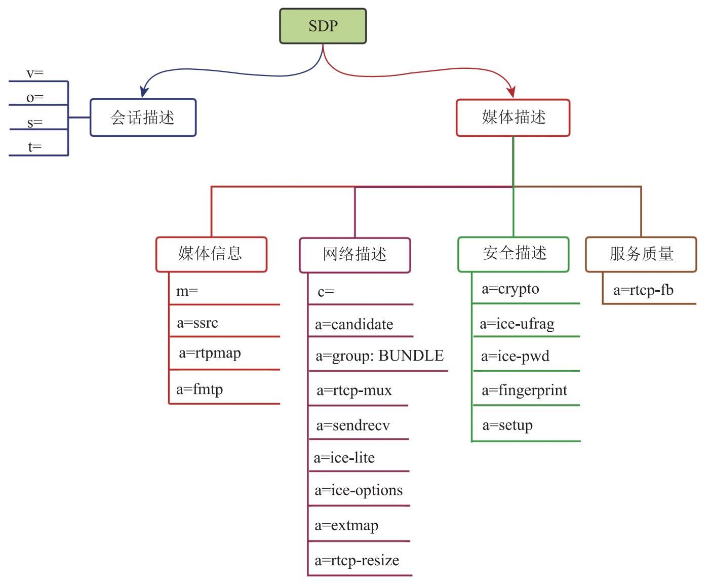

# Session Description Protocol (SDP)

[SDP](https://en.wikipedia.org/wiki/Session_Description_Protocol) 是已有的协议，这也印证了一个说法 WebRTC 不是一个创新，而是已有技术的一个集合。其实也不能说没有创新，毕竟革命性的创新很难立即投入生产，而生产中的创新，为了更快的部署、减少阻力，反而利用已有的技术成本更加低。

详细解释可以查看[SDP 工作草案](https://datatracker.ietf.org/doc/draft-ietf-rtcweb-sdp/)


请记住，WebRTC 的设计宗旨是，应用程序基本不需要处理 SDP 中的文本，对于 SDP 的修改基本可以通过 JSEP API 来完成，SDP 格式的 offer/answer 几乎可以
看做一个整体传输。


```
                                                 +---------------------+
                                                 |        v=           |
                                                 +---------------------+
                 +---------------------+         +---------------------+
         ====    |   Session Metadata  |  =====  |        o=           |
         |       +---------------------+         +----------------------
         |                                       +---------------------+
         |                                       |        t=           |
         |                                       +---------------------+
         |
         |
         |                                       +---------------------+
         |                                       |        c=           |
         |                                       +---------------------+
         |       +---------------------+
         ====    | Network Description |   =====
         |       +---------------------+
         |                                       +---------------------+
         |                                       |    a=candidate      |
         |                                       +---------------------+
         |
         |
         |                                       +---------------------+
         |                                       |        m=           |
         |                                       +---------------------+
         |        +---------------------+        +---------------------+
         ====     | Stream Description  |  ===== |      a=rtpmap       |
         |        +---------------------+        +----------------------
         |                                       +---------------------+
         |                                       |      a=fmtp         |
         |                                       +---------------------+
         |                                       +---------------------+
         |                                       |      a=sendrecv..   |
         |                                       +---------------------+
 +---------------+
 |    SEMANTIC   |
 | COMPONENTS OF |
 |     SDP       |
 +---------------+
         |                                       +---------------------+
         |                                       |      a=crypto       |
         |                                       +---------------------+
         |         +---------------------+       +---------------------+
         ====      |Security Descriptions|  =====|      a=ice-frag     |
         |         +---------------------+       +----------------------
         |                                       +---------------------+
         |                                       |      a=ice-pwd      |
         |                                       +---------------------+
         |                                       +---------------------+
         |                                       |     a=fingerprint   |
         |                                       +---------------------+
         |
         |
         |
         |                                       +---------------------+
         |                                       |      a=rtcp-fb      |
         |                                       +---------------------+
         |         +---------------------+       +---------------------+
         ====      |   Qos,Grouping      |       |                     |
                   |   Descriptions      |  =====|       a=group       |
                   +---------------------+       +----------------------
                                                 +---------------------+
                                                 |       a=rtcpmux     |
                                                 +---------------------+

                  Figure 1: Semantic Components of SDP
```


- 会话描述只有一个，媒体描述可以有0个或多个。
- SDP 是行描述协议，这行是一个描述单位。每个 `m=` 开始的行，到下一个 mline 之前 是一个媒体描述。其中 `m=`开始的行称为 `mline`，媒体描述以 mline 开始，
- SDP 是分块的，同样的字段，在不同块里代表的含义不同。
- SDP 行内没有结构，当多个字段并列是，以空格区分。因此不能缺省，为空的字段使用 `-` 表示。

## Session Metadata

```
v=0
o=- 2319080246114730604 2 IN IP4 127.0.0.1
s=-
t=0 0
```

```
version: <version num>
owner:   <username> <sess-id> <sess-version> <nettype> <addrtype> <unicast-address>
session: <session name>
time:    <start-time> <stop-time>
```
- v: version, 协议版本
- o: owner/creator and session identifier，会话的创建者。 IN: Internet 的缩写
- s: session name 会话名, WebRTC 没有用到，写死的。
- t: time the session is active，会话时长。没用到，写死的。

**会话描述中除了 `sess-id` 是生成的，其它都是固定写死的。之所以有这些都是 RFC4566 中规定必须的**

除了上面介绍的 `<type>` 外，还有一些 `<type>` 是公共的，这些类型既可以出现在会话中，也可以出现在媒体中，如c（connection information，网络信息）、a（attribute，属性）等。尤其是a类型，其用法非常复杂，后续会对它做进一步介绍。

- a: Attributes
- m: Media Descriptions
- c= Connection Data

```
a=<attribute>
a=<attribute>:<value>
```

```
# 每组一行，可以有多行。都是以 `a=group:BUNDLE` 打头
a=group:BUNDLE 0 1  # 媒体 0 和 1 使用同一个 transport 发送。减少 condidate 收集和 transport 创建。
# # 对 RTP 头的扩展，在 https://datatracker.ietf.org/doc/html/rfc8285 中
# 同一个 RTPStream 中允许 one-byte header extension 和 two-byte header extension 同时出现，需要 sdp中声明 "a=extmap-allow-mixed"
a=extmap-allow-mixed

# 因为上面的 BUNDLE 使得音视频可以复用传输通道
# 所以 WebRTC 定义一个媒体流来对音视频进行统一描述
# 媒体流中可以包含多路轨（ 音频轨、视频轨… )
# 每个媒体轨对应一个 SSRC
# msid-semantic 用于 RTP 分包中 ssrc 的标识。https://datatracker.ietf.org/doc/html/draft-alvestrand-rtcweb-msid-02#section-3
a=msid-semantic: WMS s34xnnYfuYAFvOt2jhTHZc7SlfV0zbApCJFu
# WMS(WebRTC Media Stream)
# 当调用 addTrack 传一个 streamId 时，msid-semantic 的值就是 treamdId，而 RFC 文档中需要说明 addTrack 需要保证
# 相同 MediaTream 的 track 保持同步（LS），标准协议上是使用 `a=group:LS 1 2` 表示同步分组。而 Google 的 WebRTC
# 实现没有这个描述，我怀疑是是用 a=msid-semantic 代替的。即每个 m 块中 a=mid 后名字相同的需要保持通读。
```


## 媒体描述

每次添加 addTrack 或者 AddTrascerver 会产生一个 RtpTransceiver，如果  RtpTransceiver 的 mid 属性不为空，则会产生一个 "m=" 块。
```
m=<media> <port>/<numbers> <transport> <fmt …>
a=mid:<media id>
a=rtcp-fb:<payload type> <rtcp fadeback control method>
a=rtpmap:<payload type> <encoding name>/<clock rate> [/<encoding parameters>]
a=fmtp:<format> <format specific parameters>
```

- m line
    - media: 媒体类型，可以是 audio、video。
    - port/numbers: 该媒体使用的端口号。**在与 condidate 关联时更新，0 表示 m= 块被拒绝。**
    - transport: 该媒体使用的传输协议，可以是UDP、TCP等。如UDP/TLS/RTP/SAVFP，表示底层使用了哪些传输协议。上面提到的UDP/TLS/RTP/SAVFP，其含义为：传输时底层使用UDP；在UDP之上使用了DTLS协议来交换证书；证书交换好后，媒体数据由RTP 进行传输（RTP运行在UDP之上），保证传输的可靠性；媒体数据（音视频数据）的安全性是由SRTP负责的，即对RTP包中的Body部分进行加密。此外，传输时还使用RTCP的feekback机制对传输信息进行实时反馈（SAVPF），以便进行拥塞控制。

    - fmt: 媒体数据类型的 PayloadType 数字编号列表，这是因为每种媒体可以选择多种编解码器，每种编解码器的详细信息需要使用“a=rtpmap:number” 属性做进一步阐述。例如 `m=video 9 UDP/TLS/RTP/SAVPF 96 … 102 121 124 …`

- a=mid: media id，表明频媒体的**索引**，在 [RFC 文档中描述为 index](https://datatracker.ietf.org/doc/html/rfc8829#section-3.5.2.1)。媒体的 ID 编号起始为 0。如果有更多的媒体，编号会一直累加。Media Id 用于在获取 Answer 后，用于对应本地的媒体。通过这个 id 可以知道哪些媒体是接受的，哪些媒体被拒绝。

- a=rtpmap: rtp map 是 PayloadType 与编码器的映射。payload type 就是 m line 中的一个 fmt，其余内容用于对这个编码做附加说明。排在 mline 列表的第一位的是视频的默认编码器。

- a=fmtp:（format parameters）用于指定媒体数据格式。

“a=rtpmap”“a=fmtp”属性随处可见。无论是音频媒体中，还是视频媒体中，都使用它们对媒体做进一步的解释。

**不同编解码（rtpmap 和 fmtp 行）的排序表达了选择的偏好，排在前面的是优先使用的编解码格式。SDP 的修改应该在设置之前完成。**


### 音频

```
m=audio 9 UDP/TLS/RTP/SAVPF 111 103 104 9 0 8 106 105 13 110 112 113 126
c=IN IP4 0.0.0.0 # 固定写死，WebRTC 不使用
a=rtcp:9 IN IP4 0.0.0.0 # 固定写死，不使用
# ice 使用，用于消息完整性验证的用户名和密码
a=ice-ufrag:xEcO
a=ice-pwd:nJAXq3WkQ8rk4h1KiSS8dRmG
a=ice-options:trickle
a=fingerprint:sha-256 B5:13:B3:78:28:7A:E1:0D:D6:88:C1:44:DC:46:08:DD:7D:D1:04:27:99:89:1A:6E:D2:0C:48:23:5F:67:B1:F6
a=setup:actpass
a=mid:0
# 支持RTP标题扩展，以指示音频级别
a=extmap:1 urn:ietf:params:rtp-hdrext:ssrc-audio-level
a=extmap:2 http://www.webrtc.org/experiments/rtp-hdrext/abs-send-time
a=extmap:3 http://www.ietf.org/id/draft-holmer-rmcat-transport-wide-cc-extensions-01
a=extmap:4 urn:ietf:params:rtp-hdrext:sdes:mid
a=extmap:5 urn:ietf:params:rtp-hdrext:sdes:rtp-stream-id
a=extmap:6 urn:ietf:params:rtp-hdrext:sdes:repaired-rtp-stream-id
# 可收可发
a=sendrecv
a=msid:s34xnnYfuYAFvOt2jhTHZc7SlfV0zbApCJFu b42ccdfb-8f86-45e0-ba7e-fd27d975c053
# RFC 规定的 RTP 使用 1025 到 65535 的一个偶数端口号，RTCP 使用紧邻的下一个基数端口。（默认是 5004 和 5005）。
# RFC 5761 规定 RTP 和 RTCP 数据可复用同一端口，处于节约 ICE 资源的目的
# 这与旧方法相比有几点好处：
# 由于只用一个端口进行媒体和控制消息的传输，所以它简化了 NAT 穿越的过程
# 理论上你可以将你系统上同一个 UDP 端口的媒体会话量翻倍
# 收集 ICE 候选以及 ICE 的 SDP 信令变得简单的多。你只需要用一套候选项，而不是两套。
# 当与 BUNDLE 一起使用时，所有媒体会话都使用同一个端口，进一步的简化了传输用量和 NAT 穿越。
a=rtcp-mux
# 支持的音频格式
a=rtpmap:111 opus/48000/2
a=rtcp-fb:111 transport-cc
a=fmtp:111 minptime=10;useinbandfec=1
a=rtpmap:103 ISAC/16000
a=rtpmap:104 ISAC/32000
a=rtpmap:9 G722/8000
a=rtpmap:0 PCMU/8000
a=rtpmap:8 PCMA/8000
a=rtpmap:106 CN/32000
a=rtpmap:105 CN/16000
a=rtpmap:13 CN/8000
a=rtpmap:110 telephone-event/48000
a=rtpmap:112 telephone-event/32000
a=rtpmap:113 telephone-event/16000
a=rtpmap:126 telephone-event/8000
// 用于 RTP 头的分包识别
a=ssrc:2486034813 cname:eN2xF5y6V76FG7z5
a=ssrc:2486034813 msid:s34xnnYfuYAFvOt2jhTHZc7SlfV0zbApCJFu b42ccdfb-8f86-45e0-ba7e-fd27d975c053
a=ssrc:2486034813 mslabel:s34xnnYfuYAFvOt2jhTHZc7SlfV0zbApCJFu
a=ssrc:2486034813 label:b42ccdfb-8f86-45e0-ba7e-fd27d975c053
```

简化
```
m=audio 9 UDP/TLS/RTP/SAVPF 111 103 104 9 0 8 106 105 13 110 112 113 126
...
a=rtpmap:111 opus/48000/2
a=rtcp-fb:111 transport-cc
a=fmtp:111 minptime=10;useinbandfec=1
a=rtpmap:103 ISAC/16000
a=rtpmap:104 ISAC/32000
a=rtpmap:9 G722/8000
a=rtpmap:0 PCMU/8000
a=rtpmap:8 PCMA/8000
a=rtpmap:106 CN/32000
a=rtpmap:105 CN/16000
a=rtpmap:13 CN/8000
a=rtpmap:110 telephone-event/48000
a=rtpmap:112 telephone-event/32000
a=rtpmap:113 telephone-event/16000
a=rtpmap:126 telephone-event/8000
a=ssrc:2486034813 cname:eN2xF5y6V76FG7z5
a=ssrc:2486034813 msid:s34xnnYfuYAFvOt2jhTHZc7SlfV0zbApCJFu b42ccdfb-8f86-45e0-ba7e-fd27d975c053
a=ssrc:2486034813 mslabel:s34xnnYfuYAFvOt2jhTHZc7SlfV0zbApCJFu
a=ssrc:2486034813 label:b42ccdfb-8f86-45e0-ba7e-fd27d975c053
```

`a=rtpmap:111 opus/48000/2` 表示对 m line 中 payload type 为 111 的格式进行说明，其编解码器为 Opus, 时钟频率（采样率）为48000，音频通道数为2。同理，PayloadType值为103的编码器是ISAC，采样率为16000...

`a=rtcp-fb:111 transport-cc` PayloadType值为111的数据采用 `transport-cc` 作为 rtcp 的反馈控制算法。

`a=fmtp:111 minptime=10;useinbandfec=1` 表示PayloadType值为111的数据（Opus数据）：以10ms长的音频数据为一帧，并且数据是经FEC编码的。其中，“usein bandfec=1”是WebRTC针对Opus增加的fmtp值。


### 视频

```
m=video 9 UDP/TLS/RTP/SAVPF 96 97 98 99 100 101 102 121 127 120 125 107 108 109 35 36 124 119 123 118 114 115 116
c=IN IP4 0.0.0.0
a=rtcp:9 IN IP4 0.0.0.0
a=ice-ufrag:xEcO
a=ice-pwd:nJAXq3WkQ8rk4h1KiSS8dRmG
a=ice-options:trickle
a=fingerprint:sha-256 B5:13:B3:78:28:7A:E1:0D:D6:88:C1:44:DC:46:08:DD:7D:D1:04:27:99:89:1A:6E:D2:0C:48:23:5F:67:B1:F6
a=setup:actpass
a=mid:1
a=extmap:14 urn:ietf:params:rtp-hdrext:toffset
a=extmap:2 http://www.webrtc.org/experiments/rtp-hdrext/abs-send-time
a=extmap:13 urn:3gpp:video-orientation
a=extmap:3 http://www.ietf.org/id/draft-holmer-rmcat-transport-wide-cc-extensions-01
a=extmap:12 http://www.webrtc.org/experiments/rtp-hdrext/playout-delay
a=extmap:11 http://www.webrtc.org/experiments/rtp-hdrext/video-content-type
a=extmap:7 http://www.webrtc.org/experiments/rtp-hdrext/video-timing
a=extmap:8 http://www.webrtc.org/experiments/rtp-hdrext/color-space
a=extmap:4 urn:ietf:params:rtp-hdrext:sdes:mid
a=extmap:5 urn:ietf:params:rtp-hdrext:sdes:rtp-stream-id
a=extmap:6 urn:ietf:params:rtp-hdrext:sdes:repaired-rtp-stream-id
a=sendrecv
a=msid:s34xnnYfuYAFvOt2jhTHZc7SlfV0zbApCJFu 64154ae0-461b-4bcd-b70c-0cbbaf26be45
a=rtcp-mux
a=rtcp-rsize
a=rtpmap:96 VP8/90000
a=rtcp-fb:96 goog-remb
a=rtcp-fb:96 transport-cc
a=rtcp-fb:96 ccm fir
a=rtcp-fb:96 nack
a=rtcp-fb:96 nack pli
a=rtpmap:97 rtx/90000
a=fmtp:97 apt=96
a=rtpmap:98 VP9/90000
a=rtcp-fb:98 goog-remb
a=rtcp-fb:98 transport-cc
a=rtcp-fb:98 ccm fir
a=rtcp-fb:98 nack
a=rtcp-fb:98 nack pli
a=fmtp:98 profile-id=0
a=rtpmap:99 rtx/90000
a=fmtp:99 apt=98
a=rtpmap:100 VP9/90000
a=rtcp-fb:100 goog-remb
a=rtcp-fb:100 transport-cc
a=rtcp-fb:100 ccm fir
a=rtcp-fb:100 nack
a=rtcp-fb:100 nack pli
a=fmtp:100 profile-id=2
a=rtpmap:101 rtx/90000
a=fmtp:101 apt=100
a=rtpmap:102 H264/90000
a=rtcp-fb:102 goog-remb
a=rtcp-fb:102 transport-cc
a=rtcp-fb:102 ccm fir
a=rtcp-fb:102 nack
a=rtcp-fb:102 nack pli
a=fmtp:102 level-asymmetry-allowed=1;packetization-mode=1;profile-level-id=42001f
a=rtpmap:121 rtx/90000
a=fmtp:121 apt=102
a=rtpmap:127 H264/90000
a=rtcp-fb:127 goog-remb
a=rtcp-fb:127 transport-cc
a=rtcp-fb:127 ccm fir
a=rtcp-fb:127 nack
a=rtcp-fb:127 nack pli
a=fmtp:127 level-asymmetry-allowed=1;packetization-mode=0;profile-level-id=42001f
a=rtpmap:120 rtx/90000
a=fmtp:120 apt=127
a=rtpmap:125 H264/90000
a=rtcp-fb:125 goog-remb
a=rtcp-fb:125 transport-cc
a=rtcp-fb:125 ccm fir
a=rtcp-fb:125 nack
a=rtcp-fb:125 nack pli
a=fmtp:125 level-asymmetry-allowed=1;packetization-mode=1;profile-level-id=42e01f
a=rtpmap:107 rtx/90000
a=fmtp:107 apt=125
a=rtpmap:108 H264/90000
a=rtcp-fb:108 goog-remb
a=rtcp-fb:108 transport-cc
a=rtcp-fb:108 ccm fir
a=rtcp-fb:108 nack
a=rtcp-fb:108 nack pli
a=fmtp:108 level-asymmetry-allowed=1;packetization-mode=0;profile-level-id=42e01f
a=rtpmap:109 rtx/90000
a=fmtp:109 apt=108
a=rtpmap:35 AV1X/90000
a=rtcp-fb:35 goog-remb
a=rtcp-fb:35 transport-cc
a=rtcp-fb:35 ccm fir
a=rtcp-fb:35 nack
a=rtcp-fb:35 nack pli
a=rtpmap:36 rtx/90000
a=fmtp:36 apt=35
a=rtpmap:124 H264/90000
a=rtcp-fb:124 goog-remb
a=rtcp-fb:124 transport-cc
a=rtcp-fb:124 ccm fir
a=rtcp-fb:124 nack
a=rtcp-fb:124 nack pli
a=fmtp:124 level-asymmetry-allowed=1;packetization-mode=1;profile-level-id=4d0032
a=rtpmap:119 rtx/90000
a=fmtp:119 apt=124
a=rtpmap:123 H264/90000
a=rtcp-fb:123 goog-remb
a=rtcp-fb:123 transport-cc
a=rtcp-fb:123 ccm fir
a=rtcp-fb:123 nack
a=rtcp-fb:123 nack pli
a=fmtp:123 level-asymmetry-allowed=1;packetization-mode=1;profile-level-id=640032
a=rtpmap:118 rtx/90000
a=fmtp:118 apt=123
a=rtpmap:114 red/90000
a=rtpmap:115 rtx/90000
a=fmtp:115 apt=114
a=rtpmap:116 ulpfec/90000
a=ssrc-group:FID 3952141725 670827422
a=ssrc:3952141725 cname:eN2xF5y6V76FG7z5
a=ssrc:3952141725 msid:s34xnnYfuYAFvOt2jhTHZc7SlfV0zbApCJFu 64154ae0-461b-4bcd-b70c-0cbbaf26be45
a=ssrc:3952141725 mslabel:s34xnnYfuYAFvOt2jhTHZc7SlfV0zbApCJFu
a=ssrc:3952141725 label:64154ae0-461b-4bcd-b70c-0cbbaf26be45
a=ssrc:670827422 cname:eN2xF5y6V76FG7z5
a=ssrc:670827422 msid:s34xnnYfuYAFvOt2jhTHZc7SlfV0zbApCJFu 64154ae0-461b-4bcd-b70c-0cbbaf26be45
a=ssrc:670827422 mslabel:s34xnnYfuYAFvOt2jhTHZc7SlfV0zbApCJFu
a=ssrc:670827422 label:64154ae0-461b-4bcd-b70c-0cbbaf26be45
```

```
m=video 9 UDP/TLS/RTP/SAVPF 96 97 98 99 100 101 102 121 127 120 125 107 108 109 35 36 124 119 123 118 114 115 116
...
a=sendrecv
a=msid:s34xnnYfuYAFvOt2jhTHZc7SlfV0zbApCJFu 64154ae0-461b-4bcd-b70c-0cbbaf26be45
a=rtcp-mux
a=rtcp-rsize
a=rtpmap:96 VP8/90000
a=rtcp-fb:96 goog-remb
a=rtcp-fb:96 transport-cc
a=rtcp-fb:96 ccm fir
a=rtcp-fb:96 nack
a=rtcp-fb:96 nack pli
a=rtpmap:97 rtx/90000
a=fmtp:97 apt=96
...
a=rtpmap:102 H264/90000
a=rtcp-fb:102 goog-remb
a=rtcp-fb:102 transport-cc
a=rtcp-fb:102 ccm fir
a=rtcp-fb:102 nack
a=rtcp-fb:102 nack pli
a=fmtp:102 level-asymmetry-allowed=1;packetization-mode=1;profile-level-id=42001f
a=rtpmap:121 rtx/90000
a=fmtp:121 apt=102
...
```

`a=rtpmap:96 VP8/90000` 表示 96 使用的编解码是 VP8，其始终频率是 9000。

`a=rtpmap:97 rtx/90000` 表示却是丢包重传，其必须和 `a=fmtp:97 apt=96` 一起使用，apt（associated payload type）是 96 表示描述的是 payload type 96 的丢包重传。


```
a=rtpmap:114 red/90000
a=rtpmap:115 rtx/90000
a=fmtp:115 apt=114
```

red 是一种在 WebRTC 中使用的FEC算法，用于防止丢包；默认情况下 WebRTC 会将 VP8/H264 等编码器编码后的数据再交由red模块编码，生成带一些冗余信息的数据包，这样当传输中某个包丢了，就可以通过其他包将其恢复回来，而不用重传丢失的包。
level-asymmetry-allowed=1 指明通信双方使用的 H264 Level 是否要保持一致：0，必须一致；1，可以不一致。

packetization mode指明经H264编码后的视频数据如何打包，其打包模式有三种：0，单包；1，非交错包；2，交错包。三种打包模式中，模式0和模式1用在低延时的实时通信领域。其中模式0的含义是每个包就是一帧视频数据；模式1的含义是可以将视频帧拆成多个顺序的RTP包发送，接收端收到数据包后，再按顺序将其还原。
profile-level-id由三部分组成，即 profile_idc、profile_iop以及level_idc，每个组成部分占8位，因此可以推测出profile_idc=64、profile_iop=00、level_idc=32。关于这几个值的具体含义，可以自行查看H264规范手册。

> 除了音频媒体信息和视频媒体信息外，媒体描述中还包括一项重要内容，就是SSRC（Synchronization Source 同步源标识）。SSRC是媒体源的唯一标识，每一路媒体流都有一个唯一的SSRC来标识它。

```
m=video ...
...
a=ssrc-group:FID 3952141725 670827422
a=ssrc:3952141725 cname:eN2xF5y6V76FG7z5
a=ssrc:3952141725 msid:s34xnnYfuYAFvOt2jhTHZc7SlfV0zbApCJFu 64154ae0-461b-4bcd-b70c-0cbbaf26be45
a=ssrc:3952141725 mslabel:s34xnnYfuYAFvOt2jhTHZc7SlfV0zbApCJFu
a=ssrc:3952141725 label:64154ae0-461b-4bcd-b70c-0cbbaf26be45
a=ssrc:670827422 cname:eN2xF5y6V76FG7z5
a=ssrc:670827422 msid:s34xnnYfuYAFvOt2jhTHZc7SlfV0zbApCJFu 64154ae0-461b-4bcd-b70c-0cbbaf26be45
a=ssrc:670827422 mslabel:s34xnnYfuYAFvOt2jhTHZc7SlfV0zbApCJFu
a=ssrc:670827422 label:64154ae0-461b-4bcd-b70c-0cbbaf26be45
```

上面的数据有两个不同的 SSRC，3952141725 和 670827422。既然每路视频只能有唯一的 SSRC，那为什么这个视频媒体描述中却出现了两个视频源（SSRC）呢？

`a=ssrc-group:FID 3952141725 670827422` 说明两个 SSRC 是有关联的, 后一个 SSRC 是前一个 SSRC 的重传流。也就是 3952141725 是真正视频流的 SSRC，670827422 是丢包时使用的SSRC。所以，虽然在同一个视频描述中有两个SSRC，但对于该视频来说，仍然只有唯一的SSRC用来标识它。

此外，我们还能看到一个关键字cname，而且 3952141725 与 670827422 的cname名字是一样的，它有什么含义呢？

cname（canonical name）通常称为别名，就是为媒体流起了一个别名。在同一个视频媒体描述中的两个SSRC后面都跟着同样的cname，说明这两个SSRC属于同一个媒体流。关于cname更多的内容，将在9.3.1节中进一步介绍。

## 网络描述

属于标准SDP中媒体描述的内容。它记录了传输媒体数据时使用的网络信息，如IP地址、端口号、连接复用等信息。对于WebRTC而言，其网络传输是由另外一套复杂的机制实现的，所以标准网络描述中的“c=”属性会被WebRTC忽略。其他几个属性是WebRTC增加的。

其中“a=candidate” 是新版的WebRTC中废弃属性。

“a=group：BUNDLE”属性用于指明哪些媒体数据可以复用同一个传输通道。复用传输通道是指多种类型的媒体数据使用同一条网络连接传输数据，这样做可以节约ICE资源。在创建 PeerConnection 的 RTCConfiguration 中配置。

“a=rtcp-mux” 属性用于指明RTCP是否与RTP复用同一端口，同样它也是出于节约 ICE 资源的目的。也是在创建 PeerConnection 的 RTCConfiguration 中配置。

“a=sendrecv”属性用于指明媒体数据的传输方向是双向的（WebRTC终端既可以接收数据，也可以发送数据）。除此之外，在设置数据传输方向时，还可以选择sendonly（仅发送）、recvonly（仅接收）、inactive（不进行传输）这几个值。“ice-options”属性用于指明WebRTC收集ICE Candidate的策略。新版WebRTC默认使用Trikle-ICE模式，这样可以加快通信双方连接的速度。除此之外，还可以将其设置为renominotion模式。

“a=extmap” 属性用于指明RTP使用的扩展头，关于这部分内容将在7.6节做详细介绍。

rtcp-resize 属性用于指明缩减 RTCP 包的大小，具体缩减的时机是根据用户带宽大小来决定的。


## 安全描述

这部分内容是WebRTC增加到SDP规范中的，属于标准SDP中媒体描述的内容。由于在浏览器上进行一对一通信需要很好的安全性，而标准SDP在这方面的约束又比较薄弱，因此 WebRTC 自己定义了一套安全机制。在这套安全机制中，安全描述的内容仅用于通信双方交换一些必要的信息。


WebRTC 的安全主要在两个方面，即：
- 信令传输
- 数据传输

由于信令传输不在 WebRTC 标准中，需要开发人员根据自己的需要，使用安全的协议传输，例如 HTTPS 等。而数据传输部分由 WebRTC 保证。

SPD 中的每个 m line 都有对应的安全信息，但这些信息的内容都是一样的，比较冗余，仅看一个 m 块中的安全信息即可。

```
a=crypto
a=ice-ufrag:xEcO
a=ice-pwd:nJAXq3WkQ8rk4h1KiSS8dRmG
a=ice-options:trickle
a=fingerprint:sha-256 XXX
a=setup=actpass
```

ice-ufrag(ice user name) 和 ice-pwd（ice password） WebRTC对等端相互通信时，需要使用这两个值进行用户有效性验证。这两个信息的作用是验证用户的合法性，其完整过程如下：通信的双方彼此发送STUN Binding请求（带着ice-ufrag和ice-pwd）给对方，当对方收到请求后，会验证请求中的ice-ufrag和ice-pwd是否与自己SDP中的一致，如果一致，则说明该用户是合法的用户，否则说明它是非法用户。

`a=setup=actpass` 用于决定使用DTLS协议时通信双方的“角色”。“a=setup”属性可以设置为active、passive 或 actpass。其中active表示终端的角色为客户端；passive表示终端的角色为服务端；actpass（active与passive组合而成）表示终端既可以是客户端又可以是服务端，最终的角色由另一端的角色确定。一般情况下，第一个加入房间的终端默认为actpass，后来加入的终端为active。因此，通过“a=setup”的属性值，可以知道使用DTLS协议时通信双方哪个是客户端，哪个是服务端。

“a=fingerprint” 属性用于验证加密证书的有效性。当通信双方通过DTLS协议交换证书时，如何才能保障证书在网络上交换的过程中没有被篡改呢？这就要用到“a=fingerprint”属性了。通过DTLS协议交换证书之前，各端会先给各自的证书生成一个指纹（fingerprint），然后将指纹放到SDP中通过信令交换给对方。通过DTLS协议交换证书后，双方会对拿到的证书重新生成指纹。然后将生成的指纹与SDP中的指纹进行比较，如果两者一致，则说明证书在传输中没有被篡改，可以放心使用，否则说明证书被篡改，此时连接创建失败。

## 服务质量描述

这部分内容也是WebRTC为SDP新增的，使用标准SDP中媒体描述的格式。在WebRTC中，服务质量包含的内容非常多，SDP只控制了其中一小部分服务质量的开关，这些服务质量的开关都是通过“a=rtcp-fb”属性设置的。在媒体协商时，发起协商一方的Ofer中指明WebRTC开启哪些RTCP反馈，应答一方则在Answer中确认是否真的开启对应的RTCP反馈。

```
a=rtcp-fb
```

```
m=audio 9 UDP/TLS/RTP/SAVPF 111 103 104 9 0 8 106 105 13 110 112 113 126
...
a=rtcp-fb:111 transport-cc # （Opus）支持 Transport-CC 类型的rtcp feedback消息，也说明WebRTC使用Opus编解码器时开启了Transport-CC拥塞控制算法。
...
m=video 9 UDP/TLS/RTP/SAVPF 96 97 98 99 100 101 102 121 127 120 125 107 108 109 35 36 124 119 123 118 114 115 116
...
a=rtpmap:96 VP8/90000
a=rtcp-fb:96 goog-remb # 支持 goog-remb 类型的rtcp feedback消息
a=rtcp-fb:96 transport-cc # 支持 Transport-CC 类型的rtcp feedback消息
a=rtcp-fb:96 ccm fir # ccm（codec con trol message）和fir（full intra refresh）表示支持RTCP的FIR指令（即申请关键帧指令）。
a=rtcp-fb:96 nack # 支持 NACK 报文。
a=rtcp-fb:96 nack pli # 支持 NACK 报文的同时，还支持 PLI 报文。
...
a=rtpmap:102 H264/90000
a=rtcp-fb:102 goog-remb
a=rtcp-fb:102 transport-cc
a=rtcp-fb:102 ccm fir
a=rtcp-fb:102 nack
a=rtcp-fb:102 nack pli
```


```Offer
v=0
o=- 1521700720675536569 2 IN IP4 127.0.0.1
s=-
t=0 0
a=group:BUNDLE 0 1
a=extmap-allow-mixed
a=msid-semantic: WMS stream_id
m=audio 9 UDP/TLS/RTP/SAVPF 111 63 103 104 9 102 0 8 106 105 13 110 112 113 126
c=IN IP4 0.0.0.0
a=rtcp:9 IN IP4 0.0.0.0
a=ice-ufrag:TtE9
a=ice-pwd:SXqO/T1eoiUAwWHXGI7u58RW
a=ice-options:trickle
a=fingerprint:sha-256 0A:01:D9:05:AC:EE:52:D2:23:C6:F0:98:F2:BD:EB:71:AC:25:24:F3:03:C5:A8:C1:D3:3A:E5:55:88:48:30:80
a=setup:actpass
a=mid:0
a=extmap:1 urn:ietf:params:rtp-hdrext:ssrc-audio-level
a=extmap:2 http://www.webrtc.org/experiments/rtp-hdrext/abs-send-time
a=extmap:3 http://www.ietf.org/id/draft-holmer-rmcat-transport-wide-cc-extensions-01
a=extmap:4 urn:ietf:params:rtp-hdrext:sdes:mid
a=sendrecv
a=msid:stream_id audio_label
a=rtcp-mux
a=rtpmap:111 opus/48000/2
a=rtcp-fb:111 transport-cc
a=fmtp:111 minptime=10;useinbandfec=1
a=rtpmap:63 red/48000/2
a=fmtp:63 111/111
a=rtpmap:103 ISAC/16000
a=rtpmap:104 ISAC/32000
a=rtpmap:9 G722/8000
a=rtpmap:102 ILBC/8000
a=rtpmap:0 PCMU/8000
a=rtpmap:8 PCMA/8000
a=rtpmap:106 CN/32000
a=rtpmap:105 CN/16000
a=rtpmap:13 CN/8000
a=rtpmap:110 telephone-event/48000
a=rtpmap:112 telephone-event/32000
a=rtpmap:113 telephone-event/16000
a=rtpmap:126 telephone-event/8000
a=ssrc:2077496760 cname:g6IkgHXnMTiE2T+B
a=ssrc:2077496760 msid:stream_id audio_label
a=ssrc:2077496760 mslabel:stream_id
a=ssrc:2077496760 label:audio_label
m=video 9 UDP/TLS/RTP/SAVPF 96 97 98 99 35 36 125 101 127
c=IN IP4 0.0.0.0
a=rtcp:9 IN IP4 0.0.0.0
a=ice-ufrag:TtE9
a=ice-pwd:SXqO/T1eoiUAwWHXGI7u58RW
a=ice-options:trickle
a=fingerprint:sha-256 0A:01:D9:05:AC:EE:52:D2:23:C6:F0:98:F2:BD:EB:71:AC:25:24:F3:03:C5:A8:C1:D3:3A:E5:55:88:48:30:80
a=setup:actpass
a=mid:1
a=extmap:14 urn:ietf:params:rtp-hdrext:toffset
a=extmap:2 http://www.webrtc.org/experiments/rtp-hdrext/abs-send-time
a=extmap:13 urn:3gpp:video-orientation
a=extmap:3 http://www.ietf.org/id/draft-holmer-rmcat-transport-wide-cc-extensions-01
a=extmap:5 http://www.webrtc.org/experiments/rtp-hdrext/playout-delay
a=extmap:6 http://www.webrtc.org/experiments/rtp-hdrext/video-content-type
a=extmap:7 http://www.webrtc.org/experiments/rtp-hdrext/video-timing
a=extmap:8 http://www.webrtc.org/experiments/rtp-hdrext/color-space
a=extmap:4 urn:ietf:params:rtp-hdrext:sdes:mid
a=extmap:10 urn:ietf:params:rtp-hdrext:sdes:rtp-stream-id
a=extmap:11 urn:ietf:params:rtp-hdrext:sdes:repaired-rtp-stream-id
a=sendrecv
a=msid:stream_id video_label
a=rtcp-mux
a=rtcp-rsize
a=rtpmap:96 VP8/90000
a=rtcp-fb:96 goog-remb
a=rtcp-fb:96 transport-cc
a=rtcp-fb:96 ccm fir
a=rtcp-fb:96 nack
a=rtcp-fb:96 nack pli
a=rtpmap:97 rtx/90000
a=fmtp:97 apt=96
a=rtpmap:98 VP9/90000
a=rtcp-fb:98 goog-remb
a=rtcp-fb:98 transport-cc
a=rtcp-fb:98 ccm fir
a=rtcp-fb:98 nack
a=rtcp-fb:98 nack pli
a=fmtp:98 profile-id=0
a=rtpmap:99 rtx/90000
a=fmtp:99 apt=98
a=rtpmap:35 AV1/90000
a=rtcp-fb:35 goog-remb
a=rtcp-fb:35 transport-cc
a=rtcp-fb:35 ccm fir
a=rtcp-fb:35 nack
a=rtcp-fb:35 nack pli
a=rtpmap:36 rtx/90000
a=fmtp:36 apt=35
a=rtpmap:125 red/90000
a=rtpmap:101 rtx/90000
a=fmtp:101 apt=125
a=rtpmap:127 ulpfec/90000
a=ssrc-group:FID 761701908 3681643210
a=ssrc:761701908 cname:g6IkgHXnMTiE2T+B
a=ssrc:761701908 msid:stream_id video_label
a=ssrc:761701908 mslabel:stream_id
a=ssrc:761701908 label:video_label
a=ssrc:3681643210 cname:g6IkgHXnMTiE2T+B
a=ssrc:3681643210 msid:stream_id video_label
a=ssrc:3681643210 mslabel:stream_id
a=ssrc:3681643210 label:video_label
```

```Answer
v=0
o=- 8720480931343486899 2 IN IP4 127.0.0.1
s=-
t=0 0
a=group:BUNDLE 0 1
a=extmap-allow-mixed
a=msid-semantic: WMS ZokLP6VIUWiOoxR2VGhpOsR12vRp9Wo3MhUD
m=audio 9 UDP/TLS/RTP/SAVPF 111 103 104 9 0 8 106 105 13 110 112 113 126
c=IN IP4 0.0.0.0
a=rtcp:9 IN IP4 0.0.0.0
a=ice-ufrag:B2TJ
a=ice-pwd:EsQzJw1RhN9rUbfTRjfeir9W
a=ice-options:trickle
a=fingerprint:sha-256 0C:18:64:BC:20:4B:B4:D0:0E:E3:15:3D:8E:BD:1C:B9:E7:41:51:4E:AA:C9:53:02:20:21:5A:88:FD:28:66:77
a=setup:active
a=mid:0
a=extmap:1 urn:ietf:params:rtp-hdrext:ssrc-audio-level
a=extmap:2 http://www.webrtc.org/experiments/rtp-hdrext/abs-send-time
a=extmap:3 http://www.ietf.org/id/draft-holmer-rmcat-transport-wide-cc-extensions-01
a=extmap:4 urn:ietf:params:rtp-hdrext:sdes:mid
a=extmap:5 urn:ietf:params:rtp-hdrext:sdes:rtp-stream-id
a=extmap:6 urn:ietf:params:rtp-hdrext:sdes:repaired-rtp-stream-id
a=sendrecv
a=msid:ZokLP6VIUWiOoxR2VGhpOsR12vRp9Wo3MhUD e58aa3f8-c853-44b1-b81c-230ac8149c96
a=rtcp-mux
a=rtpmap:111 opus/48000/2
# 传输层拥塞控制算法
a=rtcp-fb:111 transport-cc
a=fmtp:111 minptime=10;useinbandfec=1
a=rtpmap:103 ISAC/16000
a=rtpmap:104 ISAC/32000
a=rtpmap:9 G722/8000
a=rtpmap:0 PCMU/8000
a=rtpmap:8 PCMA/8000
a=rtpmap:106 CN/32000
a=rtpmap:105 CN/16000
a=rtpmap:13 CN/8000
a=rtpmap:110 telephone-event/48000
a=rtpmap:112 telephone-event/32000
a=rtpmap:113 telephone-event/16000
a=rtpmap:126 telephone-event/8000
a=ssrc:2143454869 cname:3NBRsvF9LdmQAUUY
m=video 9 UDP/TLS/RTP/SAVPF 96 97 98 99 100 101 102 121 127 120 125 107 108 109 35 36 124 119 123 118 114 115 116
c=IN IP4 0.0.0.0
a=rtcp:9 IN IP4 0.0.0.0
a=ice-ufrag:B2TJ
a=ice-pwd:EsQzJw1RhN9rUbfTRjfeir9W
a=ice-options:trickle
a=fingerprint:sha-256 0C:18:64:BC:20:4B:B4:D0:0E:E3:15:3D:8E:BD:1C:B9:E7:41:51:4E:AA:C9:53:02:20:21:5A:88:FD:28:66:77
a=setup:active
a=mid:1
a=extmap:14 urn:ietf:params:rtp-hdrext:toffset
a=extmap:2 http://www.webrtc.org/experiments/rtp-hdrext/abs-send-time
a=extmap:13 urn:3gpp:video-orientation
a=extmap:3 http://www.ietf.org/id/draft-holmer-rmcat-transport-wide-cc-extensions-01
a=extmap:12 http://www.webrtc.org/experiments/rtp-hdrext/playout-delay
a=extmap:11 http://www.webrtc.org/experiments/rtp-hdrext/video-content-type
a=extmap:7 http://www.webrtc.org/experiments/rtp-hdrext/video-timing
a=extmap:8 http://www.webrtc.org/experiments/rtp-hdrext/color-space
a=extmap:4 urn:ietf:params:rtp-hdrext:sdes:mid
a=extmap:5 urn:ietf:params:rtp-hdrext:sdes:rtp-stream-id
a=extmap:6 urn:ietf:params:rtp-hdrext:sdes:repaired-rtp-stream-id
a=sendrecv
a=msid:ZokLP6VIUWiOoxR2VGhpOsR12vRp9Wo3MhUD 3854a09f-d154-4946-b182-b915030e13b5
a=rtcp-mux
a=rtcp-rsize
a=rtpmap:96 VP8/90000
a=rtcp-fb:96 goog-remb
a=rtcp-fb:96 transport-cc
a=rtcp-fb:96 ccm fir
a=rtcp-fb:96 nack
a=rtcp-fb:96 nack pli
a=rtpmap:97 rtx/90000
a=fmtp:97 apt=96
a=rtpmap:98 VP9/90000
a=rtcp-fb:98 goog-remb
a=rtcp-fb:98 transport-cc
a=rtcp-fb:98 ccm fir
a=rtcp-fb:98 nack
a=rtcp-fb:98 nack pli
a=fmtp:98 profile-id=0
a=rtpmap:99 rtx/90000
a=fmtp:99 apt=98
a=rtpmap:100 VP9/90000
a=rtcp-fb:100 goog-remb
a=rtcp-fb:100 transport-cc
a=rtcp-fb:100 ccm fir
a=rtcp-fb:100 nack
a=rtcp-fb:100 nack pli
a=fmtp:100 profile-id=2
a=rtpmap:101 rtx/90000
a=fmtp:101 apt=100
a=rtpmap:102 H264/90000
a=rtcp-fb:102 goog-remb
a=rtcp-fb:102 transport-cc
a=rtcp-fb:102 ccm fir
a=rtcp-fb:102 nack
a=rtcp-fb:102 nack pli
a=fmtp:102 level-asymmetry-allowed=1;packetization-mode=1;profile-level-id=42001f
a=rtpmap:121 rtx/90000
a=fmtp:121 apt=102
a=rtpmap:127 H264/90000
a=rtcp-fb:127 goog-remb
a=rtcp-fb:127 transport-cc
a=rtcp-fb:127 ccm fir
a=rtcp-fb:127 nack
a=rtcp-fb:127 nack pli
a=fmtp:127 level-asymmetry-allowed=1;packetization-mode=0;profile-level-id=42001f
a=rtpmap:120 rtx/90000
a=fmtp:120 apt=127
a=rtpmap:125 H264/90000
a=rtcp-fb:125 goog-remb
a=rtcp-fb:125 transport-cc
a=rtcp-fb:125 ccm fir
a=rtcp-fb:125 nack
a=rtcp-fb:125 nack pli
a=fmtp:125 level-asymmetry-allowed=1;packetization-mode=1;profile-level-id=42e01f
a=rtpmap:107 rtx/90000
a=fmtp:107 apt=125
a=rtpmap:108 H264/90000
a=rtcp-fb:108 goog-remb
a=rtcp-fb:108 transport-cc
a=rtcp-fb:108 ccm fir
a=rtcp-fb:108 nack
a=rtcp-fb:108 nack pli
a=fmtp:108 level-asymmetry-allowed=1;packetization-mode=0;profile-level-id=42e01f
a=rtpmap:109 rtx/90000
a=fmtp:109 apt=108
a=rtpmap:35 AV1X/90000
a=rtcp-fb:35 goog-remb
a=rtcp-fb:35 transport-cc
a=rtcp-fb:35 ccm fir
a=rtcp-fb:35 nack
a=rtcp-fb:35 nack pli
a=rtpmap:36 rtx/90000
a=fmtp:36 apt=35
a=rtpmap:124 H264/90000
a=rtcp-fb:124 goog-remb
a=rtcp-fb:124 transport-cc
a=rtcp-fb:124 ccm fir
a=rtcp-fb:124 nack
a=rtcp-fb:124 nack pli
a=fmtp:124 level-asymmetry-allowed=1;packetization-mode=1;profile-level-id=4d001f
a=rtpmap:119 rtx/90000
a=fmtp:119 apt=124
a=rtpmap:123 H264/90000
a=rtcp-fb:123 goog-remb
a=rtcp-fb:123 transport-cc
a=rtcp-fb:123 ccm fir
a=rtcp-fb:123 nack
a=rtcp-fb:123 nack pli
a=fmtp:123 level-asymmetry-allowed=1;packetization-mode=1;profile-level-id=64001f
a=rtpmap:118 rtx/90000
a=fmtp:118 apt=123
a=rtpmap:114 red/90000
a=rtpmap:115 rtx/90000
a=fmtp:115 apt=114
a=rtpmap:116 ulpfec/90000
a=ssrc-group:FID 3271226471 2543712714
a=ssrc:3271226471 cname:3NBRsvF9LdmQAUUY
a=ssrc:2543712714 cname:3NBRsvF9LdmQAUUY
```


SAVPF: SRTP Audio Video Profile Feedback，参见https://tools.ietf.org/html/rfc5124。

FEC: Forward Error Correction，前向纠错。

https://tools.ietf.org/html/rfc4566

https://tools.ietf.org/html/draft-ietf-payload-rtp-opus-11