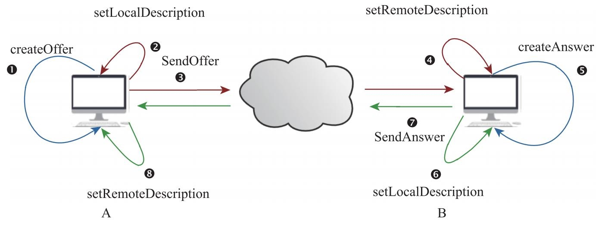

# P2P 连接

在准备好本地环境后（1，2，3 步），就开始建立 P2P 连接了（JSEP）。它包括两个大的步骤。

1. 媒体协商
2. 交换 ICE

媒体协商适用于确定双方都传输何种数据，什么格式的数据。媒体协商使用 SDP，这是一个古老的协议，使用纯文本的方式不仅不方便操作且会有一些繁琐，[WebRTC 对其中的媒体描述部分根据需要增加了一些描述， 有了专门的描述草案](https://datatracker.ietf.org/doc/draft-ietf-rtcweb-sdp/))。之前 ORTC 是一个致力于替代 SDP 的尝试，由微软支持，计划赶不上变化，如今 ORTC 的许多概念被吸收进 WebRTC 1.0 标准中，SDP 暂时没有好的替代计划。

## 媒体协商
> 媒体协商详细过程

在WebRTC中，媒体协商是有严格的顺序



```
Caller(A)               Signaling-Server                        Callee(B)
  |                            |                                    |
  |                            |                                    |
1 createOfer                   |                                    |
2 setLocalDescription          |                                    |
  ├----- 3. Send Offer ------->|----------------------------------->|
  |                            |                          4 setRemoteDescription
  |                            |                          5 createAnswer
  |                            |                          6 setLocalDescription
  |<---------------------------|------------ 7 Send Ansder ---------┤
8 setRemoteDescription         |                                    |
  |                            |                                    |
 ICE <==== multi times ========|========== Send ICE ===========> ➇ ICE
  |
```

这里我们假设协商的发起方是用户 A，当它创建好RTCPeerConnection对象并与采集到的数据绑定后，开始执行

1. 即调用 RTCPeerConnection 对象的 createOfer 接口生成 SDP 格式的本地协商信息 Offer；

2. 本地协商信息 Offer 生成后，再调用 setLocalDescription 接口，将 Offer 保存起来 (协商是有状态的，为了方便开发者调整本地设置，所以增加了本地设置的步骤。)；

3. 之后通过客户端的信令系统将 Offer 发送给远端用户B。此时用户A的媒体协商过程暂告一段落（还未完成）。

4. 用户B通过信令系统收到用户 A 的 Offer 信息后，调用本地 RTCPeerConnection 对象的setRemoteDescription 接口，将 Offer 信息保存起来；

5. 再调用 createAnswer 接口创建 Answer 消息（Answer消息也是SDP格式，里边记录的是用户B端的协商信息）；

6. Answer 消息创建好后，用户 B 调用setLocalDescription 接口将 Answer 信息保存起来。至此，用户B端的媒体协商已经完成。

7. 接下来，用户B需要将 Answer 消息发送给A端，以便让用户A继续完成自己的媒体协商。

8. 用户A收到用户B的 Answer 消息后，就可以重启其未完成的媒体协商了。用户A需要调用 RTCPeerConnection 对象的 setRemoteDescription 接口将收到的 Answer 消息保存起来。执行完这一步后，整个媒体协商过程才算最终完成。

## 交换 ICE
