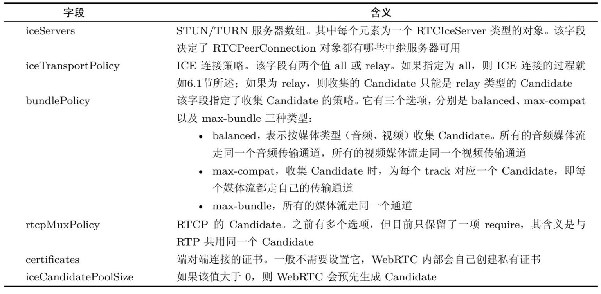

# ICE （Interactive Connectivity Establishment, 交互式连接建立）

ICE 指 WebRTC 建立网络连接的过程。更确切地说，ICE是在各端调用setLocalDescription() 接口后就开始了(其实是在 SdpOfferAnswerHandler::DoSetLocalDescription 的最后调用了 transport_controller()->MaybeStartGathering())。

JsepTransportController::MaybeStartGathering();


其操作过程如下：

1. Candidate 收集
2. 交换 Candidate
3. 按优先级尝试连接。

Candidate 就是候选网络。网络连接有不同的方式，如路径不同，协议不同，服务器不同等等。每种连接情况就是一种候选网络，WebRTC 会比较网络的优劣，选择一条最佳的连接线路。因为这些网络并没有确定，因此是“候选”的。

候选信息包括：协议、ip、端口、CandidateType、ufrag等

```
IceCandidate{
"candidate":
  "udp 192.168.1.9 45845 type host … ufrag aOj8 … ",
"sdpMid":"0",
"sdpMLineIndex":0
}
```

通过上面的信息可以看到，IceCandidate的结构由candidate、sdpMid和sdpMLineIn dex三部分组成。其中最关键的内容放在candidate字段中，也就是第3行代码里的内容（这行内容已经做了删减，将一些无关紧要的内容删掉了）。

从第3行代码中还可以知道，它包括了该IceCandidate使用的传输协议（UDP）、IP地址、端口号、Candidate类型（type host）以及用户名（ufrag a0j8）。有了这条信息，WebRTC就可以尝试与远端进行连接了。需要注意的是，实际中使用的IceCandidate结构与WebRTC 1.0规范中定义的IceCandidate结构有很大出入。之所以会出现这种情况，主要是因为WebRTC 1.0规范出来得较晚，各浏览器厂商还是按之前的草案来实现的。不过相信未来各浏览器厂商最终还是会按WebRTC规范来实现的。


WebRTC将Candidate分成了四种类型，即host、srflx、prflx及relay，且它们还有优先级次序，其中host优先级最高，relay优先级最低。比如WebRTC收集到了两个Candidate，一个是host类型，另一个是srflx类型，那么WebRTC一定会先尝试与host类型的Candidate建立连接，如果不成功，才会使用srflx类型的Candidate。

## 收集 Candidate

WebRTC收集Candidate时有几种途径：host类型的 Candidate，是根据主机的网卡个数来决定的，一般来说，一个网卡对应一个 IP 地址，给每个IP地址随机分配一个端口从而生成一个host类型的Candidate；srflx类型的Candidate，是从STUN服务器获得的IP地址和端口生成的；relay类型的Candidate，是通过TRUN服务器获得的IP地址和端口号生成的。


收集到Candidate后，通过 RTCPeerConnection对象的 onicecandidate 事件交给客户端。客户端需要通过信令发送给对等端，交换 Candidate.


## 交换 Candidate

WebRTC收集好Candidate后，会通过信令系统将它们发送给对端。对端接收到这些Candidate后，通过 PeerConnection 的 addIceCandidate 添加到本地，会与本地的Candidate形成CandidatePair（即连接候选者对）。有了CandidatePair，WebRTC就可以开始尝试建立连接了。这里需要注意的是，Candidate的交换不是等所有Candidate收集好后才进行的，而是边收集边交换。

## 尝试连接

当 WebRTC 形成 CandidatePair 后，便开始尝试进行连接。一旦WebRTC发现其中有一个可以连通的 CandidatePair 时，它就不再进行后面的连接尝试了，但发现新的 Candidate 时仍然可以继续进行交换。

根据Candidate的收集次序，WebRTC会先收集host类型的Candidate，并通过信令服务器交换给对端。当收到对端的Candidate后，WebRTC在其内部生成CandidatePair。这样终端就可以利用CandidatePair尝试建立socket连接了。在本例中，由于A和B是在同一局域网下，因此它们通过host类型的Candidate可以在内网建立起连接。当连接成功后，音视频数据就可以源源不断地从一方流向另一方了。

如果A与C通信，因为不在同一局域网内，双方尝试host型Candidate连接时会失败。不过，在A与C尝试连接时，各端Candidate的收集工作并未停止。Candidate收集线程还在收集其他类型的Candidate，如从STUN/TURN服务器收集srflx和relay类型的Candidate（中的步骤❸）；当收集到srflx类型的Candidate时，ICE会尝试NAT打洞（关于NAT打洞的过程将在 6.3节中做详细介绍），如果打洞成功，则A和C会通过P2P的方式传输数据；如果打洞失败，A和C则会通过TURN服务器中转数据。

·WebRTC的ICE机制会选择最好的链路传输音视频数据，即如果通信的双方在同一网段内，则优先使用内网链路；如果通信的双方不在同一网段，则优先使用P2P；当以上方式都无法连通时，则使用relay服务进行中转。

·ICE的连通率几乎可以达到100%。在内网和P2P无法连通的情况下，它还可以通用中继的方式让彼此连通，从而大大提高了WebRTC的连通率。

通过上面的分析，你现在应该对WebRTC在网络处理方面的策略略知一二了。WebRTC中的ICE既考虑了数据传输的效率，又考虑了网络的连通率，同时实现起来还很简单。

## 定制 ICE 策略

创建 PeerConnection 时可以传入一个 `webrtc::PeerConnectionInterface::RTCConfiguration` 结构体
WebRTC 1.0 标准仅定义了以下的内容，其余是历史的遗留代码。

```C++
struct RTC_EXPORT RTCConfiguration {
    ...
    ////////////////////////////////////////////////////////////////////////
    // The below few fields mirror the standard RTCConfiguration dictionary:
    // https://w3c.github.io/webrtc-pc/#rtcconfiguration-dictionary
    ////////////////////////////////////////////////////////////////////////

    // TODO(pthatcher): Rename this ice_servers, but update Chromium
    // at the same time.
    IceServers servers;
    // TODO(pthatcher): Rename this ice_transport_type, but update
    // Chromium at the same time.
    IceTransportsType type = kAll;
    BundlePolicy bundle_policy = kBundlePolicyBalanced;
    RtcpMuxPolicy rtcp_mux_policy = kRtcpMuxPolicyRequire;
    std::vector<rtc::scoped_refptr<rtc::RTCCertificate>> certificates;
    int ice_candidate_pool_size = 0;
    ...
}
```




## P2P 连接
