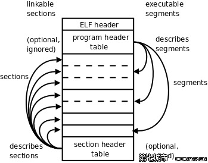

# ELF

一、为什么需要ELF(Executable and Linkable Format)文件格式

   现代操作系统提供了内存管理功能，为每个进程提供了独立的地址空间。每个程序独立占用完整的地址空间（每个程序都有地址 0 ~ 0xFFFF~，32位和 64 位地址空间不同），但是并不意味着其可以任意使用空间中的地址。

* 现代的系统为程序规定了代码区、数据区、堆、栈等区域，并且这些区域不一定是连续的。因此程序本身是多个片段。因此文件需要记录各个片段的类型、虚拟内存起始地址、长度。以及为了方便根据需要加载不同的段，需要记录各个端在文件中的位置。

* 对于如此多的运行任务，内存仍然是稀缺资源，为了高效使用内存，加载程序只会为程序占用的地址空间分配内存。因次需要知道哪些地址有数据，成块的数据被作为一个段。

* 现代系统并不会一次性将程序加载到内存，而是访问到加载一页数据进内存（页大小由芯片设计和系统共同决定，例如 X86 一般为 4KB），因次需要根据虚拟地址快速在文件中定位数据。

* 现代系统的可执行文件还有共享库，这些程序能够被多个程序使用，但是在内存中仅存在一份数据，由于动态加载，程序无法将块区域留给固定的库，因此共享库在不同程序中的虚拟地址也是不同的。


基于以上的原因，elf 被设计出来，最核心的思想就是分段、即记录程序中数据的块。包括各段的类型、起始地址、长度、在文件中的位置等信息。

## ELF 的历史

**`COFF` 文件最突出的贡献就是引入了段，不同类型的应用可以根据需要使用不同的段、并且可以根据需要进行扩展。**

## ELF 的种类

ELF 文件标准把系统中采用 ELF 格式的文档分为 4 类：

1. 可重定位文件（Relocatable File），可以被连接器用于链接成可执行程序或共享库。静态链接库也属于这种。

2. 可执行文件(Executable File)。 

3. 共享目标文件(Shared Object File): 共享文件有两种应用。一种时链接器可以将这种文件和其它可重定位文件和共享目标文件链接成新的目标文件；另一种是动态链接库可以将其与可执行文件结合，作为进程映像的一部分来运行。

4. 核心转储文件（Core Dump File）: 当进程意外终止时，系统可以将进程地址空间的内容及进程终止的一些其它信息转储到核心转出文件。例如 Linux 下的 core dump.

`file` 命令可以查看 ELF 的应用类型。

## ELF 的结构

ELF 文件由 3 大部分组成: ELF 文件头、各个段、各个段的段表。

```
+---------------+
|  ELF Header   |
+---------------+
|    Section    |
|     ...       |
+---------------+
| Section Header|
| Table         |
|      ...      |
+---------------+
```


## 进程的创建

进程的创建和运行大致经历了以下步骤：

1. 用户请求运行程序时，操作系统会读取存储在磁盘上的可执行文件进内存，此时仅将其看做数据处理。

2. 根据文件的信息指示，把不同的文件内容放到为你分配的这3G虚拟内存

3. 然后根据文件的指示，系统设置设置代码段和数据段寄存器

4. 然后根据文件的指示,    跳转到用户的代码的入口地址（一般就是我们的main函数)

5. 从 main 开始，计算机就一条一条的执行我们给的指令，其他的高级特性如进程调度对于我们的程序是不可见的，程序的视角是独占了系统的资源。


## 可执行的 elf 文件。

可执行文件一般分成4个部分，能扩展，我们理解这4部分就够了。



### 1. ELF heder

可以使用如下命令查看 elf 文件的 Header
```
$ readelf -h <file name>
ELF Header:
  Magic:   7f 45 4c 46 02 01 01 00 00 00 00 00 00 00 00 00
  Class:                             ELF64
  Data:                              2's complement, little endian
  Version:                           1 (current)
  OS/ABI:                            UNIX - System V
  ABI Version:                       0
  Type:                              EXEC (Executable file)
  Machine:                           Advanced Micro Devices X86-64
  Version:                           0x1
  Entry point address:               0x401040
  Start of program headers:          64 (bytes into file)
  Start of section headers:          13984 (bytes into file)
  Flags:                             0x0
  Size of this header:               64 (bytes)
  Size of program headers:           56 (bytes)
  Number of program headers:         13
  Size of section headers:           64 (bytes)
  Number of section headers:         31
  Section header string table index: 30
```

对应的 ELF 文件的数据结构定义在 `elf.h` 中，其中 64 位的结构为。

```
typedef struct
{
    unsigned char e_ident[EI_NIDENT]; /* Magic number and other info */
    Elf64_Half  e_type;         /* Object file type */
    Elf64_Half  e_machine;      /* Architecture */
    Elf64_Word  e_version;      /* Object file version */
    Elf64_Addr  e_entry;        /* Entry point virtual address */
    Elf64_Off   e_phoff;        /* Program header table file offset */
    Elf64_Off   e_shoff;        /* Section header table file offset */
    Elf64_Word  e_flags;        /* Processor-specific flags */
    Elf64_Half  e_ehsize;       /* ELF header size in bytes */
    Elf64_Half  e_phentsize;    /* Program header table entry size */
    Elf64_Half  e_phnum;        /* Program header table entry count */
    Elf64_Half  e_shentsize;    /* Section header table entry size */
    Elf64_Half  e_shnum;        /* Section header table entry count */
    Elf64_Half  e_shstrndx;     /* Section header string table index */
} Elf64_Ehdr;
```


指令输的内容和结构体的对应关系为
```
  Data:                              2's complement, little endian
  Version:                           1 (current)
  OS/ABI:                            UNIX - System V
  ABI Version:                       0
  Type:                              EXEC (Executable file)
  Machine:                           Advanced Micro Devices X86-64
  Version:                           0x1
  Entry point address:               0x401040
  Start of program headers:          64 (bytes into file)
  Start of section headers:          13984 (bytes into file)
  Flags:                             0x0
  Size of this header:               64 (bytes)
  Size of program headers:           56 (bytes)
  Number of program headers:         13
  Size of section headers:           64 (bytes)
  Number of section headers:         31
  Section header string table index: 30
                                          Magic
                                          Class
typedef struct                            Data
{                                         Version
    unsigned char e_ident[EI_NIDENT];     OS/ABI  ABI Version
    Elf64_Half  e_type;                   Type
    Elf64_Half  e_machine;                Machine
    Elf64_Word  e_version;                Version
    Elf64_Addr  e_entry;                  Entry point address
    Elf64_Off   e_phoff;                  Start of program headers
    Elf64_Off   e_shoff;                  Start of section headers
    Elf64_Word  e_flags;                  Flags
    Elf64_Half  e_ehsize;                 Size of this header
    Elf64_Half  e_phentsize;              Size of program headers
    Elf64_Half  e_phnum;                  Number of program headers
    Elf64_Half  e_shentsize;              Size of section headers
    Elf64_Half  e_shnum;                  Number of section headers
    Elf64_Half  e_shstrndx;               Section header string table index
} Elf64_Ehdr;
```

这个对elf文件整体信息的描述，在32位系统下是52字节，在64位系统下是64个字节。
它们的结构完全相同，仅有e_entry、e_phoff和e_shoff 三项的长度不同，在32位下是4字节，64位下是8字节。这也正是多出12字节的原因。

对于可执行文件来说，文件头包含的一下信息与进程启动相关

- e_entry      程序入口地址

- e_phoff      segment偏移

- e_phnum   segment数量

### 2. Program header table

这个表是加载指示器，操作系统（确切的说是加载器，有些elf文件，比如操作系统内核，是由其他程序加载的）,该表的结构非常重要。

```
typedef struct
{
  Elf64_Word     p_type;            /* Segment type */
  Elf64_Word     p_flags;        /* Segment flags */  /*segment权限，6表示可读写，5表示可读可执行
  Elf64_Off      p_offset;        /* Segment file offset */     /*段在文件中的偏移*/
  Elf64_Addr     p_vaddr;        /* Segment virtual address */   /*虚拟内存地址，这个表示内存中的
  Elf64_Addr     p_paddr;        /* Segment physical address  /*物理内存地址，对应用程序来说，这个字段无用*/
  Elf64_Xword    p_filesz;        /* Segment size in file */        /*段在文件中的长度*/
  Elf64_Xword    p_memsz;        /* Segment size in memory */       /在内存中的长度，一般和p_filesz的值一样*/
  Elf64_Xword    p_align;        /* Segment alignment */                  /* 段对齐*/
} Elf64_Phdr;   
```

### 3. section

对于可执行文件来说，最主要的就是数据段和代码段

### 4. section heder table

对可执行文件来说，没有用，在链接的时候有用，是对代码段数据段在链接是的一种描述。

我们将通过一个例子来讲解系统加载elf的过程(64位平台)。一个简单的汇编程序：
```ASM
 .section .data
.global data_item
data_item:
.long 3,67,28
.section .text
.global _start
_start:
    mov $1,%eax
    mov $4,%ebx
    int $0x80
```

编译链接后生成hello文件，我们分析hello文件.

执行：readelf -h ../asm/hello   （readelf -h 是读取elf文件头的命令)
```
ELF Header:
  Magic:   7f 45 4c 46 02 01 01 00 00 00 00 00 00 00 00 00  
  Class:                             ELF64
  Data:                              2's complement, little endian
  Version:                           1 (current)
  OS/ABI:                            UNIX - System V
  ABI Version:                       0
  Type:                              EXEC (Executable file)
  Machine:                           Advanced Micro Devices X86-64
  Version:                           0x1
  Entry point address:               0x4000b0               //程序的入口地址是0x4000b0
  Start of program headers:          64 (bytes into file)   //segment表在文件64字节偏移处
  Start of section headers:          240 (bytes into file)                     
  Flags:                             0x0
  Size of this header:               64 (bytes)                                        
  Size of program headers:           56 (bytes) //segment头项的长度是56字节(32系统是32字节)
  Number of program headers:         2
  Size of section headers:           64 (bytes)
  Number of section headers:         6
  Section header string table index: 3
```

对于程序的装载，我们关心这三项：

```
Entry point address:               0x4000b0    //程序的入口地址是0x4000b0
Start of program headers:          64 (bytes into file) //segment表在文件64字节偏移处
Size of program headers:           56 (bytes)  //segment头项的长度是56字节（32系统是32字节)
```
以上内容告诉我们 segment 表在文件的64字节处，我们看看64字节处有什么内容。

   
执行 readelf -l ../asm/hello  输出segments信息。(readelf -l 读取segments)
```
Program Headers:
  Type           Offset             VirtAddr           PhysAddr
                 FileSiz            MemSiz              Flags  Align
  LOAD           0x0000000000000000 0x0000000000400000 0x0000000000400000
                 0x00000000000000bc 0x00000000000000bc  R E    200000
  LOAD           0x00000000000000bc 0x00000000006000bc 0x00000000006000bc
                 0x000000000000000c 0x000000000000000c  RW     200000

 Section to Segment mapping:
  Segment Sections...
   00     .text 


   01     .data 
```

我们看到程序有两个segment ，分别叫做.text 和.data 

.text的Offset是0，FileSiz是0x0,MemSiz是0xbc, VirtAddr是0x400000,Flags是R E,表示加载起将把elf文件中从0字节开始直到oxbc处的内容加载到虚拟内存中的0x400000处，占用0xbc长度的内存。设置该内存的权限是RE(可读，可执行），这一段的内容正好是elf头，segments table,和代码段。

再看看 elfheader 的 e_entry 的地址 0x4000b0，这个地址正好是代码段的起始地址。

.data的Offset是0，FileSiz是0xbc,MemSiz是0x0c, VirtAddr是0x6000bc,Flags是R W,表示加载起将把elf文件中从bc字节开始直到oxbc + 0xc处的内容加载到虚拟内存中的0x6000bc处，占用0x0c长度的内存。设置该内存的权限是RE(可读，可执行）

为什么数据段的其实地址是0x6000bc,而不是0x6000000呢，这是由Align决定的，Align决定内存和磁盘以1M为单位进行映射，在文件中.data 和.text处于一个页面中，在映射的时候，直接把整个页面都映射到了0x6000000处，所以把数据段的偏移设置成了0x60000bc,0x600000到0x6000bc的内容不使用。

有了以上内容，系统就可以根据elf文件创建进程了。

- BSS 区: Block Started by Symbol。存放进程未初始化的 static 以及 gloal 变量, 默认初始化时全部为0.

## 查看内容

1. 查看某个段的内容 readelf 或者 objdump 都可以


```shell
$ readelf -x .data a.out
Hex dump of section '.data':
0x00404018 00000000 00000000 00000000 00000000 ................
0x00404028 03000000 01000000 02000000          ............
$ objdump -s -j .data a.out

a.out:	file format elf64-x86-64

Contents of section .data:
 404018 00000000 00000000 00000000 00000000  ................
 404028 03000000 01000000 02000000           ............
```