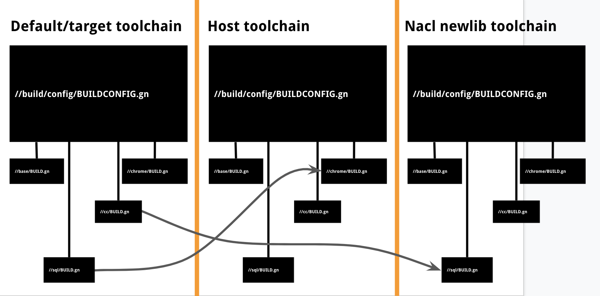

# Cross compiling

跨品台编译即在一种类型的主机上给另一种平台（系统）编译运行软件。

一些概念：

host：主机是运行构建的平台
targe：目标是实际运行代码的平台

target 在不同语境中有不同的含义，在用于描述编译的对象时，target 是指构建目标，而跨平台编译的 target 是指目标平台。在中文中含义区分很明显，而在英文中根据语境区分。


GN 启动后，host_os 和 host_cpu 变量被自动设置为 host 平台的对应值（它们可以被 args 中的参数覆盖，这在特殊的情况下非常有用）。当用于想要交叉编译时，需要设置 `target_os`，`target_cpu` 至少其中之一（前者操作控制系统不同，后者控制 cup 不同）。如果没有被设置，它们将被设置为 host 的对应值。这些值的设置是在 `BUILDCONFIG.gn` 文件中完成的，可以根据需要调整(例如，android 仅在 arm/x86 芯片上运行，当用户指定了 target_os, 没有指定 target_cpu 时，可以将 target_cup 设置为常用的 `arm`, 而不是跟 host 保持一致。)。但原则是 `host_` 指编译平台，`target_` 指向运行平台。


So, for example, running on an x64 Linux machine:
```
gn gen out/Default
```

is equivalent to:
```
gn gen out/Default --args='target_os="linux" target_cpu="x64"'
```

To do an 32-bit ARM Android cross-compile, do:
```
gn gen out/Default --args='target_os="android"'
```

(We don't have to specify target_cpu because of the conditionals mentioned above).

And, to do a 64-bit MIPS Chrome OS cross-compile:
```
gn gen out/Default --args='target_os="chromeos" target_cpu="mips64el"'
```

## toolchain

toolchain 是编译目标文件的工具集合，例如对运行在 Linux 上的 C/C++ ，其包括编译器、汇编器、链接器、反汇编、系统库等。因为系统、运行环境、编译器、库等不同，不同的目标平台往往需要不同的工具链。

### 定义一个新的 toolchain

gn 已经内置了 `toolchain()` 用于定义一个新的 toolchain，可以通过 `gn --help toolchain` 查看详细的文档。

```gn

toolchain("gcc") {
  tool("cc") {
    depfile = "{{output}}.d"
    command = "gcc -MMD -MF $depfile {{defines}} {{include_dirs}} {{cflags}} {{cflags_c}} -c {{source}} -o {{output}}"
    depsformat = "gcc"
    description = "CC {{output}}"
    outputs =
        [ "{{source_out_dir}}/{{target_output_name}}.{{source_name_part}}.o" ]
  }
  ...

  toolchain_args = {
    current_cpu = "ppc64"
    current_os = "linux"
  }
}
```
在构建中可以同时使用多个工具链。构建文件对引用它的每个工具链执行一次，因此 gn 能够在不同 toolchain 上为每个目标设置不同的参数。

当只有一个工具链的简单构建时，构建配置文件只在构建开始时加载一次。工具链定义中的 “toolchain_args” 部分被忽略，不被使用。

当目标依赖于使用不同工具链的目标时，GN 将使用辅助工具链构建目标。GN 将重新加载构建配置文件，并使用 `toolchain_args` 中的参数覆盖构建参数。因为默认的工具链是已知的，因此 `set_default_toolchain()` 的调用将被忽略。

例如
```gn
executable("hello") {
  sources = [ "hello.cc" ]
  print("current_cpu: " + current_cpu)
  print("current_os: " + current_os)

  deps = [
    ":hello_shared(//build/toolchain:clang)",
  ]
}
shared_library("hello_shared") {
  print("current_cpu: " + current_cpu)
  print("current_os: " + current_os)
  ...
}
```

将打印
```
current_cpu: x64
current_os: mac
current_cpu: x64
current_os: mac
...
current_cpu: ppc64
current_os: linux
current_cpu: ppc64
current_os: linux
```

在备用工具链中加载文件，GN执行以下操作

1. 加载定义有 toolchain 的文件（由 toolchain 的标签名确定）。

2. 重新运行主构建配置文件，应用工具链定义的 `toolchain_args` 部分指定的参数。

3. 在上一步的配置文件上下文中加载目标构建文件。

工具链配置是双向的。在默认的工具链(即主构建目标)中，配置从构建配置文件流向工具链。构建配置文件查看构建的状态(OS类型、CPU架构等)，并决定使用哪个工具链(通过 set_default_toolchain())。在辅助工具链中，配置从工具链流向构建配置文件:工具链定义中的“工具链参数”指定重新调用构建的参数。

### toolchain 可以设置的内容

- tool(): tool() 函数指定为给定步骤运行的命令。参见“gn help tool”。
- toolchain_args{}: 覆盖构建文件中 `declare_args` 中声明的同名参数。
  当使用辅助工具链构建目标时，主构建配置文件将在该工具链的上下文中重新解析。toolchain_args 允许你控制传递给再次构建调用的参数。
  任何默认的参数或通过“gn args”传入的参数除非被 `toolchain_args` 显式覆盖，否则也将被传递给替代调用。
  在主构建中，工具链中的 `toolchain_args` 将被忽略。此时，它认为你希望使用默认参数值。
  另请参阅 “gn help buildargs”以了解这些参数的概述。
- propagates_configs [boolean, default=false]: 确定此工具链中的 `public_configs` 和 `all_dependent_configs` 是否传播到其它工具链的目标中。

- deps [string list]: 工具链的依赖性。在编译工具链中的任何目标之前，这些依赖项将被解析。为了避免循环依赖，这些必须是在另一个工具链中定义的目标。
  其形式为一个目标的列表，并且这些目标通常都会指定一个工具链：deps = [ "//foo/bar:baz(//build/toolchain:bootstrap)" ]
  在 ninja 中表达这个概念有点低效（它需要很多重复规则）所以只有在绝对必要时才使用。


### 设置 toolchain

它必须调用 `set_default_toolchain()` 来告诉 gn 要使用的工具链定义的标签。

对于任何的构建目标，只需要通过 `set_default_toolchain(tool_chain)` 设置一个 tool_chain，如果想要实现多平台目标编译，则需要判断 `target_os` 来分别设置。例如

```gn
_default_toolchain = ""

if (target_os == "android") {
  _default_toolchain = "//build/toolchain/android:android_clang_$target_cpu"
} else if (target_os == "ios") {
  _default_toolchain = "//build/toolchain/ios:ios_clang_$target_cpu"
} else {
  assert(false, "Unsupported target_os: $target_os")
}
set_default_toolchain(_default_toolchain)
```

`set_default_toolchain(tool_chain)` 的参数究竟是什么的？

### tool()

tool() 的参数必须为已经定义的类型，可以通过 `gn help tool` 查看支持的类型，目前支持 C、C++、objc、Objc++、Swift、Ruxt 的编译。


## 对于 BUILD.gn

当你编写 `//build` 目录之外构建文件（例如，不是直接编写 toolchains、编译器配合等）时，通常你只需要关系如下几点：

- current_toolchain、 current_cpu 和 current_os 是给定编译目标实际起作用的设置。`is_linux`、`is_win` 等变量根据 `current_` 的值而变化。同时改变的还有 `cflags`,`ldflags`等更改也仅适用于当前的工具链和所构建的当前编译目标。

- 你也可以访问 `target_cpu` 和 `target_os` 变量，如果你需要根据 `target_arch` 在不同 host 上做不同的事情，这将非常有用；它们的值在所有工具链中都是一样的。你也可以跟句 host_cpu 和 host_os 变量做类似的事情，但通常不需要这样做。

- 对于默认的 toolchain，target_cpu 和 current_cpu是相同的。对于 `secondary toolchain`，current_cpu 根据 toolchain 的定义进行设置，而 `target_cpu`保持不变。在编写规则（编译目标）时，大部分时间都应该使用current_cpu而不是target_cpu。

- 默认情况下，编译目标的 `deps` 中的依赖列表和编译目标使用相同的 `toolchain`，你可以使用 `<编译目标>(toolchain label)` 标签标记指定不同的 `toolchain`.  [具体课查看文档的 label 小节](currently active))

```
  A canonical label includes the label of the toolchain being used. Normally,
  the toolchain label is implicitly inherited from the current execution
  context, but you can override this to specify cross-toolchain dependencies:

    //base/test:test_support(//build/toolchain/win:msvc)

  Here GN will look for the toolchain definition called "msvc" in the file
  "//build/toolchain/win" to know how to compile this target.
```


Here's an example of when to use target_cpu vs current_cpu:

```
declare_args() {
  # Applies only to toolchains targeting target_cpu.
  sysroot = ""
}

config("my_config") {
  # Uses current_cpu because compile flags are toolchain-dependent.
  if (current_cpu == "arm") {
    defines = [ "CPU_IS_32_BIT" ]
  } else {
    defines = [ "CPU_IS_64_BIT" ]
  }
  # Compares current_cpu with target_cpu to see whether current_toolchain
  # has the same architecture as target_toolchain.
  if (sysroot != "" && current_cpu == target_cpu) {
    cflags = [
      "-isysroot",
      sysroot,
    ]
  }
}
```

## 对于 //build/config 或 //build/toolchain

`default_toolchain` 在 `BUILDCONFIG.gn` 文件中声明，通常 `default_toolchain` 应该是`target_os` 和 `target_cpu` 的 toolchain，`current_toolchain` 是当前构建目标起作用的 `toolchain`。

确保你理解 host_cpu、target_cpu、current_cpu 和 toolchain_cpu (and the os equivalents)的不同。前两个像之前描述的那样被设置。你负责确保 current_cpu 在你的工具链中正确的设置。如果你正在使用像 gcc_toolchain 和 msvc_toolchain 这样的 stock 模板，意味着你需要确保 toolchain_cpu 和 toolchain_os 在模板调用时正确地设置。

默认有两个指示 toolchain 的变量：default_toolchain，current_toolchain。


## Toolchains

Imagine your build as an n-dimensional hypercube...

> What’s a toolchain?

There are two main things to set: "os" and "cpu" by `BUILDCONFIG.gn`. The "toolchain" is the name
of the GN thing that encodes combinations of these things.

这句话就是说，toolchain 是 `os`、`cpu` 等相关工具集合。

- Identified by a label。

- Defines a set of compiler and linker rules.

- Goes with a set of variables (OS, CPU, etc.)

toolchain 一般包括

```shell
TOOLCHAIN=$NDK/toolchains/llvm/prebuilt/$HOST_TAG

function configEnv()
{
    export TARGET_AL=$1
    export CROSS_PREFIX=$TOOLCHAIN/bin/$1-

    export AR=${CROSS_PREFIX}ar # 打包静态库的命令
    export AS=${CROSS_PREFIX}as # assembler
    export LD=${CROSS_PREFIX}ld # linker
    export NM=${CROSS_PREFIX}nm # nm 命令
    export RANLIB=${CROSS_PREFIX}ranlib # ranlib 命令
    export STRIP=${CROSS_PREFIX}strip # 命令
    # Configure and build.
    export CC=$TOOLCHAIN/bin/$2-clang # c 编译命令
    export CXX=$TOOLCHAIN/bin/$2-clang++ # c++ 编译

    # 不使用 $NDK 目录下的 /sysroot/
    export SYSROOT=$TOOLCHAIN/sysroot # 运行平台的工具链的 system 的根路径
    # 可以不设置，但是设置必须是对应架构的，例如 arm-linux-androideabi-
    export CPU=$3 # 运行机器的 CPU
    export ARCH=$4 # 运行机器的 架构

    #优化编译项
    export extra_cflags=$5 # 其他编译参数。
}
```

toolchain 是 `BUILDCONFIG.gn` 中设置。

chromium 设置了两种 toolchain：default toolchain，host_toolchain 用于在交叉编译时区分目标和本地的工具链。在非交叉编译时，二者相同。


```
# build/BUILDCONFIG.gn
set_default_toolchain("//build/toolchain:gcc")
```
也设置了构建参数

```
# All binary targets will get this list of configs by default.
_shared_binary_target_configs = [ "//build:compiler_defaults" ]

# Apply that default list to the binary target types.
set_defaults("executable") {
  configs = _shared_binary_target_configs

  # Executables get this additional configuration.
  configs += [ "//build:executable_ldconfig" ]
}
set_defaults("static_library") {
  configs = _shared_binary_target_configs
}
set_defaults("shared_library") {
  configs = _shared_binary_target_configs
}
set_defaults("source_set") {
  configs = _shared_binary_target_configs
}
```

简单的构建可能仅有一个 toolchain (即 default toolchain)。交叉编译和nacl builds` 则会有更多（甚至 4-5个）, 这些构建目标可以跨 toolchain 进行依赖。



构建设置实际上是跨每个工具链重复的。这意味着有不同的全局变量集(“is_nacl”)，构建文件可能在不同的上下文中多次执行。在一个`BUILD.gn` 文件中的打印变量（如 is_mac），可能被打印多次，并且可能是不同的值。因为 `BUILD` 可能会被执行多次。


```
# build/toolchain/BUILD.gn

toolchain("gcc") {
  tool("cc") {
    depfile = "{{output}}.d"
    command = "gcc -MMD -MF $depfile {{defines}} {{include_dirs}} {{cflags}} {{cflags_c}} -c {{source}} -o {{output}}"
    depsformat = "gcc"
    description = "CC {{output}}"
    outputs =
        [ "{{source_out_dir}}/{{target_output_name}}.{{source_name_part}}.o" ]
  }

  tool("cxx") {
    depfile = "{{output}}.d"
    command = "g++ -MMD -MF $depfile {{defines}} {{include_dirs}} {{cflags}} {{cflags_cc}} -c {{source}} -o {{output}}"
    depsformat = "gcc"
    description = "CXX {{output}}"
    outputs =
        [ "{{source_out_dir}}/{{target_output_name}}.{{source_name_part}}.o" ]
  }
  ...
}
```


可以被依赖

```
executable(“chrome”) {
  print(current_toolchain)
  print(default_toolchain)
  …
  data_deps = [
   "compile_some_protos(//build/toolchain:gcc)"
  ]
}

action("compile_some_protos") {
  …
  deps = [
    ":proto_compiler($host_toolchain)"
  ]
}

```

可以检测

```
if (current_toolchain ==  host_toolchain) {
  executable(“proto_compiler”) {
    …
  }
}
```

“compiler” 执行目标（ “compiler” executable）仅存在于 host_toolchain 中，因为在交叉编译时我们不需要为目标CPU对其进行编译。