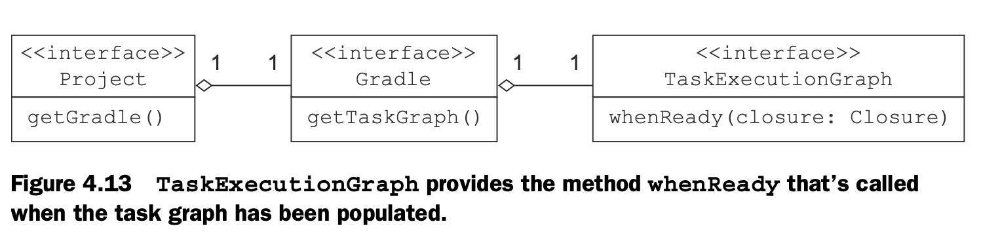

# 构建流程

## Building Blocks

Gradle 的构建包括三个基础块：projects、tasks、properties。

- 每个构建至少包含一个 project. 根据 `build.gradle` 的配置，实例化 `org.gradle.api.Project` 对象。可有通过 `project` 变量获取属性。在 `build.gradle` 不需要使用 `project` 调用它的方法或属性，默认该脚本在其内部调用，可以直接通过方法名或属性名访问。
- 每个 project 包含一个或多个 task.
- project 和 task 暴露用于控制构建的 properties.


## Task

可以通过多种方式创建 Task。

1. 使用默认的 Task， task 函数创建 Task 默认继承自 DefaultTask.

```groovy
task hello() {
    doLast {
        println "Hello World"
    }
}
```

2. 自定义 Task 需要继承一个 Task 类。一般继承 DefaultTask

```groovy
class HelloWorld extends DefaultTask {
    @TaskAction
    void hello() {
        println "Hello"
    }
}
```

创建 Task 
```

def hello = tasks.register("hello", HelloWorld)
```

或者

```
task hello(type: HelloWorld) {}
```

这种方式也适用于 Gradle 内建的一些 Task 的创建，例如 Zip、Copy 等。

```groovy
 task makeZip(type: Zip, dependsOn: makeReleaseVersion) {
     archiveFileName = "my-distribution.zip"  // 压缩文件名
     destinationDirectory = file("$buildDir/dist") // 目标目录

     from "$buildDir/libs" // 要被压缩的文件。
 }
```

更多 Copy、Zip、Tar 文档可查看 https://docs.gradle.org/current/userguide/working_with_files.html


## Action

Action 是 task 内部的可执行模块。Task 提供了两个对应的方法用于声明 `action`： doFirst(Closure) 和 doLast(Clusure)。当 Task 执行的时候，作为闭包参数的 action 逻辑被以此执行。

或者在类中使用 `@TaskAction` 定义 Action。

```groovy
class HelloWorld extends DefaultTask {
    @TaskAction
    void hello() {
        println "Hello"
    }
}
```


## 依赖

依赖可以有几种类型：

`dependsOn` 方法用于定义 task 之间的依赖关系。声明方式有多种

### 1. 在定义 task 时声明。

```
task first {
    doLast { println "first" }
}
task second {
    doLast { println "second" }
}
task printVersion(dependsOn: second)  {
    logger.quiet "Version: $version"
}
```

也可以声明多个依赖

```
task printVersion(dependsOn: [second, first]) { 
    logger.quiet "Version: $version"
}
```

**`first` 和 `second` 的执行顺序是不确定的。**

### 2. 对于已有的 task，也可以补充依赖

```
printVersion.dependsOn('first')
```

重要的是要理解 Gradle 不保证依赖任务的执行顺序。 dependsOn 仅定义需要先执行的依赖任务。 Gradle的哲学是声明在给定任务之前应该执行什么，而不是应该如何执行。 如果你使用过像Ant那样必须使用强制性地定义其依赖项的构建工具，则很难理解此概念。 在Gradle中，执行顺序是由任务的输入/输出规范自动确定的，正如您将在本章稍后看到的那样。 这个建筑设计决策有很多好处。 一方面，您无需了解整个任务依赖关系链即可进行更改，从而提高了代码的可维护性并避免了潜在的损坏。 另一方面，由于不必严格按照顺序执行构建，因此已启用了并行任务执行功能，这可以显着缩短构建执行时间。

### 3. 自动推断

当将一个 Task 的输出作为另一个 Task 的输入时，默认推断出他们之间的依赖。为了使依赖关系正确的得到推断，需要正确地配置 task 输入输出的位置。保证生产者和消费者 task 使用同一个位置。

Property API不仅跟踪属性的值，还跟踪任务呀的生成值，从而使依赖推断更加容易，因此不必也指定它。以下面的代码为例，它有一个生产者和消费者任务，这两个任务是有依赖的:

具体看下节，Task 的输入输出》

## Task 的输入输出

一个 Task 可以包含一些输入以及一些输出。输入输出在 Task 依赖推断中占据着重要的作用。

Gradle 通过比较两次构建之间的任务输入和输出快照来确定任务是否最新。如果自上次执行任务以来输入和输出未发生变化，则该任务被认为是最新的。 因此，仅当输入和输出不同时，任务才会运行； 否则，将被跳过。

- 输入可以是一个目录，一个或多个文件，或任意的属性

- 任务的输出是通过目录或1 ... n个文件。

### DefaultTask 的输入输出

DefaultTask 类中的输入是 `TaskInputs` 类型的属性 `inputs`。输出字段的类型是 `TaskOutputs`，属性名是 `outputs`


```groovy
ext.versionFile = file('version.properties')

task makeReleaseVersion(group: 'versioning', description: 'Makes project a release version.') {
    inputs.property('<key name>', <实际的属性变量>) //  属性
    inputs.file versionFile // 文件
 }
```

### 自定义 Task 的输入输出

继承自 DefaultTask 的类仍然可以使用 `inputs` `outputs` 作为输入输出，另外还可以使用注解直接定义字段。


```groovy
class Producer extends DefaultTask {
    @Input Boolean release
    @OutputFile File destFile
    @OutputFile
    final RegularFileProperty outputFile = project.objects.fileProperty()
}
```

然后使用时可以直接访问属性名来赋值

```groovy
task makeReleaseVersion(type: ReleaseVersionTask) {
    release = version.release
    destFile = file('version.properties')
}
```

或者在 `configure` 中配置

```
def producer = tasks.register("producer", Producer)

producer.configure {
    outputFile = layout.buildDirectory.file('file.txt')
}
```

如果 Task A 的输出作为 Task B 的输入，则 B 依赖于 A。

## 清理任务

`finalizedBy` 用于定义一个任务执行之后执行的任务。


## 生命周期

`task configuration` 块总是在 `task action`` 之前执行。


```
Initialization phase(creates a Project instance)
      |
      ∨
Configuration phase(task 中的任务，直接在 build.gradle 中的脚本)
      |
      ∨
Execution phase(根据依赖执行 task 的 action.)
```

**Keep in mind that any configuration code is executed with every build of your proj- ect—even if you just execute gradle tasks.**

有两种方式来设置构建生命周期的回调：闭包和实现监听器接口。如果你想要对程序由充分的测试，实现监听接口是一个更好的选择。

几个主要的 Hook 函数。




在接口Project和Gradle中定义了许多生命周期回调方法。更多的钩子函数可以查看官方的文档。

在配置时，Gradle决定了在执行阶段需要运行的任务的顺序。Task 根据依赖被构建为一个有向无环图。

```groovy
gradle.taskGraph.whenReady { TaskExecutionGraph taskGraph ->
    println taskGraph.allTasks
    if (taskGraph.hasTask(':release')) { // 或者 release
        println "Change release value to true task is executed."
        if (!version.release) {
            version.release = true
            ant.propertyfile(file: versionFile) {
                entry(key: 'release', type: 'string', operation: '=', value: 'true')
            }
        }
    }
}
```

可以使用监听器来实现同样的功能。

```groovy
gradle.taskGraph.addTaskExecutionGraphListener(new TaskExecutionGraphListener() {
    @Override
    void graphPopulated(TaskExecutionGraph graph) {
        if (graph.hasTask(release)) {
            List<Task> allTasks = graph.allTasks
            Task releaseTask = allTasks.find {it.path == ':release' }
            Project project = releaseTask.project
            if(!project.version.release) {
                project.version.release = true
                ant.propertyfile(file: versionFile) {
                    entry(key: 'release', type: 'string', operation: '=', value: 'true')
                }
            }
        }
    }
})
```


