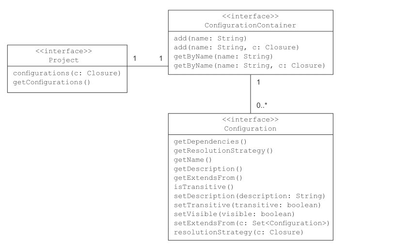
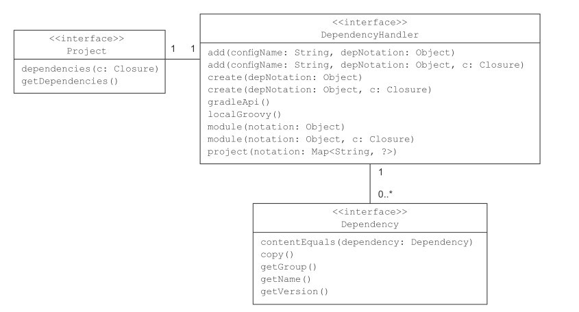

# Dependency Management

由于现代项目依赖的复杂性，不同依赖可能还有依赖，以及依赖于同一个库的不同版本等。想要通过手工维护依赖关系显然不太现实。自动化依赖维护工具诞生就是自动查找、比较依赖关系并自动加入到项目中。

为了实现依赖的自动查找，中央仓库必不可缺。Java 领域主要有两个包仓库:

Apache Ivy是一个纯粹的依赖管理器，主要用于Ant项目
Maven，它包含依赖项管理器作为其构建基础结构的一部分。

## 配置依赖

gradle 通过 `dependencies` 配置依赖，通过 `repositories` 配置仓库地址。 gradle 提供了各种配置对项目构建生命周期中所需的依赖。

依赖可以直接在项目的脚本的根级别添加和访问；可以使用插件所提供的配置，或者声明自己的配置。每个项目都有一个 ConfigurationContainer 类的容器来管理相应的配置。可以通过配置控制依赖解决方案中是否包含传递性依赖，定义解决策略，甚至可以使配置扩展。



Java 插件(aply plugin: 'java')提供了 6 个现成的配置。

- implementation （替代 compile）
- compileOnly 添加编译时期的依赖，不在运行时使用。
- compileClasspath extends compile, compileOnly, implementation Compile classpath, used when compiling source. Used by task compileJava
- annotationProcessor 注解处理的阶段的依赖
- runtimeOnly 仅在运行时使用的依赖。
- runtimeClasspath 运行时类路径包含实现的元素以及仅运行时元素。

测试和调试的
- testImplementation (代替 testCompile) 
- debugImplementation
- androidTestImplementation
... 类似

### 自定义配置。

除了插件默认提供的，gradle 可以很简单的添加自定义配置。

```groovy
configurations {
    cargo {
        description = "Classpath path for Cargo Ant tasks."
        visible = false
    }
}
```

## 声明依赖

depenpencies 将一个或多个依赖指配给配置，指派的外部仓库类库被称为外部依赖，外部依赖并不是项目声明的唯一依赖。 Gradle 可以指定的依赖有：

- 外部依赖：依赖仓库中的外部类库。

- 项目依赖：Gradle 可以是多项目（模块）的，项目之间可以依赖。如 `implementation project(':XXX')`
- 文件依赖：依赖文件系统中的一系列文件

- Gradle 运行时依赖：Gradle 脚本需要的依赖，在 `buildscript` 作用域中配置。

- 客户端模块依赖：以阿里仓库带外部类库，具有声明元数据的能力。

每个项目都有一个 DependencyHandler 实例来处理依赖。下表列出了它们之间的关系和方法。



### 外部依赖

外部依赖通过不同的属性来唯一确定，当依赖管理器在仓库中查找一个依赖时，会通过属性组合来找到它。一个依赖至少需要提供一个名称。


- group: 此属性通常标识组织，公司或项目。 该组可以使用点符号，但不是强制性的。 对于Hibernate库，该组为org.hibernate。

- name: 工件的名称唯一地描述了依赖性。 Hibernate的核心库的名称是hibernate-core。

- version: 库可能有许多版本。 很多时候，版本字符串由主要版本和次要版本组成。 您为Hibernate core选择的版本是3.6.3-Final。

- classfiler: 有时工件会定义另一个属性分类器，该分类器用于区分具有相同组，名称和版本的工件，但是需要进一步说明（例如，运行时环境）。 Hibernate的核心库未提供分类器。

依赖的声明可以使用 map 的形式或者使用 `:` 分割的字符串形式。其本质是一样的。

Gradle 并没有提供一个默认的仓库。在没有配置仓库的相框下运行错误。需要指定仓库地址。

```gradle
repositories {
    jcenter()
}
```

当运行 dependencies 帮助 task 时，会显示完整的依赖树，依赖树显示了在构建脚本中声明的顶层依赖，以及它们的传递性依赖。
```shell
$ ./gradlew dependencies

> Configure project :
Description of project init_gradle: This is a test project
Reading the version file.
-------------- 0.12 ---------------

> Task :dependencies

------------------------------------------------------------
Root project - This is a test project
------------------------------------------------------------

cargo - Classpath path for Cargo Ant tasks.
\--- com.squareup.okhttp3:okhttp:4.9.0
     +--- com.squareup.okio:okio:2.8.0
     |    +--- org.jetbrains.kotlin:kotlin-stdlib:1.4.0 -> 1.4.10
     |    |    +--- org.jetbrains.kotlin:kotlin-stdlib-common:1.4.10
     |    |    \--- org.jetbrains:annotations:13.0
     |    \--- org.jetbrains.kotlin:kotlin-stdlib-common:1.4.0 -> 1.4.10
     \--- org.jetbrains.kotlin:kotlin-stdlib:1.4.10 (*)

(*) - dependencies omitted (listed previously)

```

标星号的被排除了，这意味着依赖管理器的选择是相同的或者另一个版本的类库，因为它被声明作为另一个依赖的依赖。针对版本冲突，Gradle 默认的解决策略师获取较新的版本，通过一个箭头（->）来表示。

#### 排除传递性依赖

当遇到一些依赖冲突是，你可以决定排除所有的产地性依赖或者有选择性的排除某些依赖。与依赖标记不同，排除依赖使用 `group` 和 `module` 属性。Gradle 不允许只排除某个特定版本的依赖，但是可以通过再次声明特定版本依赖的方式实现。
 
```groovy
dependencies {
    cargo('com.squareup.okhttp3:okhttp:4.9.0') {
        exclude group: 'org.jetbrains.kotlin', module: 'kotlin-stdlib'
    }
    cargo 'org.jetbrains.kotlin:kotlin-stdlib:1.4.0'
}

```

```
$ ./gradlew dependencies

cargo - Classpath path for Cargo Ant tasks.
+--- com.squareup.okhttp3:okhttp:4.9.0
|    \--- com.squareup.okio:okio:2.8.0
|         \--- org.jetbrains.kotlin:kotlin-stdlib-common:1.4.0
\--- org.jetbrains.kotlin:kotlin-stdlib:1.4.0
     +--- org.jetbrains.kotlin:kotlin-stdlib-common:1.4.0
     \--- org.jetbrains:annotations:13.0

```

也可以排除所有传递性依赖。

```groovy
dependencies {
    cargo('com.squareup.okhttp3:okhttp:4.9.0') {
        transitive = false
    }
    // 指定依赖
}
```

#### 动态版本声明

如果你想要使用最新版本的依赖，需要使用 `latest.integration` 占位符代替版本值。例如 `org.codehaus.cargo:cargo-ant:latest-integration.`。如果想要某个版本区间的，可以使用 `+` 代替可变部分。

```
org.codehaus.cargo:cargo-ant:1.+.
```

**最好少用或者不用动态版本，可靠和可重复的构建时最重要的。更糟糕的是，在不知情的情况下，你可能引入了不兼容的类或副作用。这些作用很可能在运行时在发生，并且很难定位。**


### 文件依赖

Gradle 允许依赖于目录和文件，这在一些没有使用 `gradle` 的就项目迁移到 `gradle` 管理时很有用，你不必一次性将所有依赖改为依赖外部仓库。

```groovy
dependencies {
    cargo fileTree(dir: 'libs', include: ['*.jar'])
}
```

通过 `dir` 指定目录，通过 `include` 来只包含特定类型的文件。

## 访问配置

在配置中添加依赖，可以在运行阶段访问。

```
task deployToLocalTomcat {
    doLast {
        Configuration cargoDeps = configurations.getByName('cargo')
        DependencySet dependency = cargoDeps.dependencies


        println("Cargo configuration:")
        println("config: " + cargoDeps.name)

        println("name: " + dependency.name)
        println("group: " + dependency.group)
        println("version: " + dependency.version)
        println("reason: " + dependency.reason)
    }
}
```

```shell
$ ./gradlew deployToLocalTomcat

> Task :deployToLocalTomcat
Cargo configuration:
config: cargo
name: [okhttp]
group: [com.squareup.okhttp3]
version: [4.9.0]
reason: [null]

```


## 使用和配置仓库
5.5 节

## 本地依赖缓存

Gradle用于将依赖项存储在本地缓存中的根目录是<USER_HOME>/.gradle/caches/artifacts-15/filestore。
打印依赖的地址 

```groovy
task printDependencies {
    doLast {
        configurations.getByName('cargo').each { dependency ->
            println dependency
        }
    }
}
```

artifacts-15 是一个标识符，指定 gralde 的版本。区分元数据存储方式的变化是必须的。
缓存实际上被分成两部分，filestore 子目录存储了仓库下载的原始二进制文件。其他二进制文件存放了下载工件的元数据。

**使用 --offset 参数来使用离线缓存，避免检查仓库差别。**


## 解决依赖问题

Gradle不会自动通知您您的项目处理了版本冲突。要解决这个问题，必须不断地运行依赖项报告并不是一种实际的方法。相反，您可以更改默认的解决策略，以便在遇到版本冲突时使构建失败，如下面的代码示例所示

```groovy
configurations.cargo.resolutionStrategy {
    failOnVersionConflict()
}
```

失败对于调试目的是有帮助的，特别是在建立项目和更改依赖集的早期阶段。运行任何项目的任务也会指出版本冲突。

为项目指定统一依赖是一个很有用的配置，以覆盖在各个子项目中不同的配置。下面的配置将覆盖 depencencies 中的配置。

```groovy
configurations.cargo.resolutionStrategy {
    force 'com.squareup.okhttp3:okhttp:4.9.0'
}
```

### 依赖审查报告

有时你可能想知道是什么原因迫使依赖使用了一个特定版本。但是依赖冲突并没有显示原因。这时候可以使用依赖审查报告。为了运行这个报告，需要添加两个参数：配置名称（默认是 implementation），和依赖本身。下面的 `dependencyInsight` 帮助 task 显示了调用的原因。

```shell
$ gradle -q dependencyInsight --configuration cargo --dependency
```

### 刷新缓存

为了避免因特定类型的依赖而重复访问存储库，Gradle应用了某些缓存策略。 依赖项的快照版本和使用动态版本模式声明的依赖项就是这种情况。 加载到本地后，它们会被缓存24小时，从而使构建更快捷，更高效。工件缓存时间期限到期后，再次检查存储库，如果工件已更改，则下载工件的新版本。

可以在命令行使用 `--refresh-dependencies` 来强制更新被缓存的依赖。 如果总是想更新，或者修改更新的时间间隔。可以使用

```
configurations.cargo.resolutionStrategy {
    cacheDynamicVersionsFor 0, 'seconds'
}
```

由于这里指定的是 0，所以依赖总会检查外部仓库时候更新。你可以根据自己的需要配置缓存失效时间。