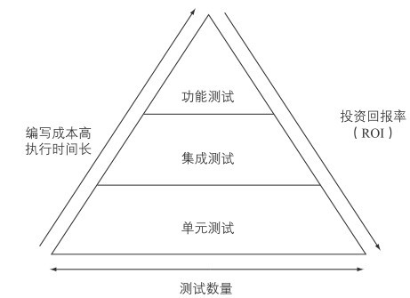
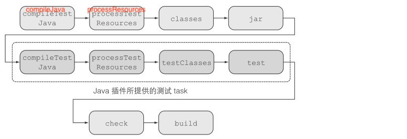

# 测试

## 测试分类
在使用范围、实现难度和执行时间上，自动化测试分为三种类型——单元测试、集成测试和功能测试“

- 单元测试：单元测试与产品代码实现一起作为一个 Task 来执行，目的是测试代码的最小单元。在基于 Java 的项目中，这个单元是一个方法。在单元测试中，你需要避免与其他类或外部系统交互（例如数据库或文件系统）。从被测代码中对其他组件的引用通常通过测试倍数来隔离，它是用于测试目的替换组件（例如存根或模拟）的通用术语。 单元测试易于编写，可快速执行，并在开发过程中提供有关代码正确性的宝贵反馈。

- 集成测试：**集成测试用于测试整个组件或子系统。**  您要确保多个类之间的交互按预期工作。 集成测试的典型方案是验证生产代码与数据库之间的交互。 结果，在测试执行期间必须可以访问相关的子系统，资源和服务。 与单元测试相比，集成测试通常需要更长的时间来执行，并且难以维护，并且故障原因可能更难以诊断。

- 功能测试： **功能测试用于测试应用程序的端到端功能，包括从用户角度来看与所有外部系统的交互。** 当我们谈论用户的观点时，通常指的是用户界面。 功能测试是最难实现和最慢的运行，因为它们需要用户之间的互动。 对于Web应用程序，功能测试工具将需要能够单击链接，将数据输入表单字段或在浏览器窗口中提交表单。 由于用户界面会随着时间变化很大，因此维护功能测试代码可能变得乏味且耗时。

### 权衡

您可能会想知道哪种测试类型最适合您的项目以及在何种程度上进行测试。 在理想的情况下，你可以混合使用这些测试，以确保您的代码可以在不同的架构层级上正常工作。然而，所编写的测试刷领需要花费时间和精力来实现和维护的。 所编写的测试越简单，执行就越快，投资回报率（ROI）越高。 为了提高 ROI，代码库应包含大量单元测试，少量的集成测试和更少的功能测试。 测试分布及其与ROI的相关性最好用测试自动化金字塔来最好地说明，该金字塔由Mike Cohn在他的《敏捷成功：使用Scrum进行软件开发》（Addison Wesley，2009年）一书中介绍。

## 测试

测试代码默认放在单独的目录下，例如 java 测试的 `src/test`, 它可以和产品代码一样拥有目录包结构。

如图，虚线圈中的为测试相关 Task，测试的编译和执行发生在产品代码编译打包之后，但在构建之前。

### 自动化监测运行

测试目录下的哪些类会被自动运行呢？只需要满足下面的条件即可执行：

- Any class or superclass that extends either junit.framework.TestCase or groovy.util.GroovyTestCase.

- Any class or superclass that’s annotated with @RunWith.

- Any class or superclass that contains at least one method annotated with @Test.
(The annotation can either be the JUnit or TestNG implementation.)

## 单元测试

