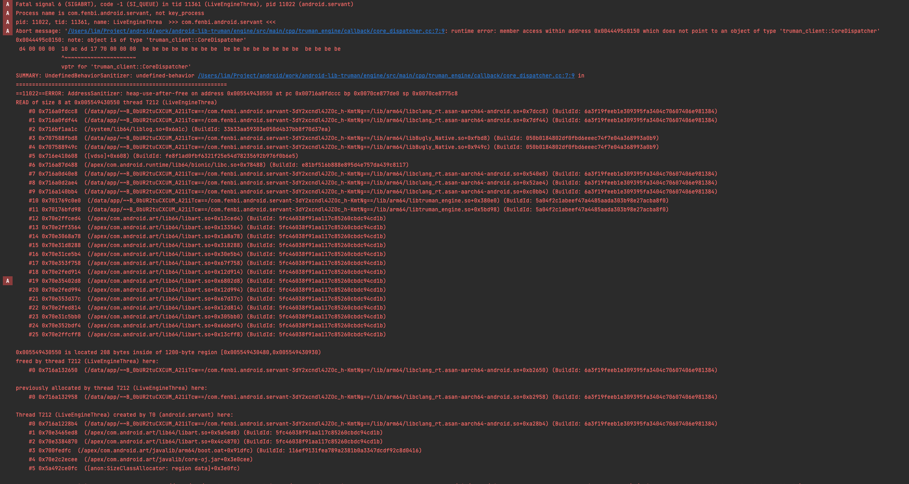

# 崩溃

原生程序的：调试、追踪、分析

## 1. 开发时避免

## 2. 开发后检测

调试、追踪、分析

- HWASan/ASan: 内存泄露。On arm64 we recommend using HWASan, while for 32-bit arm and for non-Arm platforms we recommend using ASan. They provide equivalent functionality and should be used for detecting memory safety bugs in userspace code.
    - 堆栈和堆缓冲区上溢/下溢
    - 释放之后的堆使用情况
    - 超出范围的堆栈使用情况
    - 重复释放/错误释放
- GWP-ASan: `释放后使用` 和 `堆缓冲区溢出` 错误。只能检测到 ASan 的子集，但是因为 GWP-ASan 不会显著降低性能，因此适合在生产环境用使用，而 HWAsan 则仅在测试环境中使用。
    - https://llvm.org/docs/GwpAsan.html
    - https://developer.android.com/ndk/guides/gwp-asan
    - https://source.android.com/docs/security/test/memory-safety/gwp-asan-kfence 在系统进程或应用启动时，随机会有 1% 的系统进程或应用会启用 GWP-ASan。此外，在 AndroidManifest.xml 文件中设置 android:gwpAsanMode 的应用也会启用 GWP-ASan。

- UBSan：许多未定义行为的检查。`数组边界检查`。
    - https://source.android.com/docs/security/test/bounds-sanitizer
    - https://clang.llvm.org/docs/UndefinedBehaviorSanitizer.html

- KAsan: HWASan/ASan 对应的内核调试实现
- KFENCE: GWP-ASan 对应的内核检测工具。
- MTE: ArmV9 才支持，HWAsan 的硬件实现。
- CPU:  Simpleperf

查看 Address Sanitizer 的崩溃报告

计划：

1. 先在咱们的 sdk 中启用，修复完错误。

## 3. 线上监控/上报

tombstone 应用内上报：https://developer.android.com/ndk/guides/debug
- Maloc 分析
    - Malloc debug

    - Malloc hooks

    - Malloc statistics

参考
平台崩溃调试：https://source.android.com/docs/core/tests/debug
    查看系统服务 dumpsys: https://developer.android.com/tools/dumpsys
    native-memory: https://source.android.com/docs/core/tests/debug/native-memory

应用调试和检测：https://developer.android.com/ndk/guides/debug

## 错误信息

错误信息包含三部分：
- 错误信号
- 寄存器信息
- 方法调用栈

## 常见的错误

- 野指针
- 空指针
- 数组越界
- 堆栈溢出
- 内存泄漏
