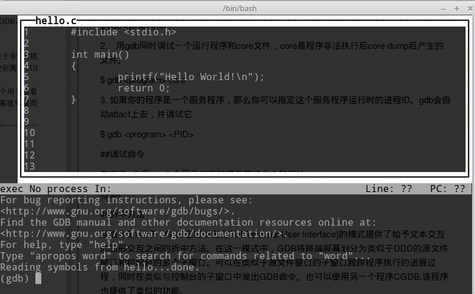
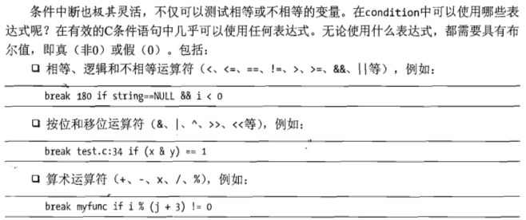
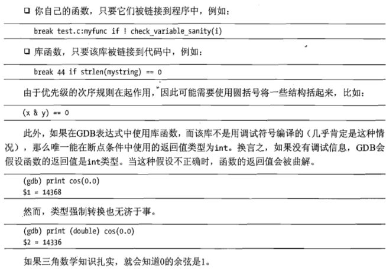
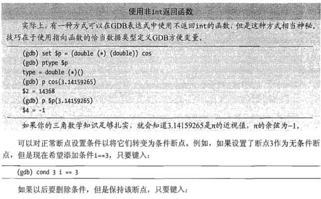
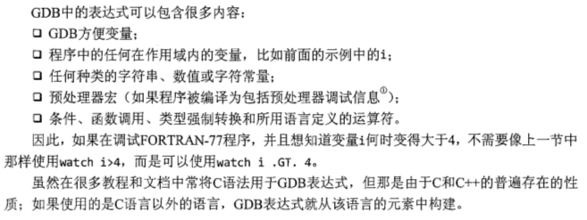
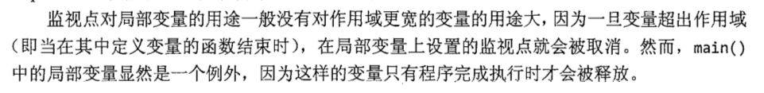
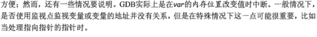
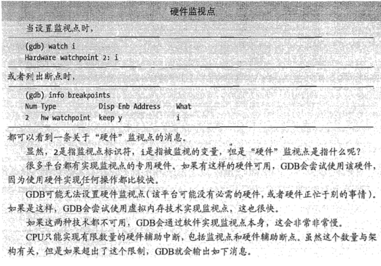
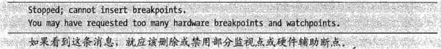

## 启动gdb调试

gdb是文本环境的程序，启动调试的方法有以下几种

1. program 即执行文件的完整路径和名称，如果在当前目录下可以只写文件名

```shell
$ gdb <program>
```

2. 用gdb同时调试一个运行程序和core文件，core是程序非法执行后core dump后产生的文件。
```shell
$ gdb <program> core
```
3. 如果你的程序已经运行，那么你可以指定这个程序运行时的进程ID。gdb会自动attact上去，并调试它
```shell
$ gdb <program> <PID>
```

## 调试命令

在启动 gdb 后，gdb 会显示如下的提示等待命令的下达

(gdb)

> 折中方法

从版本 6.1 以来，GDB 已经以名为TUI(Terminal User Interface)的模式提供了给予文本交互的图形交互之间的折中方法。在这一模式中，GDB将终端屏幕划分为类似于DDD的源文件窗口和控制台的多个子窗口。可以在类似于源文件窗口的子窗口跟踪程序执行的进展过程，同时在类似与控制台的子窗口中发出GDB命令。也可以使用另一个程序 CGDB，该程序也提供了类似的功能。

为了让GDB以TUI模式运行，可以在启动 GDB 时添加 `-tui` 选项，或者处于非 TUI 模式时在GDB中使用  `Ctrl+X+A` 组合键切换到 TUI 模式。如果当前处于 TUI 模式，后一中方式会使你离开 TUI 模式。



TUI 模式将 GDB 划分为两个子窗口 —— 一个用于显示源代码，一个用于输入GDB命令。


使用 `*` 和 `>` 标识断点和当前执行的代码行。

通过使用上下方向键滚动到代码的其他部分。如果没有处于 TUI 模式，就可以使用箭头键来浏览以前的 GDB 命令，从而修改或重复执行这些命令。在TUI中，可以使用 `Ctrl+P` 和`Ctrl+N` 组合键来浏览以前的 GDB 命令。同样，可以使用list 命令更改源代码子窗口中显示的代码区域。再操作多个源文件的情况下非常有用。


## 主要调试工作

#### 运行程序

```
run <arguments list>

r
```
#### 断点

###### 设置断点

gdb 实际设置的断点可能与要求的不一致，gdb 是使用机器指令工作的，使用了符号表后表现出源代码行的错觉。gdb 发现某行代码对于调试没有什么用处时，就会私自往后推一行。当使用优化来编译程序时，这个问题变得更加糟糕。


有两种方法设置断点

１. 使用行号
```
break <[filename:]line_Number>
```

２. 使用函数名
```
break <[filename:]function_name>
```
c++允许函数重载，使用函数名会使所有同名的函数上设置断点。如果要在某个特例上设置断点，只有用行号来指明。

３. 一些特别的参数

使用 `break +offset` 或 `break -offset`，可以再当前选中栈帧中正在执行的源代码行前面或后面设置断点偏移行数。

`break *address` 这种形式可以用来在虚拟内存地址处设置断点。这对于程序没有调试信息的部分（比如当源代码不可用时，或者对于共享库）是必须的。


###### 临时断点

临时断点的格式和断点完全一样，使用 `tbreak` 命令，在首次到达后就被自动删除。


###### 捕获点

catch

#### 条件断点

```
break break-args if (dondition)
```
break-args 即为 break 命令中的任何断点位置的参数。

condition 是布尔表达式。包括 condition 的圆括号是可选的。




```
(gdb) cond 3
```


#### 断点命令列表

当 gdb 遇到断点时，几乎总要查看某个变量，如果反复遇到同一个断点（与循环内的断点一样），将反复查看相同的变量，让 gdb 再每次到达某个断点就自动执行一组命令，自动完成这一过程，不是更好吗？

###### 使用 commands 命令设置列表
```
commands breakpoint_number

[...]

commands

[...]

end
```

如果要修改断点的命令集，就要重新设置该断点的指令集。或者重新定义一个空集合来取消该命令集。

```
commands 1

end
```

###### 安静的触发断点

每次触发断点时，gdb都会详细输出断点信息，当我们清楚知道断点的位置，并且关心断点命令列表的打印输出时，希望不要有这些断点信息。这时可以再断点命令列表的第一行添加silent命令:
```
silent
```

####监视点

监视点是一种特殊的断点，它不像普通断点住在某一行代码处，而是监视当某个表达式改变了值就暂停执行。该表达式可以很简单，例如变量的名称：
```
(gdb) watch i
```
表达式也可以很复杂：
```
(gdb) watch (i|j > 12) && i > 24 && strlen(name) > 6
```
c语言有严格的作用域规则，所以只能监视存在且在作用域内的变量。只有到达变量的作用域后才能设置该变量的监视点。一旦变量不再存在于调用栈的任何栈帧中，gdb就会自动删除监视点。

###### 设置监视点
```
watch var
```
监视点结合了断点和变量检查的概念。最基本形式的监视点通知调试器，每当指定变量的值发生变化是都暂停程序的执行。

１. 例如，在程序执行期间，假设要在变量z值改变值时查看程序的状态。再gdb中可以至新高如下命令
```
watch z
```
２. 设置条件表达式监视点，例如，要查找程序执行期间z的值大于28的第一个位置，可以使用表达式。DDD中只能通过控制太提交命令才能使用表达式。
```
watch (z > 28)
```






###### 删除断点

```
clear //清除gdb将执行的下一个指令出的断点。这种方法适用于要删除要删除gdb已经到达的断点的情况

clear function
clear filename:function
clear line_number
clear filename:number //根据位置清除断点
```
工作方式与对应的 break 相似

```
delete <breakpoint_list>

delete 1 3 4　//断电好为１，３，４的，不分监视点还是捕获点

delete //删除所有断点。
```
除非执行也可以放在 .gdbinit 启动文件中的 `set fonfirm off` 命令，否则gdb会要求确认删除操作。

可以看到 delete 只能使用断点号，而clear 既能使用断点号又能使用方法名。

###### 禁用断点
```
disable breakpoint_list
```
不带任何参数禁用所有断点

###### 启动断点
```
enable breakpoint_list
```
不带任何参数起用所有断点
```
enable once breakpoint_list //仅启用一次，在中断过一次之后被禁用
```

#### 断点属性

每个断点都有各种属性 —— 行号、加在断点上的条件（如果有的话）、当前引用／启动状态等。

###### 查看存在的断点
```
info break[points]=i b
```
获取所有断点的清单，以及它们的属性。


标识符Num:断点的唯一标识符

类型Type:断点、监视点或是捕获点

部署Disp:指示断点下次引起gdb停止后该断点上会发生什么事情。可能的部署有以下三种。

    保持keep:下次中断后不改变断点。这是新建断点的默认部署。

    删除del:下次到达该断点后删除。使用tbreak创建的断点都是这样的。

    禁用dis:下次到达断点后会禁用。这是使用enable once设置的断点。

启动状态Enb:断点当前是启用还是禁用。

地址Address:内存中设置断点的位置。它主要用于汇编语言，或者试图调试没有用        扩充的符号表变异的科执行文件的人。

位置What:显示了断点所在源代码中的行号和文件名。对于监视点，这个字段表示正在监视哪个变量。便利那个实际是带名称的内存地址，而内存地址则是一个位置。

另外，对于引起停止过的断点还提供了停止次数。如果该断点在循环中，则能马上看出循环过的次数。

####恢复执行

三类：

单步：step,next

断点：continue

条件：finish,until

######单步调试

n(或next) [num] 命令让程序执行一行，遇到函数直接执行完整个函数才暂停。

s(step) [num] 与next类似，只是在函数调用时step命令会进入函数。

######恢复操作

continue　[num]通知调试器恢复执行并继续，直到遇到断点为止。=c.num表示要求gdb忽略下面num个断点。

######跳出函数

finish恢复执行，(在没有中间断点时）只到恰好在当前栈帧完成之后为止，也就是说，当在一个函数中时，finish使gdb恢复执行，直到恰好在函数返回之后停止。如果是递归函数，finish只会将你带到递归的上一层。因为每次函数调用都有自己的栈帧。=fin

######完成循环

until=u（在没有断点的情况下）执行循环的其余部分，让gdb在循环后面的第一行代码处暂停。


如果你比较好奇，而且懂得机器的汇编语言，则可以使用gdb的disassembal命令，后面跟着p/x $pc来输出当前位置，（也可以使用gcc的-s徐哪像来查看机器指令。使用该选项会产生一个后缀为.s的汇编语言文件，其中显示了编译器产生的机器码。这样只会产生汇编文件而不会产生可执行文件。）这样可以显示until将做的事情。如果再循环的末尾执行until命令导致回到循环顶部，这时只要再次执行until就可以离开当前的循环。


##检查变量

如果发现某个变量有一个出乎意料的值，往往是找出某个程序错误的位置和性质的重要线索。

######查看变量的当前值

print <变量名/数组名> = p

输出完整的数据结构

p *指针名

十六进制格式查看变量的地址

p/x &变量名

######查看制定地址的值

x命令查看制定地址的值

x 0x6000c8

######每次有暂停自动输出指定条目

display bar = disp

只有当变量在作用域中时，才会将显示列表中的变量显示出来。

print和display命令允许制定可选的格式。例如：

p/x y

会以十六进制格式显示变量，其他常用格式为c表示字符(character),s表示字符串(string),f表示浮点数(floating-point)。

可以临时禁用某个显示项

dis disp 1

如果不知道条目号，可以通过info disp命令查看。要重新启用条目使用enable,例如：

enable disp 1

如果要完全删除显示的条目，使用undisplay,例如：

undisp 1

######检查栈帧中的局部变量


######调用程序函数显示

call function(arguments)

事实上gdb可以调用程序中的任何函数来，甚至可以在监视点的条件表达式中调用函数。


cond表示condtion


######检查动态数组

p(print)命令可以输出整个静态数组的值，但对于动态数组，如指针x指向malloc申请的数组。

p *x

只能输出x[0]，当然可以在命令中使用p x[5]输出单个元素值。但显然输出整个数组更加方便。

gdb通过创建人工数组来(artificial array)解决这个问题。一般形式为：

*pointer@number_of_elements

因此如果x有25个长度，要输出整个x数组:

p *x@25

gdb还允许在适当的时候使用强制类型转换，比如：

p (int [25])*x

两种方法都能达到显示整个数组的效果。

######查看数据结构定义

ptype 变量

可以很方便地浏览类或结构体的结构。

######监视局部变量

info locals命令得到当前栈帧中所有局部变量的值列表。

######直接检查内存


##设置变量

在某些情况下，再单步调试过程中设置变量的值是有用的。这样可以回答假设某个程序错误的各种来源的产生的诸如“如果...将会怎么样”的问题。

######设置

set x = 12将当前x的值改为12.


##gdb自己的变量

####使用值历史


####方便变量

##栈帧

在函数调用期间，与调用关联的运行时信息存储在称为栈帧(stack fram)的内存区域中。帧中包含函数的局部变量的值、形参以及调用该函数位置记录。每次发生函数调用时，都会创建一个新帧，并将其推到一个系统维护的栈上；栈最上方表示当ｉａｎ正在执行的函数，当函数退出时，这个帧被弹出栈，并且被释放。

例如，再insert()函数中暂停示例程序insert_short的执行。当前栈帧中的数据会指出，你通过你个恰好位于process_data()函数（该函数调用inert()）中的特定位置进行的函数调用到达了这个帧。这个帧也会存储存储insert()的唯一局部变量的当前值，稍后你会发现这个值为j.

其他活动函数地啊用的栈帧将包含类似的信息，如果你愿意，也可以查看它们。例如，尽管程序执行当前位于insert()内，但是你也可能希望查看调用栈中以前的帧，几查看process_data()的帧。在gdb中可以用如下命令查看以前的帧。

######上下移动调用栈

frame 1

当执行GDB的frame命令时，当前正在执行的函数的帧被编号为０，其父帧被编号为１，父帧的父帧被编号为２，以此类推。gdb的up命令将你带到地啊用中的下一个父帧（例如从帧０到帧１），down则引向相反方向。这样的操作非常有用，因为根据以前的一部分栈帧中的局部变量的值，可能发现一些引起程序错误的代码的线索。

GDB的backgrace命令会显示整个栈，即当前存在的左右栈的集合。

*在程序崩溃时，这通常很有用，因为你可以通过一些调试方法很快找到崩溃点，但是，如果由于传入的参数错误，是在一个库函数内部引起程序奔溃通常使问题变得复杂，我们无法查看库函数的代码，此时的想法是要是能回到该库函数调用之前，就可以验证函数调用的参数是否正确，frame 1能够很好的实现。

##联机帮助

在gdb中可以通过help命令访问文档。例如

help breakpoints

急那个显示关于断点的文档。不带参数的GDB命令help提供一个可以用来作为help的参数的类别菜单。

在DDD和eclipse中，可以单击Help获取大量信息。

##启动文件的使用

启动文件可以用于保存断点和调试状态，每次启动gdb自动加载它。该文件名为.gdbinit。可以将一个文件放在主目录用于一般用途，另一个文件包含在该项目中用于特殊用途。

如果已经启动gdb，但是修改了.gdbinit 可以使用sources ~/.gdbinti重新加载该启动文件。


##宏


##启用core文件调试

gdb program core

可以看到是哪个程序生成了core文件，以便确认调用了正确的core文件，还有segment　falt信息，

Core was generated by `./cstring'.

Program terminated with signal SIGSEGV, Segmentation fault.

0  __strncpy_ssse3 () at ../sysdeps/x86_64/multiarch/strcpy-ssse3.S:2415

2415	../sysdeps/x86_64/multiarch/strcpy-ssse3.S: No such file or directory.

######bt表示backtrace通说core文件回溯程序崩溃信息。

(gdb) backtrace

0  __strncpy_ssse3 () at ../sysdeps/x86_64/multiarch/strcpy-ssse3.S:2415

1  0x00000000004006b2 in Init_CString (str=0x4008e8 "Hello!") at cstring.c:16

2  0x00000000004007bb in main () at cstring.c:57

根据回溯信息，我们能够很容易的发现在第１６行的Init_CString()中，是在调用ctrncpy()期间发生的。设置不用仔细检查代码，我们可以猜测很可能是项strncpy传递了一个NULL指针。