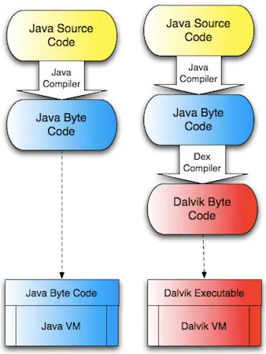
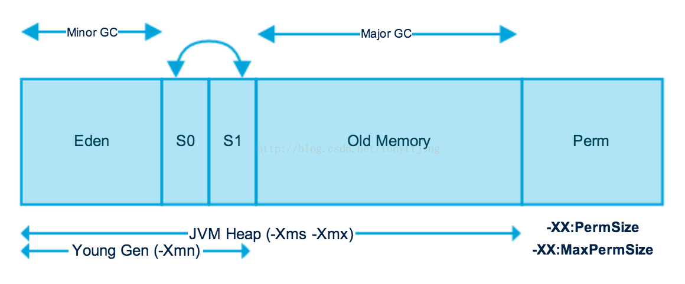

# JVM

> JVM 有什么用？

1. 排查解决一些内存移除和泄露

2. 可以让我们写出更高质量的代码

Android 最开始用的是 Dalvik，Dalvik虚拟机是基于apache的java虚拟机，并被改进以适应低内存，低处理器速度的移动设备环境。而 4.4 及之后开始使用 ART 虚拟机。两者对比有：

优点：

JVM和Dalvik工作流程：

> JVM和DVM区别：

| Java虚拟机 |  Dalvik虚拟机 |
| ---- | --- |
| `java` 虚拟机基于栈，基于栈的机器必须使用指令来载入和操作栈上数据 | `Dalvik` 虚拟机基于寄存器 |
| `java` 虚拟机运行的是 `java` 字节码。（java 类会被编译成一个或多个字节码 `.class` 文件，打包到 `.jar` 文件中，`java` 虚拟机从相应的  `.jar` 包中读取　`.class` 文件获取字节码） | `Dalvik` 运行的是自己专属的 `.dex` 字节码格式。（`java` 类被编译成 `.class` 文件后，会通过一个 `dx` 工具将所有的 `.class` 文件转换成一个 `.dex` 文件，然后 `dalvik` 虚拟机会从其中读取指令和数据） |
| -	| 一个应用对应一个 `Diavik` 虚拟机实例，独立运行 |
| `JVM` 在运行的时候为每一个类装载字节码 | `Dalvik` 程序包含一个或多个 `.dex` 文件，这个文件包含了程序中所有的类 |

> Dalvik　与　Art（Android Runtime）的区别：

- Dalvik 每次运行的时候，字节码都需要通过即时编译器（just in time ，JIT）转换为机器码，这会拖慢应用的运行效率，Art 只会首次启动编译

- Art占用空间比Dalvik大（原生代码占用的存储空间更大），就是用“空间换时间”

- Art减少编译，减少了CPU使用频率，使用明显改善电池续航

- Art应用启动更快、运行更快、体验更流畅、触感反馈更及时

## GC

GVM 使用的是　Hotspot 算法。

GC 完成了３件事

1. 确定哪些内存需要回收
2. 什么时候进行 GC
3. 如何执行 GC。

### 1. 确定那些对象可以回收

1. 引用计数法

不能解决循环引用的问题

2. 可达性分析: 从根对象集合进行搜索，对象不可达的话，就属于垃圾对象。根集合有：
    - java栈中的引用对象
    - 本地方法栈中JNI的引用对象
    - 方法区中运行常量池中的引用对象
    - 方法区中静态属性引用的对象
    - 运行中的线程
    - 由引导类加载器加载的对象
    - GC控制的对象。
    总之，JVM在做垃圾回收的时候，会检查堆中的所有对象是否被这些根集中的对象所引用，不能够被引用的对象就会被垃圾回收器回收。

### 3. 回收算法有

回收垃圾的算法有：

#### 1.标记--清除（mark--sweep）：

算法和名字一样分为两个阶段：标记和清除。标记所有需要回收的对象，之后统一回收。这是最基础的算法，后续的回收算法都是基于这个算法扩展的。

不足：效率低，标记清除之后会产生大量碎片。

#### 2.复制（copying）：

此算法把内存空间划分为两个相等的区域，每次只使用其中的一个区域。垃圾回收时，遍历当前使用区域的所有对象，将正在使用中的对象复制到另一个区域。此算法每次只处理使用中的对象，因此复制成本比较小，同时复制过去之后还能进行相应的内存整理，所以不会出现碎片问题。

不足：缺点也很明显就是需要两倍的内存空间。以空间换取时间。

#### 3.标记--整理（mark--compact）:

此算法结合了标记--清除和复制的有点，也是分两个阶段，第一阶段是从根节点遍历所有对象标记所有能被引用的对象，第二阶段遍历整个堆中的对象，清除所有未被标记的对象，并把所有存活对象“压缩”到堆的其中一块，按顺序排放。此算法避免了“标记--清除”的碎片问题，也没有“复制”的空间问题。

#### 分代回收算法

- 年轻代：是所有新对象产生的地方。年轻代被分为3个部分——Enden区和两个Survivor区（From和to）当Eden区被对象填满时，就会执行Minor GC。并把所有存活下来的对象转移到其中一个survivor区（假设为from区）。Minor GC同样会检查存活下来的对象，并把它们转移到另一个survivor区（假设为to区）。这样在一段时间内，总会有一个空的survivor区。经过多次GC周期后，仍然存活下来的对象会被转移到年老代内存空间。通常这是在年轻代有资格提升到年老代前通过设定年龄阈值来完成的。需要注意，Survivor的两个区是对称的，没先后关系，from和to是相对的。

- 年老代：在年轻代中经历了N次回收后仍然没有被清除的对象，就会被放到年老代中，可以说他们都是久经沙场而不亡的一代，都是生命周期较长的对象。对于年老代和永久代，就不能再采用像年轻代中那样搬移腾挪的回收算法，因为那些对于这些回收战场上的老兵来说是小儿科。通常会在老年代内存被占满时将会触发Full GC,回收整个堆内存。

- 持久代：用于存放静态文件，比如java类、方法等。持久代对垃圾回收没有显著的影响。

我这里之所以最后讲分代，是因为分代里涉及了前面几种算法。年轻代：涉及了复制算法；年老代：涉及了“标记-整理（Mark-Sweep）”的算法。 

https://www.cnblogs.com/luohanguo/p/9469851.html
