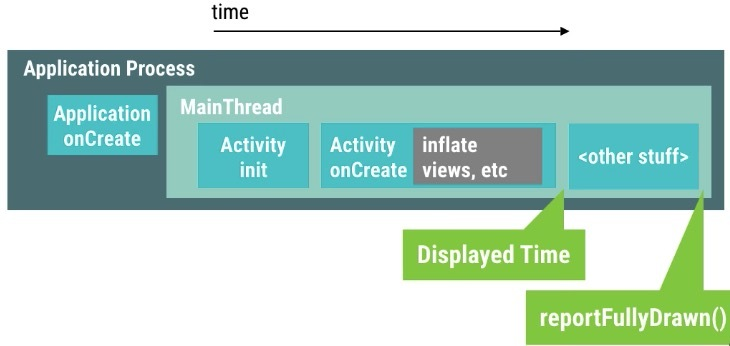

# 如何测量

启动速度优化的方法和卡顿优化基本相同，不过因为启动实在是太重要了，我们会更加“精打细算”。我们希望启动期间加载的每个功能和业务都是必须的，它们的实现都是经过“千锤百炼”的，特别是在中低端机上面的表现。

冷启动、温启动、热启动。
## Cold Start

冷启动是在 app 完全杀死的情况下，点击桌面图标到第一屏能够显示的时间，这其中包括：

1. 用户点击 icon
2. 系统开始加载和启动应用
3. 应用启动：开启空白(黑色)窗口
4. 创建应用进程
5. 初始化Application
6. 启动 UI 线程
7. 创建第一个 Activity
8. 解析(Inflater)和加载内容视图
9. 布局(Layout)
10. 绘制(Draw)

其中在 3 ~ 10 之间会形成短暂的空白屏，一般的做法是在app的主题中增加一个北京图，使其在 3 这个地方就能显示。从而使空白屏不那么难看。


## 测量工具

- Traceview 性能损耗太大，得出的结果并不真实；
- Nanoscope 非常真实，不过暂时只支持 Nexus 6P 和 x86 模拟器，无法针对中低端机做测试；
- Simpleperf 的火焰图并不适合做启动流程分析；
- systrace 可以很方便地追踪关键系统调用的耗时情况，但是不支持应用程序代码的耗时分析。
- adb 只能统计粗略的启动时间，过程之间的数据没有。用于估计整体的时间消耗以及用于优化后统计时间对比。
    2. 只能统计某个 Activity 启动的时间，不能细化到某个函数，或者几个函数的定制统计。
    3. 只能测量某个 Activity 的启动，如果有启动页等流程，无法正常得到几个 Activity 的启动数据。
    4. 使用在 Manifest 中声明了 `android:exported="true"` 的 activity 才能启动。

### adb 粗略统计

```shell
adb shell am start -W <app id>/<package>.<Activity name>
```
app id 即 build.gradle 声明的 id，一般是和应用包名相同的，但也有特别的不相同。当其和包名相同时，`/` 后面的包名可以省略掉相同的部分，同时以 `.` 开头。否则不能省略。

如，相同时
```shell
adb shell am start -W com.yiliao/.ui.home.MainActivity

# activity 的完整路径是 com.yiliao.ui.home.MainActivity
```

不同时
```shell
adb shell am start -W com.yiliao/com.demo.ui.home.MainActivity
# app id 是 com.yiliao, 包名是 com.demo
```

```
Starting: Intent { act=android.intent.action.MAIN cat=[android.intent.category.LAUNCHER] cmp=<你的 Activity 路径> }
Status: ok
LaunchState: COLD
Activity: com.fenbi.android.yixue/com.fenbi.android.module.home.HomeActivity
TotalTime: 4694
WaitTime: 4698
```
注意Android 5.0 之前的手机是没有WaitTime这个值的。关于ThisTime/TotalTime/WaitTime的区别,下面是其解释。WaitTime=endTime-startTime

- startTime记录的刚准备调用startActivityAndWait()的时间点

- endTime记录的是startActivityAndWait()函数调用返回的时间点

- WaitTime = startActivityAndWait()调用耗时。

WaitTime 就是总的耗时，包括前一个应用Activity pause 的时间和新应用启动的时间；ThisTime 表示一连串启动Activity 的最后一个 Activity 的启动耗时；TotalTime表示新应用启动的耗时，包括新进程的启动和 Activity 的启动，但不包括前一个应用Activity pause 的耗时。也就是说，开发者一般只要关心 TotalTime 即可，这个时间才是自己应用真正启动的耗时。

该方法算出的时间是系统从开始处理启动activity的时间到完成运行layout和draw函数的时间，简单的理解就是启动这个Activity的时间，并不包括点击icon到系统接收到消息的时间。显然，这个时间并不能完整的模拟用户操作场景的启动时间。其次该方法只计算一个Activity的整体启动时间，没有分别统计其中每个函数的时间，不便于定位问题。针对这两个问题，我们接下来看一下下面两个方法是怎样解决的。

通过 adb 启动有一个明显的缺点，就是一旦有多个启动页，很难估计多个从启动页到主页启动的时间。

### Display Time

从API19之后，Android在系统Log中增加了Display的Log信息，通过过滤ActivityManager（9.0 之后变成了 ActivityTaskManager）以及Displayed 这两个关键字，可以找到系统中的这个Log：

```shell
$ adb logcat | grep ActivityTaskManager

```
```shell
ActivityTaskManager: Displayed com.yaowen/com.yaowen.ui.WelcomeActivity: +4s229ms
```

实际上是Activity启动，到Layout全部显示的过程，但是要注意，这里并不包括数据的加载后显示给用户的时间。

为了监控实际用户能够操作的时间，系统留了一个 `Activity.reportFullyDrawn()` 方法，共我们自己调用。日子会自动计算并打印耗时。



### Screen Record

在API21+，Android给我们提供了一个更加方便、准确的方式：录屏。

```shell
adb shell screenrecord --bugreport /sdcard/test.mp4
```
`--bugreport` 会使该指令在屏幕的左上角打印出时间

例如显示的是：15:31:22.261 f=171(0)
其中，前面的4个数字，就是时间戳，即15点31分22秒261，f=后面的数字是当前的帧数，
注意，不是帧率，而是代表当前是第几帧，括号中的数字，
代表的是『Dropped frames count』，即掉帧数。


## 现有的做法

许多厂商为了增加品牌宣传，会单独使用一个页面作为启动屏（Splash），用于品牌宣传和广告。

但是，广泛形成的共识是，启动页并不能增加用户体验，反而会影响用户的体验。除非你是一个广告商为了靠启动页赚取利润，否则不要使用启动屏。为此有了一系列的优化问题。

we should avoid using Splash Screens on Android, arguing that they hurt the user experience, increase the size of the application, etc.

1. 使用启动屏，从第一个页面向第二个页面的跳转也会增加大约 300ms 的时间。


## 影响冷启动时间的因素

1. 应用的功能越复杂
2. 使用了重写的 Application 类，用于初始化用户分析和错误上报。


## 优化方向

1. 珍惜主题背景
2. 减少甚至避免在 application 中和第一屏之前舒适化任何
3. 数据本地化，优先显示本地数据，加载网络后，再更新本地数据和页面。

### 珍惜主题背景

1. 主题背景设置为和第一页一样的颜色
2. 使用 `<layer-list>` 作为占位符
3. 如果首页有占位图片，将其放到 `<layer-list>` 中，使其在 app 启动时就能加载到内存中，从而减少在第一屏显示时，从外存加载的时间。 23 开始能够使用 svg 图，之前必须使用 png 图。

### 避免在 Application 中初始化数据

### 第一屏优先显示本地数据

数据本地化

详细可查看。

http://saulmm.github.io/avoding-android-cold-starts
