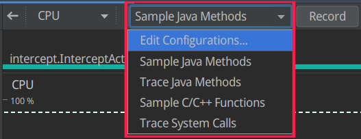

# CPU Profile

优化应用程序的CPU使用率具有许多优势，例如，提供更快，更流畅的用户体验以及节省设备电池寿命。

您可以使用CPU Profiler实时检查在与应用程序交互时应用程序的CPU使用率和线程活动，CPU profile 提供了四种类型的检测方法来追踪方法（Java）/函数(C/C++)，系统跟踪数据信息。

- 方法/函数跟踪(前三个): 用户 app 中线程的每个函数消耗的 CPU 资源(执行时长)，以此来优化避免不必要的工作。
    - Java 方法可以选择使用 `采样` 或 `追踪`。
        - Sample Java Methods（采样）：基于频繁采集的调用堆栈对比推导出代码的执行时间和资源使用。很明显，采样有一个问题，如果一个方法执行时间如此之短，恰好在两次采样之间执行完了，就无法记录下该方法的执行。
        - Traceinstrumented Java Methods(追踪):在运行时检测应用，以在每个方法调用开始和结束时记录一个时间戳。系统会收集并比较这些时间戳，以生成方法跟踪数据，包括时间信息和 CPU 使用率。
        追踪方法也有明显的问题，检测每个方法的开销会影响性能，对于执行时长较短的方法更加明显。此外，如果短时间内执行大量的方法，分析器可能很快超出文件大小限制。
    - C++ 只能采样，并且要使用 8.0 及以上的系统。其底层使用的是 `simpleperf` 工具，如果要为 simpleperf 指定其他选项，如对特定设备 CPU 采样或指定高精度采样持续时间，您可以从命令行使用 simpleperf。

- Trace System Call(跟踪系统调用): 捕获精细的详细信息，以便您检查应用与系统资源的交互情况。可以检查线程状态的确切时间和持续时间、直观地查看所有内核的 CPU 瓶颈在何处，并添加要分析的自定义跟踪事件。 当您排查性能问题时，此类信息至关重要。要使用此配置，您必须将应用部署到搭载 Android 7.0（API 级别 24）或更高版本的设备上。

使用此跟踪配置时，您可以通过检测代码，在分析器时间轴上直观地标记重要的代码例程。要检测 C/C++ 代码，请使用由 trace.h 提供的原生跟踪 API。要检测 Java 代码，请使用 Trace 类。如需了解详情，请参阅检测您的应用代码。

此跟踪配置在 systrace 的基础上构建而成。您可以使用 systrace 命令行实用程序指定除 CPU Profiler 提供的选项之外的其他选项。systrace 提供的其他系统级数据可帮助您检查原生系统进程并排查丢帧或帧延迟问题。

在搭载 Android 9（API 级别 28）或更高版本的设备上，您可以使用一个名为“系统跟踪”的系统应用来记录设备上的系统跟踪数据。

使用此跟踪配置时，您可以通过检测代码，在分析器时间轴上直观地标记重要的代码例程。要检测 C/C++ 代码，请使用由 trace.h 提供的原生跟踪 API。要检测 Java 代码，请使用 Trace 类。如需了解详情，请参阅检测您的应用代码。

Debug 应该与用于开始和停止 CPU 活动记录的其他方法（如 CPU Profiler 图形界面中的按钮，以及在应用启动时执行的自动记录的记录配置中的设置）分开使用。

此跟踪配置在 systrace 的基础上构建而成。您可以使用 systrace 命令行实用程序指定除 CPU Profiler 提供的选项之外的其他选项。systrace 提供的其他系统级数据可帮助您检查原生系统进程并排查丢帧或帧延迟问题。

