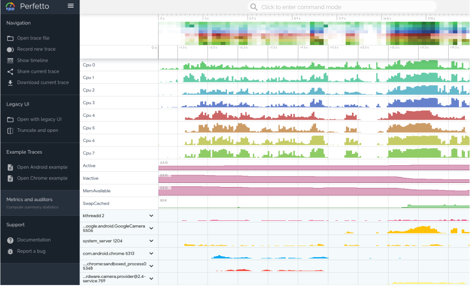

# 系统追踪

记录设备短时间内的活动被称为系统跟踪。通过系统生成的一个跟踪文件，可用于生成系统报告。此报告可帮助您确定如何最好地改善应用或游戏的性能。

Android平台提供了多种捕获跟踪的选项：

- Android Studio CPU Profile

- System Tracing 应用

- Systrace命令行工具 

- Perfetto命令行工具

后面三个可以配合使用

- 当与应用进行交互时，Android Studio CPU profile 能够实时检查应用的CPU使用情况和线程状态。 还可以在函数/方法跟踪，系统跟踪记录中查看详细信息。
- System Tracing 应用是一个Android工具，可将设备活动保存到跟踪文件中。 在运行Android 10（API级别29）或更高版本的设备上，跟踪文件以Perfetto格式保存（请参见下文）。 在运行Android早期版本的设备上，跟踪文件以Systrace格式保存。

- Systrace 是安卓平台早期遗留下来的命令行工具，可将设备在短时间内的活动记录在压缩的文本文件中。 该工具将来自 Android 内核的数据，例如CPU调度程序，磁盘活动和应用程序线程合并，生成报告。

- Perfetto 是Android 10 中新引入的的平台级的跟踪工具，它是针对Android，Linux 和 Chrome 的更通用，更精细的开源追踪项目。 与Systrace相比，它提供了数据源的超集，并允许以原始编码的二进制流来记录任意时长的追踪数据。 然后在Perfetto UI中打开这些跟踪。

两种报告都提供了一定时间段内Android设备的系统进程的总体情况。该报告还检查捕获的跟踪信息，以高亮显示它检测到的问题，例如UI垃圾或高功耗。

Perfetto和Systrace是可互操作的：

- Perfetto UI中使用旧版 Systrace 查看器可以打开Systrace文件（使用“Open with legacy UI”功能）。

- 使用 `traceconv` 工具将 `Perfetto` 跟踪转换为传统的`Systrace` 文本格式。

**注意：Systrace 和 Perfetto 不会收集有关应用程序运行中代码执行的详细信息。 有关您的应用正在执行哪些方法以及正在使用多少CPU资源的更多详细信息，请使用 Android Studio 中的CPU profile。**

- [使用 CPU Profile 分析应用的CPU使用率和线程活动](cpu_profile.md)

- []