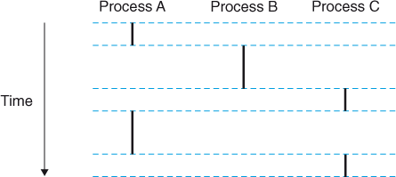
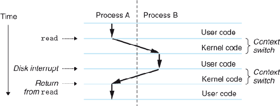

# 实现方式

2. Process 实现（机制）
    1. 机制和策略
    2. 上下文切换
    3. 时钟中断 
    4. 系统调用
```
TIP: SEPARATE POLICY AND MECHANISM
In many operating systems, a common design paradigm is to separate
high-level policies from their low-level mechanisms [L+75]. You can
think of the mechanism as providing the answer to a how question about
a system; for example, how does an operating system perform a context
switch? The policy provides the answer to a which question; for example,
which process should the operating system run right now? Separating the
two allows one easily to change policies without having to rethink the
mechanism and is thus a form of modularity, a general software design
principle.
```

## Processor illusion

```
     THE CRUX OF THE PROBLEM:
HOW TO PROVIDE THE ILLUSION OF MANY CPUS?
Although there are only a few physical CPUs available, how can the OS provide the illusion of a nearly-endless supply of said CPUs?
```

The OS creates this illusion by virtualizing the CPU. By running one process, then stopping it and running another, and so forth, the OS can promote the illusion that many virtual CPUs exist when in fact there is only one physical CPU (or a few). This basic technique, known as time sharing of the CPU, allows users to run as many concurrent processes as they would like; the potential cost is performance, as each will run more slowly if the CPU(s) must be shared.



Each process executes a portion of its flow and then is preempted (temporarily suspended) while other processes take their turns. To a program running in the context of one of these processes, it appears to have exclusive use of the processor. The only evidence to the contrary is that if we were to precisely measure the elapsed time of each instruction, we would notice that the CPU appears to periodically stall between the execution of some of the instructions in our program. However, each time the processor stalls, it subsequently resumes execution of our program without any change to the contents of the program's memory locations or registers.

```
TIP: USE TIME SHARING (AND SPACE SHARING)
Time sharing is a basic technique used by an OS to share a resource. By
allowing the resource to be used for a little while by one entity, and then
a little while by another, and so forth, the resource in question (e.g., the
CPU, or a network link) can be shared by many. The counterpart of time
sharing is space sharing, where a resource is divided (in space) among
those who wish to use it. For example, disk space is naturally a spaceshared resource; once a block is assigned to a file, it is normally not assigned to another file until the user deletes the original file.
```

To implement virtualization of the CPU, and to implement it well, the
OS will need both some low-level machinery and some high-level intelligence. We call the low-level machinery mechanisms; mechanisms
are low-level methods or protocols that implement a needed piece of
functionality. For example, we’ll learn later how to implement a `context switch`, which gives the OS the ability to stop running one program and
start running another on a given CPU; this time-sharing mechanism is
employed by all modern OSes.
On top of these mechanisms resides some of the intelligence in the
OS, in the form of policies. Policies are algorithms for making some
kind of decision within the OS. For example, given a number of possible programs to run on a CPU, which program should the OS run? A
scheduling policy in the OS will make this decision, likely using historical information (e.g., which program has run more over the last minute?),
workload knowledge (e.g., what types of programs are run), and performance metrics (e.g., is the system optimizing for interactive performance,
or throughput?) to make its decision.


## Context


The kernel maintains a context for each process. The context is the state that the kernel needs to restart a preempted process. It consists of the values of objects such as the general-purpose registers, the floating-point registers, the program counter, user's stack, status registers, kernel's stack, and various kernel data structures such as a page table that characterizes the address space, a process table that contains information about the current process, and a file table that contains information about the files that the process has opened.

At certain points during the execution of a process, the kernel can decide to preempt the current process and restart a previously preempted process. This decision is known as scheduling and is handled by code in the kernel, called the scheduler. When the kernel selects a new process to run, we say that the kernel has scheduled that process. After the kernel has scheduled a new process to run, it preempts the current process and transfers control to the new process using a mechanism called a context switch that (1) saves the context of the current process, (2) restores the saved context of some previously preempted process, and (3) passes control to this newly restored process.

A context switch can occur while the kernel is executing a system call on behalf of the user. If the system call blocks because it is waiting for some event to occur, then the kernel can put the current process to sleep and switch to another process. For example, if a read system call requires a disk access, the kernel can opt to perform a context switch and run another process instead of waiting for the data to arrive from the disk. Another example is the sleep system call, which is an explicit request to put the calling process to sleep. In general, even if a system call does not block, the kernel can decide to perform a context switch rather than return control to the calling process.
A context switch can also occur as a result of an interrupt. For example, all systems have some mechanism for generating periodic timer interrupts, typically every 1 ms or 10 ms. Each time a timer interrupt occurs, the kernel can decide that the current process has run long enough and switch to a new process.



The disk will take a relatively long time to fetch the data (on the order of tens of milliseconds), so instead of waiting and doing nothing in the interim, the kernel performs a context switch from process A to B. 

To understand what constitutes a process, we thus have to understand its machine state: what a program can read or update when it is running. At any given time, what parts of the machine are important to the execution of this program?

One obvious component of machine state that comprises a process is its memory. Instructions lie in memory; the data that the running program reads and writes sits in memory as well. Thus the memory that the process can address (called its address space) is part of the process.

Also part of the process’s machine state are registers; many instructions explicitly read or update registers and thus clearly they are important to the execution of the process.

Note that there are some particularly special registers that form part of this machine state. For example, the program counter (PC) (sometimes called the instruction pointer or IP) tells us which instruction of the program will execute next; similarly a stack pointer and associated frame pointer are used to manage the stack for function parameters, local variables, and return addresses.

Finally, programs often access persistent storage devices too. Such I/O
information might include a list of the files the process currently has open.


```
ASIDE: HOW LONG CONTEXT SWITCHES TAKE
A natural question you might have is: how long does something like a
context switch take? Or even a system call? For those of you that are curious, there is a tool called lmbench [MS96] that measures exactly those
things, as well as a few other performance measures that might be relevant.
Results have improved quite a bit over time, roughly tracking processor
performance. For example, in 1996 running Linux 1.3.37 on a 200-MHz
P6 CPU, system calls took roughly 4 microseconds, and a context switch
roughly 6 microseconds [MS96]. Modern systems perform almost an order of magnitude better, with sub-microsecond results on systems with 2- or 3-GHz processors.
It should be noted that not all operating-system actions track CPU performance. As Ousterhout observed, many OS operations are memory intensive, and memory bandwidth has not improved as dramatically as
processor speed over time [O90]. Thus, depending on your workload,
buying the latest and greatest p
```

millisecond (ms 毫秒
microsecond  μs 微秒

## 系统调用

After execve loads filename, it calls the start-up code described in Section 7.9. The start-up code sets up the stack and passes control to the main routine of the new program.

[进入 Main 函数之前发生的事，以及 main 函数 return 之后，是如何调用 exit 结束进程的](https://stackoverflow.com/questions/29694564/what-is-the-use-of-start-in-c)
http://dbp-consulting.com/tutorials/debugging/linuxProgramStartup.html


1. exit(status) 的状态值和 main 函数renturn 的结果等价。


## Linux interrupts

`/proc/interrupts` 统计了各个 CPU 发生中断的次数。第一列是中断号，有两类中断：纯数字是外部中断，IPI开头的是核间中断。
```
$ cat /proc/interrupts
           CPU0       CPU1       CPU2       CPU3       CPU4       CPU5       CPU6       CPU7       CPU8       CPU9       CPU10
 11:     833455     910361     911772     894177     897459     881883     908547     888914     893835     882430     881164     GICv3  27 Level     arch_timer
 14:          0          0          0          0          0          0          0          0          0          0          0     GICv3  36 Level     rtc-pl031
 15:       8391          0          0          0          0          0          0          0          0          0          0     GICv3  65 Level     virtio0
 16:        393          0          0          0          0          0          0          0          0          0          0     GICv3  69 Level     virtio1
 17:      46945          0          0          0          0          0          0          0          0          0          0     GICv3  70 Level     virtio2
 18:     207532          0          0          0          0          0          0          0          0          0          0     GICv3  71 Level     virtio3
 19:        518          0          0          0          0          0          0          0          0          0          0     GICv3  72 Level     virtio4
 20:        192          0          0          0          0          0          0          0          0          0          0     GICv3  73 Level     virtio5
IPI0:    276977     368583     351215     361840     357538     373907     339305     340875     324187     342800     358735       Rescheduling interrupts
IPI1:     86399      23345       9007       5118       3821       3444       3506       2811       3291       3415       2886       Function call interrupts
IPI2:         0          0          0          0          0          0          0          0          0          0          0       CPU stop interrupts
IPI3:         0          0          0          0          0          0          0          0          0          0          0       CPU stop (for crash dump) interrupts
IPI4:         0          0          0          0          0          0          0          0          0          0          0       Timer broadcast interrupts
IPI5:         0          0          0          1          3          0          1          0          0          0          0       IRQ work interrupts
IPI6:         0          0          0          0          0          0          0          0          0          0          0       CPU wake-up interrupts
Err:          0
```
```
中断ID   CPU开机以来的中断次数  可编程中断 优先级   触发方式 Level水平触发，Edge上升/下降沿触发。    中断设备名
           CPU0       
 11:     833455              GICv3     27     Level                                     arch_timer
 14:          0              GICv3     36     Level                                     rtc-pl031
```


不同定时器切换频率的影响： https://core.ac.uk/download/pdf/143963314.pdf

[查看系统编译定时器的配置](https://stackoverflow.com/questions/12480486/how-to-check-hz-in-the-terminal)：
```
zcat /proc/config.gz | grep CONFIG_HZ
grep 'CONFIG_HZ=' /boot/config-$(uname -r)
```
需要注意 [USER_HZ 固定是 100，这是因为历史实现的妥协](https://stackoverflow.com/questions/17410841/how-does-user-hz-solve-the-jiffy-scaling-issue)。

full tickless: https://tinylab.org/lwn-549580/

### [Linux CFS](https://blog.csdn.net/qq_62309585/article/details/127034832)
https://zhuanlan.zhihu.com/p/556295381