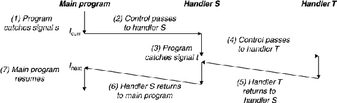

# Signal

we will study a higher-level software form of exceptional control flow, known as a Linux signal, that allows processes and the kernel to interrupt other processes. A signal is a small message that notifies a process that an event of some type has occurred in the system. The 30 different types of signals that are supported on Linux systems. SIG 是信号名的通用前缀, 


| Number |   Name  | Default action               | Corresponding event            |
| ------ | ------- | ---------------------------- | ------------------------------ |
|   1    | SIGHUP  | Terminate                    | Terminal line hangup 终端挂起或控制进程终止|
|   2    | SIGINT  | Terminate                    | Interrupt from keyboard (Ctrl-C)| 
|   3    | SIGQUIT | Terminate                    | Quit from keyboard (Ctrl-`\`)  |
|   4    | SIGILL  | Terminate                    | Illegal instruction
|   5    | SIGTRAP | Terminate and dump corea$^a$ | Trace trap (debug 使用，由断点指令产生)|
|   6    | SIGABRT | Terminate and dump corea$^a$ | Abort signal from abort function (abort 或 assert)|
|   7    | SIGBUS  | Terminate                    | Bus error                    |
|   8    | SIGFPE  | Terminate and dump corea     | Floating-point exception     |
|   9    | SIGKILL | Terminate$^b$                | Kill program from kill function or command|
|   10   | SIGUSR1 | Terminate                    | User-defined signal 1        |
|   11   | SIGSEGV | Terminate and dump core$^a$  | Invalid memory reference (seg fault) |
|   12   | SIGUSR2 | Terminate                    | User-defined signal 2         |
|   13   | SIGPIPE | Terminate                    | Wrote to a pipe with no reader|
|   14   | SIGALRM | Terminate                    | Timer signal from alarm function |
|   15   | SIGTERM | Terminate                    | Software termination signal   |
|   16   | SIGSTKFLT|Terminate                    | Stack fault on coprocessor    |
|   17   | SIGCHLD | Ignore                       | A child process has stopped or terminated |
|   18   | SIGCONT | Ignore                       | Continue process if stopped   |
|   19   | SIGSTOP | Stop until next SIGCONT$^b$  | Stop signal not from terminal |
|   20   | SIGTSTP | Stop until next SIGCONT      | Stop signal from terminal(Ctrl+z)|
|   21   | SIGTTIN | Stop until next SIGCONT      | Background process read from terminal |
|   22   | SIGTTOU | Stop until next SIGCONT      | Background process wrote to terminal |
|   23   | SIGURG  | Ignore                       | Urgent condition on socket(有"紧急"数据)|
|   24   | SIGXCPU | Terminate                    | CPU time limit exceeded       |
|   25   | SIGXFSZ | Terminate                    | File size limit exceeded(文件大小超额)|
|   26   | SIGVTALRM|Terminate                    | Virtual timer expired(虚拟时钟信号)|
|   27   | SIGPROF | Terminate                    | Profiling timer expired(时钟信号描述)|
|   28   | SIGWINCH| Ignore                       | Window size changed                                 |
|   29   | SIGIO   | Terminate                    | I/O now possible on a descriptor(可以进行输入/输出操作)|
|   30   | SIGPWR  | Terminate                    | Power failure                                       |
|   31   | SIGSYS  | Terminate                    | 非法的系统调用                                        |
|   32   | SIGUNUSED| Ignore                      | 未使用信号                                            |

Notes: (a) Years ago, main memory was implemented with a technology known as core memory. “Dumping core” is a historical term that means writing an image of the code and data memory segments to disk, (b) This signal can be neither caught nor ignored.

SIGPWR: 如果电源失效,系统依靠蓄电池继续运行。但是如果蓄电池也将不能工作,此时发送SIGPWR信号。通常是接到蓄电池电压过低信息的进程将SIGPWR发送给init进程,然后由init处理停机操作

可以使用 `kill -l` 查看该系统支持的信号量。结果中，编号为1 ~ 31的信号为传统UNIX支持的信号，是不可靠信号(非实时的)，编号为32 ~ 63的信号是后来扩充的，称做可靠信号(实时信号)。不可靠信号和可靠信号的区别在于前者不支持排队，可能会造成信号丢失，而后者不会。

Linux发行版中，有着 `/usr/include/**/signal.h` 这样的头文件，定义Linux系统中信号类型。

**Each signal type corresponds to some kind of system event. Low-level hardware exceptions are processed by the kernel's exception handlers and would not normally be visible to user processes. Signals provide a mechanism for exposing the occurrence of such exceptions to user processes.** For example, if a process attempts to divide by zero, then the kernel sends it a SIGFPE signal (number 8). If a process executes an illegal instruction, the kernel sends it a SIGILL signal (number 4). If a process makes an illegal memory reference, the kernel sends it a SIGSEGV signal (number 11). Other signals correspond to higher-level software events in the kernel or in other user processes. For example, if you type Ctrl+C (i.e., press the Ctrl key and the ‘c’ key at the same time) while a process is running in the foreground, then the kernel sends a SIGINT (number 2) to each process in the foreground process group. A process can forcibly terminate another process by sending it a SIGKILL signal (number 9). When a child process terminates or stops, the kernel sends a SIGCHLD signal (number 17) to the parent.
 
## Signal Terminology

The transfer of a signal to a destination process occurs in two distinct steps:

- **Sending a signal.** The kernel sends (delivers) a signal to a destination process by updating some state in the context of the destination process. The signal is delivered for one of two reasons: (1) The kernel has detected a system event such as a divide-by-zero error or the termination of a child process. (2) A process has invoked the kill function (discussed in the next section) to explicitly request the kernel to send a signal to the destination process. A process can send a signal to itself.

- **Receiving a signal.** A destination process receives a signal when it is forced by the kernel to react in some way to the delivery of the signal. The process can either ignore the signal, terminate, or catch the signal by executing a user-level function called a signal handler. Bellow figure shows the basic idea of a handler catching a signal.


A signal that has been sent but not yet received is called **spending signal**. At any point in time, there can be at most one pending signal of a particular type. If a process has a pending signal of type k, then any subsequent signals of type k sent to that process are not queued; they are simply discarded. A process can selectively block the receipt of certain signals. When a signal is blocked, it can be delivered, but the resulting pending signal will not be received until the process unblocks the signal.

A pending signal is received at most once. For each process, the kernel maintains the set of pending signals in the pending bit vector, and the set of blocked signals in the blocked bit vector.1 The kernel sets bit k in pending whenever a signal of type k is delivered and clears bit k in pending whenever a signal of type k is received.


## Sending Signals

Unix systems provide a number of mechanisms for sending signals to processes. All of the mechanisms rely on the notion of a process group.

> Sending Signals with the /bin/kill Program

```
linux> /bin/kill -9 15213
```
sends signal 9 (SIGKILL) to process 15213. A negative PID causes the signal to be sent to every process in process group PID. For example, the command

```
linux> /bin/kill -9 -15213
```
sends a SIGKILL signal to every process in process group 15213. Note that we use the complete path /bin/kill here because some Unix shells have their own built-in kill command.


> Sending Signals from the Keyboard

Typing Ctrl+C at the keyboard causes the kernel to send a SIGINT signal to every process in the foreground process group. In the default case, the result is to terminate the foreground job. Similarly, typing Ctrl+Z causes the kernel to send a SIGTSTP signal to every process in the foreground process group. In the default case, the result is to stop (suspend) the foreground job.


> Sending Signals with the kill Function

Processes send signals to other processes (including themselves) by calling the kill function.

```C
#include <sys/types.h>
#include <signal.h>
int kill(pid_t pid, int sig);
				Returns: 0 if OK, -1 on error
```

If pid is greater than zero, then the kill function sends signal number sig to process pid. If pid is equal to zero, then kill sends signal sig to every process in the process group of the calling process, including the calling process itself. If pid is less than zero, then kill sends signal sig to every process in process group |pid| (the absolute value of pid). Figure 8.29 shows an example of a parent that uses the kill function to send a SIGKILL signal to its child.


> Sending Signals with the alarm Function

A process can send SIGALRM signals to itself by calling the alarm function.

```
#include <unistd.h>
unsigned int alarm(unsigned int secs);
				Returns: remaining seconds of previous alarm, or 0 if no previous alarm
```


The alarm function arranges for the kernel to send a SIGALRM signal to the calling process in secs seconds. If secs is 0, then no new alarm is scheduled. In any event, the call to alarm cancels any pending alarms and returns the number of seconds remaining until any pending alarm was due to be delivered (had not this call to alarm canceled it), or 0 if there were no pending alarms.

**不同的信号需要不同的触发触发方式，但其目标都是进程，并有一个默认的处理行为**

## Receiving Signals

When the kernel switches a process p from kernel mode to user mode (e.g., returning from a system call or completing a context switch), it checks the set of unblocked pending signals (pending & ~blocked) for p. If this set is empty (the usual case), then the kernel passes control to the next instruction (I$_{next}$) in the logical control flow of p. However, if the set is nonempty, then the kernel chooses some signal k in the set (typically the smallest k) and forces p to receive signal k. The receipt of the signal triggers some action by the process. Once the process completes the action, then control passes back to the next instruction (I$_{next}$) in the logical control flow of p. Each signal type has a predefined default action, which is one of the following:

- The process terminates.

- The process terminates and dumps core.

- The process stops (suspends) until restarted by a SIGCONT signal.

- The process ignores the signal.

前面信号的表格中 `Default action` 列出了各个信号的默认处理行为。For example, the default action for the receipt of a SIGKILL is to terminate the receiving process. On the other hand, the default action for the receipt of a SIGCHLD is to ignore the signal. A process can modify the default action associated with a signal by using the signal function. **The only exceptions are SIGSTOP and SIGKILL, whose default actions cannot be changed.**

```C
#include <signal.h>
typedef void (*sighandler_t)(int);
sighandler_t signal(int signum, sighandler_t handler);
				Returns: pointer to previous handler if OK, SIG_ERR on error (does not set errno)
```
The `signal` function can change the action associated with a signal `signum` in one of three ways:

- If `handler` is SIG_IGN, then signals of type `signum` are ignored.

- If `handler` is SIG_DFL, then the action for signals of type `signum` reverts to the default action.

- Otherwise, `handler` is the address of a user-defined function, called a signal handler, that will be called whenever the process receives a signal of type signum. Changing the default action by passing the address of a handler to the `handler` function is known as installing the handler. The invocation of the handler is called catching the signal. The execution of the handler is referred to as handling the signal.

When a process catches a signal of type k, the handler installed for signal k is invoked with a single integer argument set to k. This argument allows the same handler function to catch different types of signals.

When the handler executes its `return` statement, control (usually) passes back to the instruction in the control flow where the process was interrupted by the receipt of the signal. We say “usually” because in some systems, interrupted system calls return immediately with an error.

**示意图的返回点只是一种情况，另一种情况是返回到当前指令，重新执行。具体哪种情形需要看引发控制转移的原因。概括的说，如果当前指令没有执行完就发生了转移（这种情况一般是执行指令时出错），则返回到当前指令，例如段访问错误，除零错误。如果当前指令执行完了才发生转移（这种情况一般是有外部引起的），**

#### Back to Next instruction

```C
#include "csapp.h"

void sigint_handler(int sig) /* SIGINT handler */
{
	printf("Caught SIGINT!\n");
	exit(0);
}

int main()
{
	/* Install the SIGINT handler */
	if (signal(SIGINT, sigint_handler) == SIG_ERR)
		unix_error("signal error");

	pause(); /* Wait for the receipt of a signal */

	return 0;
}
```

This program catches the SIGINT signal that is sent whenever the user types Ctrl+C at the keyboard. The default action for SIGINT is to immediately terminate the process. In this example, we modify the default behavior to catch the signal, print a message, and then terminate the process.

#### Back to current instruction

```C
#include "csapp.h"

void sigint_handler(int sig) /* SIGINT handler */
{
    printf("Caught SIGSEGV!\n");
}

int main()
{
    /* Install the SIGSEGV handler */
    if (signal(SIGSEGV, sigint_handler) == SIG_ERR)
        unix_error("signal error");

    // Cause a SIGSEVG signal.
    int * point = 0;
    *point = 100;
    return 0;
}
```

当我们执行这个程序时，会得到如下的输出:
```
Caught SIGSEGV!
Caught SIGSEGV!
Caught SIGSEGV!
Caught SIGSEGV!
...
```
程序陷入无限的循环中，也不会有堆栈溢出，这很令人吃惊，不得不使用 `Contrl-C` 或者 `kill` 才能结束程序。这是因为 `*point = 100` 访问内存时，而地址为 0 的内存不能够被写入，触发了内存保护错误 `SIGSEGV`，此时触发发送信号。然后进入我们的信号处理程序输出 `Caught SIGSEGV!`，在信号处理程序结束后，由于在程序触发信号时，当前执行并未执行完，系统会返回当前指令执行，再次触发 `SIGSEGV` 信号。这就是陷入死循环的原因。

**这里留一个问题，能不能讲给程序申请一个内存，然后修改内存中 point 指向新地址。**当然，这种操作是徒劳的，因为即使可以，也不知道对内存的访问是新申请，还是被释放的内存。如果是被释放的内存，可有有其它数据，即使我们能新申请内存，也无法得知原先的数据。申请内存只会导致在将来的访问中导致的问题更加离奇（这也是目前没有动态修复这类问题的原因）。最好的方式是解析堆栈，并报告错误，让开发者能够根据堆栈信息更快的定位错误，修复问题。

Signal handlers can be interrupted by other handlers, as shown in Figure 8.31. In this example, the main program catches signal s, which interrupts the main program and transfers control to handler S. While S is running, the program catches signal t ≠ s, which interrupts S and transfers control to handler T. When T returns, S resumes where it was interrupted. Eventually, S returns, transferring control back to the main program, which resumes where it left off.




## Blocking and Unblocking Signals

Linux provides implicit and explicit mechanisms for blocking signals:


Implicit blocking mechanism. By default, the kernel blocks any pending signals of the type currently being processed by a handler. For example, in Figure 8.31, suppose the program has caught signal s and is currently running handler S. If another signal s is sent to the process, then s will become pending but will not be received until after handler S returns.
Explicit blocking mechanism. Applications can explicitly block and unblock selected signals using the sigprocmask function and its helpers.


```
#include <signal.h>

int sigprocmask(int how, const sigset_t *set, sigset_t *oldset);
int sigemptyset(sigset_t *set);
int sigfillset(sigset_t *set);
int sigaddset(sigset_t *set, int signum);
int sigdelset(sigset_t *set, int signum);
				Returns: 0 if OK, -1 on error
int sigismember(const sigset_t *set, int signum);
				Returns: 1 if member, 0 if not, -1 on error
```


The sigprocmask function changes the set of currently blocked signals (the blocked bit vector described in Section 8.5.1). The specific behavior depends on the value of how:

- SIG_BLOCK. Add the signals in set to blocked (blocked = blocked | set).

- SIG_UNBLOCK. Remove the signals in set from blocked (blocked = blocked & -set).

- SIG_SETMASK. blocked = set.

If oldset is non-NULL, the previous value of the blocked bit vector is stored in oldset.
Signal sets such as set are manipulated using the following functions: The sigemptyset initializes set to the empty set. The sigfillset function adds every signal to set. The sigaddset function adds signum to set, sigdelset deletes signum from set, and sigismember returns 1 if signum is a member of set, and 0 if not.

For example, Figure 8.32 shows how you would use sigprocmask to temporarily block the receipt of SIGINT signals.

```C
sigset_t mask, prev_mask;

Sigemptyset(&mask);
Sigaddset(&mask, SIGINT);

/* Block SIGINT and save previous blocked set */
Sigprocmask(SIG_BLOCK, &mask, &prev_mask);
⋮ // Code region that will not be interrupted by SIGINT
/* Restore previous blocked set, unblocking SIGINT */
Sigprocmask(SIG_SETMASK, &prev_mask, NULL);

```

##  Writing Signal Handlers

Signal handling is one of the thornier aspects of Linux system-level programming. Handlers have several attributes that make them difficult to reason about: (1) Handlers run concurrently with the main program and share the same global variables, and thus can interfere with the main program and with other handlers. (2) The rules for how and when signals are received is often counterintuitive. (3) Different systems can have different signal-handling semantics.

In this section, we address these issues and give you some basic guidelines for writing safe, correct, and portable signal handlers.

### Safe Signal Handling

Signal handlers are tricky because they can run concurrently with the main program and with each other, as we saw in Figure 8.31. If a handler and the main program access the same global data structure concurrently, then the results can be unpredictable and often fatal.
We will explore concurrent programming in detail in Chapter 12. Our aim here is to give you some conservative guidelines for writing handlers that are safe to run concurrently. If you ignore these guidelines, you run the risk of introducing subtle concurrency errors. With such errors, your program works correctly most of the time. However, when it fails, it fails in unpredictable and unrepeatable ways that are horrendously difficult to debug. Forewarned is forearmed!

- G0. Keep handlers as simple as possible. The best way to avoid trouble is to keep your handlers as small and simple as possible. For example, the handler might simply set a global flag and return immediately; all processing associated with the receipt of the signal is performed by the main program, which periodically checks (and resets) the flag.

- G1. Call only async-signal-safe functions in your handlers. A function that is async-signal-safe, or simply safe, has the property that it can be safely called from a signal handler, either because it is reentrant (e.g., accesses only local variables; see Section 12.7.2), or because it cannot be interrupted by a signal handler. Figure 8.33 lists the system-level functions that Linux guarantees to be safe. Notice that many popular functions, such as printf, sprintf, malloc, and exit, are not on this list.
The only safe way to generate output from a signal handler is to use the write function (see Section 10.1). In particular, calling printf or sprintf is unsafe. To work around this unfortunate restriction, we have developed some safe functions, called the Sio (Safe I/O) package, that you can use to print simple messages from signal handlers.
The sio_putl and sio_puts functions emit a long and a string, respectively, to standard output. The sio_error function prints an error message and terminates.
Figure 8.34 shows the implementation of the Sio package, which uses two private reentrant functions from csapp. c. The sio_strlen function in line 3 returns the length of string s. The sio_ltoa function in line 10, which is based on the itoa function from [61], converts v to its base b string representation in s. The _exit function in line 17 is an async-signal-safe variant of exit.
Figure 8.35 shows a safe version of the SIGINT handler from Figure 8.30.

- G2. Save and restore errno. Many of the Linux async-signal-safe functions set errno when they return with an error. Calling such functions inside a handler might interfere with other parts of the program that rely on errno.
The workaround is to save errno to a local variable on entry to the handler and restore it before the handler returns. Note that this is only necessary if the handler returns. It is not necessary if the handler terminates the process by calling _exit.


- G3. Protect accesses to shared global data structures by blocking all signals. If a handler shares a global data structure with the main program or with other handlers, then your handlers and main program should temporarily block all signals while accessing (reading or writing) that data structure. The reason for this rule is that accessing a data structure d from the main program typically requires a sequence of instructions. If this instruction sequence is interrupted by a handler that accesses d, then the handler might find d in an inconsistent state, with unpredictable results. Temporarily blocking signals while you access d guarantees that a handler will not interrupt the instruction sequence.

- G4. Declare global variables with volatile. Consider a handler and main routine that share a global variable g. The handler updates g, and main periodically reads g. To an optimizing compiler, it would appear that the value of g never changes in main, and thus it would be safe to use a copy of g that is cached in a register to satisfy every reference to g. In this case, the main function would never see the updated values from the handler.

- You can tell the compiler not to cache a variable by declaring it with the volatile type qualifier. For example:

```C
volatile int g;
```

	The volatile qualifier forces the compiler to read the value of g from memory each time it is referenced in the code. In general, as with any shared data structure, each access to a global variable should be protected by temporarily blocking signals.

- G5. Declare flags with sig_atomic_t. In one common handler design, the handler records the receipt of the signal by writing to a global flag. The main program periodically reads the flag, responds to the signal, and clears the flag. For flags that are shared in this way, C provides an integer data type, sig_atomic_t, for which reads and writes are guaranteed to be atomic (uninterruptible) because they can be implemented with a single instruction:

```C
volatile sig_atomic_t flag;
```
	Since they can't be interrupted, you can safely read from and write to sig_atomic_t variables without temporarily blocking signals. Note that the guarantee of atomicity only applies to individual reads and writes. It does not apply to updates such as flag++ or flag = flag + 10, which might require multiple instructions.”

Keep in mind that the guidelines we have presented are conservative, in the sense that they are not always strictly necessary. For example, if you know that a handler can never modify errno, then you don't need to save and restore errno. Or if you can prove that no instance of printf can ever be interrupted by a handler, then it is safe to call printf from the handler. The same holds for accesses to shared global data structures. However, it is very difficult to prove such assertions in general. So we recommend that you take the conservative approach and follow the guidelines by keeping your handlers as simple as possible, calling safe functions, saving and restoring errno, protecting accesses to shared data structures, and using volatile and sig_atomic_t.

### Correct Signal Handling

注意信号是无队列的，当一个信号正在处理时，再次到来的该类型信号就会被阻塞，这时再次触发该类型信号就会被丢弃。信号触发的数量无法用于计数发送信号的数量。


### Portable Signal Handling

使用 sigaction 代替 signal 处理一些老旧 Unix 上的兼容性问题。

## Synchronizing Flows to Avoid Nasty Concurrency Bugs

The problem of how to program concurrent flows that read and write the same storage locations has challenged generations of computer scientists. In general, the number of potential interleavings of the flows is exponential in the number of instructions. Some of those interleavings will produce correct answers, and others will not. The fundamental problem is to somehow synchronize the concurrent flows so as to allow the largest set of feasible interleavings such that each of the feasible interleavings produces a correct answer.

**This is an example of a classic synchronization error known as a race. In this case, the race is between the call to addjob in the main routine and the call to deletejob in the handler.** If addjob wins the race, then the answer is correct. If not, the answer is incorrect. Such errors are enormously difficult to debug because it is often impossible to test every interleaving. You might run the code a billion times without a problem, but then the next test results in an interleaving that triggers the race.

By blocking SIGCHLD signals before the call to fork and then unblocking them only after we have called addjob, we guarantee that the child will be reaped after it is added to the job list. **Notice that children inherit the blocked set of their parents, so we must be careful to unblock the SIGCHLD signal in the child before calling execve.**

## Explicitly Waiting for Signals

```C
#include <signal.h>
int sigsuspend(const sigset_t *mask);
				Returns: -1
```
The sigsuspend function temporarily replaces the current blocked set with mask and then suspends the process until the receipt of a signal whose action is either to run a handler or to terminate the process. If the action is to terminate, then the process terminates without returning from sigsuspend. If the action is to run a handler, then sigsuspend returns after the handler returns, restoring the blocked set to its state when sigsuspend was called.

The sigsuspend function is equivalent to an atomic (uninterruptible) version of the following:

1. sigprocmask(SIG_BLOCK, &mask, &prev);
2. pause();
3. sigprocmask(SIG_SETMASK, &prev, NULL);

The atomic property guarantees that the calls to sigprocmask (line 1) and pause (line 2) occur together, without being interrupted. This eliminates the potential race where a signal is received after the call to sigprocmask and before the call to pause.


### 错误信号

错误信号包括 `信号量` 和 `错误码`，例如 `signal 11 (SIGSEGV), code 1 (SEGV_MAPERR), fault addr 0x0` 中 `signal 11 (SIGSEGV)` 就是信号量，`code 1 (SEGV_MAPERR)` 就是错误码；然后是对错误码的详细描述。


> SIGSEGV(SEGV_MAPERR)

SEGV 是 segmentation violation 的缩写
在 POSIX 兼容的平台上，SIGSEGV 是当一个进程执行了一个无效的内存引用，或发生段错误时发送给它的信号。SIGSEGV 的符号常量在头文件 signal.h 中定义。因为在不同平台上，信号数字可能变化，因此符号信号名被使用。通常，它是信号11。


对于不正确的内存处理,如当程序企图访问 CPU 无法定址的内存区块时,计算机程序可能抛出 SIGSEGV。操作系统可能使用信号栈向一个处于自然状态的应用程序通告错误，由此，开发者可以使用它来调试程序或处理错误。
在一个程序接收到 SIGSEGV 时的默认动作是异常终止。这个动作也许会结束进程，但是可能生成一个核心文件以帮助调试，或者执行一些其他特定于某些平台的动作。
SIGSEGV可以被捕获。也就是说，应用程序可以请求它们想要的动作，以替代默认发生的动作。这样的动作可以是忽略它、调用一个函数，或恢复默认的动作。在一些情形下，忽略 SIGSEGV 导致未定义行为。
一个应用程序可能处理SIGSEGV的例子是调试器，它可能检查信号栈并通知开发者目前所发生的，以及程序终止的位置。

SIGSEGV通常由操作系统生成，但是有适当权限的用户可以在需要时使用kill系统调用或kill命令（一个用户级程序，或者一个shell内建命令）来向一个进程发送信号。


例如，空指针访问：

```
2022-05-10 12:06:40.549 23488-23488/? A/DEBUG: signal 11 (SIGSEGV), code 1 (SEGV_MAPERR), fault addr 0x0
2022-05-10 12:06:40.549 23488-23488/? A/DEBUG: Cause: null pointer dereference
```

没有分配的地址

```
T* pointer = (T*) 0x0000007ffbb43df0;
pointer->getValue();
```

```
022-05-10 12:26:44.739 3788-3788/? A/DEBUG: signal 11 (SIGSEGV), code 2 (SEGV_ACCERR), fault addr 0x7ffbb43e20
```
