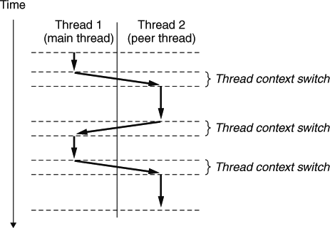
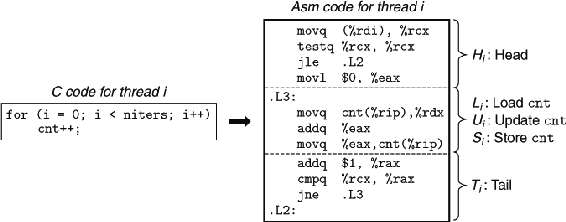
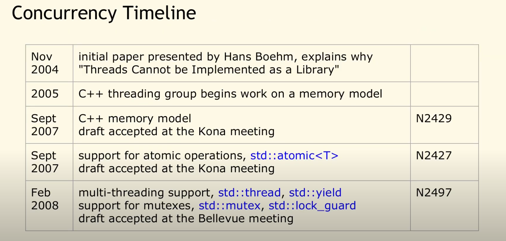
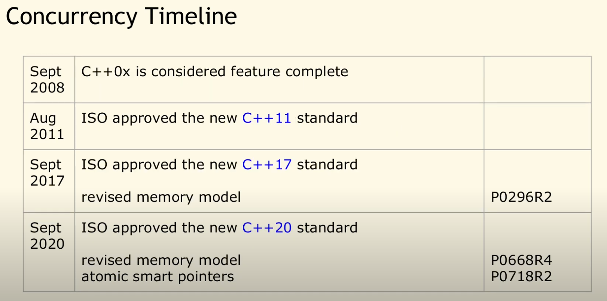

# 线程

[TOC]

线程的出现基于这样的需求：在一个进程中同样需要并发执行的任务。例如一个音乐播放器在请求网络数据时，不能阻塞 UI 截面的操作，同时也要允许播放声音。60年代，在OS中能拥有资源和独立运行的基本单位是进程，然而随着计算机技术的发展，进程暴漏了很多弊端，一是由于进程是资源拥有者，创建、撤消与切换存在较大的时空开销，因此需要引入轻型进程；二是由于对称多处理机（SMP）出现，可以满足多个运行单位，而多个进程并行开销过大。到了80年代，线程的概念被提出来，将进程进一步划分为更多的可执行流。这些流——线程——作为运行和调度的基本单位。

进程拥有独立的地址空间，这使得他们之间共享数据很困难。同一进程中的线程共用相同的地址空间和资源，这使得他们可以直接访问相同的数据。线程作为执行的基本单位，由内核进行调度。每个线程都有它自己的线程上下文，包括：
- 一个整数线程 ID（Thread ID TID）
- 栈 和 栈指针
- 程序计数器
- 通用目的的寄存器和条件码

同一进程中的所有线程共享整个进程的上下文，因而能够共享资源，包括虚拟地址空间，代码、数据区域、堆、共享库、和打开的文件。

## 线程执行模型

线程其实就是将原来进程中用于执行的部分独立出来，并且在一个进程中可以有多个这种执行流，它们共用其它部分。在某些方面多线程的执行模型和多进程的执行模型非常相似。因此线程也被称为——轻量级进程。

每个进程开始生命周期时都是单一线程，这个线程称为主线程(mainthread)。在某一时刻，主线程创建一个对等线程(peerthread)，从这个时间点开始，两个线程就并发运行。最后，因为主线程执行一个慢速系统调用，例如read或者sleep，或者因为它被系统的间隔计时器中断，控制就会通过上下文切换传递到对等线程。在控制传递回主线程前，对等线程会执行一段时间，依次类推。



在一些重要的方面，线程执行是不同于进程的。因为一个线程的上下文要比一个进程的上下文小得多，线程的上下文切换要比进程的上下文切换快得多。（事实上，上下文切换导致的性能差别不是由于上下文的大小导致的，而是因为切换地址空间导致的缓存失效。上下文切换分为两步：

1. 切换地址空间
2. 切换内核栈和硬件上下文

线程与进程相比少了步骤 1，这步的代码执行并不多，主要的性能损失是该步骤会导致处理器中缓存失效（还包括MMU内的页表缓存）、这导致一段之间内的执行都需要从内存访问数据，降低了程序的效率。而进程切换不会切换地址空间，从而没有这方面的性能损失。）


另一个不同就是线程，不像进程那样，线程不是按照严格的父子层次来组织的。同一个进程的线程组成一个对等(线程)池(a pool of peers)，独立于其它进程创建的线程。主线程和其他线程的区别仅在于它总是进程中第一个运行的线程。对等(线程)池概念的主要影响是，一个线程可以杀死它的任何对等线程，或者等待它的任意对等线程终止。进一步来说，每个对等线程都能读写相同的共享数据。

What runs next is determined by the OS
scheduler, and although the scheduler likely implements some sensible
algorithm, it is hard to know what will run at any given moment in time.

As you also might be able to tell from this example, threads make life
complicated: it is already hard to tell what will run when! Computers are
hard enough to understand without concurrency. Unfortunately, with
concurrency, it simply gets worse. Much worse.

## 线程模型

多线程的实现不止在系统内核中，也可以使用应用程序层实现，这种实现不是由系统调度的，而是通过软件的长跳转(longjump），称为用户线程。由于应用线程调度仅仅是一个跳转（也需要保存当前运行环境），不像内核线程需要保存寄存器等状态，用户线程往往更高效。由于不同的线程实现，就有了实际应用中三种不同线程模型。

### 1:1

一个应用线程对应一个内核线程。这种实现方式用户线程并没有实现线程调度，线程仅仅是对内核线程的封装，以提供一个套简洁一致的 API。例如 Java 的线程就是对各个平台线程的封装。

缺点：线程调度由内核调度，性能不如其它模型高。

### 1:N

一个内核线程对应 N 个用户线程。由应用程序完成线程的调度。这种实现通常在一些没有内核线程的系统上，应用层通过自己实现线程调度来实现并发。

缺点：无法实现高并发

### M:N

这种线程也称为混合线程模型。N 个用户线程依附于 M 个内核线程。这种实现避免了比 1:1 线程更加高效，同时避免了 1:N 模型中无法实现抢占式调度。

缺点：实现过于复杂。
而且，一旦一个线程阻塞，将阻塞在同一个内核线程中的所有应用线程。(**不一定，根据具体实现，如果所有不被运行的应用线程组成一个任务队列，在运行时才分配的话并不会阻塞。只有预先将所有应用线程和内核线程绑定才会导致这种阻塞。**)

> 多线程实现的现状：

主流的系统都在转为 1:1 的线程模型。虽然 M:N 模型更高效，但是其实现过于复杂，在现代计算机越来越倾向于多核化，以及一些超标量流水线技术等支持，再加上 N:M 实现需要的复杂的代码消耗，M:N 实现带来性能提升并不与其付出成比例。过高的实现复杂度带来的性能回报并不高。

Linux 上 M:N 模型的 NGPT 实现，在 2003 年中期被放弃了，把这个领域完全留给了 NPTL。
有个说法没有验证：
FreeBSD从7.0开始转为 1:1 实现。
Solaris 之前实现了 M:N 线程模型，从某个版本也开始转移到 1:1 模型。

Java 也遗弃了 M:N 的线程模型。现在线程仅仅是对内核线程的一个封装。


我认为 N:M 线程模型被抛弃的另一个原因是：M:N 的实现有更好的 API: 协程。应用线程在编程 API 上不如协程，以为它不支持返回结果，用户切换引起内核调度的消耗更大。内核专心实现内核线程，而将应用级的切换留给协程这种编程模型更好的技术，是更好的选择。

## 线程 API

对于目前常见的系统，由于线程的实现从根本上依赖于操作系统，其用户 API 都不过是对系统线程的一个包装而已。以 UNIX 为例 `POSIX` 标准的线程 API `Pthreads`。其定义了大约 60 个函数，用于创建、杀死和回收线程，以及与对等线程安全地共享数据，通知对等线程系统状态的变化。

pthreads（POSIX Threads）定义了一组C编程语言类型、函数和常量。它是通过pthread.h头文件和线程库实现的。大约有100个线程过程，都以pthread为前缀，它们可以分为四组:
- 线程管理、创建、连接线程等
- Mutexes
- 条件变量
- 用于线程之间的同步的读写锁和屏障
- 自旋锁

POSIX 信号量 API 可以与 POSIX 线程一起使用，但不是线程标准的一部分，它定义在POSIX.1b实时扩展(IEEE Std 1003.1 -1993)标准中。因此，信号量方法的前缀是sem，而不是pthread。


```C
#include "csapp.h"
void *thread(void *vargp);

int main()
{
	pthread_t tid;
	Pthread_create(&tid, NULL, thread, NULL);
	Pthread_join(tid, NULL);
	exit(0);
}

void *thread(void *vargp) /* Thread routine */
{
	printf("Hello, world!\n");
	return NULL;
}
```
PThread 通过 pthread_create 创建一个线程，当线程开始执行时 `thread` 函数被调用，它作为 `pthread_create` 的第三个参数传递给线程。当对 pthread_create 的调用返回时，主线程和新创建的对等线程并发运行，并且 tid 包含新线程的ID。通过调用 pthread_join，主线程等待对等线程终止。最后，主线程调用 exit 终止当时运行在这个进程中的所有线程(在这个示例中就只有主线程)。

正如第二行里的原型所示，每个线程都以一个通用指针作为输入（pthread_create 的最后一个参数传入），并返回一个通用指针。如果你想传递多个参数给线程例程，那么你应该将参数放到一个结构体中，并传递一个指向该结构体的指针。相似地，如果你想要线程例程返回多个参数，你可以返回一个指向一个结构的指针。

### 创建

```C
#include <pthread.h>
typedef void *(func)(void *);
int pthread_create(pthread_t *tid, pthread_attr_t *attr, func *f, void *arg);
					Returns: 0 if OK, nonzero on error
```

`pthread_create` 用于创建一个线程，其有四个参数，分别为：

- tid，用于保存线程 ID, 新线程可以用 `pthread_self` 来获得自己的 ID。

- attr: 用于设置线程的属性。

- f: 线程要执行的函数。

- arg: 传递给线程函数 f 的参数。

### 终止/销毁

一个线程是以下列方式之一来终止的:

- 当顶层的线程例程返回时，线程会隐式地终止。

- 通过调用 pthread_exit 函数，线程会显式地终止，该函数会返回一个指向返回值 thread_return 的指针。如果主线程调用 pthread_exit，它会等待所有其他对等线程终止，然后再终止主线程和整个进程，返回值 thread_return。

- 某个对等线程调用 exit 函数，该函数终止进程以及所有与该进程相关的线程。

- 另一个对等线程通过调用指定当前线程 ID 调用 pthread_cancel 函数来终止当前线程

```C
#include <pthread.h>
void pthread_exit(void *thread_return);
						Never returns

int pthread_cancel(pthread_t tid);
					Returns: 0 if OK, nonzero on error
```

### 回收已终止线程的资源

线程通过调用 pthread_join 函数等待其他线程终止。pthread_join 函数将阻塞当前线程直到等待的线程终止，并将线程例程返回的泛型(void *)指针赋值给 thread_return 所指向的位置，回收已终止线程占用的所有存储器资源。

注意，和Unix的wait函数不同，pthread_join 函数只能等待一个指定的线程终止。没有办法让pihread_wait 等待任意一个线程终止。这使得我们的代码更加复杂，因为它迫使我们去使用其它一些不那么直观的机制来检测进程的终止。实际上，Stevens 在[81]中就很有说服力地论证了这是一个错误。

```C
#include <pthread.h>
int pthread_join(pthread_t tid, void **thread_return);
					Returns: 0 if OK, nonzero on error
```

### 分离线程

在任何一个时间点上，线程是结合的(joinable)或者是分离的(detached)。 一个结合的线程能够被其他线程收回其资源和杀死。在被其他线程回收之前，它的存储器资源 (例如栈)是不释放的。相反，一个分离的线程是不能被其他线程回收或杀死的。它的存储器资源在它终止时由系统自动释放。 默认情况下，线程被创建成结合的。为了避免存储器泄漏，每个可结合线程都应该要么被其它线程显式地收回，要么通过调用pthread_detach 函数被分离。

```C
#include <pthread.h>
int pthread_detach(pthread_t tid) ;
若成功则返回O，若出错则为非零。
```

线程能够通过以 pthread_self() 为参数的 pthread_detach 调用来分离它自己。 尽管我们的一些例子会使用结合线程，但是在现实程序中，有理由要使用分离的线程。例如，一个高性能 Web 服务器可能在每次收到 Web 浏览器的连接请求时都创建一个新的对等线程。因为每个连接都是由一个单独的线程独立处理的，所以对于服务器而言，就很没有必要——实际上也不愿意——显式地等待每个对等线程终止。在这种情况下，每个对等线程都应该在它开始处理请求之前，分离它自身，这样就能在它终止后，自动回收它的存储器资源了。

### 唯一初始化

当我们需要在整个程序中需要对内容仅初始化一次，该初始化需要在使用时才进行，而不是在程序一开始就完成（懒操作，因为可能并不一定用到，过早初始化会造成浪费），我们通常会设置一个全局变量，并对变量进行判断来完成该操作。但在多线程情况下，该操作变得复杂，因为要保证线程的安全。为此，PThread 设计了 `pthread_once` 来保证传递给 pthread_once 的函数仅被调用一次。

```C
#include <pthread.h>
pthread_once_t once_control = PTHREAD_ONCE_INIT;
int pthread_once(pthread_once_t *once_control, void (*init_routine) (void)) ;
```

once_control 变量是一个全局或者静态变量，总是被初始化为 PTHREAD_ONCE_INIT。当你第一次用参数 once_control 调用 pthread_once 时，它调用 init_routine，这是一个没有输入参数，也不返回什么的函数。再次以 once_control 为参数的 pthread_once 调用不做任何事情。

### 线程使用中出现的一些问题

#### 1. 内存泄露


### 切线程的本质

只有操作系统才能真正切线程（用于可以调用系统函数挂起线程也是请求系统进行切换，但是其操作更普遍的叫法是挂起线程），用户代码所指的切线程不过是将一个任务放到线程的执行队列中，等待执行。

## 线程安全

使用线程的一大优势是能够通过变量就能访问相同的内存，这跟编写单线程的程序没有任何区别，方便且速度极快。然而这可不是免费的午餐，在线程之间共享变量会引入一个非常棘手的问题——线程安全。为了编写正确的多线程程序，我们必须对所谓的共享以及它是如何工作的有很清楚的了解。

### 多线程程序中的共享变量

为了理解C程序中的一个变量是否是共享的，有 一些基本的问题要解答:线程的基础存储器模 型是什么?根据这个模型，变量实例是如何映射到存储器的?最后，有多少线程引用这些实例?一个变量是共享的，当且仅当多个线程引用这个变量的某个实例。

为了让我们对共享的讨论具体化，我们使用如下程序作为一个运行示例。尽管有些 人为的痕迹，但是它仍然值得研究，因为它说明了关于共享的许多细微之处。示例程序由一个创建 了两个对等线程的主线程组成。主线程传递一个惟一的ID 给每个对等线程，每个对等线程利用这个ID输出一条个性化的信息，以及调用该线程例程的全部次数的数值。

```C
#include "csapp.h"
#define N 2
void *thread(void *vargp);

char **ptr; /* Global variable */

int main()
{
	int i;
	pthread_t tid;
	char *msgs[N] = {
		"Hello from foo",
		"Hello from bar"
	};

	ptr = msgs;
	for (i = 0; i < N; i++)
		Pthread_create(&tid, NULL, thread, (void *)i);
	Pthread_exit(NULL);
}

void *thread(void *vargp)
{
	int myid = (int)vargp;
	static int cnt = 0;
	printf("[%d]: %s (cnt=%d)\n", myid, ptr[myid], ++cnt);
	return NULL;
}
```

#### 线程存储模型

一个线程池中的并发线程运行在一个进程的上下文中。每个线程有它自己独立的线程上下文，包括线程 ID、栈、栈指针、程序计数器、条件代码和通用目的寄存器值。每个线程和其他线程一起共享进程上下文的剩余部分。这包括整个用户虚拟地址空间（它是由只读文本(代码)、读/写数据、堆以及 所有的共享库代码和数据区组成的）和打开文件的集合。

从实际操作的角度来说，让一个线程去读或写另一个线程的寄存器值是不可能的。另一方面，任何线程都可以访问共享虚拟存储器的任意位置。如果某个线程修改了一个存储器位置，那么其它线程最终都能在它读这个位置时发现这个变化。因此，**寄存器是从不共享的，而虚拟存储器总是共享的。** 

内存模型的线程栈的不是那么清晰。这些栈在虚拟地址空间的栈区域中，并且通常是被它们的对应线程独立地访问的。我们说通常而不是总是，是因为不同的线程栈是不对其他线程设防的。所以，如果一个线程不知何故得到一个指向其他线程栈的指针，那么它就可以读写这个栈的任何部分。我们的示例程序在第 26 行展示了这一点，对等线程直接通过全局变量 ptr 引用主线程栈中的内容。

#### 将变量映射到存取器

多线程的 C 程序中的变量根据其存储类型被映射到虚拟内存。

- **全局变量**。全局变量是定义在函数之外的变量。在运行时，每个全局变量在虚拟内存的数据区只包含唯一的实例。例如，第5行声明的全局变量 ptr 在虚拟内存数据区中有一个运行时实例。当一个变量只有一个实例时，我们只用变量名来表示该实例——在本例中是 ptr。

- **局部变量**。局部变量是定义在函数内部但是没有 static 属性的变量。在运行时，每个线程的栈都包含它自己的所有局部变量的实例。即使多个线程执行同一个线程时，也是如此。例如，该例中的局部变量 tid，它的实例保存在主线程的栈中。我们用 tid.m 来表示这个实例。另一个本地变量 myid 有两个实例，一个在对等线程 0 的栈内，另一个在对等线程 1 的栈内。我们将这两个实例分别表示为 myid.p0 和 myid.p1。

- **静态局部变量**。静态局部变量是定义在函数内部使用 static 修饰的变量。和全局变量一样，虚拟存内存的数据区中只包含每个本地静态变量的一个实例。例如，示例程序中的每个对等线程都包含了第 25 行声明的cnt，在运行时，虚拟内存的数据区中也只有一个cnt的实例。每个对等线程都读和写这个实例。

#### 共享变量

一个变量 v 是共享的当且仅当它的实例被一个以上线程所引用。例如实例程序中 cnt 是共享的，因为它仅有一个运行时的实例，该实例被两个对等线程所引用。另外 myid 不是共享的，因为它两个实例中的任意一个实例都金杯一个线程所引用。然而，也应该意识到，像 msgs 这样的局部变量同样可以被共享。


### 同步线程

共享变量非常方便，但是其引入了***同步错误***的可能性。如下示例中的程序创建两个线程，每个线程都增加共享的全局变量 cnt。

因为每个线程为计数器增加 niters 次，我们期望其最终的值是 niters 的两倍。这非常简单和直接。然而，当我们运行程序时，不仅得到的结果是错误的，而且每次运行都得到不同的错误结果。

```C
/* WARNING: This code is buggy! */
#include "csapp.h"

void *thread(void *vargp); /* Thread routine prototype */

/* Global shared variable */
volatile long cnt = 0; /* Counter */
int main(int argc, char **argv)
{
	long niters;
	pthread_t tid1, tid2;

	/* Check input argument */
	if (argc != 2) {
		printf("usage: %s <niters>\n", argv[0]);
		exit(0);
	}
	niters = atoi(argv[1]);

	/* Create threads and wait for them to finish */
	Pthread_create(&tid1, NULL, thread, &niters);
	Pthread_create(&tid2, NULL, thread, &niters);
	Pthread_join(tid1, NULL);
	Pthread_join(tid2, NULL);

	/* Check result */
	if (cnt != (2 * niters))
		printf("BOOM! cnt=%ld\n", cnt);
	else
		printf("OK cnt=%ld\n", cnt);
	exit(0);
}

/* Thread routine */
void *thread(void *vargp)
{
	long i, niters = *((long *)vargp);
	for (i = 0; i < niters; i++)
		cnt++;

	return NULL;
}
```

运行结果
```shell
linux> ./badcnt 1000000
BOOM! cnt=1445085
linux> ./badcnt 1000000
BOOM! cnt=1915220
linux> ./badcnt 1000000
BOOM! cnt=1404746
```
究竟哪里出了问题？为了清楚的理解该问题，我们需要研究线程中计数循环的汇编代码。即如下所示：



我们发现将线程 i 的该循环代码划分为五部分更方便分析。

- $H_i$: 在循环头部的指令块。
- $L_i$: 加载共享变量 `cnt` 到寄存器 %$rdx_i$ 的指令，这里 %$rdx_i$ 表示线程 i 中的寄存器  %rdx 的值。
- $U_i$: 更新(增加) %$rdx_i$ 的指令。
- $S_i$: 将 %$rdx_i$ 更新后的值存回到共享变量 cnt 的指令。
- $T_i$: 循环尾部的指令块。

请注意，头部和尾部只操纵栈中的局部变量，而 $L_i$、$U_i$ 和 $S_i$ 操纵共享计数器变量的内容。

当上面示例中的两个对等线程在一个**单处理机**上并发运行时，机器指令以某种顺序一个接一个地完成。因此，每种并发执行流是两个线程中指令的顺序(或交错)排序。不幸的是，其中一些顺序会产生正确结果，另外的则不会。

关键点是：**通常情况下，你无法预测操作系统是否会为你的线程选择正确的顺序**。例如，如下的表格展示了一个正确指令执行顺序。当每个线程更新了共享变量 cnt 之后，其内存中的值是 2，正是所期望的结果。

<table>
    <thead align=left>
        <tr>
            <th colspan="6">(a) Correct ordering</th>
        </tr>
        <tr>
            <th>Step</th><th>Thread</th><th>Instr.</th><th>%rdx<sub>1</sub></th><th>%rdx<sub>2</sub></th><th>cnt</th>
        </tr>
    </thead>
    <tbody>
        <tr>
            <td>1</td> <td>1</td> <td>H<sub>1</sub></td> <td>—</td> <td>—</td> <td>0</td>
        </tr>
		<tr>
            <td>2</td> <td>1</td> <td>L<sub>1</sub></td> <td>0</td> <td>—</td> <td>0</td>
        </tr>
		<tr>
            <td>3</td> <td>1</td> <td>U<sub>1</sub></td> <td>1</td> <td>—</td> <td>0</td>
        </tr>
		<tr>
            <td>4</td> <td>1</td> <td>S<sub>1</sub></td> <td>1</td> <td>—</td> <td>1</td>
        </tr>
		<tr>
            <td>5</td> <td>2</td> <td>H<sub>2</sub></td> <td>—</td> <td>—</td> <td>1</td>
        </tr>
		<tr>
            <td>6</td> <td>2</td> <td>L<sub>2</sub></td> <td>—</td> <td>1</td> <td>1</td>
        </tr>
		<tr>
            <td>7</td> <td>2</td> <td>U<sub>2</sub></td> <td>—</td> <td>2</td> <td>1</td>
        </tr>
		<tr>
            <td>8</td> <td>2</td> <td>S<sub>2</sub></td> <td>—</td> <td>2</td> <td>2</td>
        </tr>
		<tr>
            <td>9</td> <td>2</td> <td>T<sub>2</sub></td> <td>—</td> <td>2</td> <td>2</td>
        </tr>
		<tr>
            <td>10</td> <td>1</td> <td>T<sub>1</sub></td> <td>1</td> <td>—</td> <td>2</td>
        </tr>
    </tbody>
</table>

另一方面，如下的表格展示了产生不正确结果的顺序。出现这个问题是因为线程 2 在线程1加载  cnt（步骤2）和将其更新值存储（步骤6）之间加载了 cnt（步骤5）的值。最终，每个线程最终存储了1的更新计数器值。出现这个问题是因为线程2在步骤5中加载cnt，在线程1加载步骤2后，但在线程1将其更新值存储在步骤6中之前。因此，每个线程最终存储了1的更新计数器值。借助进度图，我们可以明确这些正确和不正确指令排序的概念，下一些将更详细的介绍进度图。

<table>
    <thead align=left>
        <tr>
            <th colspan="6" >(b) Incorrect ordering</th>
        </tr>
        <tr>
            <th>Step</th><th>Thread</th><th>Instr.</th><th>%$rdx<sub>1</sub></th><th>%rdx<sub>2</sub></th><th>cnt</th>
        </tr>
    </thead>
    <tbody>
        <tr>
            <td>1</td> <td>1</td> <td>H<sub>1</sub></td> <td>—</td> <td>—</td> <td>0</td>
        </tr>
		<tr>
            <td>2</td> <td>1</td> <td>L<sub>1</sub></td> <td>0</td> <td>—</td> <td>0</td>
        </tr>
		<tr>
            <td>3</td> <td>1</td> <td>U<sub>1</sub></td> <td>1</td> <td>—</td> <td>0</td>
        </tr>
		<tr>
            <td>4</td> <td>2</td> <td>H<sub>2</sub></td> <td>-</td> <td>-</td> <td>0</td>
        </tr>
		<tr>
            <td>5</td> <td>2</td> <td>L<sub>2</sub></td> <td>—</td> <td>0</td> <td>0</td>
        </tr>
		<tr>
            <td>6</td> <td>1</td> <td>S<sub>1</sub></td> <td>1</td> <td>-</td> <td>1</td>
        </tr>
		<tr>
            <td>7</td> <td>1</td> <td>T<sub>1</sub></td> <td>1</td> <td>-</td> <td>1</td>
        </tr>
		<tr>
            <td>8</td> <td>2</td> <td>U<sub>2</sub></td> <td>—</td> <td>1</td> <td>1</td>
        </tr>
		<tr>
            <td>9</td> <td>2</td> <td>S<sub>2</sub></td> <td>—</td> <td>1</td> <td>1</td>
        </tr>
		<tr>
            <td>10</td> <td>2</td> <td>T<sub>2</sub></td> <td>-</td> <td>1</td> <td>1</td>
        </tr>
    </tbody>
</table>

#### 进度图

进度图将 n 个并发线程的执行建模为穿过n维笛卡尔空间的轨迹。每个轴k对应于线程k的进度。每个点（$I_1$，$I_2$，......，$I_n$）表示线程k（k = 1，......，n）已完成指令$I_k$的状态。图的原点对应于任何线程尚未完成指令的初始状态。

下图显示了 badcnt.c 程序第一次循环迭代的二维进度图。水平轴对应于线程1，垂直轴对应于线程2。点（L1，S2）对应于线程1已完成L1，线程2已完成S2的状态。


进度图将指令执行建模为从一种状态到另一种状态的过渡。过渡表示为从一个点到相邻点的定向矢量。合法的过渡为向右移动（线程1中的指令完成）或向上移动（线程2中的指令完成）。在多核处理器上另个指令可以同时执行——此时对角线过度（~~两个指令不能同时完成——不允许对角线执行~~）。程序从不向回退运行，因此向下或向左移动的过渡也不合法。

程序的执行过程被建模为穿越状态间的轨迹。下图显示了与以下指令顺序相对应的轨迹：

$$H_1, L_1, U_1, H_2, L_2, S_1, T_1, U_2, S_2, T_2$$


对于线程i，操作共享变量内容的指令（$L_i、U_i、S_i$）构成了一个**临界区(critical section)**（关于共享变量cnt。A critical section is a piece of code that accesses a shared variable (or more generally, a shared resource) and must not be concurrently executed by more than one thread.），该部分不应与其它线程的临界区发生交错。换句话说，我们希望确保每个线程在执行其临界区的指令时对共享变量具有相互排它性的访问权限。这种现象通常被称为相互排斥。

在进度图上，两个临界区的交集形成的状态区域，称为**不安全区**。图12.21显示了变量 cnt 的不安全区域。注意，不安全区和与它交界的状态相毗邻，但并不包括这些状态。例如，各州（$H_1、H_2$）和（$S_1、U_2$）毗邻不安全地区，但它们不是其中的一部分。绕过不安全区域的轨迹被称为安全轨迹。相反，接触不安全区域任何部分的轨迹都是不安全的轨迹。图12.21显示了通过我们示例badcnt.c程序的状态空间的安全和不安全轨迹示例。上部轨迹沿着其左侧和顶部绕过不安全区域，因此是安全的。下面的轨迹穿过不安全区域，因此不安全。


任何安全轨迹都将正确更新共享计数器。为了保证正确执行我们的示例线程程序——以及任何共享全局数据结构的并发程序——我们必须以某种方式同步线程，以便它们始终有一个安全的轨迹。一种经典实现方式是使用信号量，我们接下来会介绍这个概念。

What we really want for this code is what we call mutual exclusion.
This property guarantees that if one thread is executing within the critical
section, the others will be prevented from doing so.

#### 保证线程安全的几种方式


### 线程同步方式。

线程同步是确保多个线程在访问共享资源时以有序的方式进行操作，避免竞态条件（race condition）和确保数据的一致性。有几种常见的线程同步方式：

1. 信号量（Semaphore）
信号量是一种更通用的同步机制，它不仅可以用作互斥锁，还可以限制同时访问某个共享资源的线程数量。信号量维护一个计数器，当计数器大于零时，线程可以进入临界区；当计数器为零时，线程需要等待，直到有线程释放资源增加计数器。

2. 互斥锁（Mutex）
互斥锁是一种最常见的同步机制，通过在访问共享资源之前获取锁并在完成后释放锁来确保同一时间只有一个线程可以访问临界区。只有持有锁的线程才能进入临界区执行相应的操作，其他线程需要等待锁的释放。

3. 条件变量（Condition Variables）
条件变量用于线程之间的通信和同步，它可以让线程等待某个条件的发生。条件变量通常与互斥锁一起使用，当一个线程等待条件时，它会释放锁并进入等待状态，直到另一个线程满足条件并通知其他线程，之后等待的线程重新获取锁并继续执行。

4. 读写锁（Read-Write Lock）
读写锁允许多个线程同时读取共享资源，但在写入时需要排他性访问。读取操作不会修改资源，因此多个线程可以并发执行读取操作，但写入操作需要独占访问资源，阻塞其他的读取和写入操作。

5. 自旋锁（Spin Lock）
自旋锁是一种基于忙等待的锁，它不会让线程进入休眠状态，而是在尝试获取锁时循环忙等。这种锁适用于临界区很小且被持有时间很短的情况，因为长时间的忙等会消耗大量的CPU资源。

6. 原子操作（Atomic Operations）
原子操作是一种保证在单个CPU指令级别上是不可分割的操作，可以确保在多线程环境下对共享数据的操作是原子的。原子操作可以通过硬件指令或者特定的编程语言提供的原子操作函数来实现，如Java中的Atomic包。

不同的同步方式适用于不同的场景和需求，选择合适的同步机制可以提高多线程程序的性能和可靠性。


- 互斥量（Mutex）：为控制一个具有有限数量用户资源而设计。
   使用 synchronized 或者 Lock 实现线程同步。

- 信号量（Semaphore）：用来通知线程有一些事件已发生，从而启动后继任务的开始。普遍用于生产者消费者问题，我可能会有多个资源多个线程都可以共享，生产者将信号量加1，消费者减1，比如减到小于0当前线程就被阻塞，当生产者再生产出一个资源，向那些阻塞的线程发出信号，让他们重新激活。

信号量 sem_
互斥锁 pthread_mutex_
条件变量 pthread_cond_
读写锁 pthread_rwlock_
自旋锁 pthread_spin——
原子操作 atomic_

> 有的博客将临界区（Critical Section）和事件（Event）算作一种同步方式，本文认为是不合理的。临界区其实就是访问（操作）共享变量的代码块，对临界区的互斥访问才能够保证线程安全。而所有的同步方法都是为了保护临界区。事件是一种普遍的编程模型：事件驱动，无论是否是并发的以及时候能保证线程安全都可以使用事件驱动模型实现，只不过并发程序很多场景很适合抽象成事件驱动的。

#### 信号量

#### 互斥锁

#### 读写锁

#### 自旋锁

#### 原子操作

对于`++`,`--` 这些操作，为了线程安全，如果使用 synchronized 则太重了。这时候可以使用带 `Atomic` 前缀的基本数据类型，它们的操作是原子性的。

> 如何从代码预测一个操作是不是原子性的？
要判断原子性需要明确：程序存储的地方在内存，而计算需要使用寄存器。以下操作是原子性的：

- 从内存加载数据到寄存器（同时要判断位宽，超出位宽的操作不是原子的，例如在 32 位机上加载 64 位数据）
- 寄存器之间直接运算
- 将寄存器数据保存到内存。

我们的程序逻辑经常遇到这样的操作序列：

1、读一个位于memory中的变量的值到寄存器中

2、修改该变量的值（也就是修改寄存器中的值）

3、将寄存器中的数值写回memory中的变量值

例如：

a=32 是一个原子操作,

volatile 不能保证对象，++,-- 等操作的线程安全。


> Atomic 的各种问题 https://www.jianshu.com/p/84c75074fa03


## Other


### 线程本地存储

也就是线程的上下文，包括栈指针、程序计数器以及通用目的的寄存器。

https://blog.csdn.net/linyt/article/details/51931737
https://www.cnblogs.com/liu6666/p/12729014.html
https://blog.csdn.net/hujutaoseu/article/details/74936222


- 线程同步
    - 诱因
    - 同步方法
    - 常用场景
    

“同”字从字面上容易理解为一起动作
其实不是，“同”字应是指协同、协助、互相配合。

即当有一个线程在对内存进行操作时，其他线程都不可以对这个内存地址进行操作（处于等待状态），直到该线程完成操作，其他线程才能对该内存地址进行操作。

- 好处：解决了线程安全的问题

- 弊端：降低了线程的执行效率，因为同步外的线程都会判断锁，锁获取和释放都需要额外的操作。

实现同步的前提是，要实现同步的所有线程使用同一个锁。


> 线程安全

在拥有共享数据的多条线程并行执行的程序中，线程安全的代码会通过同步机制保证各个线程都可以正常且正确的执行，不会出现数据污染等意外情况

> 问题产生的原因

1. 多个线程在同时操作共享的数据
2. 操作共享数据的代码有多条

当一个线程执行操作共享数据的多条代码时，由于线程切换是随机的，会导致执行过程中，数据被其他线程更改。这样使数据产生预期之外的值。

为了解决这个问题，需要线程同步，即对同一个数据的一块操作必须整体要么执行完，要么不执行。不能被其它线程打断。实现操作的原子性。

**多线程的共享数据的竞争有一个比喻，就像多个人去争抢几个桃子一样，结果难以预期。具体谁能抢到是无法推测的，这不满足程序的确定性**


### 数据竞争
从并发性的介绍，我们看到了并发编程中的一个基本问题:我们希望以原子方式执行一系列指令，但由于单个处理器(或多个线程在多个处理器上并发执行)上存在中断，实际上无法实现。通过对临界区使用锁，从而确保任何这样的临界区都**表现的像**单个原子指令一样执行。


传统同步的特点就是对于单核单处理，多线程，尤其是单片机上面比较简单的处理器，一般处理器不需要提供原子操作，因为只要通过简单的开关中断操作即可对锁对象做原子性的修改操作。
对于多核多处理器环境下的数据同步，如果我要用开关中断来实现原子性是不切合实际的。

我们再看一下上面的这张图。如果我们要线程A和线程B在单核单处理器的情况下，那么只要加载的时候加一个锁，如果线程A先执行，这个锁在它访问时是开的，在要用这个资源之前就把这个锁关上，然后做加载、计算和存储，即便我当前在做加载完成了或者计算完成的时候，线程A被操作系统调度出去了，把线程B调度进来，B这边也会面对这把锁，当它要访问下面资源的时候就会被锁住，同时当前线程会被挂起，等到A执行的时候，最后存储结果完了以后，把锁打开，线程B就可以从这里继续执行下去。而多个处理器，就像我们刚才讲的，我这边线程A对线程B是没法进行任何干扰的，这两个线程是完全同时执行的，**delete 错误 所以这个时候你要用传统的锁是无法同步的，** ***在多核处理器环境下，锁的实现也需要基于原子操作***。

当程序未正确同步时，就会存在数据竞争。


java 内存模型规范对数据竞争的定义如下：

在一个线程中写一个变量，
在另一个线程读同一个变量，
而且写和读没有通过同步来排序。

如果一个多线程程序能正确同步，这个程序将是一个没有数据竞争的程序。


Think: 竞争是导致线程不安全的一种情况。其本质还是对资源访问的不同步。竞争通常表现在业务代码上，而不是底层的计算机实现。例如，两个线程同时对一个变量增加就不能算作竞争，其导致线程不安全的原因是可见性导致的，其中一个线程对数据的修改对另一个线程不可见。

### 线程安全的三个条件

volatile

- 可见性：

可见性是一种复杂的属性，因为可见性中的错误总是会违背我们的直觉。通常，我们无法确保执行读操作的线程能适时地看到其他线程写入的值，有时甚至是根本不可能的事情。为了确保多个线程之间对内存写入操作的可见性，必须使用同步机制。

可见性，是指线程之间的可见性，一个线程修改的状态对另一个线程是可见的。也就是一个线程修改的结果。另一个线程马上就能看到。比如：用volatile 修饰的变量，就会具有可见性。当把变量声明为volatile类型后，编译器与运行时都会注意到这个变量是共享的，因此不会将该变量上的操作与其他内存操作一起重排序。volatile变量不会被缓存在寄存器或者对其他处理器不可见的地方，因此在读取volatile类型的变量时总会返回最新写入的值。，即直接修改内存。所以对其他线程是可见的。但是这里需要注意一个问题，volatile只能让被他修饰内容具有可见性，但不能保证它具有原子性。比如 volatile int a = 0；之后有一个操作 a++；这个变量a具有可见性，但是a++ 依然是一个非原子操作，也就是这个操作同样存在线程安全问题。

volatile变量的内存可见性是基于内存屏障(Memory Barrier)实现的，什么是内存屏障?内存屏障，又称内存栅栏，是一个CPU指令。在程序运行时，为了提高执行性能，编译器和处理器会对指令进行重排序，通过插入特定类型的内存屏障来禁止特定类型的编译器重排序和处理器重排序，插入一条内存屏障会告诉编译器和CPU：不管什么指令都不能和这条Memory Barrier指令重排序。

https://www.jianshu.com/p/08a0a8c984ab

在 Java 中 volatile、synchronized 和 final 实现可见性。

- 原子性：

即一个操作或者多个操作 要么全部执行并且执行的过程不会被任何因素打断，要么就都不执行。比如 a=0；（a非long和double类型） 这个操作是不可分割的，那么我们说这个操作时原子操作。再比如：a++； 这个操作实际是a = a + 1；是可分割的，所以他不是一个原子操作。非原子操作都会存在线程安全问题，需要我们使用同步技术（sychronized）来让它变成一个原子操作。一个操作是原子操作，那么我们称它具有原子性。java的concurrent包下提供了一些原子类，我们可以通过阅读API来了解这些原子类的用法。比如：AtomicInteger、AtomicLong、AtomicReference等。

虽然原子性在单核处理器上能够保证线程安全，但是在多核处理器上，程序执行是并行的，因此还是需要考虑其他特性，例如互斥。

在 Java 中 synchronized 和在 lock、unlock 中操作保证原子性。

- 有序性：

Java 语言提供了 volatile 和 synchronized 两个关键字来保证线程之间操作的有序性，volatile 是因为其本身包含“禁止指令重排序”的语义，synchronized 是由“一个变量在同一个时刻只允许一条线程对其进行 lock 操作”这条规则获得的，此规则决定了持有同一个对象锁的两个同步块只能串行执行。


> 当一个变量定义为 volatile 之后，将具备两种特性：

1.保证此变量对所有的线程的可见性，这里的“可见性”，当一个线程修改了这个变量的值，volatile 保证了新值能立即同步到主内存，以及每次使用前立即从主内存刷新。但普通变量做不到这点，普通变量的值在线程间传递均需要通过主内存（详见：Java内存模型）来完成。

2.禁止指令重排序优化。有volatile修饰的变量，赋值后多执行了一个“load addl $0x0, (%esp)”操作，这个操作相当于一个内存屏障（指令重排序时不能把后面的指令重排序到内存屏障之前的位置），只有一个CPU访问内存时，并不需要内存屏障；（什么是指令重排序：是指CPU采用了允许将多条指令不按程序规定的顺序分开发送给各相应电路单元处理）。

volatile 性能：
volatile 的读性能消耗与普通变量几乎相同，但是写操作稍慢，因为它需要在本地代码中插入许多内存屏障指令来保证处理器不发生乱序执行。

volatile 的可见性并不是缓存一致性，而是缓存锁或者总线锁。

> synchronized 后，仍需要加 volatile

synchronized 既保证了原子性又保证了可见性。


## 线程撕裂者/超线程

两核四线程
一个 ALU 同一时刻只能执行一个程序。

一核里一般含有一套 ALU,一套寄存器。而超线程则是一个核里一套 ALU 和多套寄存器。随着计算机的发展，由于计算单元和内存的速度差距越来越大。在每个核里，提供多套寄存器和缓存，它们公用 ALU。ALU 通过轮询使用寄存器和缓存，在使用一套寄存器的时候，另一套寄存器加载数据。这样看起来就增加了核心数量，同时解约了硬件成本。这样一核就能计算多个线程。


## 内核原子操作

由于内核无法使用用户 API，在内核中，也定义了一套原子操作 API，

#### 实现机制

X86 处理器

Cacheline Lock
为了实现多核Cache一致性，现在的硬件基本采用MESI协议（或者MESI变种）维护一致性。因此我们可以借助多核Cache一致性协议MESI实现原子操作。我们知道Cache line的状态处于Exclusive或者Modified时，可以说明该变量只有当前CPU私有Cache缓存了该数据。所以我们可以直接修改Cache line即可更新数据。并且MESI协议可以帮我们保证互斥。当然这不能不能保证RMW操作期间不被打断，因此我们还需要做些手脚实现原子操作。

我们依然假设只有2个CPU的系统。当CPU0试图执行原子递增操作时。a) CPU0发出"Read Invalidate"消息，其他CPU将原子变量所在的缓存无效，并从Cache返回数据。CPU0将Cache line置成Exclusive状态。然后将该cache line标记locked。b) 然后CPU0读取原子变量，修改，最后写入cache line。c) 将cache line置位unlocked。

在步骤a)和c)之间，如果其他CPU（例如CPU1）尝试执行一个原子递增操作，CPU1会发送一个"Read Invalidate"消息，CPU0收到消息后，检查对应的cache line的状态是locked，暂时不回复消息（CPU1会一直等待CPU0回复Invalidate Acknowledge消息）。直到cache line变成unlocked。这样就可以实现原子操作。我们称这种方式为锁cache line。这种实现方式必须要求操作的变量位于一个cache line。


## 锁的各种概念

### 死锁

1. A 线程持有资源 x, 要获取 y。Ｂ 线程持有资源 y，要获取 x。

它们一定是双锁，同时产生了嵌套。一个获取了锁 a，代码块内部想要获取锁 b. 另一个线程获取了锁 b，内部同步代码执行时想要获取锁 a。由于是嵌套的，不获取的时候还释放不了 a。


### 乐观锁和悲观锁

- 乐观锁是读数据的时候不会锁数据，假设数据不会被修改，而是等到写入的时候再检查是否有修改，有修改就会更新失败。没有修改就能够更新成功。但是在更新的时候会判断一下在此期间别人有没有去更新这个数据，可以使用版本号等机制。乐观锁适用于多读的应用类型，这样可以提高吞吐量。

- 悲观锁总是假设最坏的情况，是觉得别人会修改数据，在读取的时候就先加锁，写入完毕的时候再释放锁。

乐观锁与悲观锁并不是特指中实现的锁，而是在并发情况下保证数据完整性的不同策略。乐观锁指是一种基于冲突检测的方法，检测到冲突时操作就会失败。因此需要在更新失败的时候，加载新数据就更新。乐观锁的实现依赖于 CAS 或者 TAS 操作或者数据版本机制（实现数据版本一般有两种，第一种是使用版本号，第二种是使用时间戳。遗留问题：数据版本机制在多内核中还能实现吗？有硬件支持吗？），也就是硬件上支持。实现可以使用”或“CAS操作”

悲观锁适合写操作非常多的场景，乐观锁适合读操作非常多的场景，不加锁会带来大量的性能提升。

乐观锁的具体实现有：Java Atomic 系列类，ReentrantLock 中的 FairSync 类等。


ABA问题
ABA问题是使用CAS时最常出现的一个问题。它的整个过程如下图所示：

```
A(线程2修改一次值，线程3改回原值)->>线程1: 读
A(线程2修改一次值，线程3改回原值)->>线程2: 读
线程2->>A(线程2修改一次值，线程3改回原值):写
A(线程2修改一次值，线程3改回原值)->>线程3: 读
线程3->>A(线程2修改一次值，线程3改回原值):写
线程1->>A(线程2修改一次值，线程3改回原值):写
```

通过上图我们可以看到虽然线程1仍然可以CAS写成功，但是它并没有感受到该A值在整个过程当中发生的问题。有可能它的值没有发生变化，而其含义却已经发生了变化。其实这种场景也非常常见，比如在我们的业务当中，我们需要在修改记录数据之前验证数据是否发生过变化，如果没有发生变化则进行写入，如果发生变化则放弃。这样可以在一定程度上提高并发度。

那么如何解决ABA问题？
1
对于ABA问题的常见解决思路即生成一个唯一可表示记录信息的标记值。例如我们可以新增一个自增字段，每次操作这个字段后该值加1，写写入数据之前比较该值是否与进入该方法时读取到的值相同。初次之外还可以记录版本号和时间戳(思路大同小异)。

对于自旋带来的CPU资源浪费问题

根据上面的分析我们知道，在CAS写入的过程当中，如果写入失败并不会挂起线程，而是会自旋并继续重试。在某些极端场景下，这可能会死循环或者造成CPU资源的白白浪费。在我们平时的编码过程当中，我们其实也可以考虑jdk1.6之后对synchronized进行锁升级的思路。自旋到一定次数还无法或者资源时，我们可以考虑放弃该任务返回null值或主动升级成重量级锁。

### 独享锁 & 共享锁
两种锁只是一种概念

独享锁：该锁一次只能被一个线程所持有

共享锁：该锁可以被多个线程所持有

举例：

synchronized是独享锁；

可重入锁ReentrantLock是独享锁；

读写锁ReentrantReadWriteLock中的读锁ReadLock是共享锁，写锁WriteLock是独享锁。

独享锁与共享锁通过AQS(AbstractQueuedSynchronizer)来实现的，通过实现不同的方法，来实现独享或者共享。

### 互斥锁 & 读写锁
上面讲的独享锁/共享锁就是一种概念，互斥锁/读写锁是具体的实现。

互斥锁的具体实现就是synchronized、ReentrantLock。ReentrantLock是JDK1.5的新特性，采用ReentrantLock可以完全替代替换synchronized传统的锁机制，更加灵活。

读写锁的具体实现就是读写锁ReadWriteLock。

### 读写锁

只有两方都是读的时候不会出问题，不用加锁。否则只要有一方写，就不安全。

读写锁要在 finally 中释放锁。

```
val readWriterLock = ReentrantReadWriteLock()
val readLock = readWriterLock.readLock()
val writeLock = readWriterLock.writeLock()

var x = 0

fun testRead() {
    readLock.lock()
    try {
        println(x)
    } finally {
        readLock.unlock()
    }
}

fun testWrite() {
    writeLock.lock()
    try {
        x++
    } finally {
        writeLock.unlock()
    }
}
```

### 可重入锁
定义：对于同一个线程在外层方法获取锁的时候，在进入内层方法时也会自动获取锁。

优点：避免死锁

举例：ReentrantLock、synchronized

### 公平锁 & 非公平锁
公平锁：多个线程相互竞争时要排队，多个线程按照申请锁的顺序来获取锁。

非公平锁：多个线程相互竞争时，先尝试插队，插队失败再排队，比如：synchronized、ReentrantLock

### 分段锁
分段锁并不是具体的一种锁，只是一种锁的设计。

分段锁的设计目的是细化锁的粒度，当操作不需要更新整个数组的时候，就仅仅针对数组中的一项进行加锁操作。CurrentHashMap底层就用了分段锁，使用Segment，就可以进行并发使用了，而HashMap确实非线程安全的，就差在了分段锁上。

### 偏向锁 & 轻量级锁 & 重量级锁
JDK 1.6 为了减少获得锁和释放锁所带来的性能消耗，在JDK 1.6里引入了4种锁的状态：无锁、偏向锁、轻量级锁和重量级锁，它会随着多线程的竞争情况逐渐升级，但不能降级。

研究发现大多数情况下，锁不仅不存在多线程竞争，而且总是由同一线程多次获得，为了不让这个线程每次获得锁都需要CAS操作的性能消耗，就引入了偏向锁。当一个线程访问对象并获取锁时，会在对象头里存储锁偏向的这个线程的ID，以后该线程再访问该对象时只需判断对象头的Mark Word里是否有这个线程的ID，如果有就不需要进行CAS操作，这就是偏向锁。当线程竞争更激烈时，偏向锁就会升级为轻量级锁，轻量级锁认为虽然竞争是存在的，但是理想情况下竞争的程度很低，通过自旋方式等待一会儿上一个线程就会释放锁，但是当自旋超过了一定次数，或者一个线程持有锁，一个线程在自旋，又来了第三个线程访问时（反正就是竞争继续加大了），轻量级锁就会膨胀为重量级锁，重量级锁就是Synchronized,重量级锁会使除了此时拥有锁的线程以外的线程都阻塞。


### 线程多少合适？

如果是 CPU 密集型，线程数量等于 CPU 核数能达到最大的计算效率。例如 Retrofit 的 Scheulers.computation
根据是非 CUP 密集型，例如网络传输，可以任务多个。例如 Retrofit 的 Scheulers.io。


### 查看线程问题

https://mp.weixin.qq.com/s/oLz_F7zhUN6-b-KaI8CMRw

> 获取当前进程的所有线程，简单介绍两种方式。

1. 在 Native 断点停止时，在 lldb 的终端输入 `thread list`

2. 使用 adb 执行 ps 命令

```
$ adb shell ps | grep com.fenbi.android.servant # 包名
u0_a487       27575    798 7579216 307616 0                   0 S com.fenbi.android.servant

# adb shell ps -T -t | grep <process id>
$ adb shell ps -T -t 27575
```

### C++ 内存模型

内存模型主要关注于多线程对内存的访问 https://stackoverflow.com/questions/6319146/c11-introduced-a-standardized-memory-model-what-does-it-mean-and-how-is-it-g

C++ 11 内存模型是首个面向多线程的内存模型。在之前（C++98/C++03），虽然也能通过各个平台提供的库编写多线程代码，但是一致没有一个标准兼容各个平台。

C++11 被设计为运行在抽象的多线程机器上。它带有一个良好定义的内存模型：即定义了在访问内存时哪些是编译器做保证或者不保证的。

考虑以下示例，其中两个线程同时访问一对全局变量：
```
           Global
           int x, y;

Thread 1            Thread 2
x = 17;             cout << y << " ";
y = 37;             cout << x << endl;
```

在 C++98/C++03 下，这甚至不是未定义的行为; 问题本身是毫无意义的，因为标准不考虑任何称为“线程”的任何东西。

在 C++11 下，结果是未定义的行为，因为通常加载和和存储没有被定义为原子的。看起来似乎并没有什么改善...... 是的，其本身并没有。

但是在 C++11 中你可以这样写：

```
           Global
           atomic<int> x, y;

Thread 1                 Thread 2
x.store(17);             cout << y.load() << " ";
y.store(37);             cout << x.load() << endl;
```


#### 什么是内存模型？

- 用于描述线程如何与内存及共享数据交互的细节和抽象。

- 多线程程序要求编程语言指定内存模型
    - 由于缓存的存在，多核处理器中，在任何时刻运行中的线程看到内存中的共享数据可能是不同的值
    - 没有内存模型，三方线程库、编译器以及硬件在编译器优化和硬件优化中存在这不一致和矛盾
    - 源代码能够在被编译器、CPU 和内存重排序
    - 模型必须定义何种重排序是允许的
    - 提供关于何时访问内存的最小保证
    - 定义何时多个线程可以访问同一内存
    - 指定一个线程的赋值何时可以对并发执行的另一线程可见
    - C++98/C++03 仅定义了单线程程序，并没有定义内存模型。


对于单线程程序，内存模型并没有带来任何裨益。但是对于多线程程序，必须遵循访问共享内存的协议，否则结果无法预测。如今，无论 PC 还是移动处理器，多核处理器都很常见，这意味着两个线程在同一时刻读取共享数据可能获得不同的值。**要求所有的线程始终保持同步非常高昂的性能损失。**当你编写多线程程序时，你将决定何时内存不一致是可以接受的，何时无法接受。内存模型的一个目的是给开发人员一种必要时编写保证共享数据同步代码的方式。

当讨论内存模型时，我们需要区分三个不同部分。
- 开发者编写的代码
- 编译器生成的用于硬件执行的指令
- CPU 执行指令时的内存操作

当我们编写程序时，语句具有严格的顺序。是具体问题的解法。当编译器编译时，为了提高性能，指令被重排序。编译结果期望能保持一致。同样，处理器和内存总线会对内存访问进行重排序以提高性能。甚至可能将一些小的写入操作做一个整体操作。内存模型扮演的角色是，限制这些重排序，以让开发者能够推测多线程程序可能的行为。模型必须定义何时多线程访问相同位置的内存是合法的。也必须定义当一个线程更改了内存如何对另一线程可见。


#### 为什么正确的模式如此重要?

- Java
    - 内存模型大约在 1995 年出现
    - 首个提供内存模型的广泛使用的语言
    - 内存模型的动机是保证类型安全和提供安全保证。
    - Java 被设计为在沙盒环境中执行不可信代码和可信代码。

- pthreads
    - 约 1995 年左右开发出来
    - pthread 实现在发生数据竞争是导致 UB.
    - 并没有定义内存模型。

- First idea for a C++ memory model is to use Java Model
    - 他们决定不采用这个方向，Java 的目标与 c++ 语言不符。

    - Java 模型要求对一些类型的读取必须是原子类型
    - Java 必须确保指针不会指向另一个不同类型的对象并加载数据。
    - 在 C++ 做出 java 中的保证消耗高昂。

- C++ 工作组发现在不限制编译器的情况下，一个库根本无法实现线程安全。

    - 这就是为什么除非还定义了一个新的内存模型，添加线程库没有什么价值
    - 他们可以为 C++ 添加内存模型，并允许第三方实现线程库
    - C++ 工作局决定为 C++ 同时添加内存模型和线程

- C++ 内存模型是核心语言的一部分

- std::thread 是标准库的一部分


由于以上的原因，C++标准组织决定为语言添加内存模型，他们参照了 Java。由于 Java 在上世纪 90 年代就定义了内存模型，令人惊奇的是它在 Java 第一个官方发布的版本中就存在了。这使 Java 成为以一个定义并支持内存模型的广泛使用的语言。 Java 内存模型的目的是确保多线程安全地执行和访问内存。在 Java 中，不可信代码和可信代码运行于相同的虚拟机并共享内存。语言必须保证不受信任的线程不会违反类型安全或具有会损害另一个线程完整性的操作。

工作组也参考了 POSIX 标准的 pthread 库。因为它是当时最广泛使用的线程库。pthread 实现假设开发者从不产生竞争。根据 POSIX 规定，如果开发者导致数据竞争，程序将无效。但是 pthread 并没有定义内存模型。

工作组决定将 Java 内存模型的 2006 版作为 C++ 内存模型的一部分。但是其也有不足之处，C++ 并没有类型安全，保证每一个内存访问的顺序一致性的成本与 C++ 核心语言高性能的哲学不相容。例如：

对于某些数据类型，Java 内存模型要求对内存中任何位置的任何变量的每次读取都必须以原子方式完成。大多数平台需要额外的CPU指令，在内存总线上增加额外的开销，以确保遵守内存模型。这种成本对于大多数 C++ 开发者将是不可接受的。Java 运行时必须确保当从内存中读取指针值时，它所指向的所有内存都已完全写入并同步。因此，每次用Java构造对象时，都需要额外的指令和内存操作以保证内存模型。这会对c++对象实例化产生重大影响。

因此决定不使用 Java 内存模型，而是重新创建一个内存模型。它融合了 Java 的思想和在 posix 中使用关键线程的经验。有信息证实他们知道这种方法存在风险，但他们相信这是正确的选择。


在 2006 年，一个主要关心的问题是：像 pthread 一样的线程库如果没有程序员、编译器和线程库的合作，pthread 不能保证有效。没有办法保证程序员的初衷在运行时得到遵守。这就是内存模型定义的内容。

**内存模型在 C++ 语言中并不可见，而是由编译器实现者遵守**。因此所有的多线程应用即使被优化和重排序也能正确的访问共享内存。





[参考](https://www.youtube.com/watch?v=KgzjxfYaScU&t=6s)
https://en.cppreference.com/w/cpp/language/memory_model


#### C++ 内存模型包括

### 原子操作

C/C++11 定义了原子类型 `atomic_<type>`，例如 `atomic_bool`, `atomic_char`, `atomic_int`...。
C 定义在 `stdatomic.h` 中，使用 `_Atomic()` 宏定义。
C++ 定义在 `atomic` 中，使用 `atomic<type>` 模板定义。

std::atomic<> wraps operations that, in pre-C++ 11 times, had to be performed using (for example) interlocked functions with MSVC or atomic bultins in case of GCC.

编译器将保证这些操作都是原子性的，也就是说，确保任意时刻只有一个线程对这个资源进行访问，编译器将保证，多个线程访问这个共享资源的正确性。

C/C++ 的原子操作，都是使用编译器中的内置函数实现的，具体的代码没有找到。gcc 提供了如下的内置函数。

https://gcc.gnu.org/onlinedocs/gcc/_005f_005fatomic-Builtins.html

[以及 __sync_ 前缀的历史遗留接口](https://gcc.gnu.org/onlinedocs/gcc/_005f_005fsync-Builtins.html)

根据编译目标平台和编译参数的不同，会生成不同的代码。

参考：

[TLS 代码分析](https://blog.csdn.net/yeholmes/article/details/106179650)
[Create TLS](https://www.cnblogs.com/xiaohaigegede/p/16602888.html)