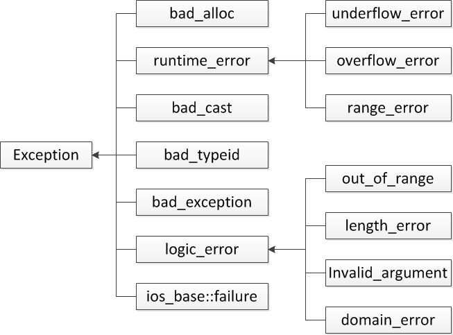

# 异常控制流（ECF）

突如其来的变化导致程序无法继续执行，而因应对突然情况转而执行其它的流程。作为开发者，理解 ECF 至关重要，有以下几个原因：

- **Understanding ECF will help you understand important systems concepts.** ECF is the basic mechanism that operating systems use to implement I/O, processes, and virtual memory. Before you can really understand these important ideas, you need to understand ECF.

- **Understanding ECF will help you understand how applications interact with the operating system.** Applications request services from the operating system by using a form of ECF known as a trap or system call. For example, writing data to a disk, reading data from a network, creating a new process, and terminating the current process are all accomplished by application programs invoking system calls. Understanding the basic system call mechanism will help you understand how these services are provided to applications.

- **Understanding ECF will help you write interesting new application programs.** The operating system provides application programs with powerful ECF mechanisms for creating new processes, waiting for processes to terminate, notifying other processes of exceptional events in the system, and detecting and responding to these events. If you understand these ECF mechanisms, then you can use them to write interesting programs such as Unix shells and Web servers.

- **Understanding ECF will help you understand concurrency.** ECF is a basic mechanism for implementing concurrency in computer systems. The following are all examples of concurrency in action: an exception handler that interrupts the execution of an application program; processes and threads whose execution overlap in time; and a signal handler that interrupts the execution of an application program. Understanding ECF is a first step to understanding concurrency.

- **Understanding ECF will help you understand how software exceptions work.** Languages such as C++ and Java provide software exception mechanisms via `try`, `catch`, and `throw` statements. Software exceptions allow the program to make nonlocal jumps (i.e., jumps that violate the usual call/return stack discipline) in response to error conditions. Nonlocal jumps are a form of application-level ECF and are provided in C via the `setjmp` and `longjmp` functions. Understanding these low-level functions will help you understand how higher-level software exceptions can be implemented.

**ECF exist at all levels of a computer system.**

类型：
① We start with exceptions, which lie at the intersection of the hardware and the operating system. ② We also discuss system calls, which are exceptions that provide applications with entry points into the operating system. ③ We then move up a level of abstraction and describe processes and signals, which lie at the intersection of applications and the operating system. ④ Finally, we discuss nonlocal jumps, which are an application-level form of ECF.

## Exceptions


An exception is an abrupt change in the control flow in response to some change in the processor's state.


When the processor detects that the event has occurred, it makes an indirect procedure call (the exception), through a jump table called an exception table, to an operating system subroutine (the exception handler) that is specifically designed to process this particular kind of event. When the exception handler finishes processing, one of three things happens, depending on the type of event that caused the exception:

1. The handler returns control to the current instruction, the instruction that was executing when the event occurred.

2. The handler returns control to next instruction, the instruction that would have executed next had the exception not occurred.

3. The handler aborts the interrupted program.

###  Exception Handling

Exceptions can be difficult to understand because handling them involves close cooperation between hardware and software.

Each type of possible exception in a system is assigned a unique nonnegative integer exception number. Some of these numbers are assigned by the designers of the processor. Other numbers are assigned by the designers of the operating system kernel (the memory-resident part of the operating system). Examples of the former include divide by zero, page faults, memory access violations, breakpoints, and arithmetic overflows. Examples of the latter include system calls and signals from external I/O devices.

At run time (when the system is executing some program), the processor detects that an event has occurred and determines the corresponding exception number k. The processor then triggers the exception by making an indirect procedure call, through entry k of the exception table, to the corresponding handler.

Once the hardware triggers the exception, the rest of the work is done in software by the exception handler. After the handler has processed the event, it optionally returns to the interrupted program by executing a special “return from interrupt” instruction, which pops the appropriate state back into the processor's control and data registers, restores the state to user mode (Section 8.2.4) if the exception interrupted a user program, and then returns control to the interrupted program.

### Classes of Exceptions

Exceptions can be divided into four classes: interrupts, traps, faults, and aborts.


|  Class | Cause  | Async/sync  |  Return behavior  |
| ------ | ------ | ----------- | ----------------- |
| Interrupt | Signal from I/O device        | Async | Always returns to next instruction     |
| Trap      | Intentional exception         | Sync  | Always returns to next instruction     |
| Fault     | Potentially recoverable error | Sync  | Might return to current instruction    |
| Abort     | Nonrecoverable error          | Sync  | Never returns                          |


#### Interrupts

Interrupts occur asynchronously as a result of signals from I/O devices that are external to the processor. Exception handlers for hardware interrupts are often called interrupt handlers.


I/O devices such as network adapters, disk controllers, and timer chips trigger interrupts by signaling a pin on the processor chip and placing onto the system bus the exception number that identifies the device that caused the interrupt.


#### Traps and System Calls

Traps is used to provide a procedure-like interface between user programs and the kernel, known as a system call. 


#### Faults

Faults result from error conditions that a handler might be able to correct. When a fault occurs, the processor transfers control to the fault handler.If the handler is able to correct the error condition, it returns control to the faulting instruction, thereby re-executing it(例如缺页中断). Otherwise, the handler returns to an abort routine in the kernel that terminates the application program that caused the fault（例如除零错误、算术溢出、段访问错误、权限错误）.

The page fault handler loads the appropriate page from disk and then returns control to the instruction that caused the fault. When the instruction executes again, the appropriate page is now resident in memory and the instruction is able to run to completion without faulting.


#### Aborts

Aborts result from unrecoverable fatal errors, typically hardware errors such as parity errors that occur when DRAM or SRAM bits are corrupted. Abort handlers never return control to the application program. the handler returns control to an abort routine that terminates the application program.


## Context Switches

### Processes

异常是操作系统内核能够提供进程概念的基础模块。
Exceptions are the basic building blocks that allow the operating system kernel to provide the notion of a process, one of the most profound and successful ideas in computer science.


现代操作系统提供了进程的抽象。The classic definition of a process is an instance of a program in execution. 进程营造出独占系统资源的假象。Each program in the system runs in the context of some process. The context consists of the state that the program needs to run correctly. This state includes the program's code and data stored in memory, its stack, the contents of its general purpose registers, its program counter, environment variables, and the set of open file descriptors.

- An independent logical control flow that provides the illusion that our program has exclusive use of the processor.
- A private address space that provides the illusion that our program has exclusive use of the memory system.


A detailed discussion of how operating systems implement processes is beyond our scope. Instead, we will focus on the key abstractions that a process provides to the application:

The key point is that processes take turns using the processor. Each process executes a portion of its flow and then is preempted (temporarily suspended) while other processes take their turns. To a program running in the context of one of these processes, it appears to have exclusive use of the processor. 


### Context Switches


The kernel maintains a context for each process. The context is the state that the kernel needs to restart a preempted process. It consists of the values of objects such as the general-purpose registers, the floating-point registers, the program counter, user's stack, status registers, kernel's stack, and various kernel data structures such as a page table that characterizes the address space, a process table that contains information about the current process, and a file table that contains information about the files that the process has opened.

上下文切换时各种异常处理流程发生时的核心流程。在一个异常发生时，需要先保存当前进程的上下文，然后才能进行异常的处理流程。当异常处理结束后，它需要根据结果来决定执行哪个进程，同时还原被选中执行的进程的上下文。上下文切换发生在任何异常控制流程发生时，当发成中断、陷阱、错误、中止时，都需要保存当前进程的上下文；而当异常处理程序结束是，决定了要继续执行哪个程序之后，又需要恢复该进程的上下文。这种上下文的保存和恢复就是上下文切换。

**The operating system kernel implements multitasking using a higher-level form of exceptional control flow known as a context switch. The context switch mechanism is built on top of the lower-level exception mechanism that we discussed。**


#### Interrupt
时钟中断。IO 


### Fault 内存保护，特权级保护

为了提供进程和虚拟内存的抽象，系统必须隐藏这些操作，避免其被普通的应用程序破坏，这就需要限制应用的执行权限。这就是特权级。

Processors typically provide this capability with a mode bit in some control register that characterizes the privileges that the process currently enjoys. When the mode bit is set, the process is running in kernel mode (sometimes called supervisor mode). A process running in kernel mode can execute any instruction in the instruction set and access any memory location in the system.

When the mode bit is not set, the process is running in user mode. A process in user mode is not allowed to execute privileged instructions that do things such as halt the processor, change the mode bit, or initiate an I/O operation. Nor is it allowed to directly reference code or data in the kernel area of the address space. Any such attempt results in a fatal protection fault. User programs must instead access kernel code and data indirectly via the system call interface.

A process running application code is initially in user mode. The only way for the process to change from user mode to kernel mode is via an exception such as an interrupt, a fault, or a trapping system call. When the exception occurs, and control passes to the exception handler, the processor changes the mode from user mode to kernel mode. The handler runs in kernel mode. When it returns to the application code, the processor changes the mode from kernel mode back to user mode.

当用户模式的程序执行了属于内核模式的指令时，就会触发错误。从而由异常表转入异常处理程序执行。

## Interceot between hardware and the operating system(Inteption)
                                                          
## System Call (Trap)

系统调用

## Signal

Trap 是应用使用内核功能的入口，而 Signal 则是系统向应用、或者应用之间发送消息的机制。

## 用户级异常控制流

异常时如此普遍，要得到最终的正确结果，虽然说条条大路通罗马，然而不通往罗马的道路可能更多，这些异常情况也是结果之一。很多编程语言提供了应用级异常处理方法，它们在应用发生异常时将应用拉回到合理的返回结果，而不是继续通往未知的结果。我们可以看到，随着计算机科学的发展，异常处理的机制越来越人性化，更易读、更少的处理、处理更多的异常情况。

1. 在 C 语言时代，没有异常捕获的概念，需要开发人员主动判断异常，然后跳转到一个处理异常的程序。

2. C++ 引入了异常捕获的机制，将异常处理流程泛化为一种异常捕获。异常处理的代码更加集中。

3. Java 让异常处理能力显著增强，能够捕获之前 C++ 不等捕获的一些异常，例如除零错误、空指针异常等等。

### Nonlocal jumps

C 提供了一种用户级的异常控制流形式——非局部跳转（nonlocal jump 全局跳转），将控制直接从一个方法转移到另一个正在执行的方法，而不必通过正常的调回返回形式。非局部跳转由 `setjmp` 和 `longjmp` 方法提供。

```C
#include <setjmp.h>
int setjmp(jmp_buf env);
int sigsetjmp(sigjmp_buf env, int savesigs);
				Returns: 0 from set jmp, nonzero from longjmps”
```

`setjmp` 函数将当前的调用环境保存到 `env` 中，用于稍后供 `longjmp` 使用，并返回结果 0。调用环境包括程序计数器，栈指针以及通用寄存器。由于一些原因（超出了讲解范围），不应该将 `setjmp` 返回的值赋给变量：

```C
rc = setjmp(env); /* Wrong! */
```
但是它却可以用作 switch 或条件语句中的测试条件。

```C
#include <setjmp.h>
void longjmp(jmp_buf env, int retval);
void siglongjmp(sigjmp_buf env, int retval);
Never returns
```
`longjmp` 函数从 env 中恢复调用环境，然后触发最近一次 `setjmp` 调用初始化 `env` 的返回。这次 `setjump` 将返回一个非零值。

`setjmp` 和 `longjmp` 之间的相互作用乍一看可能令人困惑。`setjmp` 方法调用一次但是返回多次：一次是在 `setjmp` 首次被调用并且调用环境被保存到 env 中，其余则是每次对应的 `longjmp` 调用时。与此相应的是，`longjmp` 每次被调用从不返回。

非局部跳转的一个重要应用是允许从深度嵌套的函数调用中立即返回，通常是检测到一些错误之后的结果。如果在嵌套函数调用的深处检测到错误条件，可以使用非局部跳转直接返回到通用的高内聚错误处理程序，而不必费力地回退调用堆栈。

如下代码展示了可能的应用示例。main 程序首先调用 `setjmp` 保存当前的调用环境，接着调用 `foo` 方法，然其调用 `bar` 函数。如果 foo 和 bar 遇到错误时，就立即调用 `longjmp` 从 `setjmp` 返回。`setjmp` 的非零返回值指示错误的类型，接着**可以在的一个位置对其进行解码和处理，这样错误处理的代码更加内聚，而不是散落在各处。程序代码也不会因为包含各种错误处理而变得冗长而降低了可读性。**

```C
#include "csapp.h"

jmp_buf buf;

int error1 = 0;
int error2 = 1;

void foo(void), bar(void);

int main()
{
	switch(setjmp(buf)) {
	case 0:
		foo();
		break;
	case 1:
		printf("Detected an error1 condition in foo\n");
		break;
	case 2:
		printf("Detected an error2 condition in foo\n");
		break;
	default:
		printf("Unknown error condition in foo\n");
	}
	exit(0);
}

/* Deeply nested function foo */
void foo(void)
{
	if (error1)
		longjmp(buf, 1);
	bar();
}

void bar void)
{
	if (error2)
		longjmp(buf, 2);
}
```

longjmp 允许跳过所有中间调用的特性可能会产生意想不到的后果。例如，如果在中间函数调用中分配了一些数据结构，并打算在函数结束时释放它们，则会跳过释放代码，从而造成内存泄漏。

非局部跳转的另一个重要应用是将信号处理程序切换到特定的代码位置，而不是返回到因信号触发而中断的指令。下面的代码显示了一个简单的程序，它演示了这种基本技术。当用户在键盘上键入 Ctrl+C 时，该程序使用信号和非局部跳转来执行软重启。`sigsetjmp` 和 `siglongjmp` 函数是 `setjmp` 和 `longjmp` 可以使用在信号处理程序中的的版本。

```C
#include "csapp.h"

sigjmp_buf buf;

void handler(int sig)
{
	siglongjmp(buf, 1);
}

int main()
{
	if (!sigsetjmp(buf, 1)) {
		Signal(SIGINT, handler);
		Sio_puts("starting\n");
	}
	else
		Sio_puts("restarting\n");

	while(1) {
		Sleep (1);
		Sio_puts("processing...\n");
	}
	exit(0); /* Control never reaches here */
}
```

当程序第一次启动时，对 `sigsetjmp` 函数的初始调用保存调用环境和信号上下文(包括挂起和阻塞的信号向量)。然后主例程进入无限处理循环。当用户键入Ctrl+C时，内核向进程发送一个 SIGINT 信号，由进程捕获该信号。处理程序不是从信号处理程序返回，而是执行非局部跳转回主程序的开头，而信号处理程序会将控制传递回被中断的处理循环。当我们在系统上运行该程序时，得到以下输出:

```
linux> ./restart
starting
processing...
processing...
Ctrl+C
restarting
processing...
Ctrl+C
restarting
processing...
```
这个程序有几个有趣的地方。首先，为了避免竞争，我们必须在调用 `sigsetjmp` 之后设置处理程序。否则，我们将面临处理程序调用 `sigsetjmp` 设置环境之前 `siglongjmp` 运行的风险。其次，你可能已经注意到 `sigsetjmp` 和 `siglongjmp` 函数不在异步信号安全函数列表中，原因是通常 `siglongjmp` 可以跳转到任意代码中。因此我们必须小心地只调用从 `siglongjmp` 可访问的任何代码中的安全函数。在我们的例子中，我们调用安全的 `sio_puts` 和 `sleep` 方法。不安全的 `exit` 函数是不可达的。


> 【旁注】C++和Java中的软件异常
C++ 和 Java 提供的异常机制是 C `setjmp` 和 `longjmp` 函数的更高级、更结构化的版本。可以将 `try` 语句中的 `catch` 子句看作类似于 `setjmp` 函数。类似地，`throw` 语句类似于 `longjmp` 函数。


## 应用级的异常体系

### C

C 开发的时代还没有标准的异常系统概念，只能自己在函数中判断异常类型，并 `return` 对应的标志位。或者使用 `setjmp` 和 `longjmp` 来跳转到同一的地方来处理异常。这些流程都由开发者自己负责，比较麻烦。

另一方面，异常的类型得返回方式也各不相同。其中广泛使用的返回方式，有三种类型：
- 设置标志位
- 通过 return 类型返回
- 通过


### C++

**C++ throw 可以抛出任意类型，只要 catch 语句中的类型和抛出类型相匹配就可以捕获异常。**

C++ 的标准定了一组异常，用于表示语言和标准库中发生异常的类型。这些异常都有继承关系。**理想情况下，我们的异常也应该继承这些异常的一个，以便处理异常能够更好的合并类型。**



这些异常使用场景：
- runtime_error: 只有在运行时才能检测出的问题(stdexcept 头文件)
	- overflow_error: 运行时错误:计算上溢
	- underflow_error: 运行时错误:计算下溢
	- range_error: 运行时错误:生成的结果超出了有意义的值域范围
- logic_error: 逻辑错误。(stdexcept 头文件)
	- out_of_range: 使用一个超出有效范围的值
	- length_error: 试图创建一个超出该类型最大长度的对象
	- invalid_argument: 无效参数
	- domain_error: 参数对应的结果值不存在
- bad_alloc: (new头文件)
- bad_cast: 类型转换异常（type_info头文件）
- bad_typid:
- bad_exception:

exception、 bad_alloc和bad_cast只能以默认初始化的方式初始化对象，不允许为这些对象提供初始值。其他异常类型的行为则恰好相反:应该使用string对象或者C风格字符串初始化这些类型的对象，但是不允许使用默认初始化的方式。当创建此类对象时，必须提供初始值，该初始值含有错误相关的信息。

### Java


## 异常安全代码

> 提示:编写异常安全的代码非常困难

要好好理解这句话:异常中断了程序的正常流程。异常发生时，调用者请求的一部 分计算可能已经完成了，另一部分则尚未完成。通常情况下，略过部分程序意味着某些 对象处理到一半就戛然而止，从而导致对象处 于无效或未完成的状态，或者资源没有正 常释放，等等。那些在异常发生期间正确执行了“清理” 工作的程序被称作异常安全 (exception safe )的代码。然而经验表明，编写异常安全的代码非常困难，这部分知识也 (远远)超出了本书的范围。 对于一些程序来说，当异常发生时只是简单地终止程序。此时，我们不怎么需要担心异常安全的问题。

但是对于那些确实要处理异常并继续执行的程序，就要加倍注意了。我们必须时刻清楚异常何时发生，异常发生后程序应如何确保对象有效、资源无泄漏、程序处于合理状态，等等。

当异常发生时，控制权从一处转移到另一处，这有两个重要的含义:
• 沿着调用链的函数可能会提早退出。
• 一旦程序开始执行异常处理代码，则沿着调用链创建的对象将被销毁。
因为跟在 throw 后面的语句将不再被执行，所以 throw 语句的用法有点类似于 return 语句:它通常作为条件语句的一部分或者作为某个函数的最后(或者唯一)一条语句

### 栈展开

寻找处理代码的过程与函数调用链刚好相反，被选中的处理代码是在调用链中与抛出对象类型匹配的最近的处理代码。

当抛出一个异常后，程序暂停当前函数的执行过程并立即开始寻找与异常匹配的 catch 子句。当 throw 出现在一个 try 语句块(tryblock)内时，检查与该 try 块关联的catch 子句。如果找到了匹配的cat ch，就使用该catch处理异常。如果这一步没找 到匹配的catch 且该try语句嵌套在其他try块中，则继续检查与外层try匹配的 ca tch 子句。如果还是找不到匹配的catch，则退出当前的函数，在调用当前函数的外层函数中继续寻找。以此类推。这个过程被称为栈展开(stack unwinding)过程。栈展开过程沿着嵌套函数的调用链不断查找，直到找到了与异常匹配的 catch 子句为止:或者也可能一直没找到匹配的 catch，则退出主函数后查找过程终止。

假设找到了一个匹配的 catch 子句，则程序进入该子句并执行其中的代码。当执行 完这个catch 子句后，找到与try块关联的最后一个catch 子句之后的点，并从这里 继续执行。

如果最终还是没能找到任何匹配的 catch 子句，程序转到名为 terminate 的标准库函数。该函数的行为与系统有关，一般情况下，执行该函数将导致程序非正常退出。

对于那些没有任何 try 语句块定义的异常，也按照类似的方式处理：毕竟，没有 try 语句块也就意味着没有匹配的 catch 子句。如果一段程序没有 try 语句块且发生了异常， 系统会调用 terminate 函数并终止当前程序的执行。

> 栈展开过程中对象被自动销毁

在栈展开过程中，位于调用链上的语句块可能会提前退出。通常情况 下，程序在这些块中创建了一些局部对象。我们已经知道，块退出后它的局部对象也将随之销毁，这条规则对于栈展开过程同样适用。**如果在栈展开过程中退出了某个块，编译器将负责确保在这个块中创建的对象能被正确地销毁。如果某个局部对象的类型是类类型，则该对象的析构函数将被自动调用。**与往常一样，编译器在销毁内置类型的对象时不需要做任何事情。

**如果异常发生在构造函数中，则当前的对象可能只构造了一部分。有的成员已经初始化了，而另外一些成员在异常发生前也许还没有初始化。即使某个对象只构造了一部分， 我们也要确保已构造的成员能被正确地销毁。**

**类似的，异常也可能发生在数组或标准库容器的元素初始化过程中。与之前类似，如果在异常发生前已经构造了一部分元素，则我们应该确保这部分元素被正确地销毁。**

> 析构函数与异常
析构函数总是会被执行的，但是函数中负责释放资源的代码却可能被跳过，这一特点对于我们如何组织程序结构有重要影响。如我们在12.1.4节(第415页)介绍过的，如果一个块分配了资源，并且在负责释放这些资源的代码前面发生了异常，则释放资源的代码将不会被执行。另一方面，类对象分配的资源将由类的析构函数负责释放。因此，如果我们使用类来控制资源的分配，就能确保无论函数正常结束还是遭遇异常，资源都能被正确地释放。
析构函数在栈展开的过程中执行，这一事实影响着我们编写析构函数的方式。在栈展开的过程中，已经引发了异常但是我们还没有处理它。如果异常抛出后没有被正确捕获，则系统将调用terminate函数。因此，出于栈展开可能使用析构函数的考虑，析构函数不应该抛出不能被它自身处理的异常。换句话说，如果析构函数需要执行某个可能抛出异常的操作，则该操作应该被放置在一个try语句块当中，并且在析构函数内部得到处理。

在实际的编程过程中，因为析构函数仅仅是释放资源，所以它不太可能抛出异常。所有标准库类型都能确保它们的析构函数不会引发异常。

WARNING
在栈展开的过程中，运行类类型的局部对象的析构函数。因为这些析构函数是自动执行的，所以它们不应该抛出异常。一旦在找展开的过程中析构函数拋出了异常，并且析构函数自身没能捕获到该异常，则程序将被终止。