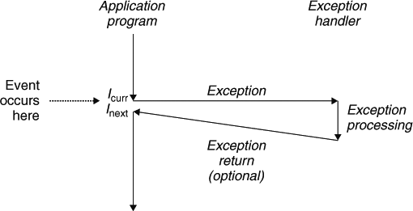
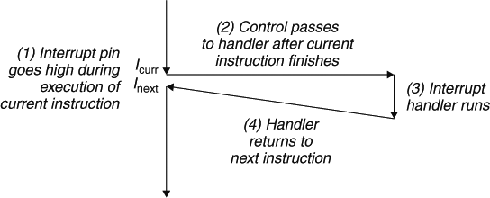
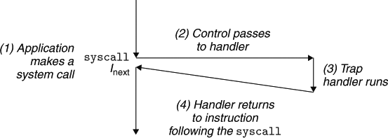
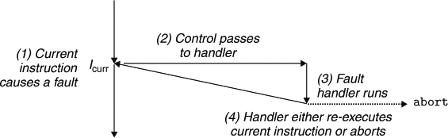
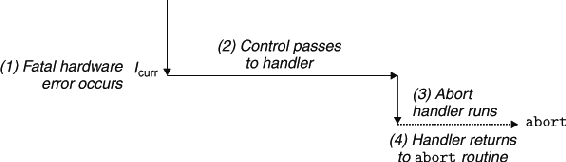

# 异常控制流（ECF）

突如其来的变化导致程序无法继续执行，而因应对突然情况转而执行其它的流程。作为开发者，理解 ECF 至关重要，有以下几个原因：

- **Understanding ECF will help you understand important systems concepts.** ECF is the basic mechanism that operating systems use to implement I/O, processes, and virtual memory. Before you can really understand these important ideas, you need to understand ECF.

- **Understanding ECF will help you understand how applications interact with the operating system.** Applications request services from the operating system by using a form of ECF known as a trap or system call. For example, writing data to a disk, reading data from a network, creating a new process, and terminating the current process are all accomplished by application programs invoking system calls. Understanding the basic system call mechanism will help you understand how these services are provided to applications.

- **Understanding ECF will help you write interesting new application programs.** The operating system provides application programs with powerful ECF mechanisms for creating new processes, waiting for processes to terminate, notifying other processes of exceptional events in the system, and detecting and responding to these events. If you understand these ECF mechanisms, then you can use them to write interesting programs such as Unix shells and Web servers.

- **Understanding ECF will help you understand concurrency.** ECF is a basic mechanism for implementing concurrency in computer systems. The following are all examples of concurrency in action: an exception handler that interrupts the execution of an application program; processes and threads whose execution overlap in time; and a signal handler that interrupts the execution of an application program. Understanding ECF is a first step to understanding concurrency.

- **Understanding ECF will help you understand how software exceptions work.** Languages such as C++ and Java provide software exception mechanisms via `try`, `catch`, and `throw` statements. Software exceptions allow the program to make nonlocal jumps (i.e., jumps that violate the usual call/return stack discipline) in response to error conditions. Nonlocal jumps are a form of application-level ECF and are provided in C via the `setjmp` and `longjmp` functions. Understanding these low-level functions will help you understand how higher-level software exceptions can be implemented.

**ECF exist at all levels of a computer system.**

类型：
① We start with exceptions, which lie at the intersection of the hardware and the operating system. ② We also discuss system calls, which are exceptions that provide applications with entry points into the operating system. ③ We then move up a level of abstraction and describe processes and signals, which lie at the intersection of applications and the operating system. ④ Finally, we discuss nonlocal jumps, which are an application-level form of ECF.

## Exceptions

An exception is an abrupt change in the control flow in response to some change in the processor's state.

When the processor detects that the event has occurred, it makes an indirect procedure call (the exception), through a jump table called an exception table, to an operating system subroutine (the exception handler) that is specifically designed to process this particular kind of event. When the exception handler finishes processing, one of three things happens, depending on the type of event that caused the exception:

1. The handler returns control to the current instruction, the instruction that was executing when the event occurred.

2. The handler returns control to next instruction, the instruction that would have executed next had the exception not occurred.

3. The handler aborts the interrupted program.

###  Exception Handling

Exceptions can be difficult to understand because handling them involves close cooperation between hardware and software.

Each type of possible exception in a system is assigned a unique nonnegative integer exception number. Some of these numbers are assigned by the designers of the processor. Other numbers are assigned by the designers of the operating system kernel (the memory-resident part of the operating system). Examples of the former include divide by zero, page faults, memory access violations, breakpoints, and arithmetic overflows. Examples of the latter include system calls and signals from external I/O devices.

At run time (when the system is executing some program), the processor detects that an event has occurred and determines the corresponding exception number k. The processor then triggers the exception by making an indirect procedure call, through entry k of the exception table, to the corresponding handler.

Once the hardware triggers the exception, the rest of the work is done in software by the exception handler. After the handler has processed the event, it optionally returns to the interrupted program by executing a special “return from interrupt” instruction, which pops the appropriate state back into the processor's control and data registers, restores the state to user mode (Section 8.2.4) if the exception interrupted a user program, and then returns control to the interrupted program.

### Classes of Exceptions

Exceptions can be divided into four classes: interrupts, traps, faults, and aborts.

|  Class | Cause  | Async/sync  |  Return behavior  |
| ------ | ------ | ----------- | ----------------- |
| Interrupt | Signal from I/O device        | Async | Always returns to next instruction     |
| Trap      | Intentional exception         | Sync  | Always returns to next instruction     |
| Fault     | Potentially recoverable error | Sync  | Might return to current instruction    |
| Abort     | Nonrecoverable error          | Sync  | Never returns                          |

#### Interrupts

Interrupts occur asynchronously as a result of signals from I/O devices that are external to the processor. Exception handlers for hardware interrupts are often called interrupt handlers.

I/O devices such as network adapters, disk controllers, and timer chips trigger interrupts by signaling a pin on the processor chip and placing onto the system bus the exception number that identifies the device that caused the interrupt.

#### Traps and System Calls

Traps is used to provide a procedure-like interface between user programs and the kernel, known as a system call. 

#### Faults

Faults result from error conditions that a handler might be able to correct. When a fault occurs, the processor transfers control to the fault handler.If the handler is able to correct the error condition, it returns control to the faulting instruction, thereby re-executing it(例如缺页中断). Otherwise, the handler returns to an abort routine in the kernel that terminates the application program that caused the fault（例如除零错误、算术溢出、段访问错误、权限错误）.

The page fault handler loads the appropriate page from disk and then returns control to the instruction that caused the fault. When the instruction executes again, the appropriate page is now resident in memory and the instruction is able to run to completion without faulting.

#### Aborts

Aborts result from unrecoverable fatal errors, typically hardware errors such as parity errors that occur when DRAM or SRAM bits are corrupted. Abort handlers never return control to the application program. the handler returns control to an abort routine that terminates the application program.

## Context Switches

### Processes

异常是操作系统内核能够提供进程概念的基础模块。
Exceptions are the basic building blocks that allow the operating system kernel to provide the notion of a process, one of the most profound and successful ideas in computer science.

现代操作系统提供了进程的抽象。The classic definition of a process is an instance of a program in execution. 进程营造出独占系统资源的假象。Each program in the system runs in the context of some process. The context consists of the state that the program needs to run correctly. This state includes the program's code and data stored in memory, its stack, the contents of its general purpose registers, its program counter, environment variables, and the set of open file descriptors.

- An independent logical control flow that provides the illusion that our program has exclusive use of the processor.
- A private address space that provides the illusion that our program has exclusive use of the memory system.

A detailed discussion of how operating systems implement processes is beyond our scope. Instead, we will focus on the key abstractions that a process provides to the application:

The key point is that processes take turns using the processor. Each process executes a portion of its flow and then is preempted (temporarily suspended) while other processes take their turns. To a program running in the context of one of these processes, it appears to have exclusive use of the processor. 

### Context Switches
上下文切换时各种异常处理流程发生时的核心流程。在一个异常发生时，需要先保存当前进程的上下文，然后才能进行异常的处理流程。当异常处理结束后，它需要根据结果来决定执行哪个进程，同时还原被选中执行的进程的上下文。上下文切换发生在任何异常控制流程发生时，当发成中断、陷阱、错误、中止时，都需要保存当前进程的上下文；而当异常处理程序结束是，决定了要继续执行哪个程序之后，又需要恢复该进程的上下文。这种上下文的保存和恢复就是上下文切换。

The operating system kernel implements multitasking using a higher-level form of exceptional control flow known as a context switch. The context switch mechanism is built on top of the lower-level exception mechanism that we discussed。

The kernel maintains a context for each process. The context is the state that the kernel needs to restart a preempted process. It consists of the values of objects such as the general-purpose registers, the floating-point registers, the program counter, user's stack, status registers, kernel's stack, and various kernel data structures such as a page table that characterizes the address space, a process table that contains information about the current process, and a file table that contains information about the files that the process has opened.

#### Interrupt
时钟中断。IO 

### Fault 内存保护，特权级保护

为了提供进程和虚拟内存的抽象，系统必须隐藏这些操作，避免其被普通的应用程序破坏，这就需要限制应用的执行权限。这就是特权级。

Processors typically provide this capability with a mode bit in some control register that characterizes the privileges that the process currently enjoys. When the mode bit is set, the process is running in kernel mode (sometimes called supervisor mode). A process running in kernel mode can execute any instruction in the instruction set and access any memory location in the system.

When the mode bit is not set, the process is running in user mode. A process in user mode is not allowed to execute privileged instructions that do things such as halt the processor, change the mode bit, or initiate an I/O operation. Nor is it allowed to directly reference code or data in the kernel area of the address space. Any such attempt results in a fatal protection fault. User programs must instead access kernel code and data indirectly via the system call interface.

A process running application code is initially in user mode. The only way for the process to change from user mode to kernel mode is via an exception such as an interrupt, a fault, or a trapping system call. When the exception occurs, and control passes to the exception handler, the processor changes the mode from user mode to kernel mode. The handler runs in kernel mode. When it returns to the application code, the processor changes the mode from kernel mode back to user mode.

当用户模式的程序执行了属于内核模式的指令时，就会触发错误。从而由异常表转入异常处理程序执行。

## Interceot between hardware and the operating system(Inteption)

## System Call (Trap)

系统调用

## Signal

Trap 是应用使用内核功能的入口，而 Signal 则是系统向应用、或者应用之间发送消息的机制。

## Nonlocal jumps