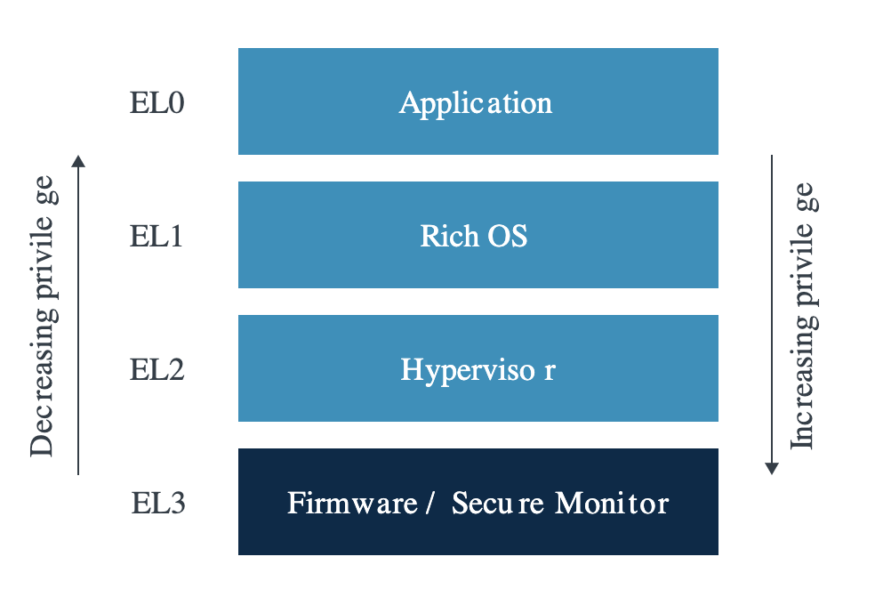
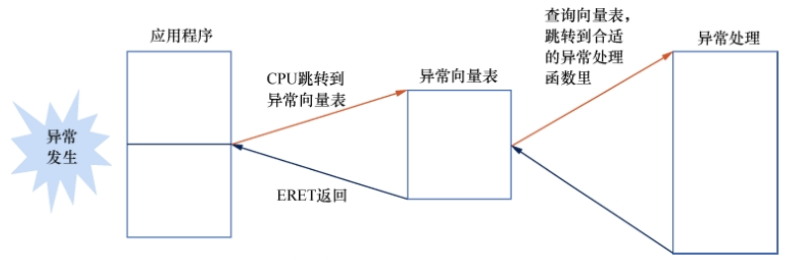
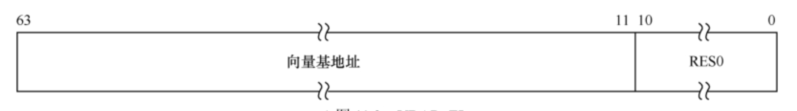
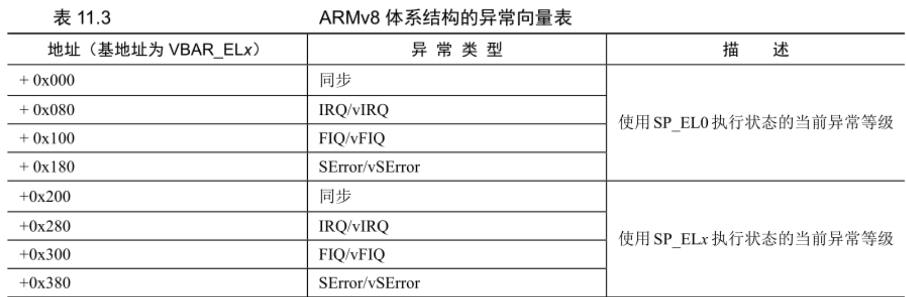
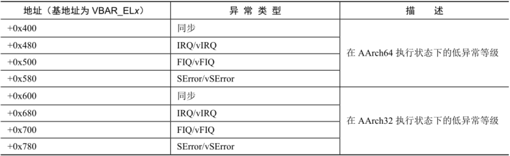
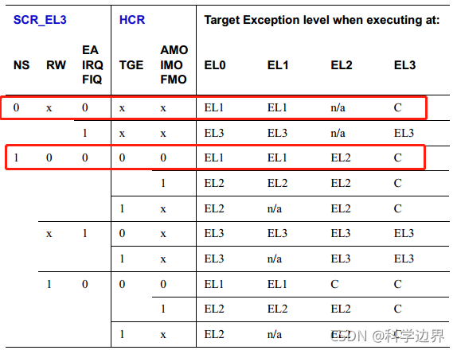

# ARM64 异常模型

以 ARM64 的异常模型来研究实际的异常模型实现，真实的理解整个计算机系统是如何建立在异常模型之上的。ARM64 架构有四个特权级，它们在 ARM64 中被称为异常级（Exception Level）。为了统一，这里也使用`异常级`这一术语。

- 四个特权级被称为 EL0~EL3，数字越大权限越高。EL0 和 EL1 是强制性的必须实现的异常级别，EL2 和 EL3 为可选实现。

- 所有的程序都运行在上述四种异常级之一。优先级越高，可以执行的指令，访问的寄存器越多。一些指令只能在某个优先级及以上才能执行。ARM64 中 `_ENx` 后缀的寄存器就是能够访问该寄存器的最低异常级。

- EL0 是应用的的运行级别，EL1 是系统的异常级别，EL2 是虚拟机监控程序的异常级别，实现了该异常级的硬件支持硬件虚拟化，虚拟机运行在更加高效。EL3 是固件和安全监控。

- X86 的 CPU 在 CPU 启动（reset）后运行在最低的特权级（应用特权级），需要将系统为高特权级准备好后，开启特权级，操作系统才开运行在高特权级。ARM 没有历史兼容性问题，**系统加电/Reset 后 CPU 运行在最高特权级**（EL3 / EL1）。

- Linux 内核要求 Bootloader 在跳转到内核执行时，要在 EL2(推荐，为了访问虚拟化扩展)或者 EL1。

系统异常四种类型：interrupts, traps, faults, and aborts.

|  Class    | Cause      | Async/sync  |  Return behavior  |
| --------- | ---------- | ----------- | ----------------- |
| 中断       | 来自外设    | 异步发生      | 返回到下一条指令执行 |
|Trap/软中断 |软件主动触发  | 同步         | 返回到下一条指令执行 |
| 错误       | 指令执行错误 | 同步         | 当前或下一条指令执行 |
| 中止       | 不可恢复错误 | 同步         | 不会继续执行       |

- 中断：外设发生的事件有两种方式处理：1，CPU 周期性的查询，这种方式太低效，浪费了大量的 CPU 资源，很少在高性能 CPU 中使用，只在单片机中存在。2. 外设通过 CPU 的引脚触发一个电平通知 CPU，这种方式被称为中断。它打断了 CPU 当前正在执行的程序，转而去处理外设的事件（例如打字、插入U盘等、定时器）。ARM64 处理器中，中断被细分为两种：普通中断请求 IRQ(Interrupt Request)，快速中断请求 FIQ(Fast Interrupt Request)。外设的中断类型非常多，而且会发生冲突，为此，需要有一个电路/芯片进行仲裁，它被称为中断控制器，所有的外设连接到这个中断控制器，由其将判断优先级和分发到哪个 CPU。

- 错误：也被称为异常。它是程序执行时出现的错误，例如非法的指令、访问 ARM 引起的缺页异常、执行高于本特权级的指令等等。

- Trap: 在 X86 上也被称为软中断，因为它是由执行的程序主动触发的，例如进行一个系统调用，从低异常级切换到高异常级需要通过该途径。

- 终止：系统重大错误无法继续执行，一般由 CPU 硬件处理，例如 CPU 本身出现问题，系统被重置。[ARM64 中的 SError（System error）异常就是这种类型的异常。](http://www.wowotech.net/?post=238)

终止异常无法处理，不用操作系统处理。其它三种异常（中断、错误、trap）虽然触发的方式不相同，但他们的处理的总体流程完全一致。

程序执行时，发生了一个异常，就会导致 CPU 跳转到异常向量表执行。在异常向量表里判断异常的类型，跳转到合适的异常处理函数处理异常，处理完之后，恢复程序的执行，或者切换到其它的程序继续执行。

## 1. 异常处理与返回

当异常发生时，CPU 的内部会发现异常并自动完成一下的操作：

- 把 PSTATE 寄存器的值保存到对应的`目标异常级`的 SPSR_ENx 中。
- 把返回地址保存到对应`目标异常级`的 ELR_ENx 中。
- 把 PSTATE 寄存器的里的 D、A、I、F 标志位都设置为 1，即将 Debug、SError、IRQ 和 FIQ 都关闭。
- 对于同步异常将异常触发的原因存放到 ESR_ENx 寄存器中。
- 使用目标异常级 SP_ENx 寄存器作为栈寄存器。
- 从异常发生的异常级切换到目标异常级，跳转到异常向量表里对应的异常向量执行。

## 2. 异常向量表

`异常向量表` 是从低异常级到高异常级的入口，在 ARM64 中每个异常级的都有一个异常向量表（EL0 除外，因为没有更低的异常级需要进入该异常级）。即 EL3、EL2、EL 各有一个异常向量表。表的首地址存放在 `VBAR_ENx` 寄存器中，但该寄存器的 0~10 位为保留的，因此异常向量表必须为 2KB 地址对齐。

ARM64 的每个表项占128字节，可以存放 32 条指令（每个指令4字节），

- 每个异常向量表分为四组，前两组为`当前异常级`的入口，后两组为`低异常级`的入口。
- 第一组的目标异常级为 EL0，即向量表的执行异常级为 EL0。第二组为在当前异常级执行异常向量表的内容。
- 第三组是 AArch64 执行模式触发的异常。第四组的 AArch32 模式的程序触发的异常。

举例来说，①运行在 EL1 异常级的操作系统触发异常时，并且被设置为在 EL1 异常级处理异常，则选择第二组向量表。②运行在 EL0 异常级的 64 位应用程序触发异常，则会选择第三组异常向量表项。③运行在 EL0 级的 32 位应用程序则会进入第四组异常处理表项。

- SError、IRQ、FIQ 为物理中断、vSError、vIRQ、vFIQ 为虚拟中断。

对于操作系统来说，EL3 不在操作系统的维护范围。例如 Linux 内核只会为 EL1, EL2 建立中断向量表。`arch/arm64/kernel/entry.S` 的 vectors 是 EL1 的中断向量表，`arch/arm64/kernel/hyp-stub.S` 的 __hyp_stub_vectors 是为虚拟机管理程序的中断向量表。

### [异常处理路由](https://blog.csdn.net/luteresa/article/details/120263414)

当异常发生时，PC可以有三个基地址VBAR_EL1、VBAR_EL3、VBAR_EL1(secure)供选择；根据 SCR_EL3 和 HCR_EL2 寄存器的配置，路由规则如下：

举两例来说明下：
第一个红色框的内容表示：在此种配置(安全模式)下，EL0和EL1状态下产生的异步异常，会导致CPU进入EL1。
第一个红色框的内容表示：在此种配置(非安全模式)下，EL0和EL1状态下产生的异步异常，会导致CPU进入EL1，而EL2状态下产生的异常，不会导致exception level切换。

更详细的寄存器配置：https://blog.csdn.net/sinat_32960911/article/details/127856639

## 3. 异常处理返回

异常处理完成后，使用 ERET 即可从异常返回，这条指令自动完成如下操作：

- 从 ELR_ELx 中恢复 PC 寄存器
- 从 SPSR_ELx 中恢复 PSTATE 寄存器的状态。*即把调试异常、SError、IRQ、FIQ 都恢复到程序执行的状态，相当于是打开。*
- 恢复栈
  

## 系统调用

ARM64 提供了专有的指令更高等级的程序提供的服务，这通常是实现系统调用的方法。

SVC: 用户态应用程序请求操作系统内核的服务。
HVC: 客户操作系统请求虚拟机监控器的服务。
SMC: 非安全层的程序请求安全监控器的服务。

## 相关的寄存器:

SPSR_ELx: PSTATE 状态和返回控制寄存器。SPSR.M[3:0] 记录返回哪个异常级，SPSR.M[4] 表示执行在 AArch64 还是 AArch32 模式，0 表示 AArch64 模式。
ELR_ENx: 返回地址寄存器
ESR_ENx: 异常综合信息寄存器（Exception Syndrome Register）。根据该寄存器来判断异常的原因。
SP_ENx: 栈寄存器
VBAR_ENx: 异常向量表地址寄存器
SCTLR_ENx: 系统控制寄存器。

x ∈ [1, 2, 3]

SPSel 栈指针配置寄存器。SP 为 0 表示所有的异常级都是用 SP_EL0 作为栈指针。此时需要使用 t 后缀表示 SP_EL0 寄存器。例如，在 EL1 中使用 SP_EL1t 来使用 SP_EL0 寄存器。1 表示使用对应的 SP_ELx 作为栈寄存器。此时使用 `h` 后缀表示对应的寄存器。例如，在 EL1 中使用 SP_EL1h 来使用 SP_EL1 寄存器。**栈必须是 16 字节对齐的。**

SCR_EL3 和 HCR_EL2 寄存器

CurrentEL: 使用 Bit[2~3] 两位表示当前的异常级，恰好能存放 0~3四个数字，其它位为保留位 0。
