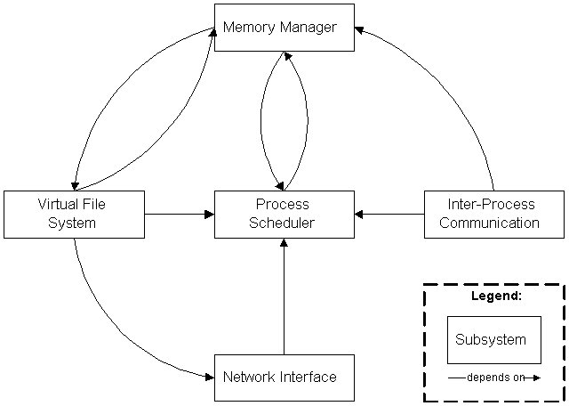

# OS

OS 设计的四个核心概念：
- 抽象
- 虚拟
- 持久化
- 安全

Linux 内核的五大组成部分：
- 进程管理
- 内存管理
- 文件系统（设备驱动）
- 网络接口
- 进程间通信

- [启动流程](startup.md)
  - [起步](first_step.md)
- [调试方法](debug.md)
- [内存管理模块](core_subsystem/memory_management/README.md)
- [进程管理](process.md)

Tools:
- [编译 Docker](build_docker/README.md)
- [调试环境](debug.md)
    - [VsCode 调试自动运行 Qemu 的 task](https://github.com/YaowenGuo/.vscode/blob/master/launch.json)

扩展阅读：
- [UEFI](uefi.md)
- [BIOS](bios.md)
- [MBR与GUID磁盘分区](disk_partition.md)
- [X86 计算机内存的特殊区间](x86_physical_memory.md)
- [config](kconfig.md)
- [Kernel build system](kbuild.md)

TODO:
1. StartKernel 之前做的事情 文档
