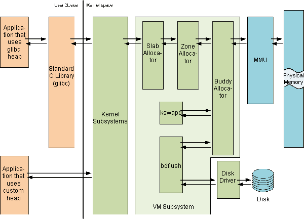

# Linux 内存管理子系统

Memory (de)allocation may be different for entities like user mode processes, drivers, etc. To satisfy memory allocation requirements Linux uses different memory allocators. It checks for free memory threshold in required zone (watermarks), if allocation fails, the kernel go through page rotation and tries to free memory.

- 物理内存管理是以页为单位的。

- 伙伴系统（buddy system）是以**页为单位管理和分配内存**。

- Slub 负责更细的内存分配。(Linux 6.4 移除 Slob，6.8 移除 Slab)

alloc_pages/__get_free_page: 以页为单位分配，以 Buddy 为基础。
slab allocator，字节为单位。
vmalloc: 以字节为单位分配虚拟地址连续的内存块
kmalloc: 以字节为单位分配物理地址连续的内存块，它是以slab为基础的

[物理内存管理](physical_memory_management.md)
[伙伴系统](buddy_allocator.md)