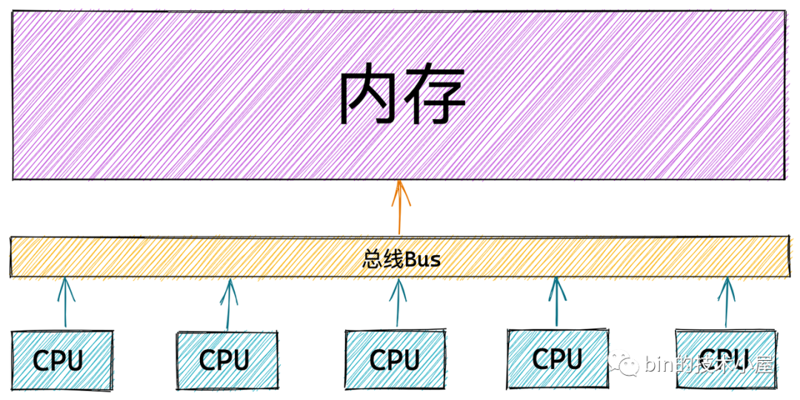
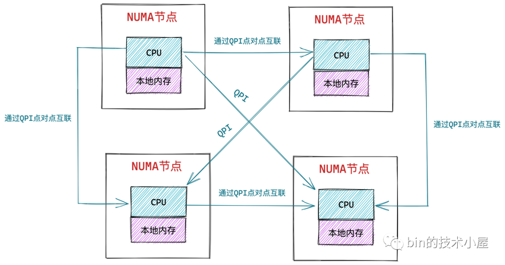
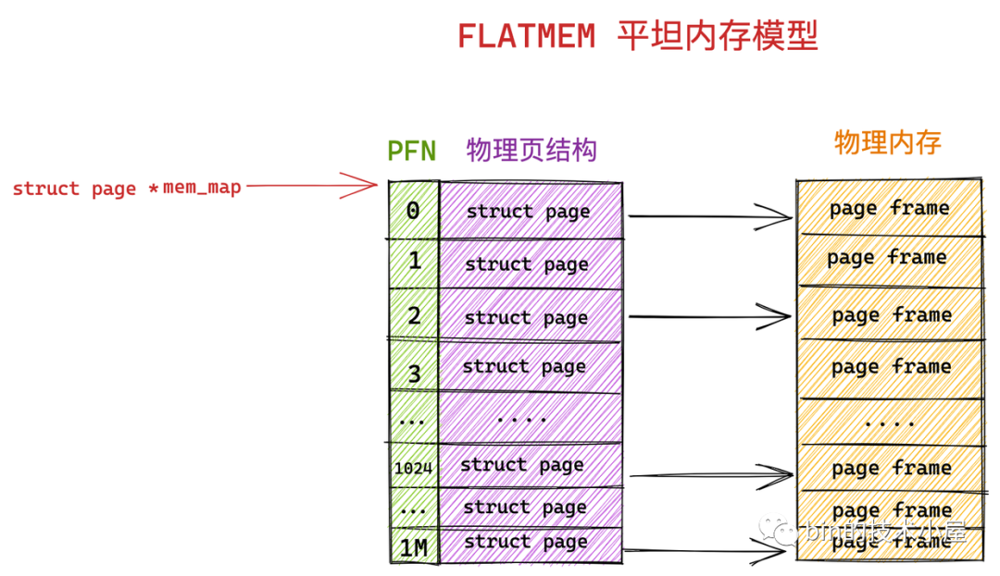
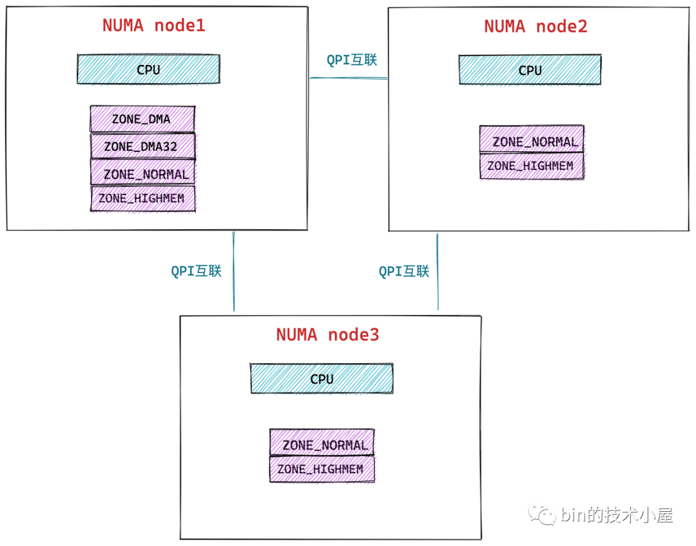
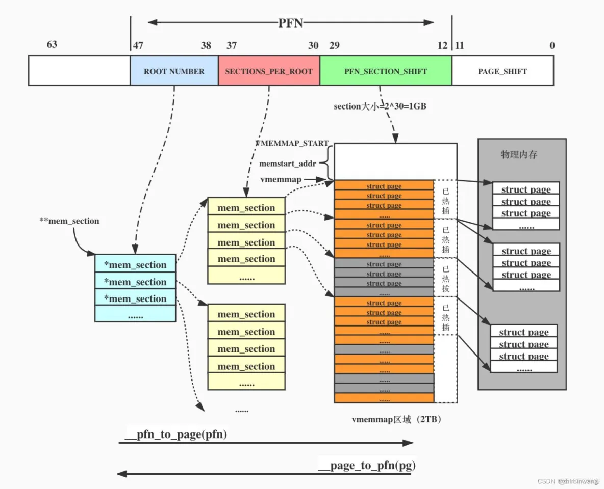

# [物理内存模型](https://docs.kernel.org/mm/memory-model.html)

具体概念请查看：https://z.itpub.net/article/detail/9B9C74A9BACEA1F7E79EC91FE89BB887，本文主要基于 Linux 6.10 内核更新描述，以及补充一些更新。
https://blog.csdn.net/weixin_45337360/article/details/128004665


根据硬件架构，Linux 从软件角度抽象出了三级数据结构来抽象和管理物理内存：node，zone 和page frame。

## 重要的概念：节点->区域->页框

这三个概念对应这内核物理内存管理中的三个重要数据结构：pglist_data、zone、page。要理解内核为什么这样设计，需要先理解这三个重要的概念。

### 节点（UMA 和 NUMA) 

#### UMA

早期 CPU 只有一个内核，CPU 通过总线与内存相连接。后来多核设计出现在 CPU 设计中，因为内存是公共的，为了简单，多个 CPU 核复用同一总线和内存相连接。由于多个 CPU 核是完全平等的，这种处理器也被称为对称多处理器（SMP —— Symmetric MultiProcessing）。



在 UMA 架构下，多个 CPU 位于总线的一侧，所有的内存条组成一大片内存位于总线的另一侧，所有的 CPU 访问内存都要过总线，而且“距离”（访问时间）都是一样的，由于所有 CPU 对内存的访问距离都是一样的，所以在 UMA 架构下所有 CPU 访问内存的速度都是一样的。这种内存访问被称为`一致性内存访问`（UMA —— Uniform Memory Access）。


但是随着多核技术的发展，服务器上的 CPU 个数会越来越多，而 UMA 架构下所有 CPU 都是需要通过总线来访问内存的，这样总线很快就会成为性能瓶颈，主要体现在以下两个方面：

- 总线的带宽压力会越来越大，随着 CPU 个数的增多导致每个 CPU 可用带宽会减少
- 总线的长度也会因此而增加，进而增加访问延迟

为了解决以上问题，提高 CPU 访问内存的性能和扩展性，于是引入了一种新的架构：非一致性内存访问 NUMA（Non-uniform memory access）。

#### NUMA

在 NUMA 架构下，内存就不是一整片的了，而是被划分成了一个一个的内存节点 （NUMA 节点），每个 CPU 都有属于自己的本地内存节点，CPU 访问自己的本地内存不需要经过总线，因此访问速度是快的。当 CPU 自己的本地内存不足时，CPU 就需要跨节点去访问其他内存节点，这种情况下 CPU 访问内存就会慢很多。

在 NUMA 架构下，任意一个 CPU 都可以访问全部的内存节点，访问自己的本地内存节点是快的，但访问其他内存节点就会慢很多，这就导致了 CPU 访问内存的速度不一致，所以叫做非一致性内存访问架构。



如上图所示，CPU 和它的本地内存组成了 NUMA 节点，CPU 与 CPU 之间通过 QPI（Intel QuickPath Interconnect）点对点完成互联，在 CPU 的本地内存不足的情况下，CPU 需要通过 QPI 访问远程 NUMA 节点上的内存控制器从而在远程内存节点上分配内存，这就导致了远程访问比本地访问多了额外的延迟开销（需要通过 QPI 遍历远程 NUMA 节点）。

对于现在常见的移动终端——手机，采用的就是UMA架构，因为手机最多是8个CPU CORE，对内存的竞争不那么严重，特别是在当前大内存（16GB+1T，同时手机都有内存扩展，将一部分存储内存当做运行内存使用）趋势下，因而都在一个node上，普通PC同理也是如此。对于一些服务器平台，有更多的CPU CORE，比如1024个，这时如果还采用share memory方式，那么CPU的性能瓶颈就在访问memory上了，此时采用NUMA架构是更合适的。这里需要说明一下：当NUMA架构中，CPU数量比较多时，可能就不是每个CPU对应一个本地内存节点了，而是以CPU模块的形式，每个CPU模块对应一个本地内存节点，一个CPU模块由多个CPU组成。


Linux 使用 Node 来统一抽象不同架构。每个 Noede 表示一个内存节点，NUMA 有多个 node，UMA 是 NUMA 的特殊情况，只使用一个node。

### 区域划分 (Zone)

理想情况下，数据可以放在的线性地址空间的任何位置，由于历史原因，内存访问存在诸多限制。例如 X86 体系结构下，ISA 总线的 DMA （直接内存存取）控制器，只能对内存的前16M 进行寻址，这就导致了 ISA 设备不能在整个 32 位地址空间中执行 DMA，只能使用物理内存的前 16M 进行 DMA 操作。


( use /proc/zoneinfo to find information about each memory zone). Each zone have specific attributes, it dictates whether or not memory can be allocated (thresholds/watermarks) and how memory reclaim will behave.

### 页框（Page Frame）

很多书籍和资料都会将物理内存的一页称为页框(Page Frame)，将虚拟内存一页称为页，这里也沿用这种叫法。

尽管内存寻址的单位是字节，但物理内存的管理是以页为单位的，MMU 对内存的权限管理和分配都是以页为单位。物理内存的一页称为页框。为了管理页框、内核定义了 `struct page` 用来记录页的组织结构、使用信息、统计信息以及与其他机头的关联映射信息。

还有一个重要概念：**索引编号PFN（Page Frame Number）**，Zone 中并没有属性指向 `struct page`，而是记录页框的 PFN，PFN 与 `struct page` 以及页框是一一对应的关系。内核提供了两个宏来完成 PFN 与 `struct page` 地址的转换关系。根据 Page 的存储方式不同，提供不同的转换实现。

```C
page_to_pfn    // 
pfn_to_page    // 
```


物理内存可以有不同的寻址方式，Linux 使用两种内存模型之一来抽象这种多样性：平面模型（FLATMEM）和稀疏矩阵模型（SPARSEMEM）。Arm64 目前使用的是 SPARSEMEM 模型。

### 平面模型

此模型适用于具有连续或大部分连续物理内存的非 NUMA 系统。由于内存是连续的，我们可以使用 `struct page` 数组来映射页框，PFN 就是数组的下标。



- 平面模型使用 `struct page` 全局 mem_map 数组来映射整个物理内存。

- 对于 CPU 无法访问的内存空洞，也有相应的 `struct page` 数组项，但是这些对应的项永远不会被初始化。


### 稀疏内存模型

FLATMEM 内存模型简单直观，但仅适合管理大部分内存连续的物理内存。对于物理内存存在较大空洞，或者 NUMA 类型的内存。即使无法访问的内存地址也要分配 `struct page` 会浪费很多内存。而且在支持内存热插拔时，平面模型的内存使用率更加低效。

稀疏内存模型的思想是将内存分为粒度更小的块，这些连续的内存单元称为 section（可以理解为页表的分级）。（物理页大小为 4k 的情况下， section 的大小为 128M ，物理页大小为 16k 的情况下， section 的大小为 512M。）Linux 支持“经典稀疏”和“稀疏 vmemmap”两种实现，由于 Arm64 使用的是 vmemmap, 这里只介绍 vmemmap 形式。


- 将内存分成不同的 Section（跟页表的分级同样的原理）。如果没有启动64K页大小，一个section size的大小一般是128MB，启用了64K页，一个section的大小是512MB。

- ARM64 使用两级 Section, 对于内存空洞的区域，不为其分配 `struct page` 甚至是 `struct mem_section`。


**特别注意的是，虽然稀疏矩中 Page 的内存。甚至 Section 数组是动态分配的，但其 `Page 数组是一个一维连续数组`，只是空洞对应的数组项物理内存没有分配而已。**


## 实现细节

### 内核对节点的管理（Node）

Linux 使用 Node 来统一抽象 UMA、NUMA 架构下的内存的访问差异，UMA 被看做只有一个节点的 NUMA。内核中使用 `struct pglist_data` 来定义一个 node。这样两种架构在内核中都使用 `struct pglist_data`（别名 pg_data_t） 来管理。内核中全局的指针 `pglist_data *node_data[]` 指向数组。

```C
// arch/arm64/include/asm/mmzone.h
extern struct pglist_data *node_data[];
#define NODE_DATA(nid)		(node_data[(nid)])


typedef struct pglist_data {
	struct zone node_zones[MAX_NR_ZONES];   // 当前节点的分区，该节点的不一定具有所有区域，实际数量记录在 nr_zones 中。
	struct zonelist node_zonelists[MAX_ZONELISTS];  // 所有 node 的全部节点。备用节点是按照访问距离的远近，依次排列在 node_zonelists 数组中，数组个备用节点是访问距离近的，这样当本节点内存不足时，可以从备用 NUMA 节点中分配内存。

	int nr_zones; // 用于统计 NUMA 节点内包含的物理内存区域个数，不是每个 NUMA 节点都会包含以上介绍的所有物理内存区域，NUMA 节点之间所包含的物理内存区域个数是不一样的。
    ...
	unsigned long node_start_pfn;       // 当前节点物理页起始的 PFN，系统中所有 NUMA 节点中的物理页都是依次编号的，每个物理页的 PFN 都是全局的（不只是其所在 NUMA 节点内）
	unsigned long node_present_pages;   // 用于统计节点内所有真正可用的物理页面数量（不包含内存空洞）。
	unsigned long node_spanned_pages;   // 用于统计节点内所有物理页面数量（含内存空洞）。 
	int node_id;                        // NUMA 节点id
	wait_queue_head_t kswapd_wait;
	wait_queue_head_t pfmemalloc_wait;

	/* workqueues for throttling reclaim for different reasons. */
	wait_queue_head_t reclaim_wait[NR_VMSCAN_THROTTLE];

	atomic_t nr_writeback_throttled;/* nr of writeback-throttled tasks */
	unsigned long nr_reclaim_start;	/* nr pages written while throttled
					 * when throttling started. */
#ifdef CONFIG_MEMORY_HOTPLUG
	struct mutex kswapd_lock;
#endif
	struct task_struct *kswapd;	/* Protected by kswapd_lock */
	int kswapd_order;
	enum zone_type kswapd_highest_zoneidx;

	int kswapd_failures;		/* Number of 'reclaimed == 0' runs */

#ifdef CONFIG_COMPACTION
	int kcompactd_max_order;
	enum zone_type kcompactd_highest_zoneidx;
	wait_queue_head_t kcompactd_wait;
	struct task_struct *kcompactd;
	bool proactive_compact_trigger;
#endif
	/*
	 * This is a per-node reserve of pages that are not available
	 * to userspace allocations.
	 */
	unsigned long		totalreserve_pages;

#ifdef CONFIG_NUMA
	/*
	 * node reclaim becomes active if more unmapped pages exist.
	 */
	unsigned long		min_unmapped_pages;
	unsigned long		min_slab_pages;
#endif /* CONFIG_NUMA */

	/* Write-intensive fields used by page reclaim */
	CACHELINE_PADDING(_pad1_);

#ifdef CONFIG_DEFERRED_STRUCT_PAGE_INIT
	/*
	 * If memory initialisation on large machines is deferred then this
	 * is the first PFN that needs to be initialised.
	 */
	unsigned long first_deferred_pfn;
#endif /* CONFIG_DEFERRED_STRUCT_PAGE_INIT */

#ifdef CONFIG_TRANSPARENT_HUGEPAGE
	struct deferred_split deferred_split_queue;
#endif

#ifdef CONFIG_NUMA_BALANCING
	/* start time in ms of current promote rate limit period */
	unsigned int nbp_rl_start;
	/* number of promote candidate pages at start time of current rate limit period */
	unsigned long nbp_rl_nr_cand;
	/* promote threshold in ms */
	unsigned int nbp_threshold;
	/* start time in ms of current promote threshold adjustment period */
	unsigned int nbp_th_start;
	/*
	 * number of promote candidate pages at start time of current promote
	 * threshold adjustment period
	 */
	unsigned long nbp_th_nr_cand;
#endif
	/* Fields commonly accessed by the page reclaim scanner */

	/*
	 * NOTE: THIS IS UNUSED IF MEMCG IS ENABLED.
	 *
	 * Use mem_cgroup_lruvec() to look up lruvecs.
	 */
	struct lruvec		__lruvec;

	unsigned long		flags;

#ifdef CONFIG_LRU_GEN
	/* kswap mm walk data */
	struct lru_gen_mm_walk mm_walk;
	/* lru_gen_folio list */
	struct lru_gen_memcg memcg_lru;
#endif

	CACHELINE_PADDING(_pad2_);

	/* Per-node vmstats */
	struct per_cpu_nodestat __percpu *per_cpu_nodestats;
	atomic_long_t		vm_stat[NR_VM_NODE_STAT_ITEMS];
#ifdef CONFIG_NUMA
	struct memory_tier __rcu *memtier;
#endif
#ifdef CONFIG_MEMORY_FAILURE
	struct memory_failure_stats mf_stats;
#endif
} pg_data_t;

// out/arm64/include/generated/bounds.h
#define MAX_NR_ZONES 4 /* __MAX_NR_ZONES */

enum {
	ZONELIST_FALLBACK,	/* zonelist with fallback */
#ifdef CONFIG_NUMA
	/*
	 * The NUMA zonelists are doubled because we need zonelists that
	 * restrict the allocations to a single node for __GFP_THISNODE.
	 */
	ZONELIST_NOFALLBACK,	/* zonelist without fallback (__GFP_THISNODE) */
#endif
	MAX_ZONELISTS
};
```

最多的节点
```C
// include/linux/numa.h
#ifdef CONFIG_NODES_SHIFT
#define NODES_SHIFT     CONFIG_NODES_SHIFT
#else
#define NODES_SHIFT     0
#endif

#define MAX_NUMNODES    (1 << NODES_SHIFT)
```


### Zone

节点内内存又分为不同的区域，根据不同设备访问内存的限制, Linux 将物理内存划分为四个内存区（Zone）:

- ZONE_DMA: 用于那些无法对全部物理内存进行寻址的硬件设备，进行 DMA 时的内存分配。例如前边介绍的 ISA 设备只能对物理内存的前 16M 进行寻址。该区域的长度依赖于具体的处理器类型。

- ZONE_DMA32：与 ZONE_DMA 区域类似，该区域内的物理页面可用于执行 DMA 操作，不同之处在于该区域是提供给 32 位设备（只能寻址 4G 物理内存）执行 DMA 操作时使用的。该区域只在 64 位系统中起作用，因为只有在 64 位系统中才会专门为 32 位设备提供专门的 DMA 区域。

- ZONE_NORMAL：这个区域的物理页都可以直接映射到内核中的虚拟内存，由于是线性映射，内核可以直接进行访问。

- ZONE_HIGHMEM：这个区域包含的物理页就是我们说的高端内存，内核不能直接访问这些物理页，这些物理页需要动态映射进内核虚拟内存空间中（非线性映射）。该区域只在 32 位系统中才会存在，因为 64 位系统中的内核虚拟内存空间太大了（128T），都可以进行直接映射。

- ZONE_DEVICE：为支持热插拔设备而分配的非易失性内存（ Non Volatile Memory ），也可用于内核崩溃时保存相关的调试信息。

- ZONE_MOVABLE：内核定义的一个虚拟内存区域，该区域中的物理页可以来自于上边介绍的几种真实的物理区域。该区域中的页全部都是可以迁移的，主要是为了防止内存碎片和支持内存的热插拔。


ZONE_HIGHMEM: 32 为系统上 896MB 到结束的位置。这是在 32 位系统上 Linux 和内核的内存映射设计出现的，32 位的系统的内存寻址空间位 4GB，Linux 对地址空间划分为 3GB 留给用户空间，1GB 留给内核使用，而内核映射到物理内存时，内核本身（代码和数据）直接映射的到了物理地址开始的位置。为了让内核能够访问全部的 4GB 物理地址（一些数据已经加载到高 3GB 了，或是和用户空间共用的内容，采用地址映射的方式而不是拷贝到物理地址的前 1GB），就需要留一部分地址空间采用任意映射的方式，根据使用经验，Linux 留了 128 MB 的空间。因此就定了  896MB 之上的是高位区间。而在 64 位系统上，地址空间远大于实际的物理内存，就不用采用固定映射的设计，也就没有 ZONE_HIGHMEM 区域了。

Linux 定义了 `enum zone_type` 来定义内核支持的区间，具体架构的 CPU 有哪些区域是可以配置的，例如 Arm64 的配置

```C
// out/arm64/include/generated/autoconf.h
#define CONFIG_ZONE_DMA 1
#define CONFIG_ZONE_DMA32 1
// 没有 CONFIG_HIGHMEM 和 CONFIG_ZONE_DEVICE

// include/linux/mmzone.h
enum zone_type {
#ifdef CONFIG_ZONE_DMA
	ZONE_DMA,
#endif
#ifdef CONFIG_ZONE_DMA32
	ZONE_DMA32,
#endif
	ZONE_NORMAL,
#ifdef CONFIG_HIGHMEM
	ZONE_HIGHMEM,
#endif
	ZONE_MOVABLE,
#ifdef CONFIG_ZONE_DEVICE
	ZONE_DEVICE,
#endif
	__MAX_NR_ZONES

};
```
ZONE_NORMAL 和 ZONE_MOVABLE 是必有的，其它可以根据具体架构的支持情况来配置。

事实上只有一个 NUMA 节点可以包含所有的物理内存区域，其它的节点并不能包含所有的区域类型，因为有些内存区域比如：ZONE_DMA，ZONE_DMA32 必须从物理内存的起点开始。这些在物理内存开始的区域可能已经被划分到第一个 NUMA 节点了，后面的物理内存会被依次划分给接下来的 NUMA 节点。因此后面的 NUMA 节点并不会包含 ZONE_DMA，ZONE_DMA32 区域。ZONE_NORMAL、ZONE_HIGHMEM 和 ZONE_MOVABLE 是可以出现在所有 NUMA 节点上的。



`/proc/zoneinfo` 中可以获得当前系统的 Node 和分区信息。可以通过 `cat /proc/zoneinfo | grep Node` 查看都有哪些 Node.


内核中用于描述和管理区域的数据结构是 `struct zone`

```C

```

**内核会为每一个内存区域分配一个伙伴系统用于管理该内存区域下物理内存的分配和释放。**

### Page + Section



- 内存空间专门预留一块地址空间用于存放页表，这部分被称为 `vmemmap`，对于 Arm64 内核，其在内核空间距离结束 1GB 的位置上。

```
						  Virtual Memory Layout	  
                      +--------------------------+<---------------
0000 0000 0000 0000   |                          |              User
                      |                          |              256T
0000 ffff ffff ffff   +--------------------------+<---------------+
                      ~                          ~
                      +--------------------------+<---------------+
ffff 0000 0000 0000   |                          |
                      |                          |              Kernel
                      +--------------------------+              256TB
ffff fc00 0000 0000   |          vmemmap         |  2TB
                      +--------------------------+<----
                      |                          |  1GB
ffff ffff ffff ffff   +--------------------------+<---------------+
```

注意 Page 数组仍然是连续的，所以地址地址计算是 `(struct page *)VMEMMAP_START[pfn - (memstart_addr >> PAGE_SHIFT)]`，

```C
#define page_to_pfn __page_to_pfn
#define pfn_to_page __pfn_to_page

#define __pfn_to_page(pfn)	(vmemmap + (pfn))
#define __page_to_pfn(page)	(unsigned long)((page) - vmemmap)

#define vmemmap			((struct page *)VMEMMAP_START - (memstart_addr >> PAGE_SHIFT))

#define VMEMMAP_START		(VMEMMAP_END - VMEMMAP_SIZE)
#define VMEMMAP_END		(-UL(SZ_1G))
```

其中 vmemmap 指针指向 VMEMMAP_START 减掉 memstart_addr 之前的页框数。（猜测 memstart_addr 之前的区域应该不需要页表的区域。）


系统启动的时候，内核会将整个 struct page 映射到内核虚拟地址空间 vmemmap 的区域，所以我们可以简单的认为struct page的基地址是vmemmap，则：vmemmap+pfn的地址就是此struct page对应的地址。?

稀疏 vmemmap 使用虚拟映射的内存映射来优化 pfn_to_page 和 page_to_pfn 操作。有一个全局struct page *vmemmap指针，它指向一个虚拟连续的 struct page对象数组。PFN 是该数组的索引，struct page与vmemmap的偏移量是该页面的 PFN。

要使用 vmemmap，架构必须保留一系列虚拟地址，这些虚拟地址将映射包含内存映射的物理页面，并确保vmemmap指向该范围。此外，架构还应实现vmemmap_populate()分配物理内存并为虚拟内存映射创建页表的方法。如果架构对 vmemmap 映射没有任何特殊要求，则可以使用通用 vmemmap_populate_basepages()内存管理提供的默认值。


## LRU

[Isolate Page](https://developer.baidu.com/article/details/2998337)

## 其它

[NUMA 的内存分配策略, 3.2.2 NUMA 的使用简介，4.4 NUMA 节点中的内存规整与回收，4.5 NUMA 节点的状态 node_states
](https://z.itpub.net/article/detail/9B9C74A9BACEA1F7E79EC91FE89BB887)


参考：
[vmemm Vmemmap](https://blog.51cto.com/u_16213589/10681382)
[内核解读之内存管理（5）内存模型](https://blog.csdn.net/HandsomeHong/article/details/128554505)