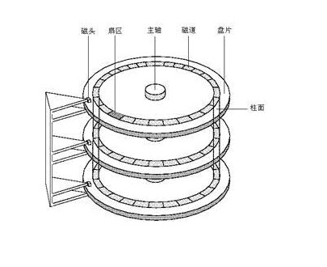
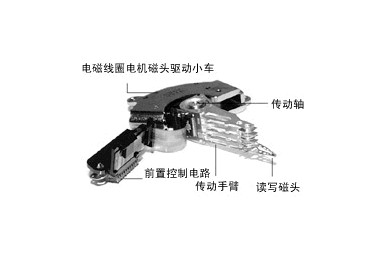
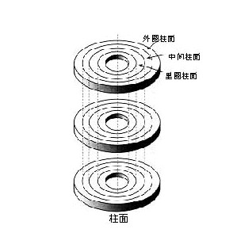
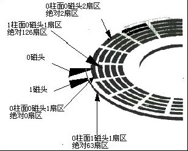
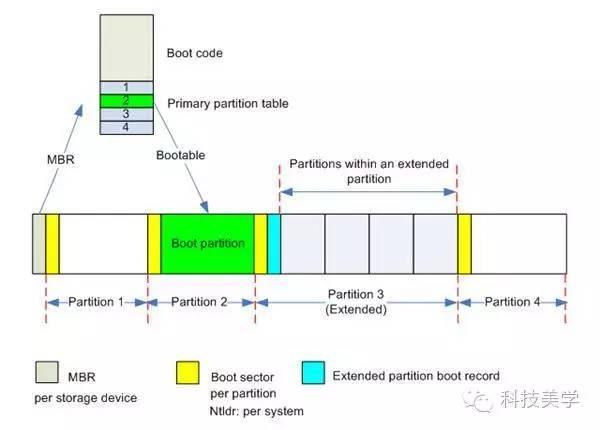
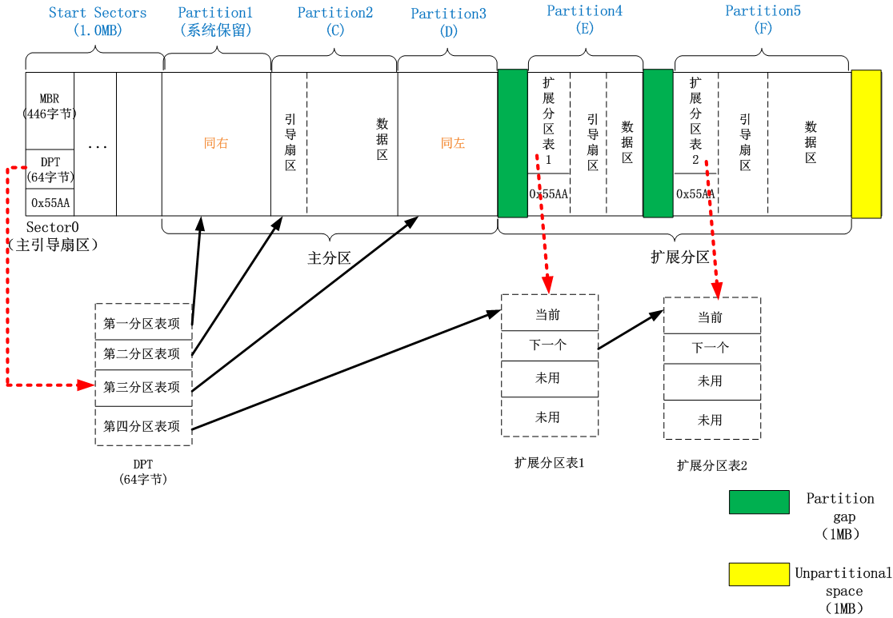
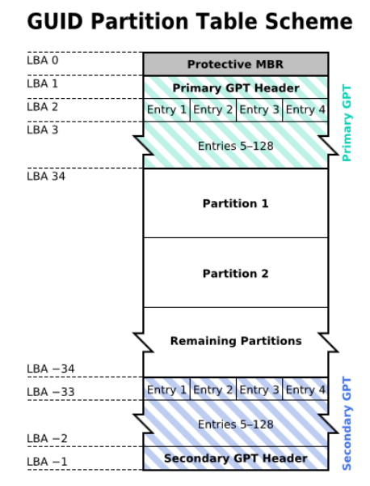

# MBR 与 GUID(GPT) 磁盘分区

## 机械磁盘的物理结构（组成）

机械硬盘 = 磁盘 + 机械臂 

机械臂与磁盘接触的地方有磁头，用于读取磁盘数据。

磁盘可以又一个或多个盘片,每个盘都有两个盘面，分别对应一个磁头，所有磁头按序编号：0～y (y表示磁头数） 

一个盘片相同半径的圆为磁道。不同磁盘的相同磁道组成一个柱面，由内向外编号0～x(x表示柱面数-1） 

每个磁道划分许多扇形块，称为扇区。扇区是读取信息的最小单位，现在有些磁头一个可以读取n个扇区。由于早期的扇区512字节，现代磁盘为了兼容，也一直保持这个单位。内个磁道上的扇区单独编号1~z(z表示每个磁道上的扇区数）。

每个扇区的位置可以用（柱面号，磁头号，扇区号）定位，如（0,0,1)表示0柱面，0磁头，1扇区

从 Intel 6 系列主板之后，启动固件开始使用 UEFI 代替之前的 BIOS，正式支持 GUID 硬盘分区表，用于取代了此前的 MBR 分区表格式，不过为了保持对老平台的兼容，微软即使最新的Windows 10 系统也继续提供了对 MBR 分区表格式的支持。

## 磁盘分区

全新硬盘（未初始化）装系统之前，必须对其进行分区，硬盘分区初始化的格式包括 MBR 和 GUID 两种。当然对于基于 PowerPC 的Mac 电脑还有专门的 Apple 分区图，在这里就不做介绍，因为从使用 Intel 芯片之后的 Apple 电脑也都使用了 GUID 分区。

### 磁盘分区的由来？

具体计算机体系什么时侯引入了分区的概念和引入的愿意不得而知了，我在网上也没有查到具体的原因。不妨在此猜测一下：在电脑刚起步的时候，磁盘的容量非常小，磁盘的类型也不是现在所见的硬盘（据我所知，Windows的磁盘号一直从C开始就是因为A给了内存，B给了软盘）。历史上曾把整个软盘作为操作系统系统盘。另外的软盘或者硬盘作为数据盘，虽然可以在逻辑上将多个盘合并成一个盘，但明显系统盘，数据盘的区分更加明智，不仅使磁盘的内容可以更清楚的知道，不同磁盘的数据分别查找更加迅速，而且某个磁盘损坏后不影响其他盘的使用。后来有了硬盘，并且硬盘的容量也越来越大，自然人们想到不同盘带来的好处，将一个物理盘分成不同盘也就成了理所当然的事情。

磁盘分区还有一些场景的需要，有些时候会对不同分区使用不同的文件系统。有些是因为计算机的历史限制，例如使用 UEFI 的计算机由于 UEFI 只能识别 FAT32 文件系统，但是我们的系统可能由更强大、高效的文件系统。这时候分区能够使得两者兼得：划分一小块分区给 UEFI 用于存放引导加载程序，其它扇区格式化为操作系统偏好的文件系统。

另一个分区的需要来自操作系统，像 Linux 这样的操作系统能够将内存不常使用的页面存储到磁盘上，以腾出空间将更频繁使用的数据加载到内存。被换出的页面也需要特殊的文件系统，因此也需要一个扇区。Unix 操作系统的文件树不同目录的文件大小和访问频率也不相同，而不同的文件系统对于这些文件类型的访问速度可能不同，通过对不同文件目录使用不同的文件系统，能够使得整个系统获得更高效的文件访问速度，而又不损失强大的文件特性。

磁盘分区实际上是一种逻辑划分，使用在磁盘上写入数据标记的方法来标识磁盘分成几个区和每个区的大小。现在使用的磁盘分区格式有MBR 和 GUID 两种。

## MBR分区

**MBR 的全称是 Master Boot Record（主引导记录）**，MBR早在 1983 年 IBM PC DOS 2.0中就已经提出。之所以叫“主引导记录”，是因为它是存在于驱动器开始部分的一个特殊的启动扇区。这个扇区包含了已安装的操作系统的启动加载器和驱动器的逻辑分区信息。

主引导扇区是硬盘的第一扇区。它由三个部分组成，主引导记录MBR、硬盘分区表DPT和硬盘有效标志。在总共512字节的主引导扇区里MBR占446个字节，偏移地址0000H--0088H），它负责从活动分区中装载，并运行系统引导程序；第二部分是Partition table区（DPT分区表），占64个字节；第三部分是Magic number，占2个字节。

严格来说 MBR 不能作为分区的名称，MBR 为 Main Boot Record（主引导记录），是磁盘地一个扇区的固定数据的名称。里面也包含分区的标识数据，就将它作为了分区类型的名称。MBR由于是设计较早，有许多限制和令人奇怪的地方。

不要被上面的图吓到，我来一点点的解释。 

上面是一块硬盘的分区示例，按照LBA寻址，把所有的扇区按照从左到右，依次排开，最左边为第一块扇区，最右边是最后一块扇区，形成一条逻辑的条行存储。从左到右分为了几部分：Start Sections–>Partition1（系统保留分区）–>Partition2（C盘）—>Partition3（D 盘）–>Partition4（E盘）–>Partition5（F盘），其中Partition1~3是主分区，Partion4~5是扩 展分区上的两个逻辑分区，里面绿色的部分是分区与分区之间的Partition gap，大小为1MB，最后黄色的表示Unpartitional space，没有利用的，也是1MB。下面开始分开逐个来解释一下。

### 一、Start Sections：

在磁盘开始一般会留一个大约1MB大小的部分，这是BIOS固件引起的，BIOS将磁盘的开始部分作为作为启动区，存放操作系统的启动器的代码，然而却没有规定启动器部分磁盘的大小。其中第一个扇区，也是整个磁盘的第一个扇区，位于0柱面0磁头1扇区，也叫做主引导扇区，一共512个字节，分为了三部分： 
Boot Section(引导扇区）=MBR+DPT+BRID

>（1）MBR（446字节）：Main Boot Record，主引导记录

如果直接说MBR可能不知道它从何而来，我们从开机来看看，它到底在什么时候起作用的。我们按下电脑的开机按键，就给主板通上了电，上面的bios 程序开始运行，对电脑硬件进行检测，然后就需要我们去选择First boot device，我们可以从U盘启动、从光盘启动，当然也可以从硬盘启动，而且很多时候默认的是从硬盘启动。如果我们选择了从硬盘启动，那么bios程序就 会读取该设备的第一个扇区的数据，也就是前面512个字节，如果最后两个字节不是以0x55AA结束，那么表示这个设备不可以用来启动；如果是 0x55AA，那么表示该设备可以用来启动，bios程序就会有一个jump的操作，跳转到硬盘这一个扇区的代码，把操作交给硬盘，那么跳转的是哪儿呢？ 就是我们要说的MBR，主引导记录。

MBR中包含了整个硬盘的一些参数和一段引导程序，引导程序就会去DPT磁盘分区表里面去找到底从硬盘的哪个分区去启动（具有激活标志的分区），找到后就把控制权交出去，不过这之前会先检查DPT磁盘分区表是否正确。

>（2）DPT（64字节）：Disk Partition Table，磁盘分区表，每个分区信息需要用16字节，所以只能记录四个分区信息，要想为了划分更多的分区，可以将一个分区规划为扩展分区，再在扩展分区中划分逻辑分区。由于逻辑分区的分区信息是记录再逻辑分区中的，而不是再DPT，所以DPT信息还是四条。

DPT 只有64个字节，分成了四项，分别为第一~四分区表项，图中红色虚线箭头指向的。每个分区表项占16个字节。四个分区表项内容格式一致，我们拿出一个分区表项（16字节）看看都包含了什么。 

| 字节 |	作用  |
| --- | -------- |
| 1   |	如果为0x80，表示是激活分区，那么前面的MBR引导程序就把控制权给这个分区。四个分区只能有一个是激活的。0x00表示非激活的分区。   |
| 2   | 分区起始扇区磁头号  |
| 3～4 | 分区起始扇区区号，0x02 的 0～5位  分区起始柱面号，0x02 的 6-7 位和 0x03 的全部8位 |
| 5   |	主分区的类型，或文件系统类型。例如01表示FAT32,05表示extended（如果一个分区的主分区id号为05，那么它就是一个扩展分区了）等，具体可参看分区类型标志。 0x83就是linux分区。  |
| 6   |	分区结束磁头号  |
| 7～8|	分区结束扇区号，0x06的0～5位    分区结束柱面号，0x06的 6-7 位和 0x07 的全部8位  |
| 9～12 |	分区其实相对扇区号，该主分区的第一个扇区的逻辑地址LBA  |
| 13～16 |	分区总的扇区数   |

我们看到我们上图中，四个分区表项分别对应了三个主分区和一个扩展分区。

最后的四个字节（”主分区的扇区总数”），决定了这个主分区的长度。也就是说，一个主分区的扇区总数最多不超过2的32次方。每个扇区512字节，那么一个分区最大也就2^23*512=2T。就是说分区表最多支持的磁盘最大也就8T。再大就要用GPT分区表了，GPT分区稍后讲解。再考虑到扇区的逻辑地址也是32位，所以单个硬盘可利用的空间最大也不超过2TB。如果想使用更大的硬盘，只有2个方法：一是提高每个扇区的字节数，然而由于为了向后兼容，基本上现在生产的磁盘扇区都是512字节。二是增加扇区总数。

>（3）最后两字节BRID(Boot Recore ID,引导记录标识符)

如果最后以0x55AA结束，表示此扇区是启动器，否则不是，将被BIOS的交接控制程序丢弃。

除了第一个扇区外，1MB 空间里面的其他几个扇区就空着了，可能没用，也可能与后面要讲的partition gap功能一致。 

### 二、主分区 

如上图所示的分区有三个主分区，主分区是历史的叫法，Windows只能安装在这种分区上，这实际上有点变态，确实我们无法改变的事实。如果该主分区装有操作系统，那么它应该包含如下部分（如图Partition2所示）：

1. 引导扇区：OS Boot Record，主分区的引导记录，有时也叫卷引导记录（Volume boot record）含有一段操作系统的引导程序，如果该分区是激活的（在DPT中标识了），可以通过它来启动本主分区的操作系统。 

2. DATA数据区：存储数据，不同的文件系统，如fat、ntfs还会细分。 

### 三、Partition gap 

用Winhex查看磁盘情况，往往会看到分区和分区之间会有Partition gap，so上面的一个解释，可以参看一下，Windows disk partion gap。 

### 四、扩展分区 

如图所示的最后一个主分区当做扩展分区，扩展分区是为了解决GPT只能包含四条分区项，无法增加分多分区而设计的，可以分出任意多个逻辑分区。扩展分区不能直接用，至少包含一个逻辑分区。逻辑分区也有类似DPT的记录，并没有大小限制，显然逻辑分区的总大小不能超过2T。上图中有两个逻辑分区E盘和F盘，每一个逻辑分区由几部分组成。 

1. 逻辑分区表 

扩展分区的第一个逻辑分区的第一个扇区，叫做EBR，extended boot record，扩展分区记录，其结构类似于整个磁盘的第一个扇区，但是它没有引导程序。分区表包含四项，第一项标识当前分区的信息。第二项可以找到下一个逻辑分区的位置，后两项没有用。 

2. 引导扇区：如果该磁盘安装了操作系统，将会有一个引导山区。如果只是存储数据，该分区将不在。 

3. 数据区是磁盘的主要。 

### 五、Unpartitional space 

只有1MB空间，我也不想知道它是干什么了。

## GUID(GPT)分区

GPT 的全称是Globally Unique Identifier Partition Table，意即GUID分区表，它的推出是和 UEFI 相辅相成的，鉴于MBR的磁盘容量和分区数量已经不能满足硬件发展的需求，GPT首要的任务就是突破了 2.2T 分区的限制，最大支持18EB的分区。

GPT 分区和 UEFI 的组合是为了解决 BIOS 和 MBR 产生的诸多问题的替代方案。GPT 提供了更加灵活的磁盘分区机制。它具有如下优点：

1. 支持 2TB 以上的大硬盘。

2. 每个磁盘的分区个数几乎没有限制，表头用于存放分区个数的占4字节，可达 2^32-1 个分区。

3. 分区大小几乎没有限制。又是一个“几乎”。因为它用64位的整数表示扇区号，即 = 18,446,744,073,709,551,616（每个扇区又有 512字节或者4K）。

4. 分区表自带备份。在磁盘的首尾部分分别保存了一份相同的分区表，其中一份被破坏后，可以通过另一份恢复；

5. 循环冗余检验值针对关键数据结构而计算，提高了数据崩溃的检测几率；

6. 虽然MBR提供1字节分区类型代码，但GPT使用一个16字节的全局唯一标识符（GUID）值来标识分区类型，这使分区类型更不容易冲突；

7. 每个分区可以有一个名称(不同于卷标)。

### GPT 分区表系统

而在分区数量上，GPT会为每一个分区分配一个全局唯一的标识符，理论上GPT支持无限个磁盘分区，不过在Windows系统上由于系统的限制，最多只能支持128个磁盘分区，基本可以满足所有用户的存储需求。在每一个分区上，这个标识符是一个随机生成的字符串，可以保证为地球上的每一个GPT分区都分配完全唯一的标识符。

而在安全性方面，GPT分区表也进行了全方位改进。在早期的MBR磁盘上，分区和启动信息是保存在一起的。如果这部分数据被覆盖或破坏，事情就麻烦了。相对的，GPT在整个磁盘上保存多个这部分信息的副本，因此它更为健壮，并可以恢复被破坏的这部分信息。GPT还为这些信息保存了循环冗余校验码（CRC）以保证其完整和正确——如果数据被破坏，GPT会发觉这些破坏，并从磁盘上的其他地方进行恢复。

- GPT 使用逻辑区块地址（LBA 既扇区索引）取代了早期的CHS寻址方式。护性 MBR 和 表头是以 LBA(扇区) 备份表头各占一个 LBA。

- GPT 的数据结构大小也没有固定，而是在数据结构中记录的，这样就可以随着发展需要而扩展。而且最低要求的 GPT 数据结构大小也已经预留的空间，可以说几乎不会修改大小。

#### LBA0：

在GPT分区表的最开头，处于兼容性考虑仍然存储了一份传统的MBR（LBA 0），这个MBR叫做保护性MBR（Protective MBR）。保护性MBR保护GPT磁盘不受以前发布的MBR磁盘工具的危害。这些工具不能感知GPT，也无法正确地访问GPT磁盘。这些工具通过解释保护性MBR，将GPT磁盘看成一个封装的（可能无法识别）分区，而不是错误地当成一个未分区的磁盘，并且拒绝对硬盘进行操作。这就避免了意外删除分区的危险。在支持从GPT启动的操作系统中，这里也用于存储第一阶段的启动代码。在这个MBR中，只有一个标识为0xEE的分区，以此来表示这块硬盘使用GPT分区表。

在使用MBR/GPT混合分区表的硬盘中，这部分存储了GPT分区表的一部分分区（通常是前四个分区），可以使不支持从GPT启动的操作系统从这个MBR启动，启动后只能操作MBR分区表中的分区。

#### LBA1：

分区表头（LBA 1）定义了硬盘的可用空间以及组成分区表的项的大小和数量。在使用64位Windows Server 2003的机器上，最多可以创建128个分区，即分区表中保留了128个项，其中每个都是128字节。（EFI标准要求分区表最小要有16,384字节，即128个分区项的大小）

分区表头还记录了这块硬盘的GUID，记录了分区表头本身的位置和大小以及备份分区表的位置和大小（在硬盘的最后）。它还储存着它本身和分区表的CRC32校验。固件、引导程序和操作系统在启动时可以根据这个校验值来判断分区表是否出错，如果出错了，可以使用软件从硬盘最后的备份GPT中恢复整个分区表，如果备份GPT也校验错误，硬盘将不可使用。以下是分区表头结构的具体信息：

#### GPT 分区表头的格式

|起始字节| 字节数 | 内容 |
| ---- | ----- | ---- |
| 0    | 8 | 签名（"EFI PART"） |
| 8    | 4 | 修订  |
| 12   | 4 | 分区表头的大小  |
| 16   | 4 | 分区表头（92个字节）的CRC32校验，在计算时，先把这个字段写作0处理，然后计算出所有分区表项的CRC32校验后再计算这个CRC32  |
| 20   | 4 | 保留，必须是 0 |
| 24   | 8 | 当前LBA（这个分区表头的位置） |
| 32   | 8 | 备份LBA（另一个分区表头的位置）|
| 40   | 8 | 第一个可用于分区的LBA（主分区表的最后一个LBA + 1） |
| 48   | 8 | 最后一个可用于分区的LBA（备份分区表的第一个LBA - 1） |
| 56   | 16| 硬盘GUID（在类UNIX系统中也叫UUID）|
| 72   | 8 | 分区表项的起始LBA（在主分区表中是2）| 
| 80   | 4 | 分区表项的数量（windows是128，没有这么多也先占着空间）| 
| 84   | 4 | 一个分区表项的大小（通常是128）| 
| 88   | 4 | 分区表项的CRC32校验（计算的是所有分区表项的检验和即128*128字节）|
| 92   |剩余| 保留，剩余字节必须是0（420字节针对512字节的LBA硬盘）| 

注：第80位起，分区表项的数量。该值一直为128，即使分区没有128项，也先写入128，在计算分区项CRC32校验时应该注意这点。

#### LBA 2–33

LBA 2–33的位置存放的是分区表项。GPT分区表使用简单而直接的方式表示分区。一个分区表项的前16字节是分区类型 。接下来的16字节是该分区唯一的GUID（这个GUID指的是该分区本身，而之前的GUID指的是该分区的类型）。再接下来是分区起始和末尾的64位LBA编号，以及分区的名字和属性。

#### GPT 分区表项的格式

| 起始字节 | 字节 | 内容 |
| ------- | ----- | --- |
| 0       | 16    | 用GUID表示的分区类型 | 
| 16      | 16    | 用GUID表示的分区唯一标识符 | 
| 32      | 8     | 分区的起始扇区，用LBA（小端格式）值表示 | 
| 40      | 8     | 该分区的结束扇区（包含），用LBA值表示，通常是奇数 | 
| 48      | 8     | 属性标签  | 
| 56      | 72    | UTF-16LE编码的人类可读分区名称，最大32个字符。| 

注意，扇区尺寸不能假定为512字节（也可能是4K），也就是说，一个扇区内可能存放4个以上的分区项，也可能只存放一个分区项的一部分。也就是说，除了头两个扇区(LBA 0 和 LBA 1)之外，GPT规范仅定义了数据结构的尺寸，而不关心使用多少个扇区进行存储

> 注：1.类型 GUID 为固定值，查阅资料可得。下图列举Windows、Linux下常见几种：

以Windows下基本数据分区为例说明：EBD0A0A2-B9E5-4433-87C0-68B6B72699C7。上述表示形式采用小端表示，其16位的串行表示为：A2A0D0EBE5B9334487C068B6B72699C7,即前三部分倒序表示。？

**分区类型**

| 相关操作系统 |  GUID[little endian]       | 含义     |
| ---------- | -------------------------- | ------- |
| None       | 00000000-0000-0000-0000-000000000000 |	未使用  |
| None       | 024DEE41-33E7-11D3-9D69-0008C781F39F |	MBR分区表  |
| None       | C12A7328-F81F-11D2-BA4B-00A0C93EC93B |	EFI系统分区[EFI System partition (ESP)]  |
| None       | 21686148-6449-6E6F-744E-656564454649 |	BIOS引导分区，其对应的ASCII字符串是"Hah!IdontNeedEFI"。  |
| None       | D3BFE2DE-3DAF-11DF-BA40-E3A556D89593 |	Intel Fast Flash (iFFS) partition (for Intel Rapid Start technology)  |
| Windows    | E3C9E316-0B5C-4DB8-817D-F92DF00215AE |	微软保留分区  |
| Windows    | EBD0A0A2-B9E5-4433-87C0-68B6B72699C7 |	基本数据分区  |
| Windows    | DE94BBA4-06D1-4D40-A16A-BFD50179D6AC |	Windows恢复环境  |
| Linux      | 0FC63DAF-8483-4772-8E79-3D69D8477DE4 |	数据分区。Linux曾经使用和Windows基本数据分区相同的GUID。这个新的GUID是由 GPT fdisk 和 GNU Parted 开发者根据Linux传统的"8300"分区代码发明的。|
| Linux      | A19D880F-05FC-4D3B-A006-743F0F84911E |	RAID分区  |
| Linux      | 0657FD6D-A4AB-43C4-84E5-0933C84B4F4F |	交换分区  |
| Linux      | E6D6D379-F507-44C2-A23C-238F2A3DF928 |	逻辑卷管理器(LVM)分区  |
| Linux      | 8DA63339-0007-60C0-C436-083AC8230908 |	保留  |

#### LBA34:分区区域
   
GPT分区区域就是用户使用的分区，也是用户进行数据存储的区域。分区区域的起始地址和结束地址由GPT头定义。

#### LBA -33~-2：分区表备份
  
分区区域结束后就是分区表备份，其地址在GPT头备份扇区中有描述。分区表备份是对分区表32个扇区的完整备份。如果分区表被破坏，系统会自动读取分区表备份，也能够保证正常识别分区

#### LBA -1：GPT头备份

GPT头有一个备份，放在GPT磁盘的最后一个扇区，但这个GPT头备份并非完全GPT头备份，某些参数有些不一样。复制的时候根据实际情况更改一下即可。

小结：**所以对于新平台用户（Intel 6系以后/AMD 900系列以后和A系列）来说，都强烈推荐使用GPT分区表格式。** 目前包括Windows Vista、7、8、8.1、10已经都支持读取和使用GPT分区表。而对于使用Windows 8、8.1、10的用户，换用GPT后开机启动速度也可以进一步得到显著提升。

## 分区避坑

- 传统的BIOS只支持从MBR分区的硬盘启动。有的主板 UEFI 支持换一个 Lagacy BIOS 的功能，用于支持启动 MBR 分区的磁盘，我强烈建议你不要使用这个功能，这会导致很多奇怪的问题。

- WindowsXP 以及之前的系统不支持 GPT 分区，如果你有使用 WindowsXP 的可能，尽量使用 MBR 分区。当然如果你已经使用了 GPT 分区，可以使用更高版本的 Windows 或者使用虚拟机来安装 WindowsXP。

- 有的主板 UEFI 支持了一个 Lagacy BIOS 的功能，用于支持启动 MBR 分区的磁盘。这种系统上重装系统时你应该格外注意使用的分区类型。一般情况下 Ubuntu 安装时如果选择和已有系统共存，它会保持使用原有的分区类型。但是**如果选择清除整个磁盘安装 Ubuntu，它默认使用 GPT 分区**。 如果再次发现有使用 MBR 分区的情况，使用 Ubuntu LiveCD的parted程序，使用一个mklabel msdos命令把硬盘从 GPT 分区更改为MBR分区。

- [LVM](https://zhuanlan.zhihu.com/p/581145034?utm_id=0)