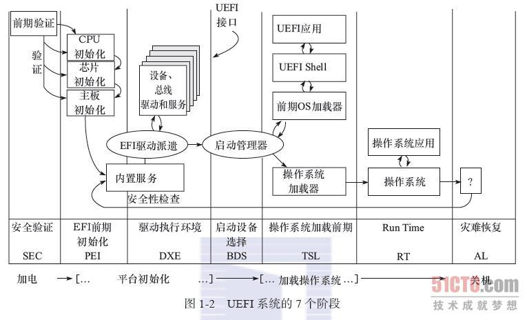

# UEFI

复制用于备份，防止原贴找不到。转载自：http://book.51cto.com/art/201502/465354.htm

## 什么是UEFI  ？
      
UEFI 全称叫可扩展固件界面（Unified Extensible Firmware Interface）。其和新的分区格式 GUID 一同被提出，用于取代原有的 BIOS + MBR 的组合。它只是一种标准，没有提供实现。其实现由其他公司或开源组织提供，例如英特尔公司提供的开源 UEFI 实现 TianoCore 和 Phoenix 公司的 SecureCore Tiano。BIOS 和 UEFI 都是计算机的固件类型。BIOS 固件（主要）用于 IBM PC 兼容计算机。UEFI 的通用性更强，可用在非“IBM PC 兼容”系列的计算机上。 
       
**不存在“UEFI BIOS”。没有任何一台计算机会有“UEFI BIOS”。**请不要再说“UEFI BIOS”。BIOS 不是所有 PC 固件的通用术语，它只是 PC 固件的一种特定类型。如果你有一台 IBM PC 兼容计算机，那么固件几乎肯定就是 BIOS 或 UEFI。如果你运行的是 Coreboot，那么恭喜，你是个例外，引以为傲吧。如果想真正了解 UEFI，你可以从官方网站下载UEFI 规范。UEFI + GPT 和 BIOS + MBR 是成两种不同的组合。

BIOS + MBR 的限制与缺点：

- 由于BIOS的资源控制采用了中断向量的方式，所它在扩展性方面以及安全性上都不能有所保障。除此之外，在传统BIOS上搭建图形界面也是一件非常困难的事情。

- BIOS 不理解分区的概念，也不能识别文件系统，而是直接读取磁盘中的一个扇区，通过两个字节的标志位判断这个扇区是否包含启动程序，如果是就直接跳转去执行，没有任何验证和扩展性。

- BIOS 使用的 MBR 分区只支持4个主分区，而且每个分区大小只能支持 2.2T 大小。

- 另外新的UEFI主板基本都提供了截屏功能，这些截屏图片都可以存储在U盘当中
       
UEFI 启动原理与 BIOS 绝对不同。你不能把 BIOS 启动的原理直接套用到原生 UEFI 启动上。你不能把专为 BIOS 启动设计的工具应用到原生 UEFI 启动的系统上。还需要了解一个重点：许多 UEFI 固件实现了某种 BIOS 兼容模式（lagency BIOS）。用于识别 MBR 分区的磁盘，它们可以查找磁盘上的 MBR，然后从 MBR 中执行启动装载程序，接着将后续工作完全交给启动装载程序。有时候，其他人误将此功能称为“禁用 UEFI”，从语言学角度而言，这种说法是荒谬的。系统固件是无法“禁用”的。这种说法很愚蠢，不要采用这种说法。但是在其他人这么说的时候，应该了解他 们真正想表达什么。他们讨论的是通过 UEFI 固件的一项功能，以“BIOS 风格”启动系统，而不是采用原生 UEFI 方式启动系统。
     

UEFI的启动过程：


UEFI在开机方面的确做得非常不同，它将初始化分为几个阶段，流程为SEC->PEI->DXE->BDS->TSL，



### 平台初始化阶段

有一个事实是无论启动器怎么修改也无法改变的：在电脑加电的一瞬间。CS被初始化为FFFFH,其他所有寄存器都为０，所以CPU马上就从CS:IP指向的地址 FFFF0H处开始执行指令，这个地址实际上在系统 ROM 的地址范围内，作为取代 BIOS 的 UEFI，放在这里的指令也只能是跳转到 UEFI 代码所在的地址。然后是 EFI 程序的初始化临时存储区域，安全验证，EFI前期初始化，初始化系统设备。

### 引导操作系统阶段

与 BIOS 不同，UEFI 确实可以（不同程度上）理解“磁盘分区”、“启动装载程序”以及“操作系统”的概念。BIOS 在磁盘起始位置留出自由空间，用于存放启动装载程序代码，但又不定义其容量，种设计糟糕透顶。UEFI的解决方案如下：我们要求固件层能够读取某些特定的分区类型和文件系统类型。UEFI 规范要求兼容固件必须能识别GPT 分区表并读取 FAT 格式的变种（包括 FAT12、FAT16 和 FAT32）。并使用单独的分区来装载操作系统的启动程序，该分区称为ESP（EFI系统分区）。“EFI 系统分区”的概念可以解决“奇葩”的 MBR 空间所产生的问题。“EFI 系统分区”是采用 FAT 变种（UEFI 规范定义的变种之一）格式化的任意分区，该分区被赋予特定 GPT 分区类型，以帮助固件识别该分区。此分区的目的如上所述：固件层可以读取“普通”磁盘分区中的数据。希望我已明确解释为何这种设计更佳：操作系统可以创建、格式化和挂载分区（采用广泛理解的格式），并将启动装载程序的代码和固件可能需要读取的所有其他内容放到这个分区中，而不用像 MBR 磁盘一样，将启动装载程序的代码写入磁盘的起始位置空间。而并没有具体规定其中的具体实现。如果回过头再看，这种设计并不明智，且难以理解。

UEFI 规范并不反对编写固件。UEFI 规范定义了一种可执行文件格式，并要求所有 UEFI 固件能够执行此格式的代码。当开发人员为原生 UEFI 编写启动装载程序时，就必须按照这种格式编写。这种设计非常简洁直观，也无需进一步解释：对于固件可以执行的代码，固件规范真正定义了其通用格式，这是件好事。因此如果你正编写操作系统或其他东西，并且想要在 UEFI 兼容固件上运行的话，你也得遵循 UEFI 规范，这就是 EFI 系统分区的概念非常重要的原因：它允许（至少理论上）将 EFI 可执行文件放在以ESP中。这种机制非常严谨，等价于 BIOS 中的“固件能够执行放置在 MBR 空间中的启动装载程序代码”。

UEFI 规范为我们提供了三大重要基础，这些重要基础是上层架构正常运行的立足之本： 

- 读取分区表  

- 访问某些特定文件系统中的文件

- 执行特定格式的代码 


## UEFI 启动管理器

UEFI 规范定义了名为 UEFI 启动管理器的一项功能。如果你确实阅读过 UEFI 规范，那么就会发现，UEFI 规范对 UEFI 启动管理器作出了如下规定：“UEFI 启动管理器是一种固件策略引擎，可通过修改固件架构中定义的全局NVRAM 变量来进行配置。启动管理器将尝试按全局 NVRAM 变量定义的顺序依次加载 UEFI 驱动和 UEFI 应用程序（包括 UEFI 操作系统启动装载程序）。”

简单来说，你可以把 UEFI 启动管理器视为启动菜单。在 BIOS 固件上，固件层的“启动菜单”是，启动时连接到计算机的各个磁盘——读取每个磁盘的MBR。但是对于 UEFI 固件而言，情况有所不同。你可以向“启动菜单”添加项或者从中删除项。固件也可以（事实上， UEFI 规范也有此要求）根据连接到计算机的磁盘或根据某些固件配置，在此启动菜单中“生成”有效项。

UEFI 提供了一种非常优秀的机制，可以从上层架构执行此操作：你可以从已启动的操作系统中配置系统启动行为（Linux发行版包含名为efibootmgr 的工具，可用于更改 UEFI 启动管理器的配置）。如果已通过 UEFI 启动 Linux，就可以使用 efibootmgr 工具来完成所有这些操作。Windows 也有相应的工具，但是我对 Windows 下的工具非常不熟悉。我们不妨看一些典型的 efibootmgr 输出，这些是我从 Fedora 论坛转过来的，稍微进行了调整：

```shell
[root@system directory]# efibootmgr -v
BootCurrent: 0002 Timeout: 3 seconds
BootOrder: 0003,0002,0000,0004
Boot0000* CD/DVD Drive  BIOS(3,0,00)
Boot0001* Hard Drive    HD(2,0,00)
Boot0002* Fedora        HD(1,800,61800,6d98f360-cb3e-4727-8fed-5ce0c040365d)File(\EFI\fedora\grubx64.efi)
Boot0003* opensuse      HD(1,800,61800,6d98f360-cb3e-4727-8fed-5ce0c040365d)File(\EFI\opensuse\grubx64.efi)
Boot0004* Hard Drive    BIOS(2,0,00)P0: ST1500DM003-9YN16G        .
[root@system directory]#
```

第一行表示，目前你从“启动菜单”的哪个项进行了启动。第二行非常明显（如果固件的 UEFI 启动管理器显示了类似启动菜单的界面，那么这一行表示继续启动默认项之前的超时）。BootOrder 是列表中启动项的尝试顺序。其余输出显示了实际的启动项。我们稍后会说明每一个启动项具体作用。

如果完全正常启动 UEFI 固件，而不进行任何调整（我们稍后会讨论），UEFI 固件将按照BootOrder 中列出的顺序，尝试从“启动菜单”中的每个“项”进行启动。因此，在这台计算机上，UEFI 固件将尝试启动名为“opensuse”的项，如果启动失败，然后再尝试启动名为“Fedora”的项，然后再是“CD/DVD Drive”，接着是第二项“Hard Drive”。

### 启动管理器项

那么，这些项的实际含义是什么？实际上，UEFI 规范之所以显得复杂，很大程度上是因为其中的不确定因素太多。如果你正在阅读 UEFI 规范，那么先做好心理准备，然后前往 EFI_DEVICE_PATH_PROTOCOL 一节。虽然这个协议不涉及启动过程，（请注意，这个协议是通用的）但是有其他作用——规定了UEFI 官方的设备标识方法，这种标识方法可用于启动管理器项以及各种其他用途。出于各种原因，并不是每一种潜在的 EFI 设备都能成为UEFI 启动项（如果你想从视频适配器启动，很可能不会成功）。启动菜单中显然可以包含指向 PXE 服务器的项。UEFI 规范进行了多项规定，可以向 UEFI 启动项配置中添加磁盘以外的启动目标。

但是对我们而言，只需要考虑连接到计算机的一般磁盘即可。既然这样，我们来讨论下可能遇到的三种启动项类型。

### BIOS 兼容启动项

在本示例中，Boot0000 和 Boot0004 实际上是 BIOS 兼容模式启动项，而不是原生 UEFI 启动项。这些启动项不是通过外部工具添加到 UEFI 启动管理器配置中的，而是由固件本身生成的——这也是 UEFI 固件实现 BIOS 兼容启动的常见方式，通过生成 UEFI 启动管理器项，可触发指定设备的 BIOS 启动。至于 UEFI 启动管理器如何呈现给用户，这是另一个问题，我们稍后讨论。根据具体固件及其配置，其中有些项可能无法显示。每一项只会具有一个名称（“CD/DVD Drive”、“Hard Drive”），这表示“如果选中此项，那么就以 BIOS 兼容模式启动本磁盘”（其中，对于 Boot0000，“本磁盘”为 3,0,00，对于 Boot0004，“本磁盘”为 2,0,00）。？

### “回退路径 (Fallback path)”UEFI 原生启动项

Boot0001 项（我虚构的，实际操作中可能不存在，这里只是为了举例说明）尝试从特定磁盘启动（以 UEFI 模式而不是 BIOS 兼容模式），但是并没有向固件提供其他信息。它没有指定磁盘上的具体启动目标，而只是让固件启动磁盘。

UEFI 规范定义了一种“回退”路径 (Fallback path)，其工作原理类似于 BIOS 驱动器启动。但是与 BIOS 不同的是：当尝试以这种方式启动时，固件会遍历磁盘上的每个 ESP（ EFI 系统分区，按照磁盘上的分区顺序）。在 ESP 内，固件将查找位于特定位置的具有特定名称的文件。在 x86-64 PC 上，固件会查找文件\EFI\BOOT\BOOT{计算机类型简称}.EFI，如：\EFI\BOOT\BOOTx64.EFI。计算机类型简称有：“x64”是 x86-64 PC 、IA32.EFI (x86-32)、IA64.EFI (Itanium)、ARM.EFI（AArch32，即32位ARM）和  AA64.EFI（AArch64，即64位ARM）。然后，固件将执行找到的第一个有效（文件需要符合UEFI规范中定义的可执行格式）文件。

这种机制的设计目的不在于启动日常使用的操作系统。它的设计目的更像是为了启动可热插拔、与设备无关的介质（如 Live 映像和操作系统介质）。这也是这种机制的常见用途。如果查看 Linux 或其他操作系统的 UEFI 兼容 Live 或安装介质，你会发现其中包含 GPT，以及位于（或靠近）设备起始位置的 FAT 分区，该分区的 GPT 分区类型标识为 EFI 系统分区。在那个分区中，会有一个 \EFI\BOOT 目录，目录中至少包含上述特殊命名的文件之一。当以原生 UEFI 模式启动 Fedora Live 或安装介质时，就会采用这种机制。BOOTx64.EFI（或其他）文件将处理剩余启动过程，从而启动介质上包含的真正操作系统。

### 完全原生 UEFI 启动项

Boot0002 和 Boot0003 是存储设备上所安装操作系统的“典型”项。这些项显示了 UEFI 启动机制的全部优势，不仅仅是“从此磁盘启动”，而是“启动此特定磁盘上此特定分区中的这一特定启动装载程序”。

Boot0002 是由原生 UEFI Fedora 安装生成的启动项。Boot0003 是由原生 UEFI OpenSUSE安装生成的启动项。按照字面意思，这些启动项表示“从此分区加载这一文件”。分区指的是HD(1,800,61800,6d98f360-cb3e-4727-8fed-5ce0c040365d) 这个东西：表示某一特定分区（使用 EFI_DEVICE_PATH_PROTOCOL，我不打算对此进行详细介绍。如果你通过固件界面和 efibootmgr 与启动管理器进行交互，你也不需要知道其中的细节）。启动装载程序指的是 (\EFI\opensuse\grubx64.efi) 。这里所指的分区基本上始终指的就是充当 EFI 系统分区的那个分区，因此可以放心地让固件访问 EFI 系统分区。

操作系统将启动装载程序（作用为加载操作系统内核等）安装到 EFI 系统分区中，并使用某一名称（显然，这一名称通常来源于操作系统名称）以及启动装载程序（EFI 可执行格式，用于加载操作系统）的位置向 UEFI 启动管理器配置中添加启动项。

Linux发行版使用 efibootmgr 工具处理 UEFI 启动管理器。进行原生 UEFI 安装时，有关启动装载方面，Linux 发行版实际进行的操作相当简单：它会创建一个 EFI 系统分区（如果不存在此分区），使用相应配置将 EFI 启动装载程序（通常为 grub2-efi，但是也有例外）安装到 EFI 系统分区中的正确路径下，然后调用 efibootmgr 添加相应的 UEFI 启动管理器项（指向其启动装载程序）。如果已存在 EFI 系统分区，大部分发行版会使用现有分区（尽管完全可以创建新的 EFI 系统分区并使用这个新分区）：我们已经提到过，UEFI 是一种宽松规范，只要在逻辑上遵循其设计，那么有多少个 EFI 系统分区都没问题。

### 配置启动过程（固件 UI）

上文描述了 UEFI 规范定义的基本机制，用于管理 UEFI 启动过程。固件用户界面可能不会明确遵循这一机制，了解这一点非常重要。不幸的是，UEFI 规范有意未限制启动过程的呈现方式或用户配置启动过程的方式，这表示——每个固件会有不同的实现方法，并且其中某些固件的实现方法较疯狂。  

许多固件的启动配置界面较直观。此类界面通常可以按名称显示完整的原生 UEFI 启动项（例如我们上文提到的 Fedora 和 OpenSUSE 示例）；你需要检查 efibootmgr –v 的输出，以详细了解在执行这些项时，它们具体会尝试执行哪些操作。

某些固件会尝试对配置进行抽象和简化，最终结果良莠不齐。例如，如果有“启用BIOS 兼容模式“选项，固件很有可能会为已连接驱动器的 UEFI 启动管理器配置添加或删除 BIOS 兼容项。如果有“仅使用BIOS启动”，那么在用户选择该模式时，固件很有可能更改 UEFI 启动管理器配置，从 BootOrder 中删除所有原生UEFI启动项。

请谨记，固件界面中的所有配置选项所执行的操作就是配置 UEFI 启动管理器的图形化操作。如果你能理解以上所有内容，那么当你更改固件界面中的选项时，你会更容易理解其背后的本质。

在 BIOS 中，系统不会始终尝试优先从可移动驱动器（CD、USB）进行启动，然后再从驱动器启动。根据实际情况，启动顺序可能有所不同。试图安装新的操作系统时，用户已习惯于时常检查 BIOS 配置，以确保启动顺序“正确无误”。

UEFI 也是如此，但是由于 UEFI 启动管理器机制的灵活性/复杂性，这一过程看起来可能显得陌生而可怕。

在系统尝试启动固定启动项之前，如果想要确保系统使用“回退(Fallback)”机制优先从可移动设备启动（例如，在安装 Fedora 时），需要将可移动设备作为固件的默认启动项，或需要相应设置固件。根据具体固件界面，可能发现每个连接的可移动设备都有对应的“菜单项”，你只需要调整 启动顺序，把你想要的可移动设备放在首位即可，有时候你也会发现可以直接请求“对此特定磁盘进行 UEFI 恢复启动”，另外你还可能发现固件会尝试将配置进行抽象。我们不知道具体的固件界面是什么样，因此难以编写说明。但是既然你已了解背后的工作原理，那么就可能更容易理解固件用户界面配置的含义。


## 一些问题解疑


注释：UEFI 不是由微软开发的，也从来不受微软控制。它的前身和基础——EFI，是由 Intel 开发和发布的。UEFI 由 [UEFI 论坛](https://uefi.org/)进行管理。微软是 UEFI 论坛的成员之一。Red Hat、Apple、几乎所有主要 PC 制造商、Intel（显然）、AMD 和[一大批其他主要和次要硬件、软件和固件公司及组织也都是 UEFI 论坛的成员](https://uefi.org/members)。UEFI 是一套业内已达成广泛共识的规范，其中当然也包含各种混乱（我们稍后会专门讨论其中一部分）。UEFI 并不由任何一家公司独裁掌控。  


- 如果以“原生 UEFI”模式启动安装介质，安装介质将以原生 UEFI 模式安装操作系统：它将尝试向 EFI 系统分区写入 EFI 格式的启动装载程序，并尝试向 UEFI 启动管理器的“启动菜单”中添加启动项，用于启动该启动装载程序。

- 如果以“BIOS 兼容”模式启动安装介质，安装介质将以 BIOS 兼容模式安装操作系统：它将尝试向磁盘上的 MBR 空间写入 MBR 类型的启动装载程序。

这适用于（现在暂时忽略其中的无关警告）我接触过的所有操作系统。如果以 BIOS 兼容模式启动安装介质，那么你绝对无法成功进行操作系统的原生 UEFI 安装，因为安装程序无法配置 UEFI 启动管理器。理论上，在以原生 UEFI 模式启动之后，操作系统的安装程序可通过 BIOS 模式安装该操作系统，即：将启动装载程序写入磁盘 MBR，但是大部分安装程序无法执行此操作。对于你日常使用的操作系统，**强烈建议不要混合使用原生 UEFI 启动和 BIOS 兼容启动，尤其不要在同一块磁盘上混用。这么做的话，你会痛不欲生。**如果你决定混合使用原生 UEFI 启动和 BIOS 兼容启动，到时候就别找我哭诉。


## 改变启动模式和分区格式

如果以为某种原因，需要改变现状，你需要考录以下几点：

1. 首先，磁盘需要用哪种分区格式，现在个人电脑的磁盘容量还比较小，但服务器的磁盘很容易就超过2.2T，这时使用 GTB 分区是唯一的选择。

2. 分区和启动模式是否匹配，较新电脑的固件都使用了UEFI，并且大多数具有兼容 BIOS 的模式。如果使用的是较老的电脑，恐怕你不得不依旧选择 MBR 分区，并且无法支持2.2T以上的磁盘（事实上也很难遇到要在一个很老的机器上安装这么大磁盘的情况，那简直浪费）。


如果你已经规划和电脑的固件和分区格式的组合，那下面的一些步骤你可能需要。

### 磁盘格式（MBR vs. GPT）

- 如果想执行“BIOS 兼容”类型的安装，那么需要安装到 MBR 格式的磁盘。

- 如果想执行原生 UEFI 安装，那么需要安装到 GPT 格式的磁盘。

当然，为了给用户找不自在，许多固件可以通过 BIOS 模式从 GPT 格式的磁盘启动。事实上，从技术层面而言，也要求 UEFI 固件能从 MBR 格式的磁盘以 UEFI 模式启动（虽然无法保证）。但是你应当尽可能避免这种情况。这些注意事项非常重要，因为许多用户都曾深受其害。例如，以原生 UEFI 模式启动操作系统安装程序，然后试图直接安装到 MBR 格式的磁盘是非常不明智的。很有可能失败。多数现代操作系统安装程序将把磁盘自动重新格式化为正确格式（如果你允许安装程序彻底清除磁盘数据），但是，如果你尝试让安装程序“对此 MBR 格式的磁盘执行原生 UEFI 安装，并且不要重新格式化这块磁盘，因为上面有重要数据”，那么就很有可能失败，尽管技术层面而言，UEFI 规范提到了这种配置。具体而言，至少 Windows 和 Fedora 会明确禁止这种配置。


## 检查磁盘格式

你可以使用 parted 实用程序检查给定磁盘的格式：

```shell
[adamw@adam Downloads]$ sudo parted /dev/sda
GNU Parted 3.1Using /dev/sda
Welcome to GNU Parted! Type 'help' to view a list of commands.
(parted) p                                                                
Model: ATA C300-CTFDDAC128M (scsi)
Disk /dev/sda: 128GB
Sector size (logical/physical): 512B/512B
Partition Table: msdos
Disk Flags: 

Number  Start   End    Size   Type     File system  Flags
 1      1049kB  525MB  524MB  primary  ext4         boot
 2      525MB   128GB  128GB  primary               lvm

(parted)
```

注意到 `Partition table: msdos` 那一行了吗？这是一块 MBR/MS-DOS 格式的磁盘。如果是 GPT 格式的磁盘，会显示 gpt。你可以从 parted 中通过执行 mklabel gpt 或 mklabel msdos 将磁盘重新格式化为其他类型分区表。这会破坏磁盘内容。

对于多数操作系统的安装程序而言，如果你采用的磁盘配置会清空目标磁盘的所有内容，那么根据执行的安装类型，安装程序就会自动使用最合适的配置重新格式化磁盘。但是如果你想使用现有磁盘而不格式化，那么你需要检查该磁盘的格式并三思而后行。

> 确定启动模式

- 最简单的办法就是进入电脑固件的配置菜单查看了。但这需要关机，从新启动。

- 如果你启动了 Linux 安装程序或环境，请运行 efibootmgr –v。如果你启动的是原生 UEFI 模式，那么就可以看到上文所示的 UEFI启动管理器配置。如果你启动的是 BIOS 兼容模式，那么会看到类似以下内容：
    Fatal: Couldn't open either sysfs or procfs directories for accessing EFI variables.
Try 'modprobe efivars' as root.

    如果启动了其他操作系统，你可以尝试运行该操作系统的内置实用程序，读取 UEFI 启动管理器，并查看是否显示了明确输出或类似错误。

- 或者你可以检查系统日志并搜索“efi”或“uefi”，从中可能发现蛛丝马迹。


## 启用原生 UEFI 启动

若要启用原生 UEFI 模式的启动，那么操作系统安装介质必须明确符合我们刚刚说明的所有规范：具有 GUID 分区表，和 EFI 系统分区，启动装载程序位于正确的“回退”路径 (Fallback path) 中—`/EFI/BOOT/BOOTx64.EFI`（其他平台可能会有其他名称）。如果无法以原生 UEFI 模式启动安装介质，并且无法查出原因，那么请检查安装介质是否满足上述条件。显然，当使用 livecd-iso-to-disk 工具将 Fedora 映像写入 USB 存储器时，你必须传递 –efi 参数，才能将存储器配置为可用 UEFI 模式启动。


## 执行手动分区时处理 EFI 系统分区

我只能针对 Fedora 给出权威建议，但是其中的主要内容可能也适用于其他发行版/操作系统。

执行原生 UEFI 安装，并且采用 GPT 格式的磁盘时，或者允许 Fedora 重新格式化磁盘（通过删除所有现有分区）时，如果允许 Fedora 自动处理分区，那么 Fedora 就会自动处理 EFI 系统分区。

但是，如果使用自定义分区，Fedora 会要求指定 EFI 系统分区，以供安装程序使用。如果不执行此步骤，安装程序会报错（错误消息的含义不明）并拒绝启动安装。

因此，如果执行原生 UEFI 安装并使用自定义分区，需要确保类型为“EFI 系统分区”的分区已挂载到 /boot/efi（这是 Fedora 查找 EFI 系统分区的路径）。如果系统上存在现有 EFI 系统分区，那么仅需将其挂载点设置为 /boot/efi 即可。如果还没有 EFI 系统分区，那么请创建一个分区，将其类型设置为 EFI 系统分区，大小至少为 200MB（建议 500MB），然后将其挂载点设置为 /boot/efi。


## 具体示例

总结：如果购买了 Windows 8 或更高版本的操作系统，那么你的 Windows 基本上肯定是通过原生 UEFI 安装到 GPT 格式磁盘的。这表示如果你想安装其他操作系统，并与 Windows 共存，那么需要通过原生 UEFI 方式安装操作系统。如果你不喜欢 UEFI，并且想要用回老掉牙的 BIOS，那么恐怕就得清空整个原生 UEFI 的 Windows，而且需要重新将磁盘格式化为 MBR。


## 强制使用 BIOS 兼容启动

如果你的固件难以通过 BIOS 兼容模式从可移动介质启动，但是你又确实想通过这种方式启动，那么可以使用一些小把戏：完全禁用该介质的原生 UEFI 启动模式。可以通过清除所有 EFI 系统分区来轻松执行此操作（或者，如果使用 livecd-iso-to-disk 从 Fedora 映像创建 USB存储器，那么只需去掉 –efi 参数，存储器就会变为不可通过 UEFI 模式启动）。如果执行完此操作以后，你的固件仍然无法以 BIOS 兼容模式启动介质，那么就去吐槽你的固件供应商吧（如果还没吐槽过）。


## 配置多启动项或更改启动顺序（通过操作系统）

如上所述，与 BIOS 机制不同，你可以从操作系统层面配置 UEFI 多启动。如果你的固件比较令人恶心，你可能需要执行此操作才能达成目的。

你可以使用之前提过的 efibootmgr 工具来添加、删除和修改 UEFI 启动管理器配置中的项，这一工具也具有其他丰富功能。你可以更改启动顺序。你可以更改下次启动时的首要启动项，而不需要使用 BootOrder 列表（如果你或其他某些工具已经进行过配置，efibootmgr –v 的输出将包括 BootNext 项，说明下一次启动将加载的菜单项）。Windows 下也有类似的工具。因此如果你难以从固件界面配置 UEFI 启动，但是你可以启动某种原生 UEFI 操作系统，那么你可以考虑从操作系统（而不是固件 UI）进行启动配置。


## 缺陷

但是，UEFI 并不完美，也有许多问题。

UEFI 规范提供了一种机制。由于 UEFI 规范是一种“广泛共识”，因此其主要缺点之一（就特定方面而言）是并未提供具体实现。如果仔细阅读 UEFI 规范，就会发现 UEFI 规范的基本方式是定义 UEFI 兼容固件必须支持的一系列功能，但是 UEFI 规范并没有严格规定这些功能的具体实现方法。UEFI 规范只要求系统固件必须遵循其中描述的所有内容，以便满足 UEFI 兼容固件的要求。但是，规范本身未规定操作系统“应该”或“必须”怎么做，并且 UEFI 规范也没有规定固件不得支持（或者不期望支持）的功能。换言之，在制定 UEFI 固件时，需要支持 GPT 格式的磁盘和 FAT 格式的 EFI 系统分区，并且必须以标准格式读取 UEFI 启动管理器项等等——但是也可以随意添加其他未规定的功能。

从 UEFI 规范中不难发现其中的隐喻——UEFI 规范仔细设置了一种良好机制，用于在固件层处理操作系统（或其他启动项）选择。但是 UEFI 规范并不要求一定要这么做，其他广受赞誉的规范也没有类似规定。

因此，在实际使用时，我们可能遇到各种复杂情况。例如，Apple Mac 的 HFS+ 分区中随附了某些启动装载程序。UEFI 规范提到，UEFI 兼容固件必须支持特定 GPT 分区类型的 UEFI FAT 分区（标识为“EFI 系统分区”），但是 UEFI 规范并没有提到固件不能识别其他文件系统类型并从中加载启动装载程序。（此类分区是否应视为“EFI 系统分区”，这很难回答，在此不做探讨。）

要是所有厂商都能按照 UEFI 规范严格使用 EFI 系统分区，那就不会有这么多问题了。但是 Apple 毕竟是 Apple，它的产品设计领先于其他厂商，率先设计出了可以从 HFS+ 分区读取和加载代码的固件，导致现在其他厂商不得不紧随 Apple 的脚步，除非他们不打算支持 Mac。在启动过程设计中，Apple 进行的工作远超出 UEFI 规范的范围，因此，如果你想让其他操作系统以美观的图标或其他形式显示在 Mac 的图形启动菜单上，你所要做的操作将超出 UEFI 规范的建议范围。

还有各种类似的极端状况，使人烦不胜烦，但是我们先不管了。这篇文章够长的了。

另外，就像之前提到过的，UEFI 规范并没有对机制的具体呈现方式进行约束。因此，如果一些软件公司设计的操作系统符合 UEFI 规范，并且可以安装 EFI 启动装载程序，并明确命名 EFI 启动管理器项（例如，Fedora 和 Windows），那么如果要向用户提供某种相对辨识度较高的漂亮界面，让用户可以从中选择启动 Windows 或 Fedora，就得看固件本身设计得怎么样。固件设计得越糟糕，操作系统工程师就越不会遵守 UEFI 规范，他们越可能在固件层上另起炉灶。

说句公道话，我们可以在操作系统层实现更多功能。我们可以用更整洁直观的方式实现 efibootmgr 的所有功能——例如，我们可以采用“无视下一次启动时的启动顺序，直接启动此项”，同时将“重新启动到 Windows”作为选项之一。如果开发人员能够用更直观的方式展现 efibootmgr 的所有功能，那将会非常不错。Windows 8 系统在一定程度上采用了这种方式——例如，用户可以从 Windows 8 设置菜单中将系统重新启动到固件 UI。但是这还不够。

这些实在令人欲哭无泪，因为 UEFI 本来可以更好地进行统一。对于多重启动，BIOS 不提供任何类型的规范或标准，因此完全需要在固件层上处理多重启动。我们（这一产业）已经提出了某种处理多重启动的规范，但是我们从未将其付诸实施，因此 最终不了了之。而每种操作系统都采用自己的多重启动方法，大量开发人员也自己写了启动装载程序，试图包揽所有操作系统。而所有操作系统和独立的启动装载程序难以互相兼容。我想说的是，在 UEFI 诞生之前，多重启动的实现方式一团混乱。

如果 UEFI——或者基于 UEFI 的某种规范——要求所有厂商遵循 UEFI 提出的规范，并要求固件提供直观的用户界面，那将会终结现阶段的混乱情况。但是现实不如人意，因此 UEFI 的情况完全可能比 BIOS 更糟糕。如果大量固件没有为 UEFI 启动管理器机制提供良好的 UI，那么操作系统供应商可能放弃 UEFI 启动管理器机制（或选择性地进行支持），转而在 UEFI 中重现 BIOS 多重启动的混乱情况——如此一来，我们就得收拾所有烂摊子，外加 UEFI 启动管理器层的其他影响。在整个 UEFI 启动管理器机制上，用户可能装有多个启动装载程序，互相争抢装载多个操作系统的控制权，而 UEFI 启动管理器机制只会机械地处理各种变量，而无法解决这种混乱情况。


另外，如上所述的UEFI 缺陷是由一时疏忽引起的——这些缺陷不受委员会控制，也不是某人故意为之的结果。如果你的系统固件很坑爹，无法让你轻松访问 UEFI 启动管理器，那么你的发泄对象不应该是 UEFI 论坛或微软，当然也不是 Fedora 或者我。你应该归咎于系统/主板制造商和他们雇用的傻逼固件开发人员。凡是大脑健全的人，都能看出来，UEFI 规范已经明确说明，为 UEFI 启动管理器提供某种直观的用户界面是非常有益的，所有反人类的固件都是一堆垃圾代码。的确，UEFI 论坛已经意识到固件工程师难以脱离现有约束重新学习新规范，但是，固件工程师最终还是应该与时俱进。

简单来说，“所有固件都是垃圾代码”。这句话通常非常准确。

## [安全启动 (Secure Boot)](https://en.wikipedia.org/wiki/Unified_Extensible_Firmware_Interface#Secure_boot)

安全启动 (Secure Boot) 与 UEFI 不是同一个概念。请不要将这些术语混淆使用。安全启动 (Secure Boot) 实际上是 UEFI 规范的一项可选功能，于 UEFI 规范版本 2.2 引入。
安全启动 (Secure Boot) 并不神奇，也不复杂。才怪！安全启动 (Secure Boot) 复杂得要命，但是其理论并不复杂。安全启动 (Secure Boot) 本身也并不邪恶。事实就是如此，你也应当认同这一事实，除非你认为GPG也有恶意。

在 UEFI 规范（2.4A 版本）的第 28 章对安全启动 (Secure Boot) 进行了定义。这种机制事实上非常明智。但是其原理却非常简单。UEFI 规范规定固件可以包含一系列签名，并拒绝运行未签名或签名与固件中包含的签名不一致的 EFI 可执行文件。

就这么简单?当然不是了，这只是一种简单概括。安全问题很复杂，因此才会产生通过安全启动 (Secure Boot) 来实现真正安全启动链的各种方法。mjg59 可以进行详细介绍，或者你可以完整阅读第 28 章。但是其中只涉及了基本概念。

使用公开密钥加密来验证某个文件完整性的方法很难判断其好坏。几乎所有 Linux 发行版都依赖这种加密方法——我们为软件包签名，在尝试安装未使用我们的密钥之一签名的软件包时，软件包管理器将发出警告。这不是我们的错，我也不认为会 有人因为以这种方式使用公开密钥加密进行签名而归咎于操作系统本身。从字面上看，安全启动 (Secure Boot) 与这种广泛认可的机制完全相同，只不过安全启动 (Secure Boot) 适用于启动链。由于一撮媒体人找错了槽点，并揪着不放，导致大众受到了广泛误导，认为安全启动 (Secure Boot) 是洪水猛兽。

UEFI 规范中定义的安全启动 (Secure Boot) 并没有对固件所信任的密钥形式及其来源作出规定，我也不打算介绍所有细节，因为过于枯燥乏味，而且本文已经挺长了。但是总的来说，UEFI 规范只对执行启动链的加密验证进行了定义。UEFI 规范甚至没有涉及用于执行这一过程的策略可能产生的问题。这本来并没有错，因为这样可以保证其灵活性，并且 UEFI 规范允许在多个层面配置涉及的所有机制。UEFI 规范中未提及微软，也没有和微软互相勾结。如果你不信，那么你可以阅读 UEFI 规范。我已经提供了所有说明。字面上来说，对于那些反对在固件规范中将启动装载程序加密验证机制作为可选功能的人，我不予置评。


## 实际使用安全启动 (Secure Boot)

有关安全启动 (Secure Boot) 的所有不满并不针对安全启动 (Secure Boot) 机制本身——虽然发出这些不满的人可能不这么认为——而是针对安全启动 (Secure Boot) 在实际操作中的特定实现方式。

我们唯一在意的是，对于预装 Windows 8 或更高版本 Windows 的 PC 而言，安全启动 (Secure Boot) 是默认开启的。微软将这些称为“Windows 硬件认证要求”。这些要求并不是什么绝密内容，所有人都可以在互联网上阅读。  

如果想从微软那里以低廉的价格获得预装 Windows 的批量许可，并在机箱上贴有“微软认证”标签，那么你必须符合这些认证要求。微软的约束力有限：他们不是美国或其他国家/地区的法律制定者，无论其他人怎么想。即使你销售的 PC 不符合这些要求，比尔•盖茨也不会拿你怎么样，前提是你不需要预装廉价的 Windows 副本和那张“微软认证”标签。对于不符合微软许可计划的在售 PC，事实上并不要求配置安全启动 (Secure Boot)，甚至根本不需要提供安全启动 (Secure Boot) 功能。具有 UEFI 2.2 或更高版本兼容固件的 PC 必须提供安全启动 (Secure Boot) 功能，但是并没有规定具体的实现方法（包括关闭安全启动 (Secure Boot) 的方法）。

如果你对安全启动 (Secure Boot) 意见很大，那么就别找借口了，马上去读读微软认证要求吧（http://msdn.microsoft.com/en-us/library /windows/hardware/dn423132.aspx）。你可以搜索“Secure Boot”来阅读相关内容。从“System.Fundamentals.Firmware.UEFISecureBoot”一节开始。

你最好读一遍，但是我对其内容进行了总结。符合微软认证要求的计算机必须满足以下条件：

- 默认启用安全启动 (Secure Boot)（服务器除外）

- 在其信任密钥列表中包含微软的密钥

- 启用安全启动 (Secure Boot) 时，必须禁用 BIOS 兼容模式（如果没记错的话，UEFI 规范也有此要求）

- 支持签名黑名单


符合微软认证要求的 **X86 计算机** 还必须满足以下附加条件：  

- **允许**      自然人禁用安全启动 (Secure Boot)    
- **允许**      自然人启用自定义模式，以及修改固件的信任密钥列表    

符合微软认证要求的 **ARM 计算机** 还必须满足以下附加条件：  

- **不允许**      自然人禁用安全启动 (Secure Boot)    
- **不允许**      自然人启用自定义模式，以及修改固件的信任密钥列表    

尽管认证要求规定，信任密钥列表必须包括微软的密钥，但是其中没有规定不允许包括其他密钥。微软认证要求也明确允许系统包 含其他任意数量的信任密钥。

这些要求并不完全出于微软的好意，之所以作出这些规定，是因为如果不这么做的话，微软将面临大量诉讼2。真正了解 UEFI 和安全启动 (Secure Boot) 的用户可能不会曲解微软认证要求，这些要求非常清晰明确。这些要求旨在确保认证系统的所有者能完全控制安全启动 (Secure Boot)，事实上这些要求也确实成功确保了这一条件。

对于 ARM 计算机，认证要求显然更变态：其中的规定和 x86 完全相反，不允许禁用安全启动 (Secure Boot)，也不允许系统所有者更改信任密钥。非常糟糕且不合理。这使得微软认证 ARM 系统成为了一个封闭的环境。值得注意的是，其他主要 ARM 平台甚至更糟糕。Apple 在所有 iDevice 上锁定了启动装载程序，而且大部分 Android 设备的启动装载程序也是锁定的。

如果你计划购买微软认证 ARM 设备，请注意这一问题，你将无法控制设备上的启动项。如果你对此反感，那就不要购买这样的设备，也不要购买 iDevice 或启动装载程序处于锁定状态的 Android 设备（你可以购买启动装载程序未锁定或无法锁定的 Android 设备，但是需要事先进行调查研究）。

目前，就 x86 设备本身而言，微软的认证要求实际上明确保障了用户自由启动系统的权利。这是件好事。

## 建议

以下内容是我在管理系统启动方面的一般建议，不保证其准确性、可靠性或安全性。

- **如果可以的话，每台计算机只安装一个操作系统。** 如果你需要一个以上操作系统，那就多买几台计算机，或使用虚拟机。这么做的话，事情就简单多了，而且无论你的固件是 BIOS 或 UEFI，或在 UEFI 系统上使用 BIOS 兼容启动，都没什么关系了。你在使用计算机时也会轻松许多。    

- **如果你确实需要在每台计算机上安装多个操作系统，那么请在每块磁盘上只安装一个操作系统。** 如果你比较熟悉 BIOS 启动，而且也不需要安全启动 (Secure Boot) 功能，在这种情况下，对于 UEFI 系统，请优先使用 BIOS 兼容启动。这样一来，可能不会有那么多麻烦，也不会造成数据丢失。如果每块磁盘只安装一个操作系统，那么你也可以混合使用原生 UEFI 和 BIOS 兼容模式。    

- **如果你坚持要在每块磁盘上安装多个操作系统**, 那么请先理解本文所写内容。这么做无异于自作孽，不可活，出了问题可别责怪操作系统供应商。另外，在这种情况下，也不要混用原生 UEFI 和 BIOS 兼容模式，否则就是雪上加霜。    

- 如果你在使用 UEFI 原生启动，并且不打算自己编译内核/内核模块或在 Linux 上使用 NVIDIA/ATI 私有驱动程序，那么最好启用安全启动 (Secure Boot)。这不会有什么副作用，反而可以带来额外的安全性，用以应对某些卑鄙的攻击类型（尽管目前很少被利用）。

- 如果打算编译内核/内核模块或使用 NVIDIA/ATI 私有驱动程序，那就最好禁用安全启动 (Secure Boot)。或者你可以启用安全启动 (Secure Boot)，然后阅读有关配置信任链和对内核/内核模块签名的说明。但是这一过程至少需要好几天。

- 不要在 MBR 格式的磁盘上进行原生 UEFI 安装，也不要在 GPT 格式的磁盘上进行 BIOS 兼容安装（如果没记错的话，除非你的磁盘大小大于 2.2TB，因为 MBR 格式无法识别那么大的磁盘。如果想在那么大的磁盘上进行 BIOS 兼容安装，那么你可能会卡在 BIOS+GPT 的组合上。虽然这种组合可以正常运行，但是有点不靠谱，而且会牵涉到臭名昭著的“BIOS Boot 分区”）。

1. 这一整节都是简化过的内容——当启动已安装的操作系统时，无论启动装载程序是否安装在“ESP”(EFI系统分区)上，对固件都没有影响；固件只会读取启动管理器项，然后尝 试访问特定分区并执行特定可执行文件，具体请参阅 pjones 的说明。但是一般会使用 ESP(EFI系统分区) 来进行启动过程，因为 UEFI 规范中有相应规定，而且这个分区也很方便，固件可以读取其文件系统。理论上来说，在固件执行可移动介质/回退路径 (Fallback path) 启动时，ESP 将不起作用。

2. 注意，这只是我的个人推断。在整个规范的制定过程中，我都没有参与，也没人告诉我这些内容。但是根据已知事实，明显可以得出这一推断


3. 目前 64bit Windows Vista、7、8、8.1、10 都已经支持GPT分区表，而 Windows 8、8.1、10 都已经原生支持UEFI，安装这些系统的时候：只要硬盘设置为GPT分区表 主板设置为UEFI启动后，就可以直接开始安装操作系统了。而对于Windows Vista、7系统，就需要手动添加UEFI支持，我们可以找一份Windows 8或者10安装镜像，从安装文件中提取Bootmgfw.efi文件，重命名为BOOTX64.EFI，拷贝到win7安装文件的\EFI\Boot\下，如果没有BOOT文件夹就新建一个。


