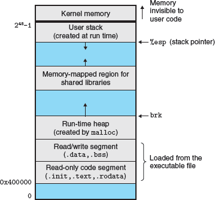
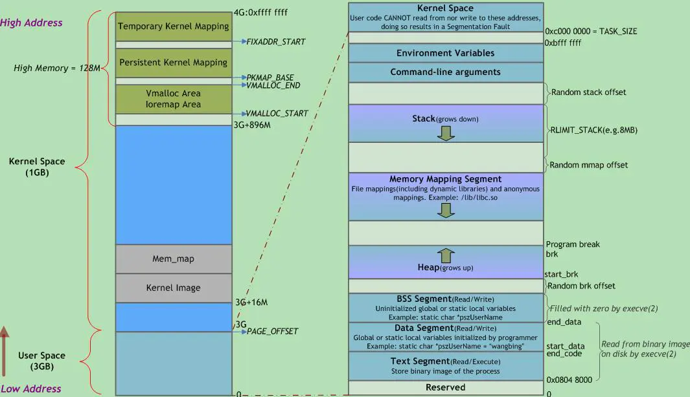

# 虚拟内存

所有的程序和系统一起共享内存，这给内存的管理和使用带来了巨大挑战。例如，一个进程的内存如果被另一个进行修改了，那么其运行的结果可能会错误或者运行崩溃，并且这种错误难以检测和分析；为了更好的管理内存和减少错误，现代系统对内存进行抽象，提供了虚拟内存。

虚拟内存是硬件异常、硬件地址转换、内存、磁盘文件以及内核的完美协作，为每个进程提供了独立、统一、超大的地址空间。在使用内存时，我们不用担心自己使用的内存是否会被别的程序占用，所有的空间都是给我们的程序使用的。虚拟内存提供了三项重要能力：

1. 将内存作为磁盘地址空间的缓存，更高效的使用内存，仅保留活动部分在内存中，只有在需要的时候才将数据从内存和磁盘之间加载和写回。

2. 通过为每个进程提供统一的地址空间来简化内存管理。

3. 保护每个进程的地址空间不被其他进程破坏。

虚拟内存是计算机系统中最伟大的思想之一。它成功的一个主要原因是它默默且自动工作，不需要应用程序程序员的任何介入。既然虚拟内存在幕后工作得如此之好，为什么还需要程序员理解它呢? 有几个原因。


- **虚拟内存是核心。** 虚拟内存涉及计算机系统的各级，在硬件异常、汇编程序、连接程序、加载程序、共享对象、文件和进程的设计中起着关键作用。了解虚拟内存将帮助开发者更好地在整体上理解系统的工作原理。

- **虚拟内存非常强大。** 虚拟内存给于应用程序创建和销毁内存块的强大能力，将内存块映射到磁盘文件的一部分，与其他进程共享内存。例如，你知道可以通过读写内存来读取或修改磁盘文件的内容吗? 或者将文件的内容加载到内存中而无需进行任何显式复制? 了解虚拟内存将帮助你在应用程序中利用它的强大功能。

- **虚拟内存非常危险。** 每当应用程序引用变量、解引用指针或调用动态分配内存(如 malloc )时，它们都会与虚拟内存交互。如果内存使用不当，应用会发生令人困惑的相关错误。例如，例如，程序中一个不好的指向可能触发“segmentation fault”或“protection fault”而立即崩溃，或者在崩溃前静默运行数小时，最可怕的是，能够运行到结束但是结果不正确。了解虚拟内存和管理它的分配包(如malloc)可以帮助您避免这些错误。


如果不正确地使用虚拟内存，应用程序可能会遇到令人困惑和潜伏的内存相关错误。例如，带有坏指针的程序可能会因“分段错误”或“保护错误”而立即崩溃，在崩溃前静默运行数小时，或者最可怕的是，运行到结束时结果不正确。了解虚拟内存以及牛奶的分配方案(如malloc)可以帮助开发者避免这些错误。


** 两个方面

- 虚拟内存是如何工作的 9.1 ~ 9.7
- 应用程序如何使用和管理虚拟内存 8.8 ~ 9.11

## 内存虚拟的必然性

现代计算机系统都提供了对内存的管理，并向上提供虚拟，让应用程序以为是独占了内存。看起来内存的这种虚拟是一种天才设计，但是回顾计算机发展的历史我们发现这种抽象其实是一种必然。

1. 应用程序独占的年代：
    在最早期的计算机出现的年代，计算机就是一台裸机，软件的开发人员直接面向硬件编程（如今的嵌入式编程就是如此）。整个计算机其实只运行一个程序，真正的做到了程序独占内存。

2. 批处理时代：
    计算机运行的速度越来越快，输入的速度却很慢，CPU 的很大时候需要等待操作员的输出，浪费了计算资源，为了更大效率利用 CPU，就有了将程序积累起来一起输入，然后计算机一个接一个的运行程序，每次只有一个程序在运行，程序仍然是独占内存的。

3. 多任务和分时操作系统的兴起
    由于技术改进，CPU 运行速度速度和程序的存储介质的访问速度的差距拉大，而且程序进行中间进行 IO 访问等操作时，程序实际上是暂停运行的，这时如果能运行其它程序，将很好的利用计算资源。同时由于操作系统概念的发展，对硬件资源进行管理，提供虚拟成了一个必然趋势。而内存的虚拟化是必然的，原因是：

    - 一方面，计算机程序希望独占内存，因为在编写程序时，我们无法预测另一程序使用了哪些内存，从而避开这部分使用。
    - 另一方面，而为了兼容原先的程序，也需要一个程序的内存地址是连续的。

    但是从实际内存的使用上来说，我们希望多个程序其实是同时存在于内存的，以便一个程序进行 IO 操作时，随时切换到其它程序运行。因此段页式的存储被设计出来，同时由操作系统对内存虚拟化，向应用提供虚拟的内存空间，在应用程序看来，整个内存空间都是自己独占的，可以使用内存的任意位置。


应用程序使用的内存空间是由操作系统提供的一个虚拟连续的地址空间。段页式内存是如何虚拟化和管理的是操作系统关系的内容，这里只关心应用程序可以使用的内存空间。


## 虚拟内存是内存管理的利器

虚拟内存极大的简化了内存管理，并且提供了一种方便的方式来保护内存。实际上，操作系统为每个进程提供了一个独立的页表，因为每个进程都有自己独立的内存空间。不同内存空间的虚拟页可以映射到同一个物理页面上，从而能节省物理内存。

按需页面调度和独立的虚拟地址空间的联合对系统中内存的使用和管理产生了深远的影响。特别是，虚拟内存内存简化了链接和加载、代码和数据的共用，以及为应用程序分配内存。


- 简化链接： 独立的地址空间让每个进程都使用相同的内存布局。不用关系具体的代码和数据在内存中的位置。例如，对于给定的 Linux 系统，每个进程都具有类似的内存布局。对于 64 的 Linux 系统，如下图所示


代码段总是从低地址开始，有的芯片无法从 0 开始（例如 8068 芯片很多从 4MB 的地址开始)，数据段跟在代码段之后，其之间会有一个合适的对齐间隙，栈在了用户地址空间的最高地址部分，并向下增长。这种一致性很大程度地简化了连接器的设计与实现，这使其能够产生全链接的可执行文件，可执行文件是独立于代码和数据在物理存内存中的位置。

— 简化加载: 虚拟内存也让可执行文件和共享文件加载进内存变得简单。为了加载对象文件中的 `.text` 和 `.data` 段进一个新建的进程， Linux 的加载器会为代码和数据段分配虚拟页（PTE），并将其标记为无效（invalid，not cached），并将页表项指向共享文件中的正确位置。有趣的是加载器从不进行磁盘到内存的数据拷贝。数据在页面第一次被访问时（CPU 获取一个指令或者执行指令时引用一个地址）才根据需要被自动换入内存。
    这种将一系列连续虚拟页映射到任意文件中的任意位置的概念称为 `内存映射`。Unix 系统都提供了 mmap 的系统调用以便应用程序创建自己的内存映射。这是一个非常有用的技术，我们会在稍后详细解释。

- 简化共享: 独立的地址空间为操作系统管理用户进程以及系统自己的共享提供了一致的机制。通常，每个进程都有自己的私有代码、数据、对和栈并且不与任何其它进程共享。这种情况下，操作系统创建页表，相应的续页页面映射到不相交的物理页面。
    然而，需要在进程之间共享代码和数据。例如，每个进程必须调用相同的操作系统内核代码，以及每个 C 程序调用 C 标准库中的函数，例如 `printf`。操作系统通过将不同进程中的虚拟页映射到相同的物理页，可以让多个进程共享内存中为唯一代码。而不是将内核和 C 标准库拷贝到不同进程中。

- 简化内存分配：虚拟内存向用户进程分配内存提供了一种简单的机制。当用户进程中的程序申请额外的堆空间时（例如，调用一个 malloc 函数），操作体统分配适当输数量的连续内存虚拟内存页，例如 K 个，并将其映射任意位置的 k 个物理内存页。由于页表的工作方式，操作系统不必寻找 k 个连续的物理内存页。这些页面可以随机地分散在物理内存中。

## 虚拟内存用于内存保护

任何现代计算机系统都必须为操作系统提供控制内存系统访问的机制。一个用户进程不应该被允许修改它的只读代码区。它也不应该被允许读取或更改任何内核中的代码和数据结构。也不应该允许其读取和修改其它进程的私有内存，也不应该允许它修改与其他进程共享的虚拟页，除非各方明确允许（通过显示调用进程间通信系统调用）。

正如我们看到的，提供独立的虚拟地址空间使隔离不同进程的私有内存变得简单。但地址转换机制可以很方便的扩展一提供更精细的访问控制。由于每次进程禅城一个地址地址转换硬件都会读取页表项，通过向页表项中添加额外的控制位就可以直接控制虚拟页内容的访问。

当一个指令违反了这些权限，CPU 就会触发一个通用的保护错误以将控制交给内核中的异常处理，其会向引发异常的进程发送一个 `SIGSEGV` 信号。 Linux shell 通常将该异常报告为 `segmentation fault.`

## 虚拟地址空间到底多大？

现代计算机通常采用 32 或者 64 位的地址总线。32 位机的的所有地址都在使用，对于 64 位机的寻址能力达到了 16 EB。


这么大的寻址能力支持的存储有多大呢？现在(2022 年) 美光推出全球最大容量内存卡高达1.5TB!，但是距离 EB 还有很遥远的距离。因此实际上为了节约成本没有计算机实际上支持这么大的内存寻址。当前主流的 64 位 CPU 实现通常支持 `39bits`, `48bits`的内存寻址。

计算地址空间大小有一个快速的方法，位数/10 作为单位，其单位转换表如下：

| Name   | Kilobyte | MegaByte | Gogabyte | TeraByte | PetaByte | ExaByte | ZetaByte |
| ------ | -------- | -------- | -------- | -------- | -------- | ------- | -------- |
| Chinese|  千字节   |   兆字节  |   吉字节  |   太字节  |   拍字节  |  艾字节  |   泽字节  |
| Symbol |    KB    |    MB    |    GB    |    TB    |    PB    |    EB   |    ZB    |
| Addres |   2^10   |   2^20   |   2^30   |   2^40   |   2^50   |   2^60  |   2^70   |

例如：

2^32 = 2^2 * 2^30 = 4 GB
2^64 = 2^4 * 2^60 = 16 EB
2^48 = 2^8 * 2^40 = 256 TB

如何验证 Linux 上使用多大的地址空间？我们可以使用如下命令查看实际使用的地址空间，例如在我的 64 位 X86 Linux 上：

```
$ cat  /proc/cpuinfo
...
address sizes	: 39 bits physical, 48 bits virtual
...
```

可以看到是 64 位的机器，但是仍然仅有 `48` 位地址在使用，也即 64 为 Linux 支持 256TB( 2^48 ) 的虚拟地址空间。这台机器上有 `39` 位的真实物理地址，也即 512 G，其实是硬盘容量。

但是 `Android ARM ` 系统 `/proc/cpuinfo` 中并没有 `address sizes` 信息。[在 Linux 官方的文档中](https://www.kernel.org/doc/Documentation/arm64/memory.txt)，我们知道 ARM 64 位 CPU **同时支持** `40bits`, `48bits` 的地址空间。支持 `ARMv8.2-LVA` 特性的 [ARM 甚至支持 `52bits` 的地址空间。](https://www.kernel.org/doc/html/latest/arm64/memory.html#)
```
AArch64 Linux memory layout with 4KB pages + 3 levels:

Start			End			Size		Use
-----------------------------------------------------------------------
0000000000000000	0000007fffffffff	 512GB		user
ffffff8000000000	ffffffffffffffff	 512GB		kernel
```


可见，**系统支持的内存地址不是想支持多大的寻址能力就能支持大多，而是 CPU 设计支持哪些地址空间，操作系统在 CPU 支持的地址空间上选择一种使用而已**

如何验证 ARM 上的实际使用的内存空间？

一个变通的方法是使用  `cat /proc/self/maps`，例如：

```
# 因为低地址可能打印时省略高位 0，因此我们看高地址的栈
...
7fd53d5000-7fd53f6000 rw-p 00000000 00:00 0                              [stack]
```

最前面的一列是这块内存占用的内存区间。打印的是 16 进制地址，一共有 10 位，因此使用的 `40 bits` 的地址空间。


## 内存空间的内存我可以随意使用吗？

进一步细化，我们得出如下问题：

1. 我们可以将数据放置到任意位置吗？
2. 我们可以使用多少堆空间？
3. 我们的栈可以支持多少调用？
4. 各个存储区有什么特点？

答案很明确：运行在现代操作系统的应用程序不能任意使用内存！没有操作系统的嵌入式开发可以。

虽然应用程序可以像独占内存一样使用全部的内存，但是现代应用程序开发已经对内存的使用划分了不同的区域（该区域是又操作系统和编译器共同决定的）。想要合理的使用内存，就需要了解应用程序能够使用的内存大小，同时掌握现代应用程序对内存是如何使用的，以及各个区域都有什么性质，如何高效合理的使用这些内存。


这里以 ARM 40bits 的地址空间为例，不同地址空间的内存占用不同，例如，39bits 的用户空间为 256GB，48bits 地址空间时 4 级 4KB 页大小用户空间 256TB，2 级 64KB 页大小用户空间为 4TB。具体平台的实际地址空间使用 `cat  /proc/cpuinfo` 和 `cat /proc/self/maps` 结合实际，具体分析。**虽然空间大小不同，但实际的布局顺序是一致的**

[40 位地址空间的 64 位 linux 系统的虚拟内存布局。](https://stackoverflow.com/questions/51928583/how-to-intepret-the-virtual-kernel-memory-layout-on-arm64)
```
--------------------> +--------------------------+                           +--------------------------+
ffff:ffff:ffff:ffff   |                          |                          /|    vsyscall,vdso,vva     |
                      |                          |                        /  +--------------------------+<--------------------
                      |                          |                      /    +        main stack        |         Stack
                      |----- Kernel (512G)-------| <-- PAGE_OFFSET    /      +--------------------------+<--------------------
                      |                          |                  /        |            :             |           ∨
                      |                          |                /          |       mmap + stack       |
ffff:ff80:0000:0000   |                          |              /            |            :             |
--------------------> +--------------------------+            /              |                          |
ffff:ff7f:ffff:ffff   |//////////////////////////|          /                |                          |
                      z //////////////////////// z        /                  |                          |
                      z //////////////////////// z      /                    |                          |
                      z //////////////////////// z    /                      |            :             |            ∧
0000:0080:0000:0000   |//////////////////////////|  /                        +--------------------------+< Program Break - brk/sbrk 
--------------------> +--------------------------+/                          |           heap           |           
0000:007f:ffff:ffff   |                          |                           +--------------------------+
                      |                          |                           |           data           |
                      |                          |                           +--------------------------+
                      |      User (512G)         |                           |           const          |
                      |                          |                           +--------------------------+
                      |                          |                           |           code           |
0000:0000:0000:0000   |                          |                           +--------------------------+
--------------------> +--------------------------+ - - - - - - - - - - - - > +--------------------------+
```

32 位内存布局：
```
--------------------> +--------------------------+
ffff:ffff             |                          |
                      |----- Kernel ( 1G )-------|
c000:0000             |                          |
--------------------> +--------------------------+
bfff:ffff             |                          |
                      |                          |
                      |                          |
                      |      User ( 3G )         |
                      |                          |
                      |                          |
0000:0000             |                          |
--------------------> +--------------------------+
```

- 64 位机的用户空间和内核没有使用连续内存，而是使用地址的两端，用户和内核虚拟地址大小是一样的。但是对于 32 位机，用户使用低地址的 3GB，内核只使用了 1GB.

- 32 位内存的用户空间的布局和 64 位内存的布局顺序一致，只不过地址空间更小。另外 64 位机能够兼容 32 位的程序，在运行 32 位程序时，内核空间仍然是 64 位机的样子，但是程序仅占低地址空间的 4 G 内存。具体查看 https://www.cnblogs.com/zengkefu/p/6783456.html

- 一些 64 位 CPU 支持将最高的几位地址为留作它用，例如 ARM 的 `Address Tagging (or top-byte-ignore, TBI)`。[HWAsan 就是使用 64 位中的高 8 为作为标记来检测内存使用问题的](https://clang.llvm.org/docs/HardwareAssistedAddressSanitizerDesign.html)，这也是想要使用 HWAsan 需要 64 位的芯片，并且要编译支持该技术的系统的原因。

- 需要特别说明的是，现代程序为了防止攻击，会开启随机化地址，这些程序的地址也不会严格从以上的分界线开始，而是有一个随机偏移。

- 有些芯片由于历史原因，地址并不能从 0 开始，例如历史上 X86 芯片将 1M 低地址作为中断和 BIOS 的存储区和终端显示，这部分地址软件就不能够使用。而 ARM 没有这些历史包袱，就能使用。

- 此外，有的 Linux 发行版会有一些快速系统调用的分区。

(盗图)更加详细的地址分布：




用户空间各区域的用处和特性，从低地址开始：

- 代码区：该区域存放代码，该区域具有可读可执行权限。

- 常量区：该区域用于存放常量、字面量(字符串等)等仅可读数据。

- 数据区：用于存放可变全局数据，全局变量、静态变量等。

- 堆区（heep）: 堆区用于程序自由申请的空间，这部分的管理交给了应用开发者，也是开发者关注最多的地方。例如 C 中 malloc 和 C++ new 的对象。

- 栈（stack）: 用于实现函数调用结构的内存块。**系统需要为每个线程分配一个栈**（可以设置大小，Linux 一般默认是8M，一般主线程和普通线程也有差别，可通过 ulimit 查看），栈空间是根据约定由编译器生成的代码自动由高地址向低地址增加。 **mmap 和栈的分配是从高地址向低地址的，如果 mmap 先申请，然后创建了线程。则先从高地址分配 mmap 的内存，然后向低地址给栈分配空间。多个栈内存并不一定放在一起。**(验证程序: memory/stack/stack_location.c)

- mmap 区: 包括文件映射和匿名内存映射。使用起来非常的灵活。
    - 应用程序的所依赖的动态库，会在程序执行时候，加载到内存这个区域，一般包括数据（data）和代码（text）;

    - 通过mmap系统调用，可以把特定的文件映射到内存中，然后在相应的内存区域中操作字节来访问文件内容，实现更高效的IO操作；例如腾讯的 MMKV 就是使用这部分内存。

    - 匿名映射，在 glibc 中 malloc 分配大内存的时候会用到匿名映射。这里所谓的“大”表示是超过了 MMAP_THRESHOLD 设置的字节数，它的缺省值是 128 kB，可以通过 mallopt() 去调整这个设置值。

    - 还可以用于进程间通信IPC（共享内存）。


**进程的虚拟地址空间的段分配和 ELF 的段不是完全相同的，进程的段主要考虑权限，权限相同的内容尽量会排在一起，以在分配物理内存时减少碎片。稍后看加载的时候会深入更多细节**

## 如何查看程序的虚拟地址分配？

### 查看程序的地址分配

我可能可以使用 readelf 查看程序的地址分配情况

TODO: 如何使用 readelf 查看程序内存占用。

然而这种方式无法包括动态申请的堆，栈、以及动态库等占用的内存，这些内存占用需要在程序运行时才能看到。我们可以使用 Linux 的 `/proc/`虚拟文件系统 maps 查看进程的内存地址分配。

### 进程的内存分配情况

free 用于查看物理内存的使用情况。除此外 `/proc/meminfo` 也提供了相关的物理内存使用情况。
可以使用 `cat /proc/self/maps` 和 `cat /proc/<process id>/maps` 获得更多内存信息。

查看 `/proc/<pid>/maps` 文件可以看到该进程的内存地址分配情况。包含当前进程使用的虚拟内存区域、内存映射的文件及其访问权限。也可以使用 mmap 命令查看。

此外线程的 maps 跟进程的 maps 是完全一致的，它们在 `/proc/<pid>/task/<tid>/maps` 文件中（输出结果完全相同，应该是同一个链接）。

文件的格式为：
```
地址区间                权限   偏移                  对应的文件
address               erms offset  dev   inode    pathname
00400000-00452000     -xp 00000000 08:02 173521   /usr/bin/dbus-daemon
00651000-00652000     --p 00051000 08:02 173521   /usr/bin/dbus-daemon
00652000-00655000     w-p 00052000 08:02 173521   /usr/bin/dbus-daemon
00e03000-00e24000     w-p 00000000 00:00 0        [heap]
00e24000-011f7000     w-p 00000000 00:00 0        [heap]
...
35b1800000-35b1820000 r-xp 00000000 08:02 135522  /usr/lib64/ld-2.15.so
35b1a1f000-35b1a20000 r--p 0001f000 08:02 135522  /usr/lib64/ld-2.15.so
35b1a20000-35b1a21000 rw-p 00020000 08:02 135522  /usr/lib64/ld-2.15.so
35b1a21000-35b1a22000 rw-p 00000000 00:00 0
35b1c00000-35b1dac000 r-xp 00000000 08:02 135870  /usr/lib64/libc-2.15.so
35b1dac000-35b1fac000 ---p 001ac000 08:02 135870  /usr/lib64/libc-2.15.so
35b1fac000-35b1fb0000 r--p 001ac000 08:02 135870  /usr/lib64/libc-2.15.so
35b1fb0000-35b1fb2000 rw-p 001b0000 08:02 135870  /usr/lib64/libc-2.15.so
...
f2c6ff8c000-7f2c7078c000 rw-p 00000000 00:00 0    [stack:986]
...
7fffb2c0d000-7fffb2c2e000 rw-p 00000000 00:00 0   [stack]
7fffb2d48000-7fffb2d49000 r-xp 00000000 00:00 0   [vdso]
```
各列的含义：

- 第一列地址区间: `00400000-00452000` 是该虚拟内存段的开始和结束位置，需要说明的是，该地址是前闭后开区间 `[start, end)`，即结束地址不是该断占用的，它可能是下一段的起始地址。
- 第二列内存权限: `r-xp` 内存段的权限，分别是可读、可写、可运行、私有或共享，最后一位p代表私有，s代表共享。例如程序段 `r-xs`，数据段 `r--p`，还有用户保护栈越界触发中断的 `---p`。
- 第三列文件偏移: `00000000` 该虚拟内存段起始地址在对应的映射文件中以页为单位的偏移量，对匿名映射，它等于0或者vm_start/PAGE_SIZE
- 第四列设备号  : `08:02` 文件的主设备号和次设备号。对匿名映射来说，没有对应的磁盘文件，所以没有设备号，始终为00:00。
- 第五列 innode: `173521` 被映射到虚拟内存的文件的索引节点号，通过该节点可以找到该文件，匿名映射的该列始终为00:00。
- 第六列映射文件: `/bin/bash` 被映射到虚拟内存的文件名称。后面带(deleted)的是内存数据，可以被销毁。对于文件映射，是映射的文件名。对匿名映射来说，是此段虚拟内存在进程中的角色：[stack]表示在进程中作为栈使用，[heap]表示堆。其余情况则无显示。


先说一下`映射`的概念：

在Linux 内存管理的进程用户态内存分布中提到过，映射分为:

- 文件映射: 文件映射就是磁盘中的数据通过 `文件系统` 映射到内存再通过 `文件映射` 映射到虚拟空间，这样，用户就可以在用户空间通过 open ,read, write 等函数区操作文件内容。至于实际的代码，open,read,write,close,mmap… 操作的虚拟地址都属于文件映射。

- 匿名映射: 进程需要分配一定的物理内存来存储运行时的数据，这部分内存没有对应文件，内核就使用 `匿名映射` 将内存中的某段物理地址与用户空间一一映射，这样用户就可用直接操作虚拟地址来访问这段物理内存。比如使用malloc申请内存。


相关的 `map_files` 目录下的链接文件就是以上输出中 `文件映射` 的段，并且文件名就是第一列的`地址区间`。

例如以上的进程的 `map_files` 目录：

```
$ ll map_files/
total 0
dr-x------ 2 root root  0 Jun 28 02:25 ./
dr-xr-xr-x 9 root root  0 Jun 28 02:19 ../
lr-------- 1 root root 64 Jun 28 02:25 00400000-00452000 -> /usr/bin/dbus-daemon
lr-------- 1 root root 64 Jun 28 02:25 00651000-00652000 -> /usr/bin/dbus-daemon
lr-------- 1 root root 64 Jun 28 02:25 00652000-00655000 -> /usr/bin/dbus-daemon
lr-------- 1 root root 64 Jun 28 02:25 35b1800000-35b1820000 -> /usr/lib64/ld-2.15.so
lr-------- 1 root root 64 Jun 28 02:25 35b1a1f000-35b1a20000 -> /usr/lib64/ld-2.15.so
lr-------- 1 root root 64 Jun 28 02:25 35b1a20000-35b1a21000 -> /usr/lib64/ld-2.15.so
lr-------- 1 root root 64 Jun 28 02:25 35b1c00000-35b1dac000 -> /usr/lib64/libc-2.15.so
lr-------- 1 root root 64 Jun 28 02:25 35b1dac000-35b1fac000 -> /usr/lib64/libc-2.15.so
lr-------- 1 root root 64 Jun 28 02:25 35b1fac000-35b1fb0000 -> /usr/lib64/libc-2.15.so
lr-------- 1 root root 64 Jun 28 02:25 35b1fb0000-35b1fb2000 -> /usr/lib64/libc-2.15.so
```
```
//vvar page，kernel的一些系统调用的数据会映射到这个页面，用户可以直接在用户空间访问；
6ff25da000-6ff25db000 r--p 00000000 00:00 0                              [vvar]
// vDSO -virtual dynamic shared object,is a small shared library exported by the kernel to accelerate the execution
// of certain system calls that do not necessarily have to run in kernel space, 就是内核实现了glibc的一些系统调用，然后可
// 以直接在用户空间执行,提高系统调用效率和减少与glibc的耦合。
6ff25db000-6ff25dc000 r-xp 00000000 00:00 0                              [vdso]
```

## 进一步的疑问是，各个区域能够使用的空间是多大？

从上面的虚拟地址空间可以看出，由于有多个栈存在，栈的空间大小并不是可以任意增长的；各个区域的内存大小是否有限制？有限制的话内存大小是多少？堆的起始地址是如何确定的？

不同系统、发行版，甚至版本的限制可能不同。对于 Linux，可以使用 `ulimit -a` 来查看系统的限制，也可以使用 `ulimit` 来修改这些设置。。或者使用 `cat /proc/<pid>/limits` 直接查看运行进程的限制。

```shell
prompt> ulimit -a
core file size          (blocks, -c) 0
data seg size           (kbytes, -d) unlimited
scheduling priority             (-e) 0
file size               (blocks, -f) unlimited
pending signals                 (-i) 30964
max locked memory       (kbytes, -l) 64
max memory size         (kbytes, -m) unlimited
open files                      (-n) 1048576
pipe size            (512 bytes, -p) 8
POSIX message queues     (bytes, -q) 819200
real-time priority              (-r) 0
stack size              (kbytes, -s) 8192
cpu time               (seconds, -t) unlimited
max user processes              (-u) unlimited
virtual memory          (kbytes, -v) unlimited
file locks                      (-x) unlimited
```

可以看到 `max memory size`、`data seg size`、`virtual memory` 都没有限制，该 Linux 只限制了栈的内存大小为 8MB。

1. 堆的起始地址并不是固定的，而是根据运行的程序占用的代码段、数据段决定。在这两部分地址末尾会增加一个随机地址（防止攻击），以此作为堆的起始地址。使用 brk 系统调用增长内存地址来申请堆的内存。

### 栈空间大小

栈空间的大小默认是 8MB，对于主线程的栈和其它线程还有点细微差别。

#### 主线程栈大小

对于主线程，系统并没有一开始就申请 8MB 的地址空间，而是只有 132KM。

```
prompt> cat /proc/4150/maps
...
7fbbd2316000-7fbbd2317000 r--p 0002c000 fe:01 1835702                    /usr/lib/x86_64-linux-gnu/ld-2.31.so
7fbbd2317000-7fbbd2318000 rw-p 0002d000 fe:01 1835702                    /usr/lib/x86_64-linux-gnu/ld-2.31.so
7fbbd2318000-7fbbd2319000 rw-p 00000000 00:00 0
7ffd457b0000-7ffd457d1000 rw-p 00000000 00:00 0                          [stack]    # 132KB
7ffd457d1000-7ffd457d5000 r--p 00000000 00:00 0                          [vvar]
7ffd457d5000-7ffd457d7000 r-xp 00000000 00:00 0                          [vdso]
ffffffffff600000-ffffffffff601000 r-xp 00000000 00:00 0                  [vsyscall]
```
可以看到栈的大小只有 132KB，这并不是说该进程的栈只有 132KB，从地址分配上可以看到，栈的地址段低地址的下一个段的结束地址 `7fbbd2319000` 有很大一个空间，而且没有给主线程的栈分配栈溢出保护段。这是因为 Linux 默认先分配 132 KB 的内存，随着已分配的栈区域耗尽，将触发一个缺页异常进入内核。通过异常陷入内核态后，异常会被内核的 expand_stack() 函数处理，进而调用 acct_stack_growth() 来检查是否还有合适的地方用于栈的增长。


如果栈的大小低于 RLIMIT_STACK（通常为8MB），那么一般情况下栈会被加长，程序继续执行，感觉不到发生了什么事情，这是一种将栈扩展到所需大小的常规机制。然而，如果达到了最大栈空间的大小，就会发生 栈溢出（stack overflow），进程将会收到内核发出的 段错误（segmentation fault） 信号。

动态栈增长是唯一一种访问未映射内存区域而被允许的情形，其他任何对未映射内存区域的访问都会触发页错误，从而导致段错误。一些被映射的区域是只读的，因此企图写这些区域也会导致段错误。


但是在 Android 系统上，其栈大小为 `8188KB`，加上栈溢出的保护段 `4KB`，恰好 8MB。不知道是不是内核版本的不同，还是谷歌修改了限制。）。**安卓的主线程后面也保留了很大一块地址空间，应该也能增加吧。**

```shell
prompt> adb shell
prompt> ps | grep <app 的包名>  # 查看进程的 id
prompt> run-as <app 的包名>   # 获取沙盒权限，查看该进程的 maps 文件。
prompt> cat /proc/<pid>/maps
...
7873d0e000-7873d0f000 r--p 00000000 00:00 0                              [anon:.bss]
7873d0f000-7873d15000 rw-p 00000000 00:00 0                              [anon:.bss]
7fdff55000-7fdff56000 ---p 00000000 00:00 0                                          # 4KB 的保护
7fdff56000-7fe0755000 rw-p 00000000 00:00 0                              [stack]     # 8188KB 的栈
```

#### 子线程栈大小

***对于非主线程的栈大小，在不超过系统限制的情况下，其大小由线程库决定。*** 例如，我的 PC Linux 的线程的栈大小为 8MB

Android 的标准库不是 glibc，而是 bionic。其子线程的栈大小小于 1MB。 

```
//java thread
797eae5000-797eae7000 ---p 00000000 00:00 0 
797eae7000-797eae8000 ---p 00000000 00:00 0                              [anon:stack_and_tls:11512]
797eae8000-797ebef000 rw-p 00000000 00:00 0                              [anon:stack_and_tls:11512]
797ebef000-797ebf1000 ---p 00000000 00:00 0                                                         # 8KB
797ebf1000-797ebf2000 ---p 00000000 00:00 0                              [anon:stack_and_tls:11511] # 4KB
797ebf2000-797ecf9000 rw-p 00000000 00:00 0                              [anon:stack_and_tls:11511] # 1M + 28KB = 1052KB  为什么会大于 1MB?

native thread?
//native thread
```
具体到不同版本的修改可以查看：https://zhuanlan.zhihu.com/p/33562383

每个栈结束都会有一个不可读写的页，用于栈的溢出保护。(为什么 stack guard 之后还有两页的保护？ < java thread 在art 里面还会再隔离一个page, 判断收到的SIGSEGV 是否为StackOverflowError.> 这个说法是真的吗? native stack 没有？)

如何找到线程的栈？

maps 输出的信息 `anon:stack_and_tls:11511` 的数字其实是线程 id, 我们可以查看进程下的所有线程来找到线程对应的栈地址。如果你有 root 的安卓系统，可以使用 `adb shell debuggerd -b PID` 可查看当前进程的所有线程。然后找到对应 tid 的堆栈。否则使用 `adb shell ps -T | grep <pid>`

```
$ adb shell ps -T | grep 11482
u0_a555       11482 11482    798 5727320 151356 0                   0 S .yaowen.android
...
u0_a555       11482 11511    798 5727320 151356 0                   0 S thread1
u0_a555       11482 11512    798 5727320 151356 0                   0 S thread2
...
```

#### 实际可使用大小

然而并不意味着可使用的空间能达到 8M，例如在栈上申请 8M 的空间则会发生段错误
```C
void* runing(void* p){
    char tack_stack[ 8 * 1024 * 1024 - 2 * sizeof(void*)] = {}; // 减去参数和返回值占用的空间，虽然返回值有时采用寄存器返回
}
```

或者我们打印线程栈的入口地址
```C
void* runing(void* p){
    printf("stack bottom addr: %p\n", &p + sizeof(void*)); // 形参没有入栈的位置。或者打印栈底寄存器更准确。
}
```
可以发现其输出和 maps 给出的地址并不相同。也可实际获取的地址不同。

```C
// 获取栈大小和位置。
int main()
{
  foobar(4);
  // Declare variable for thread's ID:
  pthread_t id;
  int err = 0, count = 0;
  pthread_attr_t attr;

  while (count < 4) {
    err = pthread_create(&id, NULL, runing, (void *)count);
    pthread_getattr_np(id, &attr);
    size_t stack_size, guard_size;
    void *stack_addr;
    int s;
    char *prefix = "";
    s = pthread_attr_getguardsize(&attr, &guard_size);
    printf("%sGuard size          = %zu bytes\n", prefix, guard_size);

    s = pthread_attr_getstack(&attr, &stack_addr, &stack_size);

    printf("%sStack address       = %p", prefix, stack_addr);
    if (stack_size > 0)
       printf(" (EOS = %p)", (char *) stack_addr + stack_size);
    printf("\n");
    printf("%sStack size          = %#zx (%zu) bytes\n",
                   prefix, stack_size, stack_size);
    printf("count = %d\n", count);
    count++;
  }
  printf("Entry any key to finish program.");
  getchar();
  return 0;
}
```

```
Guard size          = 4096 bytes
Stack address       = 0x7fd546f65000 (EOS = 0x7fd547765000)
Stack size          = 0x800000 (8388608) bytes
stack bottom addr: 0x7fd547763eec
```

线程的入口函数帧地址 `0x7fd547763eec` 距分配空间的栈底 `0x7fd547765000` 还有 `4372` 字节的大小。这部分局域用于存放线程先关的数据以及 TLS(Thread Local Storage) 数据。因此实际可用的空间不足 8MB。

```
...
7f54affec000-7f54affed000 ---p 00000000 00:00 0
7f54affed000-7f54b07ed000 rw-p 00000000 00:00 0    # 8MB
7f54b07ed000-7f54b07ee000 ---p 00000000 00:00 0
7f54b07ee000-7f54b0fee000 rw-p 00000000 00:00 0    # 8MB
7f54b0fee000-7f54b0fef000 ---p 00000000 00:00 0
7f54b0fef000-7f54b17ef000 rw-p 00000000 00:00 0    # 8MB
7f54b17ef000-7f54b17f0000 ---p 00000000 00:00 0
7f54b17f0000-7f54b1ff3000 rw-p 00000000 00:00 0    # 8204KB 第一个创建的线程的 maps 输出并不是 8MB。 Way?
...


root@573a3d572e1d:/# ps -aux
USER       PID %CPU %MEM    VSZ   RSS TTY      STAT START   TIME COMMAND
root         1  0.0  0.0   4248  3376 pts/0    Ss+  03:37   0:00 /bin/bash
root        13  0.0  0.0   4248  3612 pts/1    Ss   03:37   0:00 /bin/bash
root        26  0.0  0.0   4248  3596 pts/2    Ss   03:37   0:00 /bin/bash
root     15394  0.0  0.0  35452   644 pts/1    Sl+  15:31   0:00 ./a.out
root     15399  0.0  0.0   5904  2940 pts/2    R+   15:31   0:00 ps -aux
root@573a3d572e1d:/# cat /proc/15394/maps
00400000-00401000 r--p 00000000 00:90 7785369                            /opt/webrtc/a.out
00401000-00402000 r-xp 00001000 00:90 7785369                            /opt/webrtc/a.out
00402000-00403000 r--p 00002000 00:90 7785369                            /opt/webrtc/a.out
00403000-00404000 r--p 00002000 00:90 7785369                            /opt/webrtc/a.out
00404000-00405000 rw-p 00003000 00:90 7785369                            /opt/webrtc/a.out
018d2000-018f3000 rw-p 00000000 00:00 0                                  [heap]
7fd545761000-7fd545762000 ---p 00000000 00:00 0
7fd545762000-7fd545f62000 rw-p 00000000 00:00 0
7fd545f62000-7fd545f63000 ---p 00000000 00:00 0
7fd545f63000-7fd546763000 rw-p 00000000 00:00 0
7fd546763000-7fd546764000 ---p 00000000 00:00 0
7fd546764000-7fd546f64000 rw-p 00000000 00:00 0
7fd546f64000-7fd546f65000 ---p 00000000 00:00 0
7fd546f65000-7fd547768000 rw-p 00000000 00:00 0
7fd547768000-7fd54778d000 r--p 00000000 fe:01 1835895                    /usr/lib/x86_64-linux-gnu/libc-2.31.so
7fd54778d000-7fd547905000 r-xp 00025000 fe:01 1835895                    /usr/lib/x86_64-linux-gnu/libc-2.31.so
7fd547905000-7fd54794f000 r--p 0019d000 fe:01 1835895                    /usr/lib/x86_64-linux-gnu/libc-2.31.so
7fd54794f000-7fd547950000 ---p 001e7000 fe:01 1835895                    /usr/lib/x86_64-linux-gnu/libc-2.31.so
7fd547950000-7fd547953000 r--p 001e7000 fe:01 1835895                    /usr/lib/x86_64-linux-gnu/libc-2.31.so
7fd547953000-7fd547956000 rw-p 001ea000 fe:01 1835895                    /usr/lib/x86_64-linux-gnu/libc-2.31.so
7fd547956000-7fd54795a000 rw-p 00000000 00:00 0
7fd54795a000-7fd547961000 r--p 00000000 fe:01 1836102                    /usr/lib/x86_64-linux-gnu/libpthread-2.31.so
7fd547961000-7fd547972000 r-xp 00007000 fe:01 1836102                    /usr/lib/x86_64-linux-gnu/libpthread-2.31.so
7fd547972000-7fd547977000 r--p 00018000 fe:01 1836102                    /usr/lib/x86_64-linux-gnu/libpthread-2.31.so
7fd547977000-7fd547978000 r--p 0001c000 fe:01 1836102                    /usr/lib/x86_64-linux-gnu/libpthread-2.31.so
7fd547978000-7fd547979000 rw-p 0001d000 fe:01 1836102                    /usr/lib/x86_64-linux-gnu/libpthread-2.31.so
7fd547979000-7fd54797d000 rw-p 00000000 00:00 0
7fd547982000-7fd547983000 r--p 00000000 00:90 7672748                    /opt/webrtc/lib.so
7fd547983000-7fd547984000 r-xp 00001000 00:90 7672748                    /opt/webrtc/lib.so
7fd547984000-7fd547985000 r--p 00002000 00:90 7672748                    /opt/webrtc/lib.so
7fd547985000-7fd547986000 r--p 00002000 00:90 7672748                    /opt/webrtc/lib.so
7fd547986000-7fd547987000 rw-p 00003000 00:90 7672748                    /opt/webrtc/lib.so
7fd547987000-7fd547989000 rw-p 00000000 00:00 0
7fd547989000-7fd54798a000 r--p 00000000 fe:01 1835702                    /usr/lib/x86_64-linux-gnu/ld-2.31.so
7fd54798a000-7fd5479ad000 r-xp 00001000 fe:01 1835702                    /usr/lib/x86_64-linux-gnu/ld-2.31.so
7fd5479ad000-7fd5479b5000 r--p 00024000 fe:01 1835702                    /usr/lib/x86_64-linux-gnu/ld-2.31.so
7fd5479b6000-7fd5479b7000 r--p 0002c000 fe:01 1835702                    /usr/lib/x86_64-linux-gnu/ld-2.31.so
7fd5479b7000-7fd5479b8000 rw-p 0002d000 fe:01 1835702                    /usr/lib/x86_64-linux-gnu/ld-2.31.so
7fd5479b8000-7fd5479b9000 rw-p 00000000 00:00 0
7ffd09d7b000-7ffd09d9c000 rw-p 00000000 00:00 0                          [stack]
7ffd09da2000-7ffd09da6000 r--p 00000000 00:00 0                          [vvar]
7ffd09da6000-7ffd09da8000 r-xp 00000000 00:00 0                          [vdso]
ffffffffff600000-ffffffffff601000 r-xp 00000000 00:00 0                  [vsyscall]


root@573a3d572e1d:/opt/webrtc# ./a.out

Guard size          = 4096 bytes
Stack address       = 0x7fd546f65000 (EOS = 0x7fd547765000)
Stack size          = 0x800000 (8388608) bytes
stack 0 bottom value: 0x7fd547763eec


Guard size          = 4096 bytes
Stack address       = 0x7fd546764000 (EOS = 0x7fd546f64000)
Stack size          = 0x800000 (8388608) bytes
stack 1 bottom value: 0x7fd546f62eec

Guard size          = 4096 bytes
Stack address       = 0x7fd545f63000 (EOS = 0x7fd546763000)
Stack size          = 0x800000 (8388608) bytes
stack 2 bottom value: 0x7fd546761eec


Guard size          = 4096 bytes
Stack address       = 0x7fd545762000 (EOS = 0x7fd545f62000)
Stack size          = 0x800000 (8388608) bytes
stack 3 bottom value: 0x7fd545f60eec
```

[vsyscall, vdso 及 vvar](https://zhuanlan.zhihu.com/p/436454953)用于 X86 平台的快速系统调用，其它平台没有，而且是关于内核调用的实现，这里不再深入探究。


### 修改默认栈大小

#### 主线程

我们可以使用 `getrlimit` 获取栈的大小限制，可以使用 `setrlimit` 增加内存大小限制，甚至超过 `ulimit` 的大小限制。

```C
// 该程序来自 https://stackoverflow.com/questions/2279052/increase-stack-size-in-linux-with-setrlimit
#include <sys/resource.h>
#include <stdio.h>

int main (int argc, char **argv)
{
    const rlim_t kStackSize = 64L * 1024L * 1024L;   // min stack size = 64 Mb
    struct rlimit rl;
    int result;

    result = getrlimit(RLIMIT_STACK, &rl);
    if (result == 0)
    {
        if (rl.rlim_cur < kStackSize)
        {
            rl.rlim_cur = kStackSize;
            result = setrlimit(RLIMIT_STACK, &rl);
            if (result != 0)
            {
                fprintf(stderr, "setrlimit returned result = %d\n", result);
            }
        }
    }

    // ...

    return 0;
}
```
运行该程序，查看该进程的内存限制。

```shell
prompt> cat /proc/139/limits
Limit                     Soft Limit           Hard Limit           Units
...
Max stack size            67108864             unlimited            bytes
...
```
`67108864 / 1024 / 1024 = 64MB`，看一下系统的限制仍然是 8MB.

```shell
prompt> ulimit -s
8192
```

#### 子线程

线程栈在创建线程的时候由线程库确定，想要修改只能重新创建线程。使用 `pthread_attr_setstack` 来设置不超过限制的栈大小。

```C
#include <pthread.h>

#define PAGE_SIZE 4096
#define STK_SIZE (10 * PAGE_SIZE)

void *stack;
pthread_t thread;
pthread_attr_t attr;

void *dowork(void *arg)
{
 int data[2*STK_SIZE];
 int i = 0;
 for(i = 0; i < 2*STK_SIZE; i++) {
   data[i] = i;
 }
}

int main(int argc, char **argv)
{
  //pthread_attr_t *attr_ptr = &attr;
  posix_memalign(&stack,PAGE_SIZE,STK_SIZE);
  pthread_attr_init(&attr);
  pthread_attr_setstack(&attr,&stack,STK_SIZE);
  pthread_create(&thread,&attr,dowork,NULL);
  pthread_exit(0);
}
pthread_create(&thread, &attr, dowork, NULL);
```


## Linux 可以创建多少线程？

这些问题有两方面的限制：

**进程的虚拟内存空间大小**，这个很好理解，虚拟地址空间越大，能够使用的地址资源越多，限制也就越少。

**系统参数限制**，虽然 Linux 并没有内核参数来控制单个进程创建的最大线程个数，但是有系统级别的参数来控制整个系统的最大线程个数。


假如使用 Linux 默认的设置，栈的大限制为 8M，在 32 位系统中，用户空间占 3GB， `3GB / 8MB = 384`，除掉代码段和数据段占用，以及随机地址偏移（导致具体数字不可预测），应该能创建 300 多个线程。

调整栈的大小，则会改变创建线程的数量，比如调整为 512k：

```shell
prompt> ulimit -s 512
```

对于 64 位系统，以使用 48位地址的系统为例，用户的地址空间可以达到 128T，`128T / 8MB = 16777216`，可以达到一千六百万左右。其还有系统的限制。

```shell
prompt> cat /proc/sys/kernel/threads-max # 表示系统支持的最大线程数
61929

prompt> cat proc/sys/kernel/pid_max # 全局的 PID 号数值的限制，每一个进程或线程都有 ID，ID 的值超过这个数，进程或线程就会创建失败
99999

prompt> cat /proc/sys/vm/max_map_count # 表示限制一个进程可以拥有的VMA(虚拟内存区域)的数量，虚拟内存区域是一个连续的虚拟地址空间区域。maps 输出的就是就是 VMA 的列表。每创建一个栈占一个，不同栈之间因为随机地址偏移而不连续。
262144
```

修改这三个参数都会影响系统实际创建线程的数量。更详细的测试可以看这个博客：https://www.jianshu.com/p/c4bb6457e4a9 


## 地址随机化问题

现代系统通过地址随机化来防止基于地址的攻击，比如栈溢出攻击和堆溢出攻击等，Linux在特定段之间使用随机偏移，使段的起始地址是随机值, Linux 系统上的ASLR 等级可以通过文件 `/proc/sys/kernel/randomize_va_space` 来进行设置，它支持以下取值：

- 0 - 关闭的随机化。每次分配的地址将保持一致。
- 1 - 保守的随机化。共享库、栈、mmap()、VDSO以及堆将被随机化。
- 2 - 完全的随机化。除了上面列举的要素外，通过 brk() 分配得到的内存空间也将被随机化。

可以通过 `sudo sysctl -w kernel.randomize_va_space=val` 的命令来修改设置。


## 进程的内存分配

Unix 创建一个进程


进程的内存分配，Copy-On-Write (写时复制)策略：当创建一个进程时，其和父进程使用同一份 Memory, 只有当使用到内存时，才实际分配内存，fork 出来的进程, 并且没执行新的程序, 内存都是共享的, 可以极大的节省Memory 的使用.

## 页面类型

- 文件映射
- 匿名映射

### Page Allocation Failure

It can be caused by memory segmentation — the available memory is so fragmented that there is not enough contiguous space to allocated pages that require contiguous space.

It can also be caused by a general lack of memory.


Setting /sys/kernel/mm/transparent_hugepapge/enabled to never will disable them.

- 查看该进程的 maps 和 smaps 文件。并解释细节
- 查找资料，确认 /proc 目录下面各个文件的作用。
- 代码段和数据段的权限不同，会放在同一页吗？如果不能放在同一页是否有很多内存浪费？

- 用户程序向内核申请内存是否只能整页申请？否，内核有不同的分配器，伙伴系统只能分配整页，以及整页的倍数，但slab 分配器可以按字节分配。

- 用户内存是否真的没有限制？

参考:

[Linux 最多创建多少线程](https://www.jianshu.com/p/c4bb6457e4a9)
[Android 线程大小](https://zhuanlan.zhihu.com/p/33562383)
[maps](https://www.cnblogs.com/my_life/articles/12068025.html)
[Linux中的进程栈和线程栈大小](https://blog.csdn.net/u013178472/article/details/124117145)
[Android jvm 虚拟机的内存大小限制](https://blog.csdn.net/weixin_39692830/article/details/117498033)
[Linux 内存管理](https://hemantra.medium.com/linux-memory-management-all-you-need-to-know-d1dbdda8b386)