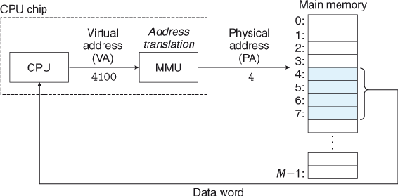
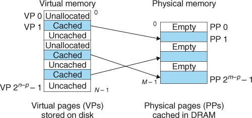
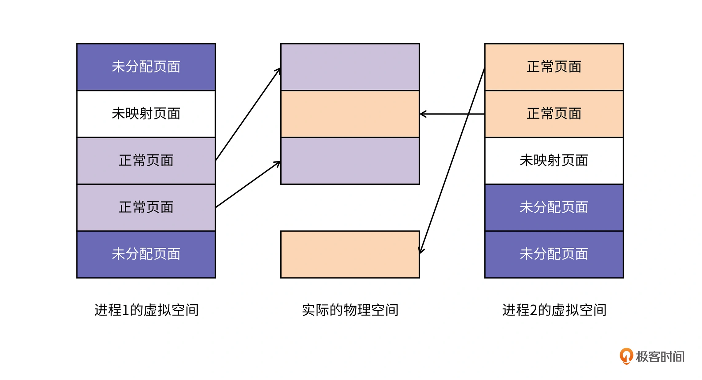
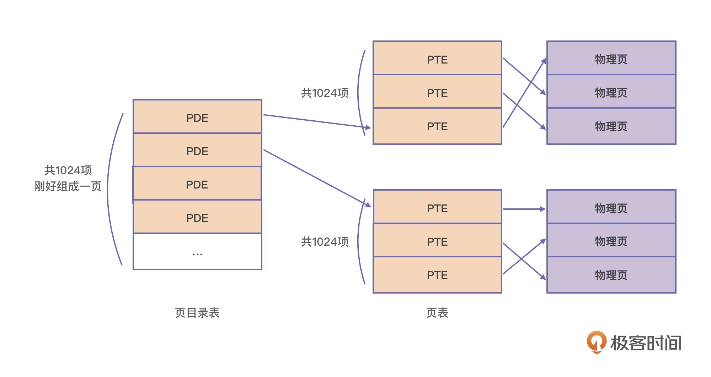
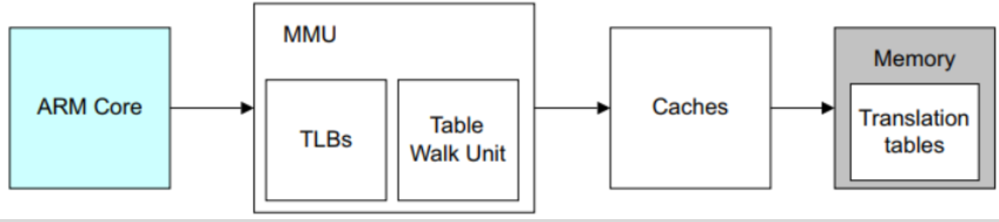

# 地址转换

## 物理地址

计算机系统的内存是由 M 个连续字节大小的单元组成的数组。每个字节都有一个唯一的物理地址(PA:physical address)。第一个字节的地址为 0，下一个字节的地址为1，再下一个字节的地址为2，依此类推。访问内存最直接的方式就是通过这些地址，早期的计算机以及现在的单片机就是使用这种方式。现代的处理器都提供了虚拟地址（VA）向物理地址转换的能力。


当 CPU 执行一条包含地址的指令时，该地址其实是一个虚拟地址，CPU 中的地址转换单元（MMU:Memory Management Unit）会将地址转换为物理地址，然后才访问物理地址所在的内存。



## 虚拟地址作为缓存工具

概念上，虚拟存储被组织为一个存贮在磁盘上的连续的 N 字节大小的数组。每个字节都有一个唯一的虚拟地址，作为数组的唯一索引。磁盘上数组的内容被缓存到内存中。像存储体系中的任何其他缓存一样，磁盘中的数据被划分成块，作为磁盘（下层）和内存（上层）传输的单元。虚拟存储系统通过将虚拟内存划分为固定大小的块(称为虚拟页 PVs)来处理这个问题。每个虚拟页有 P = 2^p 字节大小。类似地，物理存储被划分为物理页（PPs），同样是 P 字节大小。（物理页通常被称为页帧）。

在任意时刻，虚拟页面集被划分为三个不相交的子集：

- 未分配的: VM 系统还未分配 (或者创建)的页。未分配的块没有任何数据和它们相关联， 因此也就不关联任何磁盘空间。

- 末缓存的: 己分配但没有缓存在物理存储器中的页。

- 缓存的:   已分配并且缓存在物理存储器中中的页。




###  DRAM 缓存的组织结构

为了帮助理解存贮体系中的不同缓存，我们使用术语 `SRAM 缓存` 表示 CPU 和内存之间的 L1、L2、L3 缓存，术语 `DRAM 缓存` 表示存储在内存中的虚拟存储的缓存。归根结底，DRAM 缓存的组织完全由巨大的不命中成本驱动。

在存储体系结构中，DRAM 缓存的的位置对其组织方式影响很大。回想一下，DRAM 至少比 SRAM 慢十倍，然而磁盘要比 DRAM 慢约十万倍。因此 DRAM 缓存的不命中要比 SRAM 缓存的不命中昂贵的多，因为 DRAM 缓存不命中需要从磁盘加载，而 SRAM 缓存的不命中通常需要基于 DRAM 的内存提供。更甚者，从磁盘扇区读取第一字节的花费比读取扇区上后继字节慢十万倍。

因为不命中的巨大惩罚以及访问第一字节的的巨大开销，虚拟页趋向于设计的更大——通常 4KB 到 2MB。由于不命中的巨大惩罚，DRAM 缓存设计为全关联的，即，任意虚拟页可以关联到任意的物理页。不命中的替换策略也非常重要，因为替换了错误页面的惩罚是如此高昂。因此，操作系统使用在 DRAM 缓存使用复杂得多的替换算法。另外，由于磁盘巨大的访问时间，DARM 缓存总是使用写回（write-back）而不是写直达(write-through)


SRAM: Static Random Access Memory 静态随机存储器
DRAM: Dynamic Random Access Memory 动态随机存储器

## 分段还是分页

分段和分页的内存管理是内存管理最常讨论的内容，**现代操作系统都使用分页式的管理来管理物理内存。**当然，分段也不是消失了，分段更多是在软件层面用于区分软件的不同块，代码段、数据段等。

存储管理方式随着ＯＳ的发展也在不断的发展。
单一连续分配——（ＯＳ由单道向多道发展）——>固定分区分配——（适应应用程序不同大小的需求）——>动态分区分配（提高内存利用率）——>分页存储管理方式

如果说推动上述发展的主要动力都直接或简介地出于提高内存的利用效率的目的，那么，分段的存储管理方式，则主要为了满足用户在编程和使用上的需求。许多高级语言的编译程序都支持分段的存储管理方式。这种管理方式已成为当今存储管理方式的基础。

### 页表


## 地址转换

## 虚拟地址的原理

虚拟地址的实现需要操作系统和硬件协同实现。CPU 和外部存储的速度差距随着计算机发展越来越大，想要程序独占内存同时实现并发并不现实，一是内存硬件并不便宜，而且要运行的程序数量无法确定，无法为每一个程序配备独立的内存。另一方面，采用从磁盘加载的方式，由于磁盘加载速度和 CPU 运行速度差别太大，事实上 IO 往往是程序性能的瓶颈，极大的影响程序速度。想要多个进程并发，共享内存是唯一的出路。得益于“局部性原理”，程序可以使用一小块内存就能运行的很好。

## 局部性原理

在绝大多数程序的运行过程中，当前指令大概率都会引用最近访问过的数据。也就是说，程序的数据访问会表现出明显的倾向性。这种倾向性，我们就称之为局部性原理 (Principle of locality)。

- 空间局部性: 程序的绝大部分是顺序逻辑，程序执行时果一个内存位置被引用过，那么接下来极大概率访问它邻近的位置。
- 时间局部性: 程序中循环逻辑的普遍存在，使被访问过一次的内存位置很可能在不远的将来会被再次访问。

基于这个原理，我们可以做出一个合理的推论：**无论一个进程占用的内存资源有多大，在任一时刻，它需要的物理内存都是很少的。**在这个推论的基础上，CPU 为每个进程只需要保留很少的物理内存就可以保证进程的正常执行了。


根据局部性原理，很容易想到多个程序共享内存的方法就是每个程序分配一小块（多块）内存。实际上内存的设计多采用将内存划分成固定大小的块。这样的好处是：程序根据需要申请内存，程序需要内存比较多时可以多申请内存，不至于一次申请过多造成浪费。固定大小的内存电路设计比较简单，操作系统方便管理。这种固定大小的内存被称为页。

虚拟内存提供了如下的优点：

1. 各个进程具有独立的内存空间，相互之间可以不受影响。同时对于需要共享的资源，也可以使用一块物理内存存放，而映射到不同进程的不同地址。

2. 程序可以使用的内存大小不受实际物理内存大小的影响，程序的大小可以超出物理内存的大小。

3. 操作系统管理内存的申请和释放，因为每次使用内存都分配一小块，程序根本不用关系实际还有没有内存。同时操作系统可以为新增物理内存提供热插拔能力，而对继承完全透明。


## 如何提供虚拟内存

操作系统的一个主要特点就是抽象，在 《Operating Systems Three Easy Pieces》中一大部分都在阐述系统对硬件的抽象。操作系统对内存的抽象就是为每个进程提供独立的内存空间。不同的进程可以使用相同的地址相互之间没有任何影响，其秘诀就是映射。通过提供地址的映射关系将相同地址映射到不同的物理内存。



如图，进程 1、2 有用独立的内存空间，通过映射存放到实际的内存页中，内存页中的地址是连续的。程序运行时并不会分配全部的内存，而是在实际使用到时才分配。分配是以页为单位的，页是分配的最小单位。

内存页的大小具体根据实际的 CPU 架构会有所不同，一般是 4KB 或者 64KB。例如 ARM 芯片同时支持 4KB 和 64KB 两种内存页大小，依赖于操作体统如何设置。

在你得到一块虚拟内存以后，这块内存就是未映射状态，因为它并没有被映射到相应的物理内存，直到对该块内存进行读写时，操作系统才会真正地为它分配物理内存。然后这个页面才能成为正常页面。

第二，在虚拟内存中连续的页面，在物理内存中不必是连续的。只要维护好从虚拟内存页到物理内存页的映射关系，你就能正确地使用内存了。这种映射关系是操作系统通过页表来自动维护的，不必你操心。


映射关系由操作系统维护，被称为页表（Page Table）。在程序运行时，CPU 的 MMU(Memory Manage Unit) 根据页表项自动将进程中指令的地址转换为实际的物理地址。要裂解转换的工作原理，我们需要弄清楚 MMU 模块和页表是如何协同工作的。


一个目录项 PTE（Page Table Entry）一般占 4 字节（X86 和 ARM 都是），这里边除了地址，还有一些其他的关于该页的属性，如是否缺页（没有加载进内存），该页的内容是否是可读、可写、可执行的等等。以 4KB 页大小为例，1024 个 PTE 刚好占一个物理页。32 位的地址空间，即 32 位系统，需要 2^10 个物理页。

```
页表需要的物理页数量
     = 2^32 / 4KB / 1024
     = 2^32 / 2^12 / 2^10
     = 2^10
```

在 64 位系统中页表占用的物理页数量更是一个天文数字，为了减少页表项的占用，实际的系统中，页表被设计为多级的。页表的目录被称为页目录表(Page Directory Entry, PDE)， 每一项叫做页目录项 (Page Directory Entry, PDE)。




**每个进程都拥有一套属于它自己的页表，因此对于每个进程而言都好像独享了整个虚拟地址空间。**


#### ARM64 MMU 的实现

我们以 ARM64 为例来理解 MMU 如何通过 PTE 寻址。



ARM Core 是 CPU 的核心部分包括寄存器和 ALU。 Tanslation Tables 是页表、页目录表等的总称，由操作系统创建和维护，放在主存中。

MMU 分两部分：

- TLBs: TLBs:Tanslation Tables 的缓存，因为 MMU 要提供实时虚拟内存转化为物理内存的能力，内存的速度远低于寄存器，因此需要有专门的缓存来缓存地址转换表。

- Table Walk Unit: 实际进行地址转换的电路。电路根据地址转换表进行转换。

MMU 会根据地址转标表判断内存是否已加载到主存，如果没加载，则会触发缺页中断，由操作系统决定接下来是加载数据还是抛出异常。如果已经在主存中，MMU 出来的地址是物理地址，会首先访问 Caches, 如果 Caches 命中，直接使用数据，否则像主存访问数据。如果主存存在数据，使用数据，并根据地址变换表中设置的属性决定是否将该部分数据缓存。

当一条访问内存的指令执行时，如：
```
MOV (0x123) ES
```

地址 0x123 首先经过 MMU 翻译，