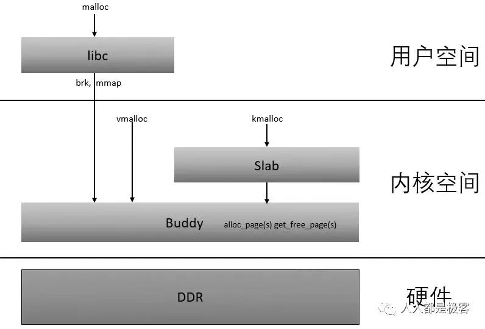

# 内存专家

三W What, Why, How

计算机先驱冯·诺依曼提出计算机结构——储存程式型电脑结构——确定了现代计算机的结构（[也有说法之前已经有了](https://www.aroundphysics.com/von-neumann-architecture-review)）。存储器成了现代计算机的核心之一，也奠定了内存在计算机中的地位。由于物理条件的限制，内存的大小和速度虽然有了巨大的提升，但仍然是一种稀缺资源，这使得内存管理和使用称为整个计算机体系结构中最复杂的部分之一（个人认为甚至没有之一，至少在软件层面是最复杂的部分，从分层结构上来说上到编程语言，下至操作系统每一层都涉及到内存管理）。

内存之于程序，犹如空气、空间之于人类——好像从未关注过它，也没有研究过它的运行规律，却是无处不在。内存是如此重要，[任何Unix内核的核心都是内存管理](Understand Linux Kernel page 4, 概述)。这话不仅适用于 Unix 系统，同样适用于所有的计算机操作系统。操作系统本身运行需要加载到内存；应用程序运行需要占用内存；CPU 执行的每一条指令，都需要占用内存，内存管理如此重要，是其它软件模块的基石。就跟空间一样，使用内存看起来我们使用它是如此自然、随意，然而深究起来，却不是那么简单。

- 实际上，整个系统的性能取决于如何有效地管理动态内存(Understand Linux Kernel page 4, 概述)。

在实际的使用中，好像内存用起来没有什么困难，遇到内存问题，实际决绝起来会发现内存牵涉到的东西又非常多，扒开一层还有一层，扒开一层还有一层。举几个简单的例子：

- 为什么我的电脑内存只有 4GB，但是内存地址却能使用远超 4GB?

- 当申请的内存大小大于 4GB 的时候会发生什么？

这些问题会打起来，我们好像能会一些，但是好像又经不起更深的追问？
比如第一个问题。你能回答上来，我们的程序使用的是虚拟内存，内存会将地址转化为实际的物理地址。

- 虚拟地址和物理地址是如何转化的？会不会影响速度？
- 既然可以超过物理内存，我一次申请 8GB 的内存可以吗？
- 如果我访问这 8GB 的内存可以吗？访问会发生什么？

内存关联的内容非常多。它牵涉到、应用、编程语言（编译器、解释器或者虚拟机）、操作系统、物理硬件。每层都负责了一部分内存相关的内容，又和其它层有关联。

自底向上方法，一层一层构建内存管理：
- [物理内存管理](physical_memory.md)
- 虚拟内管理——地址空间
- 内存池
- native 语言内存管理
- 虚拟机语言内存管理

我原先想模仿网络工程的方法——自顶向下分析方法——来分析内存管理。但内存和网络分层有些不一样，使用自顶向下方法有诸多的困难：
1. 内存管理的分层界限并不那么清晰，很多概念相互牵连，在分析一层的时候，牵涉到很多下层的概念。如果不清楚，缠身很多的疑问。

- 分析对比不同技术、不同的解决方案。比较他们的优缺点、方便我们在实际使用中根据场景选择何时的方案。

- 对于每个技术点，举例说明其应用（我们会反问自己，我为什么要花时间知道这个？知道这个玩意儿有什么用🤪？）。这样不至于过分理论化，学了之后从来不知道怎么用。同时根据案例，我们自己也方便我们做一些延伸和变通，更可能在实际开发中使用。

一个变量要经过编译器、链接器、加载器和操作系统的进程管理，然后再经过 CPU 的 MMU 模块，才能最终出现在真正的物理内存里。

1. 应用程序中的内存管理。
2. 操作系统的内存管理

- Compiler & Linker
    地址空间分配
    - [链接](link.md)
    - Loader
    - [mmap](mmap.md)
    - [动态库](shared_lib.md)
- 操作系统
    - [虚拟内存](1.virtual_memory_layout.md)

- Hardware

0. 程序运行的准备

1. 程序运行时，它的内存排布是怎样的？或者说，程序指令是如何定位的？

2. 程序中的地址是何时确定的？如何计算这些地址？

3. 程序何时分配内存的？

4. 计算机如何实现虚拟地址的？MCU 寻址

看起来我们使用内存时一个简单的 `new Object()`，其背后内存的管理牵涉到计算机硬件，操作系统、编译器、编程语言共同协作才能完成。因此想要弄清楚全部的细节不是几句话就能讲清楚的。

底层的内存管理复杂而晦涩，由于现代计算机系统系统的抽象抽象，应用开发者不会直接对内存硬件进行管理。 因此我们自上而下从最常接触到的开始，先从应用的角度来看内存组成，作为应用开发者，这也是我们对内存最直观的印象。

## Linux 内存管理子系统

Memory (de)allocation may be different for entities like user mode processes, drivers, etc. To satisfy memory allocation requirements Linux uses different memory allocators. It checks for free memory threshold in required zone (watermarks), if allocation fails, the kernel go through page rotation and tries to free memory.

- 物理内存管理是以页为单位的。

- 伙伴系统（buddy system）是以**页为单位管理和分配内存**。

- Slub 负责更细的内存分配。(Linux 6.4 移除 Slob，6.8 移除 Slab)

alloc_pages/__get_free_page: 以页为单位分配，以 Buddy 为基础。
slab allocator，字节为单位。
kmalloc: 以字节为单位分配物理地址连续的内存块，它是以slab为基础的
vmalloc: 以**页为单位**分配虚拟地址连续，但物理地址不一定连续的内存块

各层的接口：
1. 所有的页描述符存放在 `mem_map` 数组中，因为每个描述符长度为32字节，所以mem_map 所需要的空间略⼩于整个RAM的1%。`virt_to_page(addr)` 宏产⽣线性地址 addr 对应的页描述符地址。pfn_to_page(pfn) 宏产⽣与页框号 pfn 对应的页描述符地址。

2. 内核使⽤ zonelist 数据结构作为管理区描述符指针数组

2. 每个节点都有⼀个类型⼒ pg_data_t 的描述符，所有节点的描述符存
放在⼀个单向链表中，它的第⼀个元素由 pgdat_list 变量指向。

[物理内存管理](physical_memory_management.md)
[伙伴系统](buddy_allocator.md)

kmalloc和vmalloc是分配的是内核的内存,malloc分配的是用户的内存。
[kmalloc分配内存是基于slab，因此slab的一些特性包括着色，对齐等都具备，性能较好。物理地址和逻辑地址都是连续的](https://www.cnblogs.com/wuchanming/p/4465155.html)
[vmalloc](https://cloud.tencent.com/developer/article/1812357)

hvigorw assembleHap -p debuggable=false -p product=online

https://www.cnblogs.com/sevenyuan/p/13305420.html

安卓 art 内存管理， https://developer.android.com/topic/performance/memory-overview

PIC PIE
https://blog.csdn.net/zat111/article/details/46738649
https://mropert.github.io/2018/02/02/pic_pie_sanitizers/
https://www.anquanke.com/post/id/177520#h2-4
https://zhuanlan.zhihu.com/p/109862930
https://blog.csdn.net/bemind1/article/details/111942222
http://nickdesaulniers.github.io/blog/2016/11/20/static-and-dynamic-libraries/

http://thinkiii.blogspot.com/2014/02/arm64-linux-kernel-virtual-address-space.html
[Arm64 内存分配](https://www.kernel.org/doc/html/latest/arm64/memory.html)
[Arm64 支持的页面大小](https://www.kernel.org/doc/Documentation/arm64/memory.txt)
[Virtual kernel memory layout 是内核启动时打印的，已经被删掉了](https://blog.csdn.net/yhb1047818384/article/details/104621500)
