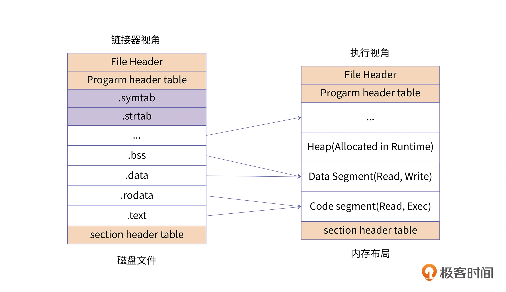

# 程序内存分配

## 链接——计算地址

## 加载

数据区域用于存放程序全局数据和静态数据，根据细分可以分为：
    - 常量存储区：.rodata，例如 C++ 的虚函数表就是放在这个区域。
    - 数据存储区：.data, 存放初始化过的数据
    - 未初始化数据区：.bss, 存放未初始化的数据（统一初始化为0，不占程序文件的空间）。

Native 类型的程序，都具有如下的内存区域。其它虚拟机程序，也基本是这几种类型的区域。只不过有的叫法不同（例如 Java 把代码区区域称为方法区，由于 Java 动态加载字节码，其方法区很可能是虚拟机的堆区）。

1. 代码区 （.text段）：
    存放代码（如函数），不允许修改（类似常量存储区），但可以执行（不同于常量存储区）

2. 常量存储区 （.rodata段）：
    存放常量，不允许修改（通过非正当手段也可以修改）。其实就是值编码在可执行文件中，接该部分数据直接加载到内存即可。

3. 全局/静态存储区 （.bss段和.data段） ：
    全局和静态变量被分配到同一块内存中。在C语言中，未初始化的放在.bss段中，初始化的放在.data段中；在C++里则不区分了。

    对于未初始化的全局变量和静态变量，因为编译器知道它们的初始值都是 0，因此便不需要再在程序的二进制映像中存放这么多 0 了，只需要记录他们的大小即可，这便是 BSS 段。Block Started by Symbol，但很多人可能更喜欢把它记作 Better Save Space 的缩写。

除了上面所讲的基本内存区域外，**现代应用程序**中还会包含其他的一些内存区域，主要有以下几类：
- **存放加载的共享库的内存空间**：如果一个进程依赖共享库，那对应的，该共享库的代码段、数据段、BSS 段也需要被加载到这个进程的地址空间中。

- **共享内存段**：我们可以通过系统调用映射一块匿名区域作为共享内存，用来进行进程间通信。

- **内存映射文件**：我们也可以将磁盘的文件映射到内存中，用来进行文件编辑或者是类似共享内存的方式进行进程通信。这样我们就初步了解了一个进程内存中需要哪些区域。

> 都是数据，为什么需要分为常量区、初始化、未初始化的分区？
这是因为不同数据保存的内容和需要做的操作不同：

- 对于常量存储区，其值直接编码在可执行文件中，直接加载到内存即可，而且，因为是常量，其页属性可以设置为 `可读不可的`。

- 对于未初始化的全局变量和静态变量，因为不用保存其值，为了减少可执行文件的大小，只需要记录其大小，加载到内存时再申请相应的空间即可。

- 对于初始化的变量，可执行文件保存的也是其值，但是加载到内存中，其页属性需要是 `可读可写`的。

在上面的讨论中，我们并没有区分磁盘的程序段 (Section)，以及内存程序段 (Segment) 的概念，这两个词在国内往往都被翻译成“段”，导致大多数同学会混淆它们。这里我来给你做一个区分。

上图从两个视角展示了应用程序的分布，左边是程序在磁盘中的文件布局结构，右边是程序加载到内存中的内存布局结构。

对于磁盘的程序，每一个单元结构称为 Section。我们可以通过 readelf -S 的选项，来查看二进制文件中所有的 Section 信息。对于右边的内存镜像，每一个单元结构称为 Segment。我们可以通过 readelf -l 的选项，来查看二进制文件加载到内存之后的 Segment 布局信息。

同时我们也可以看到，往往多个 Section 会对应一个 Segment，例如.text、.rodata 等一些只读的 Section，会被映射到内存的一个只读 / 执行的 Segment 里；而.data、.bss 等一些可读写的 Section，则会被映射到内存的一个具有读写权限的 Segment 里。并且对于磁盘二进制中一些辅助信息的 Section，例如.symtab、.strtab 等，不需要在内存中进行映射。

总的来说，Section 主要是指在磁盘中的程序段，而 Segment 则用来指代内存中的程序段，Segment 是将具有相同权限属性的 Section 集合在一起，系统为它们分配的一块内存空间。
