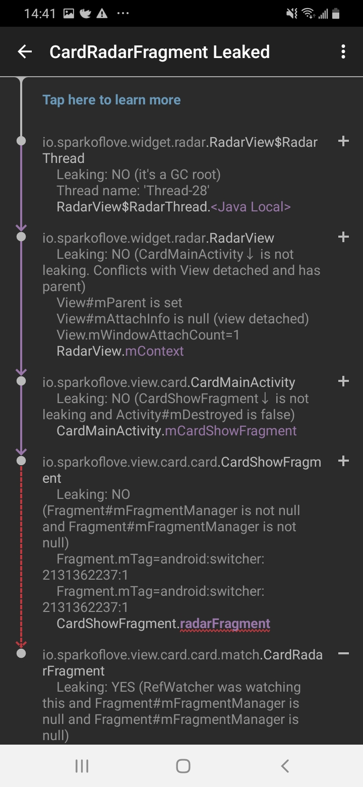

## android内存管理

### Overcommit

Overcommit allows more memory to be allocated than physically available. (more that the main memory + swap). It is dependent on on-demand paging and on applications not using more than a minority of allocated memory.

It allows for malloc () requests to succeed instead of failing as system will rarely decline requests for virtual memory.

Consequences of overcommit depend on tumbles and how kernel manages memory pressure — most frequently you’ll see OOM Killed (Out of memory killer).

> (1). 内存的整体使用情况.


要分析 memory leaks, 你需要知道总体的内存使用情况和划分. 以判断内存泄露是发生在user space, kernel space, mulit-media 等使用的memory, 从而进一步去判断具体的 memory leaks.

user space 使用的 memory 即通常包括从进程直接申请的memory, 比如 malloc: 先 mmap/sbrk 整体申请大块Memory 后再malloc 细分使用, 比如stack memory, 直接通过mmap 从系统申请; 以及因user space 进程打开文件所使用的page cache, 以及使用ZRAM 压缩 user space memory 存储所占用的memory.

kernel space 使用的 memory 通常包括 kernel stack, slub, page table, vmalloc, shmem 等.

mulit-media 使用的memory 通常使用的方式包括 ion, gpu 等.

其他方式的memory 使用, 此类一般直接从buddy system 中申请出以page 为单位的memory, android 中比较常见如ashmem.

而从进程的角度来讲, 通常情况下进程所使用的 memory, 都会通过mmap 映射到进程空间后访问使用(注: 也会一些非常特别异常的流程, 没有mmap 到进程空间), 所以进程的memory maps 资讯是至关重要的. 对应在AEE DB 里面的file 是 PROCESS_MAPS

> 内存溢出和内存泄露的区别：


内存溢出（out of memory）

Android为不同类型的进程分配了不同的内存使用上限，每个应用都在自己的进程中运行，每个进程分配一定的内存空间，这些空间也不是全部都能申请的，申请内存都是在堆空间申请的。内存溢出是指当对象的内存占用已经超出堆中可分配内存的空间大小，这时未经处理的异常就会抛出。

内存泄漏（memory leak）

有些对象只有有限的生命周期。当它们的任务完成之后，它们将被垃圾回收。如果在对象的生命周期本该结束的时候，这个对象还被一系列的引用，这就会导致内存泄漏。随着泄漏的累积，app将消耗完内存。

比如当你向系统申请分配内存进行使用(new)，可是使用完了以后却不归还(delete)，结果你申请到的那块内存你自己也不能再访问（也许你把它的地址给弄丢了），而系统也不能再次将它分配给需要的程序。


1. 内存泄露导致

由于我们程序的失误，长期保持某些资源（如Context）的引用，垃圾回收器以为还在使用而无法回收它，当然该对象占用的内存就无法被使用，这就造成内存泄露。


2. 占用内存较多的对象

保存了多个耗用内存过大的对象（如Bitmap）或加载单个超大的图片，造成内存超出限制。

3. 一次创建过多的对象，而使整体占用空间超过了可分配空间。


## 内存溢出到常见场景

1. 内存泄露导致

    - 比如，在Activity.onDestroy()被调用之后，view树以及相关的bitmap都应该被垃圾回收。如果一个正在运行的后台线程继续持有这个Activity的引用，那么相关的内存将不会被回收，这最终将导致OutOfMemoryError崩溃。 重复进入会再次创建，最终会导致内存溢出。

    - 内部类 handle 延时发送 message 而在关闭 activity 后 context 仍被 messgeQueue 中的 handler 锁引用。无法被销毁所引发泄漏。Handler应该申明为静态对象， 并在其内部类中保存一个对外部类的弱引用。
    - 或者 Activity 中 AsynTask 内部类在 Activity 销毁后还在执行。

    - 内部类的变量被定义为了 static，而没有清空。

    - 资源对象没关闭，如Cursor，File等资源。他们会在finalize中关闭，但这样效率太低。容易造成内存泄漏

    - 使用 Adapter时，没有使用系统缓存的 converView

    - 没有即时调用recycle()释放不再使用的bitmap

    - 静态变量或者单例模式中的变量引用了 Activity.

    - 广播注册没取消造成内存泄露

    - 注册的系统服务监听，眉头在结束时取消监听。SensorManager sensorManager = (SensorManager) getSystemService(SENSOR_SERVICE);

2. 占用内存较多的对象

    - 不经缩放的加载 bitmap 对象的溢出，显示像素过高或图片尺寸远远大于显示空间的尺寸时，通常都要将其缩放，减小占用内存。


3. 一次创建过多的对象

    - SQLiteCurost,当数据量大的时候容易泄漏


http://hukai.me/android-performance-oom/

1. 减小对象的内存占用
2. 内存对象的重复利用
3. 避免对象的内存泄露
4. 内存使用策略优化


###  LeakCanary 做不到的(待定)

择 LeakCanary 作为首选的内存泄漏检测工具主要是因为它能实时检测泄漏并以非常直观的调用链方式展示内存泄漏的原因。

虽然 LeakCanary 有诸多优点，但是它也有做不到的地方，比如说检测申请大容量内存导致的OOM问题、Bitmap内存未释放问题，Service 中的内存泄漏可能无法检测等。


# OOM 引起问题和解决方案

添加 leakcanary 的依赖。2.0 版本做了一些改动，只需要添加依赖就能自动向项目中注入代码，不用再在 application 中开启检测。

```
debugImplementation 'com.squareup.leakcanary:leakcanary-android:2.0-alpha-3'
```

此时只会在 debug 版本中添加检测，其他版本都不会添加加测。测试发现 `debugImplementation` 是和 `buildTypes` 中的分渠道打包名关联的。

```
buildTypes {
        debug {
           ...
        }

        product {
            ...
        }

        pre_relese {
            ...
        }

        release {
            ...
        }
    }
```

因此，想要添加 `product` 版本的检测，需要添加。这在官方文档上并没有提到。

```
    productImplementation 'com.squareup.leakcanary:leakcanary-android:2.0-alpha-3'

```

leakcanary 对混淆敏感，混淆会导致其无法启动，也没有在官网上找到取消混淆的文档，这个可以理解，在 release 版本上带 leakcanary 的需求本身就很奇怪。


## 内部类

在使用过程中，内部类本身持有外部类的应用，所以才可以调用外部类的非静态方法。如果内部类的声明周期比外部类长，就会导致外部类占用的内存无法释放。Java 中内部类默认是费静态的，引用更普遍，在 Kotlin 做了改进，默认是静态内部类。

```Java
public class CardMainActivity extends BaseActivity {
    public class CardMainHandler extends Handler {
        @Override
        public void handleMessage(Message msg) {
            // 不用声明变量，内部类就持有外部类的引用，所以才能自由访问外部类的非静态变量和方法。
            mViewModel.getMatchUsers(null);
        }
    }
```

此时 `CardMainHandler` 是非静态的，自然而然持有外部对象的引用。 此时如果内部类生命周期比外部类长，外部类就无法释放。

```Java
//registerNetReceiver();
((DatingApplication) getApplication()).setCardMainHandler(new CardMainHandler());
```

解决方案： 使用 Activity 销毁时自动解绑的 LiveData 或者 EventBus 处理页面直接的事件传递。禁止使用全局 application 传递事件。

## 静态内部类

静态内部类虽然没有外部类对象的引用，但是却有类的引用，用于访问外部类的静态方法。此时如果外部类声明了静态变量，在静态内部中使用了，也不容易释放掉。这种方式是：1，没有明确的包含关系，少用内部类。2，除了常量和单例，谨慎使用静态变量。




## 自定义线程

无论是多线程还是多进程，在编程中都是一个难点。在页面退出后，线程没有销毁非常普遍。

关于自定义线程解决的方法多种多样，不同的场景需要使用不同的方式。这里进列举现在遇到的。

1. 一个常见的使用线程的地方就是动画，动画需要在单独的线程计算，然后在 UI 线程中更新 UI。 关于动画的部分，建议使用 Android 更好封装的属性动画。它会在 UI 销毁时，及时的销毁，而不必关系终止问题。

下面是 RadarView 的线程计算动画执行过程

```Java
    private static class RadarThread extends Thread {
        private WeakReference<RadarView> weakReference;

        public RadarThread(RadarView radarView) {
            weakReference = new WeakReference<>(radarView);
        }

        @Override
        public void run() {
            super.run();

            RadarView radarView = weakReference.get();
            if (radarView != null) {
                radarView.beginRunning();
            }
        }
    }

    /**
     * 开始运行
     */
    private void beginRunning() {
        while (threadIsRunning) {
            RadarView.this.post(new Runnable() {
                @Override
                public void run() {
                    start = start + 1;
                    matrix.setRotate(start, 0, 0); //因为我对画笔进行了平移，0，0表示绕圆的中心点转动
                    RadarView.this.invalidate();
                }
            });
            try {
                Thread.sleep(5);
            } catch (InterruptedException e) {
                e.printStackTrace();
            }
        }
    }

```

改为系统组件更简单，而且可调节的更多。会在 UI 销毁时，将其一块销毁。

```Java
    public void start() {
        if (mRotateAnim != null && mRotateAnim.isRunning()) {
            return;
        }
        mRotateAnim = ObjectAnimator.ofInt(this, "rotate", start + 360) // 360 度
                .setDuration(2000);
        mRotateAnim.setRepeatMode(ValueAnimator.RESTART);
        mRotateAnim.setRepeatCount(Animation.INFINITE);
        mRotateAnim.setInterpolator(new LinearInterpolator());
        mRotateAnim.start();
    }
```

2. 在 View 组件销毁的时候，将线程终止掉。很麻烦的一点是， Java 的线程没有提供直接终止的方法，一般是单独设置一个标志位，在线程中判断标志位，终止执行。

```
    private static class RadarThread extends Thread {
        @Override
        public void run() {
            if (continue) { // 要判断的标志位
                // ...
            }
        }
    }
```

这种方式并不太好，能不直接使用线程还是避免使用线程，太原始了。深入掌握线程非常重要，但不一定非要处处使用，仿佛一下从机械时代回到了农耕时代。

- 软件内存不够用了(OOM)，我的系统是 64 位的，既然可以虚拟内存可以使用超过物理内存的大小，按道理我的程序可以使用 2^64 大小的内存，现在远没有达到这么大，为什么报 OOM？

1. 系统限制：例如 JVM 会限制堆内存占用空间，操作系统也可以对进程占用的内存进行限制。

    Jvm 虚拟机允许对堆内存大小进行限制。在 Android 中设置的prop值保存在 `System/build.prop`文件中。手机厂商会根据手机的硬件性能和配置对该文件进行修改。其中和虚拟机内存相关主要有三个：


2. 物理内存比较少时，会操作系统会根据内存需求，主动终止一些进程？


## Android 的内存限制

Java 虚拟机本质就是一个 native 程序。其使用内存也要符合系统提供的虚拟内存。而 Java 应用程序使用的内存，则是虚拟机向系统申请的内存，也是在虚拟机的地址空间中。Java 虚拟机规范隐藏了地址空间的概念，仅给程序保留了逻辑上的堆、栈等概念。从这方面说，虚拟机代替开发者管理地址，从而让开发者专注于业务逻辑。

Art 虚拟机的实现是为每个 Java 程序单独启动一个独立的虚拟机。（应该所有的虚拟机都是这样，只不 jvm 虚拟机本身的代码因为内存的共享机制，在多个进程之间共享而已。）

在启动虚拟机时，我们可以指定一些参数来限制 Java 程序可以使用的内存。

1. 初始堆大小：dalvik.vm.heapstartsize=8m
2. 最大堆大小：dalvik.vm.heapgrowthlimit=64m 
3. 最大堆带下：dalvik.vm.heapsize=384m      //如果存在 heapgrowthlimit 参数，则以 heapgrowthlimit 为准.

注意：在设置了 heapgrowthlimit 的情况下，单个进程可用最大内存为 heapgrowthlimit 值。在android开发中，如果要使用大堆，需要在manifest中指定android:largeHeap 为 true，这样 dvm heap 最大可达 heapsize。

不同设备，这些个值可以不一样。一般地，厂家针对设备的配置情况都会适当的修改 /system/build.prop 文件来调高这个值。随着设备硬件性能的不断提升，从最早的 16M 限制(G1手机)到后来的 24m, 32m，64m等，都遵循 Android 框架对每个应用的最小内存大小限制，参考 http://source.android.com/compatibility/downloads.html 3.7节。

Art 虚拟机采用了分代垃圾回收机制。

Dalvik 不会压缩逻辑堆的大小，这意味着 Android 不会对逻辑堆进行碎片整理以关闭空间。Android 只能在堆末端有未使用的空间时缩小逻辑堆大小。但是，系统仍然可以减少堆使用的物理内存。在垃圾收集之后，Dalvik遍历堆并找到未使用的页面，然后使用 madvise 将这些页面返回给内核。因此，大块的内存的分配和释放调用对应该导致回收所使用的全部(或几乎全部)物理内存。但是，回收小块内存的效率可能要低得多，因为小块内存可能仍然与尚未释放的对象共享内存页。

在某些情况下，您可能想知道当前设备上 app 有多大的堆可用——例如，这可以确定在缓存中保存多少数据是安全的。可以使用 ActivityManager 的 getMemoryClass() 函数来查询该值。此方法返回一个整数，表示应用程序可用堆的兆字节数。


读取/编辑 `` 文件需要 root 权限，在用户手机上无法获得，可以使用 Android 提供的 API 来获取。

```Kotlin

val activityManager = context.getSystemService(Context.ACTIVITY_SERVICE) as ActivityManager

val stackLimit = activityManager.memoryClass  // 

val largeMemoryClass = activityManager.largeMemoryClass

activityManager.isLowRamDevice() // 判断设备是否为低内存设备。
```
 

### 切换应用

当用户在应用程序之间切换时，Android 将不在前台的应用程序（即用户看不到或类似音乐播放的前台服务）保留在缓存中。例如，当用户第一次启动一个应用程序时，会为它创建一个进程;但是当用户离开应用程序时，这个进程并不会退出。系统将该进程缓存。如果用户稍后返回该程序，系统复用该进程，从而使应用程序切换更快。

如果你的应用程序被缓存，并且它保留了当前不需要的资源，那么即使用户没有使用它，其也会影响系统的整体性能。当系统的内存等资源不足时，它会终止缓存中的进程。系统还会考虑占用最多内存的进程，并可以终止它们以释放RAM。

** 注意:应用程序在缓存中消耗的内存越少，它不被杀死的几率就越大，并且能够快速恢复。然而，根据瞬时系统需求，缓存的进程有可能在任何时候被终止，而不管它们的资源使用情况如何。


### 内存压测

虽然内存压力问题在高端设备上不太常见，但它们仍然会给低 ram 设备上的用户带来问题，比如运行Android (Go版)的设备。尝试重现这种内存紧张的环境是很重要的，这样你就可以编写检测来验证应用程序的行为，并改善低内存设备上用户的体验。


但是 Jvm 没能完全处理对内存的管理。其为了保留对 native 程序的兼容。保留了 JNI 程序接口。这就使开发者仍然需要关注 native 程序的堆分配。


### app 内存限制

为了维持多任务处理运行环境，Android 对每个应用程序的堆大小设置了硬限制。确切的堆大小限制在设备之间有所不同，这取决于设备的总体可用RAM大小。如果你的应用程序已经达到堆容量限制，并试图分配更多的内存，它可以收到一个 OutOfMemoryError。

## 待研究

Fragment 是否需要持有引用，或者如何销毁。


[Android 内存大小限制]https://blog.csdn.net/weixin_39793420/article/details/117498032
