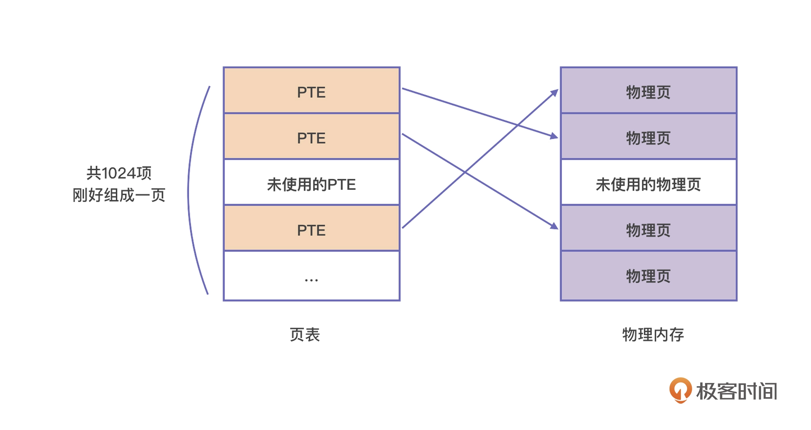

映射的过程，是由 CPU 的内存管理单元 (Memory Management Unit, MMU) 自动完成的，但它依赖操作系统设置的页表。

页表的本质是页表项 (Page Table Entry, PTE) 的数组，虚拟空间中的每一个页在页表中都有一个 PTE 与之对应，PTE 中会记录这个虚拟内存页所对应的实际物理页的起始地址。为方便理解，我这举了个例子，下面这张图描述的是 i7 处理器中的页面映射机制。

7 处理器的页表也是存储在内存页里的，每个页表项都是 4 字节。所以，人们就将 1024 个页表项组成一张页表。这样一张页表的大小就刚好是 4K，占据一个内存页，这样就更加方便管理。而且，当前市场上主流的处理器也都选择将页大小定为 4K。

一个页表项对应着一个大小为 4K 的页，所以 1024 个页表项所能支持的空间就是 4M。那为了编码更多地址，我们必须使用更多的页表。而且，为了管理这些页表，我们还可以继续引入页表的数组：页目录表。