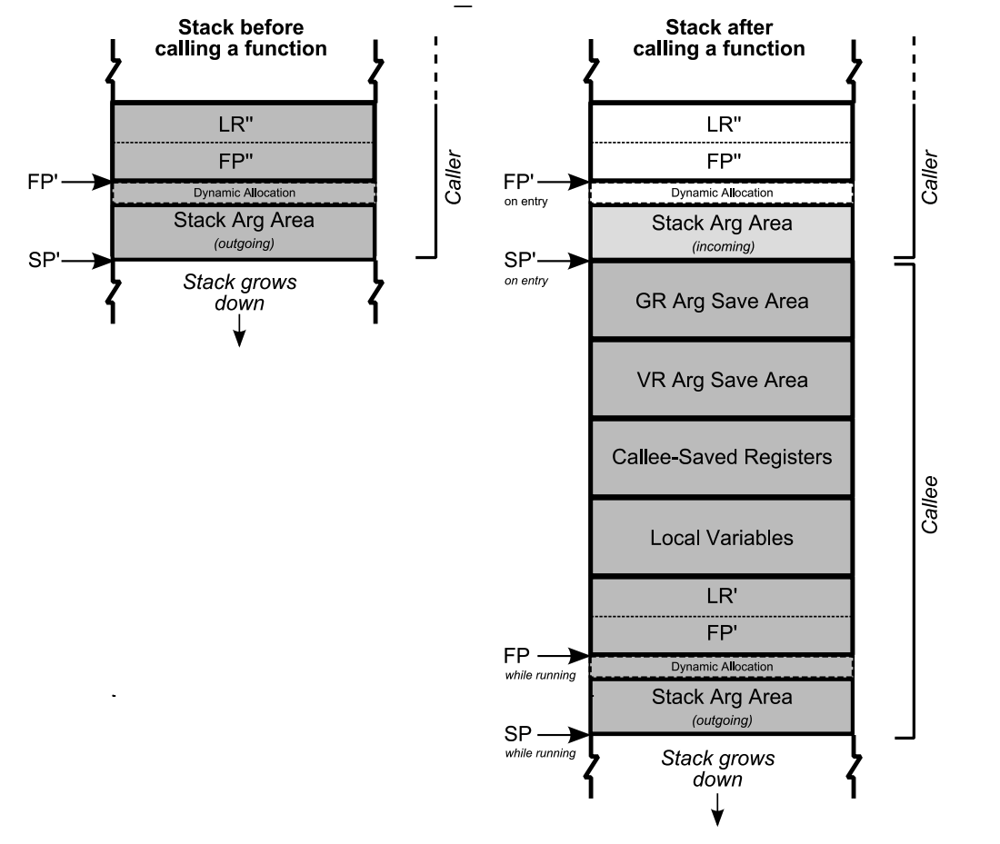

# 栈

栈为什么要由高地址向低地址扩展，堆为什么由低地址向高地址扩展？

历史原因：在没有MMU的时代，为了最大的利用内存空间，堆和栈被设计为从两端相向生长。人们对数据访问是习惯于从地址小的位置开始，比如你在堆中申请一个数组，是习惯于把低元素放到低地址，把高位放到高地址，所以堆向上生长比较符合习惯,  而栈则对方向不敏感，一般对栈的操作只有 PUSH 和 pop，无所谓向上向下，所以就把堆放在了低端，把栈放在了高端. 但现在已经习惯这样了。这个和处理器设计有关系，目前大多数主流处理器都是这样设计，但ARM 同时支持这两种增长方式。

函数调用的参数和局部数据都会放在栈中。首先看参数传递：


[栈的使用涉及到以下几个方面](https://www.cs.princeton.edu/courses/archive/spr19/cos217/lectures/15_AssemblyFunctions.pdf)

1. 调用和返回
    - 如何跳到被调用的函数执行？
    - 如何从被调用函数返回调用者？
2. 传递参数
    - 如何传递参数给被调用函数
3. 局部变量
    - 被调用函数如何存储局部变量？
4. 返回值
    - 被调用函数如何将值返回给调用者？
    - 调用者如何获得返回的值？
5. 优化
    - 调用者和被调用函数如何做到最小的内存占用？

栈帧: 一个函数调用锁说使用的栈空间被称为一个栈帧。这也是调试器用于解析函数局部变量的地方。

```
Low                   |                          |
                      +--------------------------+
SP -----------------> |                          |
                      +--------------------------+
                      |          ARGS            |
                      |          ARGS            |
                      |          ARGS            |
                      +==========================+
FP -----------------> |           FP'            |
                      +--------------------------+
                      |           IR'            |
High                  |                          |
```

BP: 栈底指针
LR(Link Register): 函数返回地址 (arm: x30, )
FP(Frame Pointer): 栈帧指针 (arm: r29, x86: rbp)
SP(Stak Pointer):  栈顶指针 （arm：sp）

以计算两个数字绝对值的和为例：
```C
int test() {
    return testCall(2, 4);
}

test:
	stp	x29, x30, [sp, #-16]! // SP = SP - 16; PUSH FP, LR
	mov	x29, sp               // FP = SP
	mov	w0, #2
	mov	w1, #4
	bl	testCall              // JUMP testCall; LR = .bl_ret
.bl_ret:
	ldp	x29, x30, [sp], #16   //
	ret
```

#### 1. 调用和返回

如何从调用者次跳到被调用函数？即，跳到被调用者第一条指令的地址。

被调用方法如何跳转回调用者的正确位置？即跳到执行跳转到被调用方法的指令后面最近的指令。

> 栈空间大小

系统的栈空间并不是一个统一的值（特别是不同系统，或者不同 CPU 平台），但是也有一般的


BL: 绝对跳转 #imm，并将返回地址（下一跳指令的地址）保存到 LR(x30)

```
stp x29, x30 ,[sp, #-0x10]! 加 “！” 的作用相当于：
sub sp, sp, #0x10
stp x29, x30, [sp]
```




#### 2. 传递参数

通用的做法是入栈，而 ARM 的做法稍有不同：

- 前 8 个参数（integer or address）保存在寄存器中，以提高效率。
    - X0..X7（64 位） and/or W0..W7（32 位）
- 多余 8 个参数或者非简单数据类型放到栈中

被调用函数
- 将寄存器传入的参数保存到栈中或者直接使用（优化）。
- 被调用函数通过 `SP+正偏移` 获取参数。


#### 3. 局部变量


**在不同语言的编译器中，调用参数压栈的顺序，参数栈的弹出，名字修饰是不同的。例如 c/c++ 的参数是从由向左开始压栈，由调用方负责弹出，命名修饰使用 `下划线 + 函数名`**

#### 栈攻击

由上面栈内存布局可以看出，栈很容易被破坏和攻击，通过栈缓冲器溢出攻击，用攻击代码首地址来替换函数帧的返回地址，当子函数返回时，便跳转到攻击代码处执行,获取系统的控制权，所以操作系统和编译器采用了一些常用的防攻击的方法：

- ASLR(地址空间布局随机化)：操作系统可以将函数调用栈的起始地址设为随机化（这种技术被称为内存布局随机化，即Address Space Layout Randomization (ASLR) ），加大了查找函数地址及返回地址的难度。

- Cannary

[clang/gcc 的编译参数](https://clang.llvm.org/docs/ClangCommandLineReference.html#cmdoption-clang-fstack-protector-strong)

| 编译参数                                 |  作用                                                       |
| -                                       | -                                                          |
| -fstack-protector, -fno-stack-protector | 开启或者关闭栈保护，只有带有 char 数组局部变量的函数才会插入保护代码。|
| -fstack-protector-all                   | 对所有函数开启堆栈保护                                         |
| -fstack-protector-strong                | 和 -fstack-protector 一样，增加对函数内有数组定义，对局部站上地址引用的函数的保护 |

开启Canary之后，函数开始时在ebp和临时变量之间插入一个随机值，函数结束时验证这个值。如果不相等（也就是这个值被其他值覆盖了），就会调用 _stackchk_fail函数，终止进程。对应GCC编译选项-fno-stack-protector解除该保护。

- NX.
  NX 即 No-eXecute（不可执行）的意思，NX（DEP）的基本原理是将数据所在内存页标识为不可执行，当程序溢出成功转入shellcode时，程序会尝试在数据页面上执行指令，此时CPU就会抛出异常，而不是去执行恶意指令。gcc编译器默认开启了NX选项，如果需要关闭NX选项，可以给gcc编译器添加 `-z execstack`参数。 `-z` 其实是将 `execstack` 传给连接器，clang 的连接器并没有使用该选项。


```C
int testCall(int a) {
    return a + 5;
}

// -fstack-protector-all

testCall(int):                           // @testCall(int)
        sub     sp, sp, #32                     // =32
        stp     x29, x30, [sp, #16]             // 16-byte Folded Spill
        add     x29, sp, #16                    // =16
        adrp    x8, __stack_chk_guard
        ldr     x8, [x8, :lo12:__stack_chk_guard]

        str     x8, [sp, #8]
        str     w0, [sp, #4]
        ldr     w9, [sp, #4]
        add     w0, w9, #5                      // =5

        adrp    x8, __stack_chk_guard
        ldr     x8, [x8, :lo12:__stack_chk_guard]
        ldr     x10, [sp, #8]
        subs    x8, x8, x10
        str     w0, [sp]                        // 4-byte Folded Spill
        b.ne    .LBB0_2
        ldr     w0, [sp]                        // 4-byte Folded Reload
        ldp     x29, x30, [sp, #16]             // 16-byte Folded Reload
        add     sp, sp, #32                     // =32
        ret
.LBB0_2:
        bl      __stack_chk_fail
```

#### 栈异常处理

一个函数（或方法）抛出异常，那么它首先将当前栈上的变量全部清空(unwinding)，如果变量是类对象的话，将调用其析构函数，接着，异常来到call stack的上一层，做相同操作，直到遇到catch语句。

**指针是一个普通的变量，不是类对象，所以在清空call stack时，指针指向资源的析构函数将不会调用。** 需要格外注意。


### 创建线程的数量


https://www.phpgolang.com/archives/833
