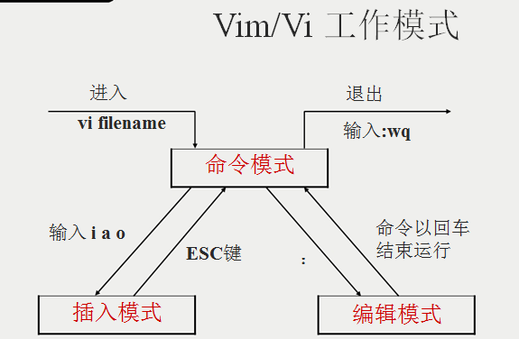

# VIM

VIM 和 emacs 是命令行的两大编辑器。 VIM 被称为神的编辑器，而 emacs 被称为编辑器之神。

> 编辑模式

- i: insert。i 在光标所在字母之前插入，I 在当前行首插入。
- a: append。a 在光标所在字母后插入，A 在行末插入。
- o: 下一行插入一行。O 上一行插入一行。

> 定位命令

| 命令 | 作用                 |
| ----| -------------------- |
| h	  | 方向左键，做移动一个字符 |
| j	  | 方向下键，下移一行      |
| k	  | 方向上键，上移一行      |
| l	  | 方向右键，右移一个字符   |
| $	  | 移至行尾              |
| 0	  | 移至行首              |

大致位置

| 命令 | 作用             |
| ----| ---------------- |
| H	  | High 移至屏幕上端  |
| M	  | Medal 移至屏幕中央 |
| L	  | Low 移至屏幕下端   |
| gg  | 到第一行 光标移动到文档开头     |
| G	  | 到最后一行，光标移动到文档末尾   |

按行移动

| 命令       | 作用         |
| --------- | ------------ |
| :set nu   | 显示行号      |
| :set nonu	| 取消行号      |

删除命令

| 命令       | 作用                    |
| --------- | ----------------------- |
| x	        | 删除光标所在处字符         |
| nx	    | 删除光标所在处后n个字符     |
| dd	    | 删除光标所在行，ndd删除n行  |
| D	        | 删除从光标所在处到行尾      |
| :x,yd	    | 删除x开始到y结束的行,包括x,y行  |

复制和剪切命令

| 命令       | 作用              |
| --------- | ----------------- |
| yy,Y	    | 复制当前行          |
| nyy,nY	| 复制当前行及以下共n行 |
| dd	    | 剪切当前行          |
| ndd	    | 剪切当前行及以下共n行 |
| p,P	    | 粘贴在当前行下或行上  |

替换和取消命令

| 命令       | 作用              |
| --------- | ----------------- |
| r	        | 取代光标所在处字符   |
| R	        | 从光标所在处开始替换字符，ESC结束 |
| u	        | 取消上一步操作      |

搜索和替换命令

- /string : 向前搜索指定字符串
- ?string : 向后搜索。搜索时忽略大小写:set ic
    n: 搜索指定字符串的下一个出现位置，N: 往前找
- :%s/old/new/g	全文替换制定字符串，g,替换不询问，c，每次替换都询问确认
- :x,ys/old/new/g	替换x行到y行的所有字符串，g: 替换不询问，c: 每次替换都询问确认

保存退出

| 命令       | 作用              |
| ----------| ----------------- |
| ZZ 或者 :wq| 保存退出           |
| wq!	    | 写入，附加!，强制。只有所有者或root才能使用。|
| q!	    | 退出，不保存       |
| w	        | 仅写入            |

- :r 文件名	将其他文件到导入到当前文件
- !命令	直接在vi中执行系统命令，:r  !命令，将命令执行的结果导入到文件
- :map 快捷键　触发命令	:map ^p 1#<ESC>
- :map ^B 0x

可以直接执行make族命令，在运行make命令前一定要设置autowrite,vim尅自动保存文件。
